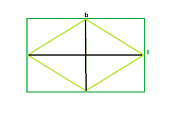

# 可以内接在矩形中的最大菱形的面积

> 原文:[https://www . geeksforgeeks . org/矩形内接最大菱形面积/](https://www.geeksforgeeks.org/area-of-the-biggest-possible-rhombus-that-can-be-inscribed-in-a-rectangle/)

给定一个长度为 **l** 和宽度为 **b** 的矩形，任务是找到可以在该矩形内接的最大菱形。
**例** :

```
Input : l = 5, b = 4
Output : 10

Input : l = 16, b = 6
Output : 48
```



从图中，我们可以看到，最大的菱形可以被内接在矩形内，它的对角线等于矩形的长度和宽度。
所以，菱形的面积， **A = (l*b)/2**
下面是上述方法的实现:

## C++

```
// C++ Program to find the biggest rhombus
// which can be inscribed within the rectangle
#include <bits/stdc++.h>
using namespace std;

// Function to find the area
// of the biggest rhombus
float rhombusarea(float l, float b)
{
    // the length and breadth cannot be negative
    if (l < 0 || b < 0)
        return -1;

    // area of the rhombus
    return (l * b) / 2;
}

// Driver code
int main()
{
    float l = 16, b = 6;
    cout << rhombusarea(l, b) << endl;
    return 0;
}
```

## Java 语言(一种计算机语言，尤用于创建网站)

```
// Java Program to find the
// biggest rhombus which can be
// inscribed within the rectangle
import java.io.*;

class GFG
{

// Function to find the area
// of the biggest rhombus
static float rhombusarea(float l,
                         float b)
{
    // the length and breadth
    // cannot be negative
    if (l < 0 || b < 0)
        return -1;

    // area of the rhombus
    return (l * b) / 2;
}

// Driver code
public static void main (String[] args)
{
    float l = 16, b = 6;
    System.out.println(rhombusarea(l, b));
}
}

// This code is contributed
// by inder_verma
```

## 蟒蛇 3

```
# Python 3 Program to find the biggest rhombus
# which can be inscribed within the rectangle

# Function to find the area
# of the biggest rhombus
def rhombusarea(l,b):
    # the length and breadth cannot be negative
    if (l < 0 or b < 0):
        return -1

    # area of the rhombus
    return (l * b) / 2

# Driver code
if __name__ == '__main__':
    l = 16
    b = 6
    print(rhombusarea(l, b))
```

## C#

```
// C# Program to find the
// biggest rhombus which can be
// inscribed within the rectangle
using System;

class GFG
{

// Function to find the area
// of the biggest rhombus
static float rhombusarea(float l,
                        float b)
{
    // the length and breadth
    // cannot be negative
    if (l < 0 || b < 0)
        return -1;

    // area of the rhombus
    return (l * b) / 2;
}

// Driver code
public static void Main ()
{
    float l = 16, b = 6;
    Console.WriteLine(rhombusarea(l, b));
}
}

// This code is contributed
// by shs
```

## 服务器端编程语言（Professional Hypertext Preprocessor 的缩写）

```
<?php
// PHP Program to find the
// biggest rhombus which can be
// inscribed within the rectangle

// Function to find the area
// of the biggest rhombus
function rhombusarea($l, $b)
{
    // the length and breadth
    // cannot be negative
    if ($l < 0 || $b < 0)
        return -1;

    // area of the rhombus
    return ($l * $b) / 2;
}

// Driver code
$l = 16; $b = 6;
echo rhombusarea($l, $b) . "\n";

// This code is contributed
// by Akanksha Rai(Abby_akku)
```

## java 描述语言

```
<script>

// javascript Program to find the
// biggest rhombus which can be
// inscribed within the rectangle

// Function to find the area
// of the biggest rhombus
function rhombusarea(l,b)
{
    // the length and breadth
    // cannot be negative
    if (l < 0 || b < 0)
        return -1;

    // area of the rhombus
    return (l * b) / 2;
}

// Driver code
var l = 16, b = 6;
document.write(rhombusarea(l, b));

// This code contributed by Princi Singh

</script>
```

**Output:** 

```
48
```