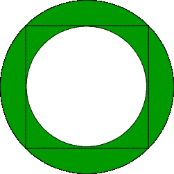
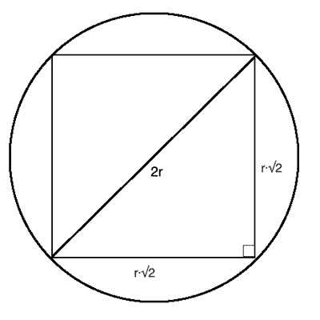

# 内接正方形和圆形的圆的面积

> 原文:[https://www . geesforgeks . org/内接正方形和圆形的圆形区域/](https://www.geeksforgeeks.org/area-of-the-circle-that-has-a-square-and-a-circle-inscribed-in-it/)

给定正方形的边**和保持在圆内的边**。它一直膨胀，直到它的四个顶点都接触到圆的圆周。另一个更小的圆现在被保留在正方形内，它不断地膨胀，直到它的圆周接触到正方形的所有四边。外环和内环形成一个环。如下图所示，找到阴影部分的区域。



**例:**

> **输入:** a = 3
> **输出:** 7.06858
> **输入:** a = 4
> **输出:** 12.566371

**进场:**



从上图可以推导出 **R = a / sqrt(2)** ，其中 **a** 为正方形的边长。外圆面积为**(π* R * R)**。


设 **s1** 为外圆**(π* R * R)**的面积， **s2** 为内圆**(π* R * R)**的面积。那么环的面积就是**S1–S2**。
以下是上述方法的实施:

## C++

```
// C++ implementation of the approach
#include <bits/stdc++.h>
using namespace std;

// Function to return the required area
float getArea(int a)
{

    // Calculate the area
    float area = (M_PI * a * a) / 4.0;
    return area;
}

// Driver code
int main()
{
    int a = 3;

    cout << getArea(a);

    return 0;
}
```

## Java 语言(一种计算机语言，尤用于创建网站)

```
// Java implementation of the approach
class GFG {

    // Function to return the required area
    static float getArea(int a)
    {

        // Calculate the area
        float area = (float)(Math.PI * a * a) / 4;
        return area;
    }

    // Driver code
    public static void main(String args[])
    {
        int a = 3;
        System.out.println(getArea(a));
    }
}
```

## 蟒蛇 3

```
# Python3 implementation of the approach
import math

# Function to return the required area
def getArea(a):

    # Calculate the area
    area = (math.pi * a * a) / 4
    return area

# Driver code
a = 3
print('{0:.6f}'.format(getArea(a)))
```

## C#

```
// C# implementation of the approach
using System;

class GFG
{

    // Function to return the required area
    static float getArea(int a)
    {

        // Calculate the area
        float area = (float)(Math.PI * a * a) / 4;
        return area;
    }

    // Driver code
    public static void Main()
    {
        int a = 3;
        Console.Write(getArea(a));
    }
}

// This code is contributed by mohit kumar 29
```

## java 描述语言

```
<script>

// Javascript implementation of the approach

// Function to return the required area
function getArea(a)
{

    // Calculate the area
    var area = (Math.PI * a * a) / 4;
    return area;
}

// Driver Code
var a = 3;

document.write(getArea(a));

// This code is contributed by Kirti

</script>
```

**Output:** 

```
7.06858
```