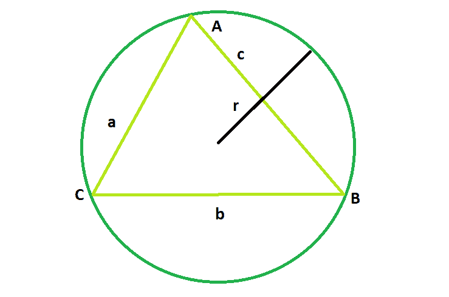

# 任意给定边的三角形外接圆面积

> 原文:[https://www . geeksforgeeks . org/给定边的任意三角形外接圆面积/](https://www.geeksforgeeks.org/area-of-the-circumcircle-of-any-triangles-with-sides-given/)

给定一个已知边 a、b 和 c 的三角形；任务是找到它的外接圆的面积。
**例:**

```
Input: a = 2, b = 2, c = 3
Output: 7.17714

Input: a = 4, b = 5, c = 3
Output: 19.625
```



**方法:**
对于边长为 a、b 和 c 的三角形，

```
Radius of the circumcircle: 

where A = √(s*(s-a)*(s-b)*(s-c))
and s = (a+b+c)/2 is the semiperimeter.
Therefore, Area of the circumcircle:

```

以下是上述方法的实现:

## C++

```
// C++ Program to find the area
// the circumcircle of the given triangle

#include <bits/stdc++.h>
using namespace std;

// Function to find the area
// of the circumcircle
float circlearea(float a, float b, float c)
{

    // the sides cannot be negative
    if (a < 0 || b < 0 || c < 0)
        return -1;

    // semi-perimeter of the circle
    float p = (a + b + c) / 2;

    // area of triangle
    float At = sqrt(p * (p - a) * (p - b) * (p - c));

    // area of the circle
    float A = 3.14 * pow(((a * b * c) / (4 * At)), 2);
    return A;
}

// Driver code
int main()
{

    // Get the sides of the triangle
    float a = 4, b = 5, c = 3;

    // Find and print the area of the circumcircle
    cout << circlearea(a, b, c) << endl;

    return 0;
}
```

## Java 语言(一种计算机语言，尤用于创建网站)

```
// Java Program to find the area
// the circumcircle of the given triangle
import java.*;
class gfg
{
// Function to find the area
// of the circumcircle
public double circlearea(double a, double b, double c)
{

    // the sides cannot be negative
    if (a < 0 || b < 0 || c < 0)
        return -1;

    // semi-perimeter of the circle
    double p = (a + b + c) / 2;

    // area of triangle
    double At = Math.sqrt(p * (p - a) * (p - b) * (p - c));

    // area of the circle
    double A = 3.14 * Math.pow(((a * b * c) / (4 * At)), 2);
    return A;
}
}

class geek
{
// Driver code
public static void main(String[] args)
{
    gfg g = new gfg();
    // Get the sides of the triangle
    double a = 4, b = 5, c = 3;

    // Find and print the area of the circumcircle
    System.out.println(g.circlearea(a, b, c));

}
}

//This code is contributed by shk..
```

## 蟒蛇 3

```
# Python3 Program to find the area
# the circumcircle of the given triangle
import math

# Function to find the area
# of the circumcircle
def circlearea(a, b, c):

    # the sides cannot be negative
    if (a < 0 or b < 0 or c < 0):
        return -1;

    # semi-perimeter of the circle
    p = (a + b + c) / 2;

    # area of triangle
    At = math.sqrt(p * (p - a) *
                  (p - b) * (p - c));

    # area of the circle
    A = 3.14 * pow(((a * b * c) / (4 * At)), 2);
    return A;

# Driver code

# Get the sides of the triangle
a = 4;
b = 5;
c = 3;

# Find and print the area
# of the circumcircle
print (float(circlearea(a, b, c)));

# This code is contributed
# by Shivi_Aggarwal
```

## C#

```
// C# Program to find the area
// the circumcircle of the given triangle
using System;
class gfg
{
 // Function to find the area
 // of the circumcircle
 public double circlearea(double a, double b, double c)
 {

    // the sides cannot be negative
    if (a < 0 || b < 0 || c < 0)
        return -1;

    // semi-perimeter of the circle
    double p = (a + b + c) / 2;

    // area of triangle
    double At = Math.Sqrt(p * (p - a) * (p - b) * (p - c));

    // area of the circle
    double A = 3.14 * Math.Pow(((a * b * c) / (4 * At)), 2);
    return A;
 }
}

class geek
{
 // Driver code
 public static int Main()
 {
    gfg g = new gfg();
    // Get the sides of the triangle
    double a = 4, b = 5, c = 3;

    // Find and print the area of the circumcircle
    Console.WriteLine(g.circlearea(a, b, c));

    return 0;
 }
}
//This code os contributed by SoumikMondal
```

## 服务器端编程语言（Professional Hypertext Preprocessor 的缩写）

```
<?php
// PHP Program to find the
// area the circumcircle of
// the given triangle

// Function to find the area
// of the circumcircle
function circlearea($a, $b, $c)
{

    // the sides cannot be negative
    if ($a < 0 || $b < 0 || $c < 0)
        return -1;

    // semi-perimeter of the circle
    $p = ($a + $b + $c) / 2;

    // area of triangle
    $At = sqrt($p * ($p - $a) *
              ($p - $b) * ($p - $c));

    // area of the circle
    $A = 3.14 * pow((($a * $b *
                      $c) / (4 * $At)), 2);
    return $A;
}

// Driver code

// Get the sides of the triangle
$a = 4; $b = 5; $c = 3;

// Find and print the area
// of the circumcircle
echo circlearea($a, $b, $c);

// This code is contributed
// by inder_verma
?>
```

## java 描述语言

```
<script>
// javascript Program to find the area
// the circumcircle of the given triangle

// Function to find the area
// of the circumcircle
function circlearea(a , b , c)
{

    // the sides cannot be negative
    if (a < 0 || b < 0 || c < 0)
        return -1;

    // semi-perimeter of the circle
    var p = (a + b + c) / 2;

    // area of triangle
    var At = Math.sqrt(p * (p - a) * (p - b) * (p - c));

    // area of the circle
    var A = 3.14 * Math.pow(((a * b * c) / (4 * At)), 2);
    return A;
}

// Driver code

// Get the sides of the triangle
var a = 4, b = 5, c = 3;

// Find and print the area of the circumcircle
document.write(circlearea(a, b, c));

// This code contributed by Princi Singh

</script>
```

**Output:** 

```
19.625
```