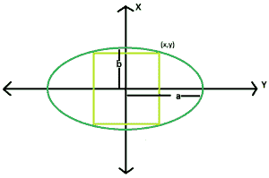

# 椭圆内接最大正方形的面积

> 原文:[https://www . geesforgeks . org/椭圆内接最大正方形面积/](https://www.geeksforgeeks.org/area-of-the-largest-square-that-can-be-inscribed-in-an-ellipse/)

给定一个椭圆，长轴长度为 **2a** & **2b** ，任务是找出其中可内接的最大矩形的面积。
**例:**

```
Input: a = 4, b = 2
Output: 1.25

Input: a = 5, b= 3
Output: 0.604444
```



**逼近**:如果一个正方形被内接在一个椭圆中，正方形的中心到它的任何一个角的距离将等于原点到下图右上角点的距离，其中 **x=y**

> 椭圆的方程式是 **x^2/a^2 + y^2/b^2 = 1**
> If， **x = y**
> then， **x^2/a^2 + x^2/b^2 = 1**
> 因此，**x = √(a^2+b^2)/ab**t11】so，**y = √(a^2+b^2)/ab**
> so area，**a = 4(a 2+b 2)/a 2b 2**t17】

以下是上述方法的实现:

## C++

```
// C++ Program to find the biggest square
// which can be inscribed within the ellipse
#include <bits/stdc++.h>
using namespace std;

// Function to find the area
// of the square
float squarearea(float a, float b)
{

    // a and b cannot be negative
    if (a < 0 || b < 0)
        return -1;

    // area of the square
    float area = 4 * ((pow(a, 2) + pow(b, 2))
                      / (pow(a, 2) * pow(b, 2)));

    return area;
}

// Driver code
int main()
{
    float a = 4, b = 2;
    cout << squarearea(a, b) << endl;

    return 0;
}
```

## Java 语言(一种计算机语言，尤用于创建网站)

```
// Java Program to find the biggest square
// which can be inscribed within the ellipse
import java.io.*;

class GFG {

// Function to find the area
// of the square
static float squarearea(float a, float b)
{

    // a and b cannot be negative
    if (a < 0 || b < 0)
        return -1;

    // area of the square
    float area = 4 *(float) ((Math.pow(a, 2) + Math.pow(b, 2))
                    / (Math.pow(a, 2) * Math.pow(b, 2)));

    return area;
}

// Driver code

    public static void main (String[] args) {
        float a = 4, b = 2;
    System.out.println( squarearea(a, b));

    }
}
// This code is contributed by inder_verma.
```

## 蟒蛇 3

```
# Python3 Program to find the biggest square
# which can be inscribed within the ellipse

# Function to find the area
# of the square
def squarearea( a, b):

    # a and b cannot be negative
    if (a < 0 or b < 0):
        return -1

    # area of the square
    area = 4 * (((pow(a, 2) + pow(b, 2)) /
               (pow(a, 2) * pow(b, 2))))

    return area

# Driver code
if __name__=='__main__':
    a = 4
    b = 2
    print(squarearea(a, b))

# This code is contributed by ash264
```

## C#

```
// C# Program to find the biggest
// square which can be inscribed
// within the ellipse
using System;

class GFG
{

// Function to find the area
// of the square
static float squarearea(float a, float b)
{

    // a and b cannot be negative
    if (a < 0 || b < 0)
        return -1;

    // area of the square
    float area = 4 *(float) ((Math.Pow(a, 2) +
                              Math.Pow(b, 2)) /
                             (Math.Pow(a, 2) *
                              Math.Pow(b, 2)));

    return area;
}

// Driver code
public static void Main ()
{
    float a = 4, b = 2;
    Console.WriteLine( squarearea(a, b));
}
}

// This code is contributed by inder_verma
```

## 服务器端编程语言（Professional Hypertext Preprocessor 的缩写）

```
<?php
// PHP Program to find the biggest square
// which can be inscribed within the ellipse

// Function to find the area
// of the square
function squarearea( $a, $b)
{

    // a and b cannot be negative
    if ($a < 0 or $b < 0)
        return -1;

    // area of the square
    $area = 4 * (((pow($a, 2) + pow($b, 2)) /
            (pow($a, 2) * pow($b, 2))));

    return $area;
}

// Driver code

    $a = 4;
    $b = 2;
    print(squarearea($a, $b));

// This code is contributed by mits
?>
```

## java 描述语言

```
<script>

// javascript Program to find the biggest square
// which can be inscribed within the ellipse

// Function to find the area
// of the square
function squarearea(a , b)
{

    // a and b cannot be negative
    if (a < 0 || b < 0)
        return -1;

    // area of the square
    var area = 4 *((Math.pow(a, 2) + Math.pow(b, 2))
                    / (Math.pow(a, 2) * Math.pow(b, 2)));

    return area;
}

// Driver code
var a = 4, b = 2;
document.write( squarearea(a, b));

// This code contributed by shikhasingrajput

</script>
```

**Output:** 

```
1.25
```