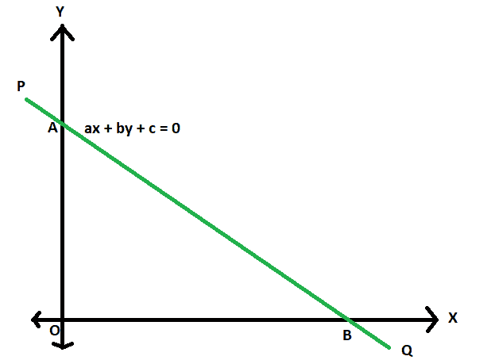
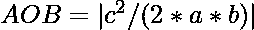

# 坐标轴与给定直线形成的三角形面积

> 原文:[https://www . geesforgeks . org/坐标轴和给定直线构成的三角形面积/](https://www.geeksforgeeks.org/area-of-triangle-formed-by-the-axes-of-co-ordinates-and-a-given-straight-line/)

给定一条方程系数为 **a** 、**b****&c**(ax+by+c = 0)的直线，任务是找出坐标轴与这条直线形成的三角形的[区域。
**举例:**](https://www.geeksforgeeks.org/c-program-find-area-triangle/) 

```
Input: a = -2, b = 4, c = 3
Output: 0.5625

Input: a = 4, b = 3, c = 12
Output: 6
```



**接近** :

1.  设 **PQ** 为轴间线段为 **AB** 的直线。
    等式为，
    **ax + by + c = 0**

2.  所以，在截距形式下它可以表示为，
    **x/(-c/a)+y/(-c/b)= 1**

3.  所以，x 截距=**-c/a**
    y 截距= **-c/b**

4.  所以，很明显现在三角形的底 **AOB** 将是 **-c/a**
    ，三角形的底 **AOB** 将是 **-c/b**

5.  所以，三角形的面积
    

以下是上述方法的实现:

## C++

```
// C++ program area of triangle
// formed by the axes of co-ordinates
// and a given straight line

#include <bits/stdc++.h>
using namespace std;

// Function to find area
double area(double a, double b, double c)
{
    double d = fabs((c * c) / (2 * a * b));
    return d;
}

// Driver code
int main()
{
    double a = -2, b = 4, c = 3;
    cout << area(a, b, c);
    return 0;
}
```

## Java 语言(一种计算机语言，尤用于创建网站)

```
// Java program area of triangle
// formed by the axes of co-ordinates
// and a given straight line

import java.io.*;

class GFG
{

// Function to find area
static double area(double a, double b, double c)
{
    double d = Math.abs((c * c) / (2 * a * b));
    return d;
}

// Driver code
public static void main (String[] args)
{

    double a = -2, b = 4, c = 3;
    System.out.println(area(a, b, c));
}
}

// This code is contributed by ajit.
```

## 蟒蛇 3

```
# Python3 program area of triangle
# formed by the axes of co-ordinates
# and a given straight line

# Function to find area
def area(a, b, c):

    d = abs((c * c) / (2 * a * b))
    return d

# Driver code
a = -2
b = 4
c = 3
print(area(a, b, c))

# This code is contributed
# by mohit kumar
```

## C#

```
// C# program area of triangle
// formed by the axes of co-ordinates
// and a given straight line
using System;

class GFG
{

// Function to find area
static double area(double a, double b, double c)
{
    double d = Math.Abs((c * c) / (2 * a * b));
    return d;
}

// Driver code
static public void Main ()
{

    double a = -2, b = 4, c = 3;
    Console.WriteLine (area(a, b, c));
}
}

// This code is contributed by akt_mit.
```

## 服务器端编程语言（Professional Hypertext Preprocessor 的缩写）

```
<?php
// PHP program area of triangle
// formed by the axes of co-ordinates
// and a given straight line

// Function to find area
function area($a, $b, $c)
{
    $d = abs(($c * $c) / (2 * $a * $b));
    return $d;
}

// Driver code
$a = -2;
$b = 4;
$c = 3;

echo area($a, $b, $c);

// This code is contributed by Ryuga
?>
```

## java 描述语言

```
<script>

// javascript program area of triangle
// formed by the axes of co-ordinates
// and a given straight line

// Function to find area
function area(a , b , c)
{
    var d = Math.abs((c * c) / (2 * a * b));
    return d;
}

// Driver code

var a = -2, b = 4, c = 3;
document.write(area(a, b, c));

// This code is contributed by Amit Katiyar

</script>
```

**Output:** 

```
0.5625
```