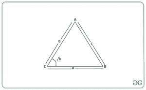
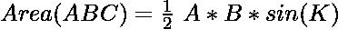

# 使用边-角-边的三角形面积(两边的长度和夹角)

> 原文:[https://www . geesforgeks . org/三角形面积-使用-边-角-边-边-长度-两边-和-夹角/](https://www.geeksforgeeks.org/area-of-triangle-using-side-angle-side-length-of-two-sides-and-the-included-angle/)

给定两个整数 **A** 、 **B** 代表三角形两边的长度，一个整数 **K** 代表它们之间的角度弧度，任务是根据给定的信息计算三角形的面积。
**举例:**

> **输入:** a = 9，b = 12，K = 2
> **输出:** 49.1
> **解释:**
> 三角形面积= 1 / 2 * (9 * 12 * Sin 2) = 35.12
> **输入:** A = 2，B = 4，K = 1
> **输出:** 3.37

**进场:**
考虑以下三角形 **ABC** 边 **A** 、 **B** 、 **C** ，边 **A** 和 **B** 之间有一个角度 **K** 。



然后，可以使用[侧角-边](https://en.wikipedia.org/wiki/Triangle)公式计算三角形的面积:

> 

以下是上述方法的实现:

## C++

```
// C++ program to calculate
// the area of a triangle when
// the length of two adjacent
// sides and the angle between
// them is provided
#include <bits/stdc++.h>
using namespace std;

float Area_of_Triangle(int a, int b, int k)
{
    float area = (float)((1 / 2.0) *
                          a * b * (sin(k)));

    return area;
}

// Driver Code
int main()
{
    int a = 9;
    int b = 12;
    int k = 2;

    // Function Call
    float ans = Area_of_Triangle(a, b, k);

    // Print the final answer
    cout << ans << endl;
}

// This code is contributed by Ritik Bansal
```

## Java 语言(一种计算机语言，尤用于创建网站)

```
// Java program to calculate
// the area of a triangle when
// the length of two adjacent
// sides and the angle between
// them is provided
class GFG{

// Function to return the area of
// triangle using Side-Angle-Side
// formula
static float Area_of_Triangle(int a, int b,
                                     int k)
{
    float area = (float)((1 / 2.0) *
                      a * b * Math.sin(k));

    return area;
}

// Driver Code
public static void main(String[] args)
{
    int a = 9;
    int b = 12;
    int k = 2;

    // Function Call
    float ans = Area_of_Triangle(a, b, k);

    // Print the final answer
    System.out.printf("%.1f",ans);
}
}

// This code is contributed by sapnasingh4991
```

## 蟒蛇 3

```
# Python3 program to calculate
# the area of a triangle when
# the length of two adjacent
# sides and the angle between
# them is provided

import math

# Function to return the area of
# triangle using Side-Angle-Side
# formula
def Area_of_Triangle(a, b, k):

    area =(1 / 2) * a * b * math.sin(k)

    return area

# Driver Code
a = 9
b = 12
k = 2

# Function Call
ans = Area_of_Triangle(a, b, k)

# Print the final answer
print(round(ans, 2))
```

## C#

```
// C# program to calculate
// the area of a triangle when
// the length of two adjacent
// sides and the angle between
// them is provided
using System;
class GFG{

// Function to return the area of
// triangle using Side-Angle-Side
// formula
static float Area_of_Triangle(int a, int b,
                                     int k)
{
    float area = (float)((1 / 2.0) *
                  a * b * Math.Sin(k));

    return area;
}

// Driver Code
public static void Main(String[] args)
{
    int a = 9;
    int b = 12;
    int k = 2;

    // Function Call
    float ans = Area_of_Triangle(a, b, k);

    // Print the readonly answer
    Console.Write("{0:F1}", ans);
}
}

// This code is contributed by sapnasingh4991
```

## java 描述语言

```
<script>
// javascript program to calculate
// the area of a triangle when
// the length of two adjacent
// sides and the angle between
// them is provided// Function to return the area of
// triangle using Side-Angle-Side
// formula

function Area_of_Triangle(a , b, k)
{
    var area = ((1 / 2.0) *
                      a * b * Math.sin(k));

    return area;
}

// Driver Code
var a = 9;
var b = 12;
var k = 2;

// Function Call
var ans = Area_of_Triangle(a, b, k);

// Print the final answer
document.write(ans.toFixed(1));

// This code is contributed by 29AjayKumar
</script>
```

**Output:** 

```
49.1
```

***时间复杂度:** O(1)*
***辅助空间:** O(1)*