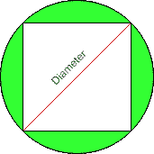

# 圆外切的正方形面积

> 原文:[https://www . geesforgeks . org/area-square-外接圆/](https://www.geeksforgeeks.org/area-square-circumscribed-circle/)

给定圆的半径，然后求出被圆外切的正方形的面积。
示例:

```
Input : r = 3
Output :Area of square = 18

Input :r = 6
Output :Area of square = 72
```

正方形的四条边都等长，四个角都是 90 度。该圆被限定在给定的正方形上，如下图阴影区域所示。



**外接圆的性质如下:**

*   外接圆的中心是正方形两条对角线相交的点。
*   正方形的外接圆是通过正方形的四个顶点构成的。
*   正方形的外接圆的半径等于正方形的半径。

> 用来计算外接圆面积的公式是:
> **2 * r<sup>2</sup>**T5【其中，r 是正方形被圆外切的圆的半径。
> **这个公式是如何工作的？**
> 假设正方形的对角线为 d，边长为 a.
> 我们从勾股定理中知道，一个
> 正方形的对角线是边长的√(2)倍。
> 即 d<sup>2</sup>= a<sup>2</sup>+a<sup>2</sup>T19】d = 2 * a<sup>2</sup>T22】d =√(2)* a
> 现在，
> a = d / √2
> 我们知道被
> 圆外切的正方形对角线等于圆的直径。
> 所以正方形的面积= a * a
> = d/√(2)* d/√(2)
> = d<sup>2</sup>/2
> =(2 * r)<sup>2</sup>/2(我们知道 d = 2 * r)
> =**2 * r<sup>2</sup>**

## 卡片打印处理机（Card Print Processor 的缩写）

```
// C++ program to find Area of
// square Circumscribed by Circle
#include <iostream>
using namespace std;

// Function to find area of square
int find_Area(int r)
{
    return (2 * r * r);
}

// Driver code
int main() 
{
    // Radius of a circle
    int r = 3;

    // Call Function to find 
    // an area of square
    cout << " Area of square = " 
                 << find_Area(r);

    return 0;
}
```

## Java 语言(一种计算机语言，尤用于创建网站)

```
// Java program to find Area of
// square Circumscribed by Circle
class GFG {

    // Function to find area of square
    static int find_Area(int r)
    {
        return (2 * r * r);
    }

    // Driver code
    public static void main(String[] args)
    {
        // Radius of a circle
        int r = 3;

        // Call Function to find
        // an area of square
        System.out.print(" Area of square = "
                             + find_Area(r));
    }
}

// This code is contributed by Anant Agarwal.
```

## 蟒蛇 3

```
# Python program to
# find Area of
# square Circumscribed
# by Circle

# Function to find
# area of square
def find_Area(r):

    return (2 * r * r)

# driver code
# Radius of a circle
r = 3

# Call Function to find 
# an area of square
print(" Area of square = ", find_Area(r))

# This code is contributed
# by Anant Agarwal.
```

## C#

```
// C# program to find Area of
// square Circumscribed by Circle
using System;

class GFG {

    // Function to find area of square
    static int find_Area(int r)
    {
        return (2 * r * r);
    }

    // Driver code
    public static void Main()
    {
        // Radius of a circle
        int r = 3;

        // Call Function to find
        // an area of square
        Console.WriteLine(" Area of square = "
                            + find_Area(r));
    }
}

// This code is contributed by vt_m.
```

## 服务器端编程语言（Professional Hypertext Preprocessor 的缩写）

```
<?php
// PHP program to find Area of
// square Circumscribed by Circle

// Function to find area of square
function find_Area( $r)
{
    return (2 * $r * $r);
}

    // Driver code
    // Radius of a circle
    $r = 3;

    // Call Function to find 
    // an area of square
    echo ("Area of square = ");
    echo(find_Area($r));

// This code is contributed by vt_m.
?>
```

## java 描述语言

```
<script>
// Javascript program to find Area of 
// square Circumscribed by Circle 

// Function to find area of square 
function find_Area(r) 
{ 
    return (2 * r * r); 
} 

// Driver code 

    // Radius of a circle 
    let r = 3; 

    // Call Function to find 
    // an area of square 
    document.write(" Area of square = "
                + find_Area(r)); 

// This code is contributed by Mayank Tyagi
</script>
```

输出:

```
Area of square = 18
```

**时间复杂度:O(1)**