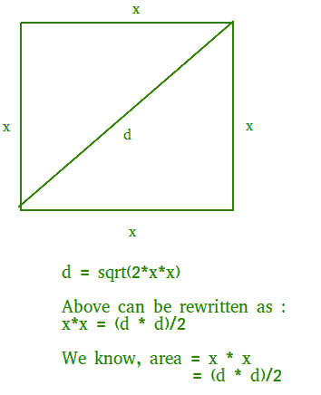

# 对角线长度的正方形面积

> 原文:[https://www.geeksforgeeks.org/area-square-diagonal-length/](https://www.geeksforgeeks.org/area-square-diagonal-length/)

给定一个数 d，它是正方形对角线的长度，求它的面积。
**例:**

```
Input : d = 10
Output : Area = 50

Input : d = 12.2
Output : Area = 74.42
```

正方形的面积可以计算为(d * d)/2。详情请见下图。



## C++

```
// C++ Program to find the area of square
// when its diagonal is given.
#include <bits/stdc++.h>
using namespace std;

// Returns area of square from given
// diagonal
double findArea(double d)
{
    return (d * d) / 2.0;
}

// Driver Code
int main()
{
    double d = 10;
    cout << (findArea(d));
    return 0;
}

// This code is contributed by
// Shivi_Aggarwal
```

## C

```
// C Program to find the area of square
// when its diagonal is given.
#include <stdio.h>

// Returns area of square from given
// diagonal
double findArea(double d)
{
    return (d * d) / 2;
}

// Driver function.
int main()
{
    double d = 10;
    printf("%.2f", findArea(d));
    return 0;
}
```

## Java 语言(一种计算机语言，尤用于创建网站)

```
// Java Program to find the area of square
// when its diagonal is given.

class GFG
{
    // Returns area of square from given
    // diagonal
    static double findArea(double d)
    {
        return (d * d) / 2;
    }

    // Driver code
    public static void main (String[] args)
    {
        double d = 10;
        System.out.println(findArea(d));
    }
}

// This code is contributed by Anant Agarwal.
```

## 蟒蛇 3

```
# Python3 Program to find
# the area of square
# when its diagonal is given.

# Returns area of square from given
# diagonal
def findArea(d):

    return (d * d) / 2

# Driver function.
d = 10
print("%.2f" % findArea(d))

# This code is contributed by
# Smitha Dinesh Semwal
```

## C#

```
// C# Program to find the area of square
// when its diagonal is given.
using System;

class GFG
{
    // Returns area of square from given
    // diagonal
    static double findArea(double d)
    {
        return (d * d) / 2;
    }

    // Driver code
    public static void Main ()
    {
        double d = 10;
        Console.WriteLine(findArea(d));
    }
}

// This code is contributed by vt_m.
```

## 服务器端编程语言（Professional Hypertext Preprocessor 的缩写）

```
<?php
// PHP Program to find the area of
// square when its diagonal is given.

// Returns area of square
// from given diagonal
function findArea( $d)
{
    return ($d * $d) / 2;
}

    // Driver Code
    $d = 10;
    echo( findArea($d));

// This code is contributed by vt_m.
?>
```

## java 描述语言

```
<script>

// JavaScript Program to find the area of square
// when its diagonal is given.

 // Returns area of square from given
    // diagonal
    function findArea(d)
    {
        return (d * d) / 2;
    }

// Driver code

       let d = 10;
       document.write(findArea(d));

</script>
```

**Output:** 

```
50.00
```