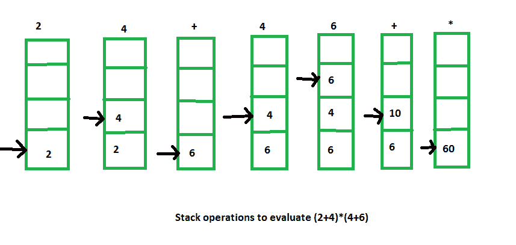

# 算术表达式求值

> 原文:[https://www . geesforgeks . org/算术-表达式-求值/](https://www.geeksforgeeks.org/arithmetic-expression-evalution/)

堆栈组织在计算算术表达式时非常有效。表达式通常用所谓的**中缀符号**来表示，其中每个运算符都写在两个操作数之间(即 A + B)。使用这种符号，我们必须通过使用括号或一些运算符优先约定来区分(A + B )*C 和 A + ( B * C)。因此，算术表达式中运算符和操作数的顺序并不能唯一确定操作的执行顺序。

**1。波兰语记数法(前缀记数法)–**
它是指运算符放在其两个操作数之前的记数法。这里不需要括号，即

```
+AB 
```

**2。反向波兰语符号(后缀符号)–**
它指的是一种类似的符号，其中运算符位于其两个操作数之后。同样，反向波兰语符号中不需要括号，即

```
AB+ 
```

堆栈式计算机比传统的中缀符号更适合后修复符号。因此，中缀符号必须转换成后缀符号。从中缀符号到后缀符号的转换必须考虑操作层次。

5 个二元运算符有 3 个优先级，如下所示:

```
Highest: Exponentiation (^)
Next highest: Multiplication (*) and division (/)
Lowest: Addition (+) and Subtraction (-) 
```

**例如–**

```
Infix notation: (A-B)*[C/(D+E)+F]
Post-fix notation: AB- CDE +/F +* 
```

这里，我们首先执行括号(A-B)和(D+E)内的算术。C/(D+E)的除法必须在与 f 相加之前完成。之后，将括号和括号内的两项相乘。

现在我们需要使用堆栈来计算这些算术运算的值。

得到结果的程序是:

1.  将表达式转换为反向波兰表示法(修复后表示法)。

2.  按照操作数出现的顺序将其推入堆栈。

3.  当任何操作符遇到时，弹出两个最上面的操作数来执行操作。

4.  执行后，将获得的结果推入堆栈。

5.  在表达式完全执行后，最终结果仍保留在堆栈顶部。

**例如–**

```
Infix notation: (2+4) * (4+6)
Post-fix notation: 2 4 + 4 6 + *
Result: 60 
```

此表达式求值的堆栈操作如下所示:

