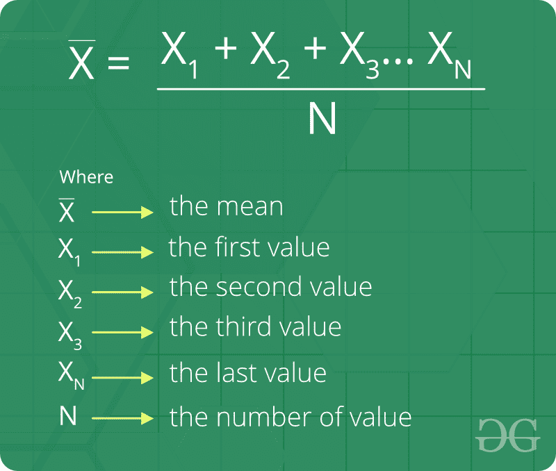

# 算术平均值

> 原文:[https://www.geeksforgeeks.org/arithmetic-mean/](https://www.geeksforgeeks.org/arithmetic-mean/)

算术平均值，也称为平均值或平均值，是将两个或多个数字或变量相加，然后除以数字或变量的数量而得到的量。算术平均值在统计学中很重要。
举个例子，假设只涉及两个量，简单地把两个量相加，除以 2 就得到算术平均值。

**算术平均值的一些有趣事实:**

1.  *n* 数 x1，x2，.。。，xn 为 *x* 。如果每个观察值增加 *p* ，则新观察值的平均值为 **(x + p)** 。
2.  *n* 数 x1，x2，.。。，xn 为 *x* 。如果每个观察值减少 *p* ，则新观察值的平均值为**(x–p)**。
3.  *n* 数 x1，x2，.。。，xn 为 *x* 。如果每个观测值乘以一个非零数 *p* ，新观测值的平均值为 **px** 。
4.  *n* 数 x1，x2，.。。，xn 为 *x* 。如果每个观测值除以一个非零数 *p* ，则新观测值的平均值为 **(x/p)** 。

**算术平均值公式:**



**如何求算术平均值？**
给定三个整数 A、B 和 N，任务是找出 A 和 B 之间的 N 个算术平均值。我们基本上需要在算术级数中插入 N 个项。其中 A 和 B 是第一项和最后一项。

**示例:**

```
Input : A = 20 B = 32 N = 5
Output : 22 24 26 28 30
The Arithmetic progression series is 
20 22 24 26 28 30 32 

Input : A = 5  B = 35  N = 5
Output : 10 15 20 25 30
```

**进场:**
让 A <sub>1</sub> ，A <sub>2</sub> ，A <sub>3</sub> ，A <sub>4</sub> ……A <sub>n</sub> 为两个给定数字 A 和 B 之间的 N 个算术平均值，然后 A，A <sub>1</sub> ，A <sub>2</sub> …..A <sub>n</sub> ，B 将处于算术级数。现在 B = (N+2) <sup>算术级数的第</sup>项。所以:

求等差数列的第(N+2)<sup>项，其中 d 为公差</sup>

```
B = A + (N + 2 - 1)d
B - A  = (N + 1)d
```

所以公差带 d 由下式给出。

```
d = (B - A) / (N + 1)
```

我们有 **A** 的值和公差( **d** 的值，现在我们可以找到 A 和 b 之间所有的 *N* 算术平均值

## C++

```
// C++ program to find n arithmetic
// means between A and B
#include <bits/stdc++.h>
using namespace std;

// Prints N arithmetic means between
// A and B.
void printAMeans(int A, int B, int N)
{
    // calculate common difference(d)
    float d = (float)(B - A) / (N + 1);

    // for finding N the arithmetic
    // mean between A and B
    for (int i = 1; i <= N; i++)
        cout << (A + i * d) << " ";
}

// Driver code to test above
int main()
{
    int A = 20, B = 32, N = 5;
    printAMeans(A, B, N);
    return 0;
}
```

## Java 语言(一种计算机语言，尤用于创建网站)

```
// java program to illustrate
// n arithmetic mean between
// A and B
import java.io.*;
import java.lang.*;
import java.util.*;

public class GFG {

    // insert function for calculating the means
    static void printAMeans(int A, int B, int N)
    {
        // Finding the value of d Common difference
        float d = (float)(B - A) / (N + 1);

        // for finding N the Arithmetic
        // mean between A and B
        for (int i = 1; i <= N; i++)
            System.out.print((A + i * d) + " ");
    }

    // Driver code
    public static void main(String args[])
    {
        int A = 20, B = 32, N = 5;
        printAMeans(A, B, N);
    }
}
```

## 蟒蛇 3

```
# Python3 program to find n arithmetic
# means between A and B

# Prints N arithmetic means
# between A and B.
def printAMeans(A, B, N):

    # Calculate common difference(d)
    d = (B - A) / (N + 1)

    # For finding N the arithmetic
    # mean between A and B
    for i in range(1, N + 1):
        print(int(A + i * d), end = " ")

# Driver code
A = 20; B = 32; N = 5
printAMeans(A, B, N)

# This code is contributed by Smitha Dinesh Semwal
```

## C#

```
// C# program to illustrate
// n arithmetic mean between
// A and B
using System;

public class GFG {

    // insert function for calculating the means
    static void printAMeans(int A, int B, int N)
    {
        // Finding the value of d Common difference
        float d = (float)(B - A) / (N + 1);

        // for finding N the Arithmetic
        // mean between A and B
        for (int i = 1; i <= N; i++)
            Console.Write((A + i * d) + " ");
    }

    // Driver code
    public static void Main()
    {
        int A = 20, B = 32, N = 5;
        printAMeans(A, B, N);
    }
}
// Contributed by vt_m
```

## 服务器端编程语言（Professional Hypertext Preprocessor 的缩写）

```
<?php
// PHP program to find n arithmetic
// means between A and B

// Prints N arithmetic means
// between A and B.
function printAMeans($A, $B, $N)
{

    // calculate common
    // difference(d)
    $d = ($B - $A) / ($N + 1);

    // for finding N the arithmetic
    // mean between A and B
    for ($i = 1; $i <= $N; $i++)
        echo ($A + $i * $d), " ";
}

    // Driver Code
    $A = 20; $B = 32;
    $N = 5;
    printAMeans($A, $B, $N);

// This code is Contributed by vt_m.
?>
```

## java 描述语言

```
<script>

// Javascript program to find n arithmetic
// means between A and B

// Prints N arithmetic means between
// A and B.
function printAMeans(A, B, N)
{

    // Calculate common difference(d)
    let d = (B - A) / (N + 1);

    // For finding N the arithmetic
    // mean between A and B
    for(let i = 1; i <= N; i++)
        document.write((A + i * d) + " ");
}

// Driver code
let A = 20, B = 32, N = 5;
printAMeans(A, B, N);

// This code is contributed by souravmahato348

</script>
```

**Output:** 

```
22 24 26 28 30
```

**算术平均相关基础程序**

*   [用算术平均值和几何平均值求调和平均值](https://www.geeksforgeeks.org/find-harmonic-mean-using-arithmetic-mean-geometric-mean/)
*   [类区间算术平均值程序](https://www.geeksforgeeks.org/program-class-interval-arithmetic-mean/)