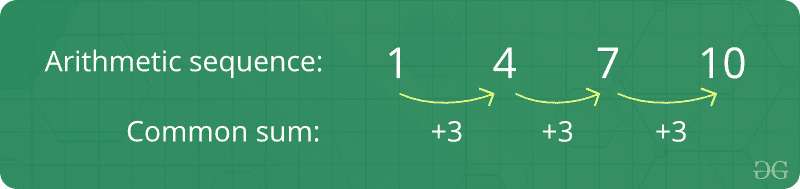
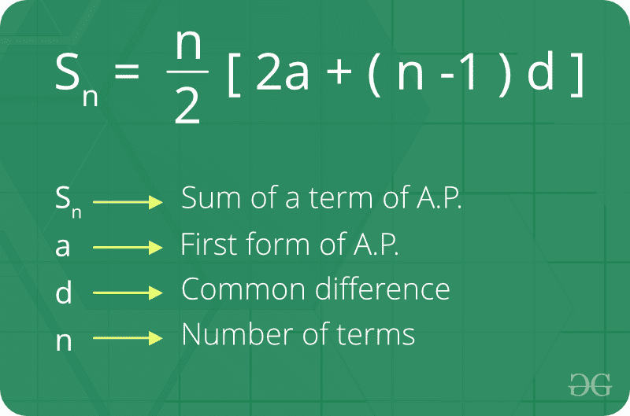

# 算术级数

> 原文:[https://www.geeksforgeeks.org/arithmetic-progression/](https://www.geeksforgeeks.org/arithmetic-progression/)

如果任意两个连续项之间的差总是相同的**，则一个数字序列被称为*等差数列*。简单来说，它意味着序列中的下一个数字是通过在序列中的前一个数字上加上一个固定的数字来计算的。例如，2，4，6，8，10 是一个 AP，因为序列中任意两个连续项之间的差(公共差)是相同的(4–2 = 6–4 = 8–6 = 10–8 = 2)。** 

****

****关于算术级数的事实:**** 

1.  ****初项:**在算术级数中，数列中的第一个数称为初项。**
2.  ****公差:**连续项增减的数值称为公差。**
3.  **等差数列的行为取决于公差 d .如果公差为:正，则成员(项)将向正无穷大增长，或者为负，则成员(项)将向负无穷大增长。**

****公式 n <sup>第</sup>项的一个 A.P :**
如果‘A’是初始项而‘d’是共同的区别。因此，显式公式为** 

****

****阿普的第 n <sup>个</sup>项之和的公式:**T4】**

****

****我们如何检验一个数列是否是等差数列？**** 

1.  ****天真解**。
    想法是对给定的数组或序列进行排序。排序后，检查连续元素之间的差异是否相同。如果所有差异都相同，算术级数是可能的。
    以下是本办法的实施:** 

## **C++**

```
// C++ program to check if a given array
// can form arithmetic progression
#include <bits/stdc++.h>
using namespace std;

// Returns true if a permutation of arr[0..n-1]
// can form arithmetic progression
bool checkIsAP(int arr[], int n)
{
    if (n == 1)
        return true;

    // Sort array
    sort(arr, arr + n);

    // After sorting, difference between
    // consecutive elements must be same.
    int d = arr[1] - arr[0];
    for (int i = 2; i < n; i++)
        if (arr[i] - arr[i - 1] != d)
            return false;

    return true;
}

// Driven Program
int main()
{
    int arr[] = { 20, 15, 5, 0, 10 };
    int n = sizeof(arr) / sizeof(arr[0]);

    (checkIsAP(arr, n)) ? (cout << "Yes" << endl) : (cout << "No" << endl);

    return 0;
}
```

## **Java 语言(一种计算机语言，尤用于创建网站)**

```
// Java program to check if a given array
// can form arithmetic progression
import java.util.Arrays;

class GFG {

    // Returns true if a permutation of
    // arr[0..n-1] can form arithmetic
    // progression
    static boolean checkIsAP(int arr[], int n)
    {
        if (n == 1)
            return true;

        // Sort array
        Arrays.sort(arr);

        // After sorting, difference between
        // consecutive elements must be same.
        int d = arr[1] - arr[0];
        for (int i = 2; i < n; i++)
            if (arr[i] - arr[i - 1] != d)
                return false;

        return true;
    }

    // driver code
    public static void main(String[] args)
    {
        int arr[] = { 20, 15, 5, 0, 10 };
        int n = arr.length;

        if (checkIsAP(arr, n))
            System.out.println("Yes");
        else
            System.out.println("No");
    }
}

// This code is contributed by Anant Agarwal.
```

## **蟒蛇 3**

```
# Python3 program to check if a given
# array can form arithmetic progression

# Returns true if a permutation of arr[0..n-1]
# can form arithmetic progression
def checkIsAP(arr, n):
    if (n == 1): return True

    # Sort array
    arr.sort()

    # After sorting, difference between
    # consecutive elements must be same.
    d = arr[1] - arr[0]
    for i in range(2, n):
        if (arr[i] - arr[i-1] != d):
            return False

    return True

# Driver code
arr = [ 20, 15, 5, 0, 10 ]
n = len(arr)
print("Yes") if(checkIsAP(arr, n)) else print("No")

# This code is contributed by Anant Agarwal.
```

## **C#**

```
// C# program to check if a given array
// can form arithmetic progression
using System;

class GFG {

    // Returns true if a permutation of
    // arr[0..n-1] can form arithmetic
    // progression
    static bool checkIsAP(int[] arr, int n)
    {
        if (n == 1)
            return true;

        // Sort array
        Array.Sort(arr);

        // After sorting, difference between
        // consecutive elements must be same.
        int d = arr[1] - arr[0];
        for (int i = 2; i < n; i++)
            if (arr[i] - arr[i - 1] != d)
                return false;

        return true;
    }

    // Driver Code
    public static void Main()
    {
        int[] arr = { 20, 15, 5, 0, 10 };
        int n = arr.Length;

        if (checkIsAP(arr, n))
            Console.WriteLine("Yes");
        else
            Console.WriteLine("No");
    }
}

// This code is contributed by vt_m.
```

## **服务器端编程语言（Professional Hypertext Preprocessor 的缩写）**

```
<?php
// PHP program to check if
// a given array can form
// arithmetic progression

// Returns true if a permutation
// of arr[0..n-1] can form
// arithmetic progression
function checkIsAP($arr, $n)
{
    if ($n == 1)
        return true;

    // Sort array
    sort($arr);

    // After sorting, difference
    // between consecutive elements
    // must be same.
    $d = $arr[1] - $arr[0];
    for ($i = 2; $i < $n; $i++)
        if ($arr[$i] -
            $arr[$i - 1] != $d)
        return false;

    return true;
}

// Driver Code
$arr = array(20, 15, 5, 0, 10);
$n = count($arr);

if(checkIsAP($arr, $n))
echo "Yes";
else
echo "No";

// This code is contributed
// by Sam007
?>
```

## **java 描述语言**

```
<script>
// Javascript program to check if a given array
// can form arithmetic progression
// Returns true if a permutation of arr[0..n-1]
// can form arithmetic progression
function compare(a, b) {
    if (a < b) {
        return -1;
    } else if (a > b) {
        return 1;
    } else {
        return 0;
    }
}
function checkIsAP( arr, n){
    if (n == 1)
        return true;

    // Sort array
    arr.sort(compare);

    // After sorting, difference between
    // consecutive elements must be same.
    let d = arr[1] - arr[0];
    for (let i = 2; i < n; i++)
        if (arr[i] - arr[i - 1] != d)
            return false;

    return true;
}

// Driven Program
let arr = [ 20, 15, 5, 0, 10 ];
let n = arr.length;
(checkIsAP(arr, n)) ? document.write("Yes <br>") : document.write("No <br>");

</script>
```

1.  ****输出:**** 

```
Yes
```

1.  ****时间复杂度:** O(n Log n)。** 
2.  ****高效解决方案**

    *   [设置 1(使用散列法)](https://www.geeksforgeeks.org/check-whether-arithmetic-progression-can-formed-given-array/)
    *   [设置 2(使用计数排序)](https://www.geeksforgeeks.org/check-whether-arithmetic-progression-can-formed-given-array/)** 

****与算术级数相关的基本程序**** 

*   **[算术级数求和程序](https://www.geeksforgeeks.org/program-sum-arithmetic-series/)**
*   **[程序打印等差数列](https://www.geeksforgeeks.org/program-print-arithmetic-progression-series/)**
*   **[给定公共差的最长算术级数](https://www.geeksforgeeks.org/longest-arithmetic-progression-with-the-given-common-difference/)**
*   **[检查算术级数是否可以从给定的数组中形成](https://www.geeksforgeeks.org/check-whether-arithmetic-progression-can-formed-given-array/)**
*   **[求算术级数中缺失的数](https://www.geeksforgeeks.org/find-missing-number-arithmetic-progression/)**
*   **[找出 A 和 B 之间的 N 个算术平均值](https://www.geeksforgeeks.org/find-n-arithmetic-means-b/)**
*   **[最多可被 2 或 5 整除的数的和](https://www.geeksforgeeks.org/sum-of-the-numbers-upto-n-that-are-divisible-by-2-or-5/)**
*   **[找出 AP 中给定素数倍数的第一个元素](https://www.geeksforgeeks.org/find-first-element-in-ap-which-is-multiple-of-given-prime/)**

****更多与算术级数相关的问题**** 

*   **[给定数列 3，6，11，…的前 n 项之和..](https://www.geeksforgeeks.org/sum-of-first-n-terms-of-a-given-series-3-6-11/)**
*   **[a . p .的第 n 项和第 m 项与给定总和比率的比率](https://www.geeksforgeeks.org/ratio-of-mth-and-nth-terms-of-an-a-p-with-given-ratio-of-sums/)**
*   **[三个随机选择的数字出现在 AP 中的概率](https://www.geeksforgeeks.org/probability-three-randomly-chosen-numbers-ap/)**
*   **[打印构成 AP 的排序数组中的所有三元组](https://www.geeksforgeeks.org/print-triplets-sorted-array-form-ap/)**
*   **[等差数列第 N 项程序](https://www.geeksforgeeks.org/program-n-th-term-arithmetic-progression-series/)**
*   **[算术几何序列之和](https://www.geeksforgeeks.org/sum-arithmetic-geometric-sequence/)**
*   **[数组中 AP(算术级数)子序列的计数](https://www.geeksforgeeks.org/count-arithmetic-progression-subsequences-array/)**

**[**近期关于算术级数的文章！**](https://www.geeksforgeeks.org/tag/arithmetic-progression/)**