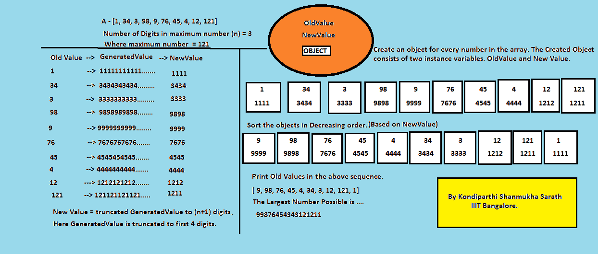

# 排列给定数字形成最大数字|集合 2

> 原文:[https://www . geesforgeks . org/array-given-numbers-form-maximum-number-set-2/](https://www.geeksforgeeks.org/arrange-given-numbers-form-biggest-number-set-2/)

给定一个非负数(整数范围)的数组，它们需要按照一定的顺序排列，以便给出最大数。例如，给定的数组是 A[1，34，3，98，9，76，45，4，12，121]。如果我们按照以下顺序排列这些数字，A[9，98，76，45，4，34，3，12，121，1]，那么通过连接它们，我们得到“998764543433121211”作为最大的数字。

**示例:**

```
Input :  [1, 34, 3, 98, 9, 76, 45, 4, 12, 121]
Output : 99876454343121211

Input :  [12, 121]
Output : 12121

```

在 [SET 1](https://www.geeksforgeeks.org/given-an-array-of-numbers-arrange-the-numbers-to-form-the-biggest-number/) 中，我们已经讨论了同样的方法。在这一集里，我们将讨论另一个逻辑。

1)找出最大数字中的位数。让位数为 n。
2)创建所有数字的扩展版本。在扩展版本中，我们有 n+1 个数字，它们是通过将的数字与其本身连接起来并截断多余的数字而形成的。
3)根据原始数字的扩展值对其进行排序。
4)连接排序后的数字产生所需的结果。

[](https://media.geeksforgeeks.org/wp-content/uploads/LargestNumber-1-e1500842965745.png)

## Java 语言(一种计算机语言，尤用于创建网站)

```
// Java program to arrange the numbers to form the
// largest number
import java.math.BigInteger;
import java.util.*;

public class LargestNumber
{
    // method that returns largest number form
    public static String largestNumber(List<Integer> arr)
    {
        // finding number of digits in maximum element
        // present in array
        int n =
         Collections.max(arr).toString().length();

        ArrayList<ExtendedNum> en =
                       new ArrayList<ExtendedNum>();
        for (int i = 0 ; i < arr.size(); i++)
            en.add(new ExtendedNum(arr.get(i),
                              n));

        // sort based on modified value
        Collections.sort(en, (p1, p2) ->
         (int)(p2.modifiedValue - p1.modifiedValue));

        StringBuilder sb = new StringBuilder();
        for (int i = 0; i < en.size(); i++)
            sb.append(new StringBuilder
            (Long.toString(en.get(i).originalValue)));

        // To remove any zeroes at head.
        BigInteger bi = new BigInteger(sb.toString());

        return bi.toString();
    }

    // Driver method
    public static void main(String[] args)
    {
        Integer arr[] = {1, 34, 3, 98, 9, 76, 45,
                                     4, 12, 121};
        List<Integer> l = Arrays.asList(arr);

        System.out.println(largestNumber(l));
    }
}

// A utility class to generate new value
class ExtendedNum
{
    int originalValue;
    long modifiedValue;

    public ExtendedNum(int originalValue, int n)
    {
        this.originalValue = originalValue;
        String s = Integer.toString(originalValue);
        StringBuilder sb = new StringBuilder(s);
        StringBuilder ans = new StringBuilder();
        while (ans.length() <= n + 1)
            ans.append(sb);

        s = ans.toString().substring(0, n + 1);
        modifiedValue = Long.parseLong(s);
    }

    public String toString()
    {
        return "[" + modifiedValue +
                ", " + originalValue + "]";
    }
}
```

## 计算机编程语言

```
# Python program to find largest
# number from the given values
# function that return largest
# possible number
def largestNumber(array):

    # extval is a empty list for extended 
    # values and ans for calculating answer
    extval, ans = [], ""

    # calculating the length of largest number
    # from given and add 1 for further operation
    l = len(str(max(array))) + 1

    # iterate given values and 
    # calculating extended values
    for i in array:
        temp = str(i) * l

        # make tuple of extended value and 
        # equivalant original value then 
        # append to list
        extval.append((temp[:l:], i))

    # sort extval in descending order
    extval.sort(reverse = True)

    # iterate extended values
    for i in extval:

        # concatinate original value equivalant
        # to extended value into ans variable
        ans += str(i[1])

    if int(ans)==0:
        return "0"
    return ans

# Driver code
a = [1, 34, 3, 98, 9, 76,
        45, 4, 12, 121]

print(largestNumber(a))

# This code is contributed by Chhekur
```

**Output:**

```
99876454343121211

```

本文由**kondipathi Shanmukha Sarath**供稿。如果你喜欢 GeeksforGeeks 并想投稿，你也可以使用[contribute.geeksforgeeks.org](http://www.contribute.geeksforgeeks.org)写一篇文章或者把你的文章邮寄到 contribute@geeksforgeeks.org。看到你的文章出现在极客博客主页上，帮助其他极客。

如果你发现任何不正确的地方，或者你想分享更多关于上面讨论的话题的信息，请写评论。