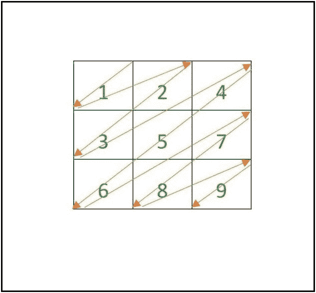

# 按照升序以之字形矩阵排列数字 1 到 n^2

> 原文:[https://www . geesforgeks . org/array-numbers-1-to-N2-in-a-zig-zag-matrix-in-升序/](https://www.geeksforgeeks.org/arrange-numbers-1-to-n2-in-a-zig-zag-matrix-in-ascending-order/)

给定一个正整数 **N** ，任务是打印一个由从 1 到 N <sup>2</sup> 的数字组成的 **N × N** [之字形矩阵](https://www.geeksforgeeks.org/print-matrix-zag-zag-fashion/)，使得矩阵的之字形遍历产生升序的数字。
**示例:**

> **输入:** N = 3
> **输出:**
> 1 2 4
> 3 5 7
> 6 8 9
> **解释:**
> 
> 
> 
> **输入:** N = 4
> **输出:**
> 1 2 4 7
> 3 5 8 11
> 6 9 12 14
> 10 13 15 16

**逼近:**
所需的矩阵可以分解成两个直角三角形。

*   一个颠倒的直角三角形(被认为是上三角形)。
*   正常的直角三角形(被认为是下三角形)。

其思想是迭代两个嵌套循环，用各自的值填充上三角形。然后再次迭代两个嵌套循环，用各自的值填充下面的三角形。在上述两个操作之后，打印所需的矩阵。
下面是上述方法的实现:

## C++

```
// C++ program for the above approach
#include <bits/stdc++.h>
using namespace std;

// Function to print the pattern
void printPattern(int n)
{
    // N * N matrix to store the
    // values
    int arr[n][n];

    arr[0][0] = 1;

    // Fill the values of
    // upper triangle
    for (int i = 0; i < n; i++) {

        if (i > 0) {
            arr[i][0] = arr[i - 1][0] + i + 1;
        }
        for (int j = 1;
             j < n - i; j++) {

            arr[i][j] = arr[i][j - 1] + i + j;
        }
    }

    // Fill the values of
    // lower triangle
    arr[1][n - 1] = arr[n - 1][0] + 1;
    int div = 0;

    for (int i = 2; i < n; i++) {

        div = n - 2;
        for (int j = n - i;
             j < n; j++) {

            if (j == n - i) {
                arr[i][j] = arr[i - 1][j + 1]
                            + 1;
            }
            else {
                arr[i][j] = arr[i][j - 1]
                            + div;
                div--;
            }
        }
    }

    // Print the array
    for (int i = 0; i < n; i++) {

        for (int j = 0; j < n; j++) {

            cout << arr[i][j] << " ";
        }
        cout << "\n";
    }
}

// Driver Code
int main()
{
    // Given size of matrix
    int N = 4;

    // Function Call
    printPattern(N);
    return 0;
}
```

## Java 语言(一种计算机语言，尤用于创建网站)

```
// Java program for
// the above approach
import java.util.*;
class GFG{

// Function to print the pattern
static void printPattern(int n)
{
  // N * N matrix to store the
  // values
  int [][]arr = new int[n][n];

  arr[0][0] = 1;

  // Fill the values of
  // upper triangle
  for (int i = 0; i < n; i++)
  {
    if (i > 0)
    {
      arr[i][0] = arr[i - 1][0] +
                      i + 1;
    }
    for (int j = 1; j < n - i; j++)
    {
      arr[i][j] = arr[i][j - 1] +
                      i + j;
    }
  }

  // Fill the values of
  // lower triangle
  arr[1][n - 1] = arr[n - 1][0] + 1;
  int div = 0;

  for (int i = 2; i < n; i++)
  {
    div = n - 2;
    for (int j = n - i; j < n; j++)
    {
      if (j == n - i)
      {
        arr[i][j] = arr[i - 1][j + 1] + 1;
      }
      else
      {
        arr[i][j] = arr[i][j - 1] + div;
        div--;
      }
    }
  }

  // Print the array
  for (int i = 0; i < n; i++)
  {
    for (int j = 0; j < n; j++)
    {
      System.out.print(arr[i][j] + " ");
    }
    System.out.print("\n");
  }
}

// Driver Code
public static void main(String[] args)
{
  // Given size of matrix
  int N = 4;

  // Function Call
  printPattern(N);
}
}

// This code is contributed by Princi Singh
```

## 蟒蛇 3

```
# Python3 program for the above approach

# Function to print the pattern
def printPattern(n):

        # N * N matrix to store the values
    arr = [[0 for i in range(n)]
        for j in range(n)]

    # Fill the values of upper triangle
    arr[0][0] = 1
    for i in range(n):
        if i > 0:
            arr[i][0] = arr[i - 1][0] + i + 1
        for j in range(1, n-i):
            arr[i][j] = arr[i][j - 1] + i + j

    # Fill the values of lower triangle
    if n > 1:
        arr[1][n - 1] = arr[n - 1][0] + 1
    div = 0
    for i in range(2, n):
        div = n-2
        for j in range(n-i, n):
            if j == n-i:
                arr[i][j] = arr[i - 1][j + 1] + 1
            else:
                arr[i][j] = arr[i][j - 1] + div
                div -= 1

    # Print the array
    for i in range(n):
        for j in range(n):
            print(arr[i][j], end=' ')
        print("")

# Driver code
# Given size of matrix
N = 4

# Function Call
printPattern(N)
```

## C#

```
// C# program for
// the above approach
using System;
class GFG{

// Function to print the pattern
static void printPattern(int n)
{
  // N * N matrix to store the
  // values
  int [,]arr = new int[n, n];

  arr[0,0] = 1;

  // Fill the values of
  // upper triangle
  for (int i = 0; i < n; i++)
  {
    if (i > 0)
    {
      arr[i, 0] = arr[i - 1, 0] +
                      i + 1;
    }
    for (int j = 1; j < n - i; j++)
    {
      arr[i, j] = arr[i, j - 1] +
                      i + j;
    }
  }

  // Fill the values of
  // lower triangle
  arr[1, n - 1] = arr[n - 1, 0] + 1;
  int div = 0;

  for (int i = 2; i < n; i++)
  {
    div = n - 2;
    for (int j = n - i; j < n; j++)
    {
      if (j == n - i)
      {
        arr[i, j] = arr[i - 1, j + 1] + 1;
      }
      else
      {
        arr[i, j] = arr[i, j - 1] + div;
        div--;
      }
    }
  }

  // Print the array
  for (int i = 0; i < n; i++)
  {
    for (int j = 0; j < n; j++)
    {
      Console.Write(arr[i, j] + " ");
    }
    Console.Write("\n");
  }
}

// Driver Code
public static void Main(String[] args)
{
  // Given size of matrix
  int N = 4;

  // Function Call
  printPattern(N);
}
}

// This code is contributed by shikhasingrajput
```

## java 描述语言

```
<script>

// Javascript program for
// the above approach

// Function to print the pattern
function printPattern(n)
{

  // N * N matrix to store the
  // values
  let arr = new Array(n);

  // Loop to create 2D array using 1D array
    for (let i = 0; i < arr.length; i++) {
        arr[i] = new Array(2);
    }

  arr[0][0] = 1;

  // Fill the values of
  // upper triangle
  for (let i = 0; i < n; i++)
  {
    if (i > 0)
    {
      arr[i][0] = arr[i - 1][0] +
                      i + 1;
    }
    for (let j = 1; j < n - i; j++)
    {
      arr[i][j] = arr[i][j - 1] +
                      i + j;
    }
  }

  // Fill the values of
  // lower triangle
  arr[1][n - 1] = arr[n - 1][0] + 1;
  let div = 0;

  for (let i = 2; i < n; i++)
  {
    div = n - 2;
    for (let j = n - i; j < n; j++)
    {
      if (j == n - i)
      {
        arr[i][j] = arr[i - 1][j + 1] + 1;
      }
      else
      {
        arr[i][j] = arr[i][j - 1] + div;
        div--;
      }
    }
  }

  // Print the array
  for (let i = 0; i < n; i++)
  {
    for (let j = 0; j < n; j++)
    {
      document.write(arr[i][j] + " ");
    }
    document.write("<br/>");
  }
}

// Driver code

    // Given size of matrix
  let N = 4;

  // Function Call
  printPattern(N);

    // This code is contributed by susmitakundugoaldanga.
</script>
```

**Output**

```
1 2 4 7 
3 5 8 11 
6 9 12 14 
10 13 15 16 
```

**时间复杂度:***O(N<sup>2</sup>)*
T7】辅助空间: *O(N <sup>2</sup> )*