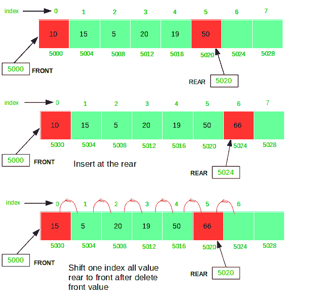

# 队列的数组实现(简单)

> 原文:[https://www . geesforgeks . org/array-实现队列-simple/](https://www.geeksforgeeks.org/array-implementation-of-queue-simple/)

在[队列](https://www.geeksforgeeks.org/queue-data-structure/)中，插入和删除发生在对端，所以实现没有[栈](https://www.geeksforgeeks.org/stack-data-structure/)那么简单。
要使用数组实现一个[队列](https://www.geeksforgeeks.org/queue-data-structure/)，创建一个大小为 *n* 的数组 *arr* ，取两个变量*前*和*后*，这两个变量都将被初始化为 *0* ，这意味着该队列当前为空。元素*后面的*是数组中存储元素的索引，前面的*是数组第一个元素的索引。现在，队列操作的一些实现如下:*

1.  **入队:**向队列中添加元素。添加元素将在检查队列是否已满后执行。如果*后< n* 表示数组未满，则将元素存储在 *arr【后】*并将*后*增加 *1* ，但是如果*后== n* ，则表示数组已满，这是溢出情况。
2.  **出列:**从队列中移除元素。只有当至少有一个元素要删除时，才能删除该元素，即*后方> 0* 。现在， *arr【前面】*处的元素可以被删除，但是所有剩余的元素必须向左移动一个位置，以便出列操作在另一个出列操作中从左边删除第二个元素。
3.  **Front:** 如果队列不为空，从队列中获取 Front 元素，即*arr【Front】*。
4.  **显示:**打印队列的所有元素。如果队列非空，遍历并打印从索引*前*到*后*的所有元素。



下面是使用数组的队列的实现:

## C++

```
// C++ program to implement a queue using an array
#include <bits/stdc++.h>
using namespace std;

struct Queue {
    int front, rear, capacity;
    int* queue;
    Queue(int c)
    {
        front = rear = 0;
        capacity = c;
        queue = new int;
    }

    ~Queue() { delete[] queue; }

    // function to insert an element
    // at the rear of the queue
    void queueEnqueue(int data)
    {
        // check queue is full or not
        if (capacity == rear) {
            printf("\nQueue is full\n");
            return;
        }

        // insert element at the rear
        else {
            queue[rear] = data;
            rear++;
        }
        return;
    }

    // function to delete an element
    // from the front of the queue
    void queueDequeue()
    {
        // if queue is empty
        if (front == rear) {
            printf("\nQueue is  empty\n");
            return;
        }

        // shift all the elements from index 2 till rear
        // to the left by one
        else {
            for (int i = 0; i < rear - 1; i++) {
                queue[i] = queue[i + 1];
            }

            // decrement rear
            rear--;
        }
        return;
    }

    // print queue elements
    void queueDisplay()
    {
        int i;
        if (front == rear) {
            printf("\nQueue is Empty\n");
            return;
        }

        // traverse front to rear and print elements
        for (i = front; i < rear; i++) {
            printf(" %d <-- ", queue[i]);
        }
        return;
    }

    // print front of queue
    void queueFront()
    {
        if (front == rear) {
            printf("\nQueue is Empty\n");
            return;
        }
        printf("\nFront Element is: %d", queue[front]);
        return;
    }
};

// Driver code
int main(void)
{
    // Create a queue of capacity 4
    Queue q(4);

    // print Queue elements
    q.queueDisplay();

    // inserting elements in the queue
    q.queueEnqueue(20);
    q.queueEnqueue(30);
    q.queueEnqueue(40);
    q.queueEnqueue(50);

    // print Queue elements
    q.queueDisplay();

    // insert element in the queue
    q.queueEnqueue(60);

    // print Queue elements
    q.queueDisplay();

    q.queueDequeue();
    q.queueDequeue();

    printf("\n\nafter two node deletion\n\n");

    // print Queue elements
    q.queueDisplay();

    // print front of the queue
    q.queueFront();

    return 0;
}
```

## Java 语言(一种计算机语言，尤用于创建网站)

```
// Java program to implement a queue using an array
class Queue {
    private static int front, rear, capacity;
    private static int queue[];

    Queue(int c)
    {
        front = rear = 0;
        capacity = c;
        queue = new int[capacity];
    }

    // function to insert an element
    // at the rear of the queue
    static void queueEnqueue(int data)
    {
        // check queue is full or not
        if (capacity == rear) {
            System.out.printf("\nQueue is full\n");
            return;
        }

        // insert element at the rear
        else {
            queue[rear] = data;
            rear++;
        }
        return;
    }

    // function to delete an element
    // from the front of the queue
    static void queueDequeue()
    {
        // if queue is empty
        if (front == rear) {
            System.out.printf("\nQueue is empty\n");
            return;
        }

        // shift all the elements from index 2 till rear
        // to the right by one
        else {
            for (int i = 0; i < rear - 1; i++) {
                queue[i] = queue[i + 1];
            }

            // store 0 at rear indicating there's no element
            if (rear < capacity)
                queue[rear] = 0;

            // decrement rear
            rear--;
        }
        return;
    }

    // print queue elements
    static void queueDisplay()
    {
        int i;
        if (front == rear) {
            System.out.printf("\nQueue is Empty\n");
            return;
        }

        // traverse front to rear and print elements
        for (i = front; i < rear; i++) {
            System.out.printf(" %d <-- ", queue[i]);
        }
        return;
    }

    // print front of queue
    static void queueFront()
    {
        if (front == rear) {
            System.out.printf("\nQueue is Empty\n");
            return;
        }
        System.out.printf("\nFront Element is: %d", queue[front]);
        return;
    }
}

public class StaticQueueinjava {

    // Driver code
    public static void main(String[] args)
    {
        // Create a queue of capacity 4
        Queue q = new Queue(4);

        // print Queue elements
        q.queueDisplay();

        // inserting elements in the queue
        q.queueEnqueue(20);
        q.queueEnqueue(30);
        q.queueEnqueue(40);
        q.queueEnqueue(50);

        // print Queue elements
        q.queueDisplay();

        // insert element in the queue
        q.queueEnqueue(60);

        // print Queue elements
        q.queueDisplay();

        q.queueDequeue();
        q.queueDequeue();
        System.out.printf("\n\nafter two node deletion\n\n");

        // print Queue elements
        q.queueDisplay();

        // print front of the queue
        q.queueFront();
    }
}
```

## 蟒蛇 3

```
# Python3 program to implement
# a queue using an array
class Queue:

    # To initialize the object.
    def __init__(self, c):

        self.queue = []
        self.front = self.rear = 0
        self.capacity = c

    # Function to insert an element
    # at the rear of the queue
    def queueEnqueue(self, data):

        # Check queue is full or not
        if(self.capacity == self.rear):
            print("\nQueue is full")

        # Insert element at the rear
        else:
            self.queue.append(data)
            self.rear += 1

    # Function to delete an element
    # from the front of the queue
    def queueDequeue(self):

        # If queue is empty
        if(self.front == self.rear):
            print("Queue is empty")

        # Pop the front element from list
        else:
            x = self.queue.pop(0)
            self.rear -= 1

    # Function to print queue elements
    def queueDisplay(self):

        if(self.front == self.rear):
            print("\nQueue is Empty")

        # Traverse front to rear to
        # print elements
        for i in self.queue:
            print(i, "<--", end = '')

    # Print front of queue
    def queueFront(self):

        if(self.front == self.rear):
            print("\nQueue is Empty")

        print("\nFront Element is:",
              self.queue[self.front])

# Driver code
if __name__=='__main__':

    # Create a new queue of
    # capacity 4
    q = Queue(4)

    # Print queue elements
    q.queueDisplay()

    # Inserting elements in the queue
    q.queueEnqueue(20)
    q.queueEnqueue(30)
    q.queueEnqueue(40)
    q.queueEnqueue(50)

    # Print queue elements
    q.queueDisplay()

    # Insert element in queue
    q.queueEnqueue(60)

    # Print queue elements
    q.queueDisplay()

    q.queueDequeue()
    q.queueDequeue()
    print("\n\nafter two node deletion\n")

    # Print queue elements
    q.queueDisplay()

    # Print front of queue
    q.queueFront()

# This code is contributed by Amit Mangal
```

## C#

```
// C# program to implement a queue using an array
using System;

public class Queue
{
    private static int front, rear, capacity;
    private static int []queue;

    public Queue(int c)
    {
        front = rear = 0;
        capacity = c;
        queue = new int[capacity];
    }

    // function to insert an element
    // at the rear of the queue
    public void queueEnqueue(int data)
    {
        // check queue is full or not
        if (capacity == rear)
        {
            Console.Write("\nQueue is full\n");
            return;
        }

        // insert element at the rear
        else
        {
            queue[rear] = data;
            rear++;
        }
        return;
    }

    // function to delete an element
    // from the front of the queue
    public void queueDequeue()
    {
        // if queue is empty
        if (front == rear)
        {
            Console.Write("\nQueue is empty\n");
            return;
        }

        // shift all the elements from index 2 till rear
        // to the right by one
        else
        {
            for (int i = 0; i < rear - 1; i++)
            {
                queue[i] = queue[i + 1];
            }

            // store 0 at rear indicating there's no element
            if (rear < capacity)
                queue[rear] = 0;

            // decrement rear
            rear--;
        }
        return;
    }

    // print queue elements
    public void queueDisplay()
    {
        int i;
        if (front == rear)
        {
            Console.Write("\nQueue is Empty\n");
            return;
        }

        // traverse front to rear and print elements
        for (i = front; i < rear; i++)
        {
            Console.Write(" {0} <-- ", queue[i]);
        }
        return;
    }

    // print front of queue
    public void queueFront()
    {
        if (front == rear)
        {
            Console.Write("\nQueue is Empty\n");
            return;
        }
        Console.Write("\nFront Element is: {0}", queue[front]);
        return;
    }
}

public class StaticQueueinjava {

    // Driver code
    public static void Main(String[] args)
    {
        // Create a queue of capacity 4
        Queue q = new Queue(4);

        // print Queue elements
        q.queueDisplay();

        // inserting elements in the queue
        q.queueEnqueue(20);
        q.queueEnqueue(30);
        q.queueEnqueue(40);
        q.queueEnqueue(50);

        // print Queue elements
        q.queueDisplay();

        // insert element in the queue
        q.queueEnqueue(60);

        // print Queue elements
        q.queueDisplay();

        q.queueDequeue();
        q.queueDequeue();
        Console.Write("\n\nafter two node deletion\n\n");

        // print Queue elements
        q.queueDisplay();

        // print front of the queue
        q.queueFront();
    }
}

// This code has been contributed by 29AjayKumar
```

## java 描述语言

```
<script>

// Javascript program to implement a queue using an array
class Queue{

constructor(c)
{
    this.front = this.rear = 0;
    this.capacity = c;
    this.queue = new Array(this.capacity);
}

// Function to insert an element
// at the rear of the queue
queueEnqueue(data)
{

    // Check queue is full or not
    if (this.capacity == this.rear)
    {
        document.write("<br>Queue is full<br>");
        return;
    }

    // insert element at the rear
    else
    {
        this.queue[this.rear] = data;
        this.rear++;
    }
    return;
}

// Function to delete an element
// from the front of the queue
queueDequeue()
{

    // If queue is empty
    if (this.front == this.rear)
    {
        document.write("<br>Queue is empty<br>");
        return;
    }

    // Shift all the elements from index 2 till rear
    // to the right by one
    else
    {
        for(let i = 0; i < this.rear - 1; i++)
        {
            this.queue[i] = this.queue[i + 1];
        }

        // Store 0 at rear indicating there's no element
        if (this.rear < this.capacity)
            this.queue[this.rear] = 0;

        // Decrement rear
        this.rear--;
    }
    return;
}

// Print queue elements
queueDisplay()
{
    let i;
    if (this.front == this.rear)
    {
        document.write("<br>Queue is Empty<br>");
        return;
    }

    // Traverse front to rear and print elements
    for(i = this.front; i < this.rear; i++)
    {
        document.write(this.queue[i] + "  <-- ");
    }
    return;
}

// Print front of queue
queueFront()
{
    if (this.front == this.rear)
    {
        document.write("<br>Queue is Empty<br>");
        return;
    }
    document.write("<br>Front Element is: " +
                   this.queue[this.front]);
    return;
}
}

// Driver code

// Create a queue of capacity 4
let q = new Queue(4);

// Print Queue elements
q.queueDisplay();

// Inserting elements in the queue
q.queueEnqueue(20);
q.queueEnqueue(30);
q.queueEnqueue(40);
q.queueEnqueue(50);

// Print Queue elements
q.queueDisplay();

// Insert element in the queue
q.queueEnqueue(60);

// Print Queue elements
q.queueDisplay();

q.queueDequeue();
q.queueDequeue();
document.write("<br><br> after two node deletion <br><br>");

// Print Queue elements
q.queueDisplay();

// Print front of the queue
q.queueFront();

// This code is contributed by rag2127

</script>
```

**Output:** 

```
Queue is Empty
 20 <--  30 <--  40 <--  50 <-- 
Queue is full
 20 <--  30 <--  40 <--  50 <-- 

after two node deletion

 40 <--  50 <-- 
Front Element is: 40
```

入队时间复杂度:O(1)
出队时间复杂度:O(n)

**优化:**
我们可以在 O(1)时间内实现入队和出队操作。为此，我们可以使用队列的[链表实现或者](https://www.geeksforgeeks.org/queue-set-2-linked-list-implementation/)[队列的](https://www.geeksforgeeks.org/circular-queue-set-1-introduction-array-implementation/)循环数组实现。