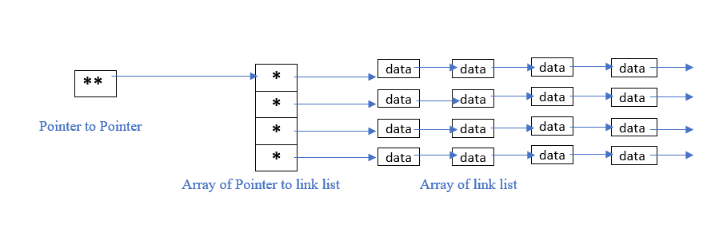

# C/c++中的链表数组

> 原文:[https://www . geesforgeks . org/c-CPP 中的链表数组/](https://www.geeksforgeeks.org/array-of-linked-list-in-c-cpp/)

[C/C++](https://www.geeksforgeeks.org/c-plus-plus/) 中的[数组](https://www.geeksforgeeks.org/introduction-to-arrays/)或者任何[编程语言中的](https://www.geeksforgeeks.org/top-10-programming-languages-of-the-world-2019-to-begin-with/)都是存储在连续存储位置的相似数据项的集合，并且可以使用数组的索引随机访问元素。它们可用于存储[原始数据类型](https://www.geeksforgeeks.org/c-data-types/)的集合，例如任何特定类型的 int、float、double、char 等。补充一下，C/C++中的数组可以存储[派生的数据类型](https://www.geeksforgeeks.org/derived-data-types-in-c/)，比如结构、指针等。下面给出了一个数组的图片表示。


一个[链表](https://www.geeksforgeeks.org/data-structures/linked-list/)是一个由节点组成的线性数据结构，其中每个节点包含一个对下一个节点的引用。为了创建一个链接列表，我们需要一个指向列表第一个节点的[指针](https://www.geeksforgeeks.org/pointers-in-c-and-c-set-1-introduction-arithmetic-and-array/)。

**方法:**创建链表数组的主要要求如下:

*   [指针数组](https://www.geeksforgeeks.org/creating-array-of-pointers-in-cpp/)。
*   为了跟踪上面创建的指针数组，需要另一个指针指向数组的第一个指针。该指针被称为指向指针的[指针。](https://www.geeksforgeeks.org/double-pointer-pointer-pointer-c/)

下面是链表数组的图示:

[](https://media.geeksforgeeks.org/wp-content/uploads/20210821212740/Arrayoflinklist.PNG)

下面是实现链表数组的 C++程序:

## C++

```
// C++ program to illustrate the array
// of Linked Lists
#include <iostream>
using namespace std;

// Structure of Linked Lists
struct info {
    int data;
    info* next;
};

// Driver Code
int main()
{
    int size = 10;

    // Pointer To Pointer Array
    info** head;

    // Array of pointers to info struct
    // of size
    head = new info*[size];

    // Initialize pointer array to NULL
    for (int i = 0; i < size; ++i) {
        *(head + i) = NULL;
    }

    // Traverse the pointer array
    for (int i = 0; i < size; ++i) {

        // To track last node of the list
        info* prev = NULL;

        // Randomly taking 4 nodes in each
        // linked list
        int s = 4;

        while (s--) {

            // Create a new node
            info* n = new info;

            // Input the random data
            n->data = i * s;
            n->next = NULL;

            // If the node is first
            if (*(head + i) == NULL) {
                *(head + i) = n;
            }
            else {
                prev->next = n;
            }
            prev = n;
        }
    }

    // Print the array of linked list
    for (int i = 0; i < size; ++i) {
        info* temp = *(head + i);

        // Linked list number
        cout << i << "-->\t";

        // Print the Linked List
        while (temp != NULL) {
            cout << temp->data << " ";
            temp = temp->next;
        }

        cout << '\n';
    }

    return 0;
}
```

**Output:**

```
0-->    0 0 0 0 
1-->    3 2 1 0 
2-->    6 4 2 0 
3-->    9 6 3 0 
4-->    12 8 4 0 
5-->    15 10 5 0 
6-->    18 12 6 0 
7-->    21 14 7 0 
8-->    24 16 8 0 
9-->    27 18 9 0

```