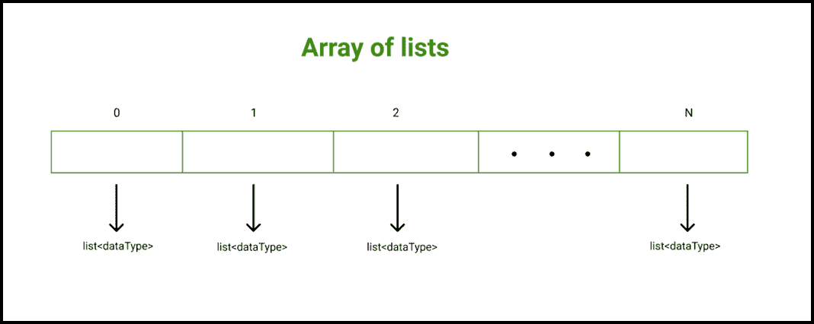

# c++中列表的数组，带示例

> 原文:[https://www . geeksforgeeks . org/c-in-list-in-examples/](https://www.geeksforgeeks.org/array-of-list-in-c-with-examples/)

**<u>什么是阵列？</u>T3】**

任何编程语言中的[数组](https://www.geeksforgeeks.org/introduction-to-arrays/)都是一种[数据结构](https://www.geeksforgeeks.org/data-structures/)，用于将相似数据类型的元素或数据项存储在连续的存储位置，并且可以使用数组的索引随机访问元素。当我们想要存储大量类似数据类型的元素时，数组是有效的。

**<u>什么是列表？</u>T3】**

在 [C++](http://www.geeksforgeeks.org/c-plus-plus/) 中，列表是一个允许非连续内存分配的序列[容器](https://www.geeksforgeeks.org/containers-cpp-stl/)。如果我们将一个向量与一个列表进行比较，那么与向量相比，列表的遍历速度较慢，但是一旦找到位置，插入和删除就会很快。一般来说，C++中的列表是一个[双向链表](https://www.geeksforgeeks.org/doubly-linked-list/) t。

**与列表一起使用的功能:**

*   [**front()**](https://www.geeksforgeeks.org/list-front-function-in-c-stl/) **:返回列表中第一个元素的值。**
*   [**back()**](https://www.geeksforgeeks.org/list-back-function-in-c-stl/) **:返回列表中最后一个元素的值。**
*   [**push _ front(x)**](https://www.geeksforgeeks.org/list-push_front-function-in-c-stl/)**:**在列表开头增加新元素‘x’。
*   [**push _ back(x)**](https://www.geeksforgeeks.org/listpush_front-listpush_back-c-stl/)**:**在列表末尾添加新元素‘x’。
*   [**【pop _ front()**](https://www.geeksforgeeks.org/list-pop_front-function-in-c-stl/)**:**移除列表的第一个元素，并将列表的大小减少 1。
*   [**【pop _ back()】**](https://www.geeksforgeeks.org/list-pop_back-function-in-c-stl/)**:**移除列表的最后一个元素，并将列表的大小减少 1。

**<u>列表阵列</u>**

C++允许我们创建一系列列表。列表数组是一个数组，其中每个元素都是一个单独的列表。

**语法:**

> **清单< dataType >支付宝【n】；**
> 
> 这里，
> **N:** 列表数组的大小。
> **数据类型:**一种数据类型。它表示每个列表只能存储这种数据类型的元素。



**示例 1:** 下面是实现列表数组的 C++程序。

## C++

```
// C++ program to demonstrate the
// working of array of lists in C++
#include <bits/stdc++.h>
using namespace std;

// Function to print list elements
// specified at the index, "index"
void print(list<int>& mylist,
           int index)
{
    cout << "The list elements stored at the index " << 
             index << ": \n";

    // Each element of the list is a pair on 
    // its own
    for (auto element : mylist) 
    {
        // Each element of the list is a pair 
        // on its own
        cout << element << '\n';
    }
    cout << '\n';
}

// Function to iterate over all the array
void print(list<int>* myContainer, int n)
{
    cout << "myContainer elements:\n\n";

    // Iterating over myContainer elements
    // Each element is a list on its own
    for (int i = 0; i < n; i++) 
    {
        print(myContainer[i], i);
    }
}

// Driver code
int main()
{
    // Declaring an array of lists
    // In list each element is of type int
    list<int> myContainer[3];

    // listping values to the list stored
    // at the index 0
    // 15 <-> 5 <-> 10 <-> 20
    myContainer[0].push_front(5);
    myContainer[0].push_back(10);
    myContainer[0].push_front(15);
    myContainer[0].push_back(20);

    // listping values to the list stored
    // at the index 1
    // 40 <-> 30 <-> 35 <-> 45
    myContainer[1].push_front(30);
    myContainer[1].push_back(35);
    myContainer[1].push_front(40);
    myContainer[1].push_back(45);

    // listping values to the list stored
    // at the index 2
    // 60 <-> 50 <-> 55 <-> 65
    myContainer[2].push_front(50);
    myContainer[2].push_back(55);
    myContainer[2].push_front(60);
    myContainer[2].push_back(65);

    // Calling print function to iterate
    // over myContainer elements
    print(myContainer, 3);

    return 0;
}
```

**Output**

> 我的容器元素:
> 
> 存储在索引 0 处的列表元素:
> 15
> 5
> 10
> 20
> 
> 存储在索引 1 中的列表元素:
> 40
> 30
> 35
> 45
> 
> 存储在索引 2 中的列表元素:
> 60
> 50
> 55
> 65

**示例 2:** 下面是实现列表数组的 C++程序。

## C++

```
// C++ program to demonstrate the
// working of array of lists in C++
#include <bits/stdc++.h>
using namespace std;

// Function to print list elements
// specified at the index, "index"
void print(list<string>& mylist,
           int index)
{
    cout << "The list elements stored at the index " << 
             index << ": \n";

    // Each element of the list is a pair 
    // on its own
    for (auto element : mylist) 
    {
        // Each element of the list is a pair 
        // on its own
        cout << element << '\n';
    }
    cout << '\n';
}

// Function to iterate over all the array
void print(list<string>* myContainer, int n)
{
    cout << "myContainer elements:\n\n";

    // Iterating over myContainer elements
    // Each element is a list on its own
    for (int i = 0; i < n; i++) 
    {
        print(myContainer[i], i);
    }
}

// Driver code
int main()
{
    // Declaring an array of lists
    // In list each element is of type string
    list<string> myContainer[3];

    // listing values to the list stored
    // at the index 0
    // "GeeksforGeeks" <-> "C++" <-> 
    // "Python" <-> "C"
    myContainer[0].push_front("C++");
    myContainer[0].push_back("Python");
    myContainer[0].push_front("GeeksforGeeks");
    myContainer[0].push_back("C");

    // listing values to the list stored
    // at the index 1
    // "Nainwal" <-> "Java" <-> "C#" <-> "GFG"
    myContainer[1].push_front("Java");
    myContainer[1].push_back("C#");
    myContainer[1].push_front("Nainwal");
    myContainer[1].push_back("GFG");

    // listing values to the list stored
    // at the index 2
    // "HTML" <-> "Swift" <-> "R" <-> "CSS"
    myContainer[2].push_front("Swift");
    myContainer[2].push_back("R");
    myContainer[2].push_front("HTML");
    myContainer[2].push_back("CSS");

    // Calling print function to iterate
    // over myContainer elements
    print(myContainer, 3);

    return 0;
}
```

**Output**

> 我的容器元素:
> 
> 存储在索引 0 处的列表元素:
> geeks forgeeks
> c++
> Python
> C
> 
> 存储在索引 1 处的列表元素:奈瓦尔
> 爪哇
> C#
> GFG
> 
> 存储在索引 2 中的列表元素:HTML
> Swift
> R
> CSS