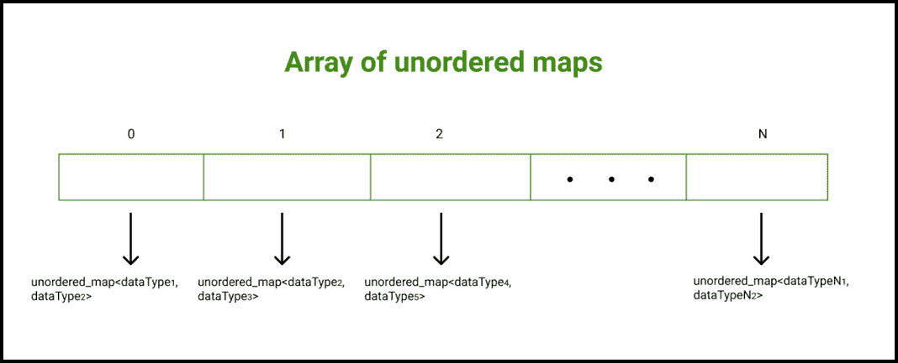

# c++中无序映射的数组，示例

> 原文:[https://www . geeksforgeeks . org/无序地图数组-c-in-with-examples/](https://www.geeksforgeeks.org/array-of-unordered-maps-in-c-with-examples/)

**<u>什么是阵列？</u>T3】**

任何编程语言中的[数组](https://www.geeksforgeeks.org/introduction-to-arrays/)都是一种[数据结构](https://www.geeksforgeeks.org/data-structures/)，用于将相似数据类型的元素或数据项存储在连续的存储位置，并且可以使用数组的索引随机访问元素。当我们想要存储大量类似数据类型的元素时，数组是有效的。

**<u>什么是无序地图？</u>T3】**

[无序 _ 映射](https://www.geeksforgeeks.org/unordered_map-in-cpp-stl/)是一个关联的[容器](https://www.geeksforgeeks.org/containers-cpp-stl/)，它存储由键值和映射值组合而成的元素。键值用于唯一标识元素，映射值是与键相关联的内容。键和值都可以是预定义或用户定义的任何类型。无序地图中的元素不以任何特定顺序排列。在内部，无序映射是使用哈希表实现的。

**无序地图使用的函数:**

*   [**at()**](https://www.geeksforgeeks.org/unordered_map-at-cpp/) **:** 这个函数在 C++无序 _map 中返回对元素为 key k 的值的引用。
*   [**begin()**](https://www.geeksforgeeks.org/unordered_map-begin-in-c/) **:** 返回一个迭代器，指向无序 _map 容器中容器的第一个元素
*   [**end()**](https://www.geeksforgeeks.org/unordered_map-end-function-in-c-stl/) **:** 返回一个迭代器，指向无序 _map 容器中容器中最后一个元素的位置

本文主要讨论如何在 C++中使用无序映射数组。在设计复杂的数据结构时，无序映射的数组非常有用。

**<u>无序地图阵列</u>**

[C++](http://www.geeksforgeeks.org/c-plus-plus/) 允许我们创建一个无序地图数组的工具。无序映射数组是一个数组，其中每个元素都是一个独立的映射。

**语法:**

> **无序 _ 地图<T3【数据类型 1】，数据类型 2>T5【我的容器【N】；**
> 
> 在这里，
> 
> **N:** 无序映射数组的大小
> **数据类型 1:** 键的数据类型
> **数据类型 2:** 值的数据类型



**示例 1:** 下面是实现该方法的 C++程序:

## C++

```
// C++ program to demonstrate the
// working of array of unordered maps in C++
#include <bits/stdc++.h>
using namespace std;

// Function to print unordered map elements
// specified at the index, "index"
void print(unordered_map<int, bool>& myMap,
           int index)
{
    cout << "The unordered map elements stored " << 
            "at the index " << index << ": \n";
    cout << "Key      Value\n";

    // Each element of the map is a pair on 
    // its own
    for (auto pr : myMap) 
    {
        // Each element of the map is a pair 
        // on its own
        cout << pr.first << "         " << 
                pr.second << '\n';
    }
    cout << '\n';
}

// Function to iterate over all the array
void print(unordered_map<int, 
           bool>* myContainer, int n)
{
    // Iterating over myContainer elements
    // Each element is a map on its own
    for (int i = 0; i < n; i++) 
    {
        print(myContainer[i], i);
    }
}

// Driver code
int main()
{
    // Declaring an array of unordered maps
    // In unordered map Key is of type int
    // Value is of type bool
    unordered_map<int, bool> myContainer[3];

    // Mapping values to the unordered map 
    // stored at the index 0
    myContainer[0][10] = true;
    myContainer[0][15] = false;
    myContainer[0][20] = true;
    myContainer[0][25] = false;

    // Mapping values to the unordered map 
    // stored at the index 1
    myContainer[1][30] = true;
    myContainer[1][35] = false;
    myContainer[1][40] = true;
    myContainer[1][45] = false;

    // Mapping values to the unordered map 
    // stored at the index 2
    myContainer[2][50] = true;
    myContainer[2][55] = false;
    myContainer[2][60] = true;
    myContainer[2][65] = false;

    // Calling print function to iterate
    // over myContainer elements
    print(myContainer, 3);

    return 0;
}
```

**Output**

> 存储在索引 0 处的无序地图元素:
> 键值
> 25 0
> 20 1
> 10 1
> 15 0
> 
> 存储在索引 1 处的无序地图元素:
> 键值
> 45 0
> 40 1
> 30 1
> 35 0
> 
> 存储在索引 2 处的无序地图元素:
> 键值
> 65 0
> 60 1
> 50 1
> 55 0

**示例 2:** 下面是实现该方法的 C++程序:

## C++

```
// C++ program to demonstrate the
// working of array of maps in C++
#include <bits/stdc++.h>
using namespace std;

// Function to print unordered map elements 
// specified at the index, "index"
void print(unordered_map<string, 
           bool>& myMap, int index)
{
    cout << "The unordered map elements stored " << 
            "at the index " << index << ": \n";
    cout << "Key      Value\n";

    // Each element of the unordered map is 
    // a pair on its own
    for (auto pr : myMap) 
    {
        cout << pr.first << "      " << 
                pr.second << '\n';
    }
    cout << '\n';
}

// Function to iterate over the unordered 
// map corresponding to an index
void print(unordered_map<string, 
           bool>* myContainer, int n)
{
    for (int i = 0; i < n; i++) 
    {
        print(myContainer[i], i);
    }
}

// Driver code
int main()
{
    // Declaring an array of unordered maps
    // In unordered map Key is of type string
    // Value is of type bool
    unordered_map<string, bool> myContainer[3];

    // Mapping values to the unordered map 
    // stored at the index 0
    myContainer[0]["Code"] = true;
    myContainer[0]["HTML"] = false;
    myContainer[0]["Java"] = true;
    myContainer[0]["Solo"] = false;

    // Mapping values to the unordered map 
    // stored at the index 1
    myContainer[1]["PHP"] = true;
    myContainer[1]["CSS"] = false;
    myContainer[1]["C++"] = true;
    myContainer[1]["Lab"] = false;

    // Mapping values to the unordered map 
    // stored at the index 2
    myContainer[2]["Swift"] = true;
    myContainer[2]["Cobol"] = false;
    myContainer[2]["Fizzy"] = true;
    myContainer[2]["Pizza"] = false;

    // Calling print function to print 
    // myContainer elements
    print(myContainer, 3);

    return 0;
}
```

**Output**

> 存储在索引 0 处的无序地图元素:
> 键值
> Solo 0
> Java 1
> 代码 1
> HTML 0
> 
> 存储在索引 1 处的无序地图元素:
> 键值
> 实验室 0
> C++ 1
> PHP 1
> CSS 0
> 
> 存储在索引 2 处的无序地图元素:
> 键值
> 菲西 1
> 比萨 0
> 斯威夫特 1
> 科博 0