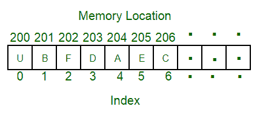

# 数组介绍

> 原文： [https://www.geeksforgeeks.org/introduction-to-arrays/](https://www.geeksforgeeks.org/introduction-to-arrays/)

数组是存储在连续内存位置的项目的集合。 这个想法是将多个相同类型的项目存储在一起。 通过简单地将偏移量添加到基本值（即数组的第一个元素的存储位置（通常由数组的名称表示）），可以更轻松地计算每个元素的位置。

为简单起见，我们可以考虑一系列楼梯，在每个楼梯上都放置一个值（假设您的一个朋友）。 在这里，您只需知道朋友走过的步数即可确定他们的位置。

请记住：“下一个索引的位置取决于我们使用的数据类型”。



上图可以看作是您在楼梯底部的楼梯的顶层视图。 每个元素都可以通过数组中的索引唯一地标识（就像您在上面的示例中通过步骤确定朋友的方式类似）。

**数组中的索引类型**：

*   0（从零开始的索引）：数组的第一个元素由下标 0 索引。
*   1（基于一个索引）：数组的第二个元素由下标 1 索引。
*   `n`（基于`n`的索引）：数组的基础索引可以自由选择。 通常，允许基于`n`索引的编程语言还允许负索引值和其他标量数据类型（例如枚举），或者可以将字符用作数组索引。


**使用数组的优势**：

*   数组允许元素的随机访问。 这使得按位置访问元素的速度更快。
*   数组具有更好的[缓存位置](https://en.wikipedia.org/wiki/Locality_of_reference "cache locality")，可以在性能上产生很大的不同。

**示例**：

```
// A character array in C/C++/Java
char arr1[] = {'g', 'e', 'e', 'k', 's'};

// An Integer array in C/C++/Java
int arr2[] = {10, 20, 30, 40, 50};

// Item at i'th index in array is typically accessed
// as "arr[i]".  For example arr1[0] gives us 'g'
// and arr2[3] gives us 40.

```

通常，字符数组称为“字符串”，而整数或浮点数的数组简称为数组。


