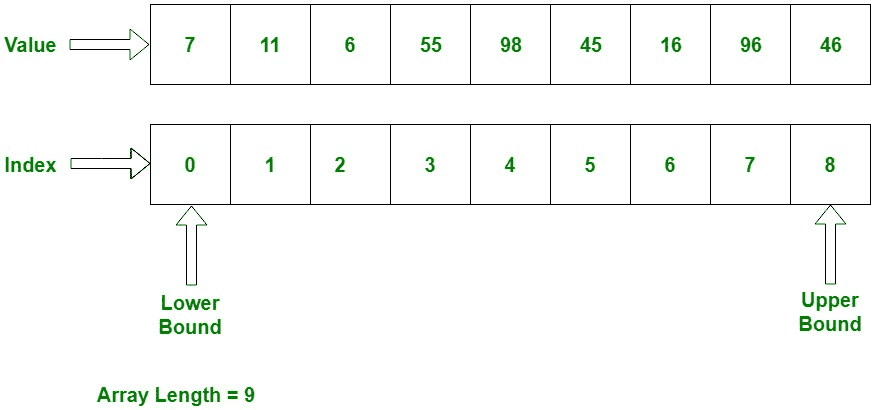

# C# | 数组

> 原文： [https://www.geeksforgeeks.org/c-sharp-arrays/](https://www.geeksforgeeks.org/c-sharp-arrays/)

数组是一组由普通名称引用的相似类型的变量。 每个数据项都称为数组的元素。 元素的数据类型可以是任何有效的数据类型，例如`char`，`int`，`float`等，并且元素存储在连续的位置。 **数组的长度**指定数组中存在的元素数。 在 [**C#**](https://www.geeksforgeeks.org/introduction-to-c-sharp/) 中，数组的内存分配是动态完成的。 而且数组是一种对象，因此使用预定义的函数很容易找到它们的大小。 数组中的变量是有序的，每个变量的索引都从 0 开始。C# 中的数组工作与 C/C++ 中的不同。

有关 C# 中数组的重要注意事项：

*   在 C# 中，所有数组都是动态分配的。
*   由于数组是 C# 中的对象，因此我们可以使用成员长度来找到它们的长度。 这与 C/C++ 不同，在 C/C++ 中，我们使用`sizeof`运算符查找长度。
*   像其他变量一样，也可以在数据类型之后使用`[]`声明 C# 数组变量。
*   数组中的变量是有序的，每个变量的索引都从 0 开始。
*   C# 数组是基本类型为`System.Array`的对象。
*   数字数组和引用类型元素的默认值分别设置为零和`null`。
*   锯齿状数组元素是引用类型，并且被初始化为`null`。
*   数组元素可以是任何类型，包括数组类型。
*   数组类型是从抽象基本类型`Array`派生的引用类型。 这些类型实现`IEnumerable`，为此，它们在 C# 中的所有数组上使用`foreach`迭代。

根据数组的定义，数组可以包含基本数据类型以及类的对象。 每当使用基元数据类型时，实际值都必须存储在连续的内存位置中。 对于类的对象，实际对象存储在堆段中。

下图显示了数组如何顺序存储值：



**说明**：索引从 0 开始，存储值。 我们还可以在数组中存储固定数量的值。 每当数组索引未达到数组大小时，将按顺序将其增加 1。

## 数组声明

**语法**：

```
< Data Type > [ ] < Name_Array >

```

**这里**，

+   `< Data Type >`：它定义数组的元素类型。
+   `[]`：它定义数组的大小。
+   `< Name_Array >`：这是数组的名称。

**示例**：

```
int[] x;  // can store int values
string[] s; // can store string values
double[] d; // can store double values
Student[] stud1; // can store instances of Student class which is custom class

```

**注意**：仅声明数组不会为该数组分配内存。 对于该数组，必须初始化。

## 数组初始化

如前所述，数组是引用类型，因此`new`关键字用于创建数组的实例。 我们可以在索引的帮助下分配初始化的单个数组元素。

**语法**：

```
type [ ] < Name_Array > = new < datatype > [size];

```

在这里，`type`指定要分配的数据的类型，`size`指定数组中元素的数量，`Name_Array`是数组变量的名称。 并且`new`将根据其大小为数组分配内存。

**示例 - 展示数组声明和初始化的不同方法**：

**示例 1**：

```
// defining array with size 5\. 
// But not assigns values
int[] intArray1 = new int[5]; 

```

上面的语句声明&初始化可以存储五个`int`值的`int`类型数组。 数组大小在方括号（`[]`）中指定。

**示例 2**：

```
// defining array with size 5 and assigning
// values at the same time
int[] intArray2 = new int[5]{1, 2, 3, 4, 5};

```

上面的语句与之相同，但是它为{}中的每个索引分配值。

**示例 3**：

```
// defining array with 5 elements which 
// indicates the size of an array
int[] intArray3 = {1, 2, 3, 4, 5};

```

在上面的语句中，数组的值直接初始化而无需占用其大小。 因此，数组大小将自动为直接获取的值的数量。

## 声明后初始化数组

声明后可以初始化数组。 不必使用`new`关键字同时声明和初始化。 但是，在声明之后初始化数组，必须使用`new`关键字对其进行初始化。 只能通过分配值来初始化它。

**示例**：

```
// Declaration of the array
string[] str1, str2;

// Initialization of array
str1 = new string[5]{ "Element 1", "Element 2", "Element 3", "Element 4", "Element 5" };

str2 = new string[5]{ "Element 1", "Element 2", "Element 3", "Element 4", "Element 5" };
```

**注意**：没有给出大小的初始化在 C# 中无效。 它将给出一个编译时错误。

**示例 - 初始化数组的声明错误**：

```
// compile-time error: must give size of an array
int[] intArray = new int[];

// error : wrong initialization of an array
string[] str1;
str1 = {"Element 1", "Element 2", "Element 3", "Element 4" };
```

## 访问数组元素

在初始化时，我们可以分配值。 但是，我们也可以在声明和初始化之后使用其索引随机分配数组的值。 我们可以通过索引来访问数组值，将元素的索引放置在数组名称后面方括号内。

**示例**：

```
//declares & initializes int type array
int[] intArray = new int[5];

// assign the value 10 in array on its index 0
intArray[0] = 10; 

// assign the value 30 in array on its index 2
intArray[2] = 30;

// assign the value 20 in array on its index 1
intArray[1] = 20;

// assign the value 50 in array on its index 4
intArray[4] = 50;

// assign the value 40 in array on its index 3
intArray[3] = 40;

// Accessing array elements using index
intArray[0];  //returns 10
intArray[2];  //returns 30

```

**实现 - 使用不同的循环访问数组元素**：

```

// C# program to illustrate creating an array 
// of integers, puts some values in the array, 
// and prints each value to standard output. 
using System; 
namespace geeksforgeeks { 

class GFG { 

    // Main Method 
    public static void Main() 
    { 

        // declares an Array of integers. 
        int[] intArray; 

        // allocating memory for 5 integers. 
        intArray = new int[5]; 

        // initialize the first elements 
        // of the array 
        intArray[0] = 10; 

        // initialize the second elements 
        // of the array 
        intArray[1] = 20; 

        // so on... 
        intArray[2] = 30; 
        intArray[3] = 40; 
        intArray[4] = 50; 

        // accessing the elements 
        // using for loop 
        Console.Write("For loop :"); 
        for (int i = 0; i < intArray.Length; i++) 
            Console.Write(" " + intArray[i]); 

        Console.WriteLine(""); 
        Console.Write("For-each loop :"); 

        // using for-each loop 
        foreach(int i in intArray) 
            Console.Write(" " + i); 

        Console.WriteLine(""); 
        Console.Write("while loop :"); 

        // using while loop 
        int j = 0; 
        while (j < intArray.Length) { 
            Console.Write(" " + intArray[j]); 
            j++; 
        } 

        Console.WriteLine(""); 
        Console.Write("Do-while loop :"); 

        // using do-while loop 
        int k = 0; 
        do
        { 
            Console.Write(" " + intArray[k]); 
            k++; 
        } while (k < intArray.Length); 
    } 
} 
} 

```

**输出**：

```
For loop : 10 20 30 40 50
For-each loop : 10 20 30 40 50
while loop : 10 20 30 40 50
Do-while loop : 10 20 30 40 50

```

## 一维数组

在此数组中仅包含一行用于存储值。 该数组的所有值从 0 到数组大小连续存储。 例如，声明 5 个整数的一维数组：

```
int[] arrayint = new int[5];

```

上面的数组包含从`arrayint[0]`到`arrayint[4]`的元素。 在这里，`new`运算符必须创建数组并通过其默认值初始化其元素。 上面的示例中，所有元素都由零初始化，因为它是`int`类型。

**示例**：

```

// C# program to creating an array 
// of the string as week days, store  
// day values in the weekdays, 
// and prints each value. 
using System; 
namespace geeksforgeeks { 

class GFG { 

    // Main Method 
    public static void Main() 
    { 

        // declares a 1D Array of string. 
        string[] weekDays; 

        // allocating memory for days. 
        weekDays = new string[] {"Sun", "Mon", "Tue", "Wed",  
                                       "Thu", "Fri", "Sat"}; 

        // Displaying Elements of array 
        foreach(string day in weekDays) 
            Console.Write(day + " "); 
    } 
} 
} 

```

**输出**：

```
Sun Mon Tue Wed Thu Fri Sat 

```

## 多维数组

多维数组包含多个行来存储值。 在 [C#](https://www.geeksforgeeks.org/introduction-to-c-sharp/)中也称为**矩形数组**，因为它的每行长度都是相同的。 它可以是 **2D 数组**或 **3D 数组**或更多。 为了存储和访问数组的值，需要嵌套循环。 多维数组的声明，初始化和访问如下：

```
// creates a two-dimensional array of 
// four rows and two columns.
int[, ] intarray = new int[4, 2];

//creates an array of three dimensions, 4, 2, and 3
int[,, ] intarray1 = new int[4, 2, 3];

```

**示例**：

```

// C# program to illustrate creating 
// an multi- dimensional array 
// puts some values in the array, 
// and print them 
using System; 
namespace geeksforgeeks { 

class GFG { 

    // Main Method 
    public static void Main() 
    { 

        // Two-dimensional array 
        int[, ] intarray = new int[, ] { { 1, 2 }, 
                                         { 3, 4 },  
                                         { 5, 6 },  
                                         { 7, 8 } }; 

        // The same array with dimensions  
        // specified 4 row and 2 column. 
        int[, ] intarray_d = new int[4, 2] { { 1, 2 }, { 3, 4 },  
                                             { 5, 6 }, { 7, 8 } }; 

        // A similar array with string elements. 
        string[, ] str = new string[4, 2] { { "one", "two" },  
                                            { "three", "four" },  
                                            { "five", "six" },  
                                            { "seven", "eight" } }; 

        // Three-dimensional array. 
        int[,, ] intarray3D = new int[,, ] { { { 1, 2, 3 },  
                                             { 4, 5, 6 } }, 
                                             { { 7, 8, 9 },  
                                           { 10, 11, 12 } } }; 

        // The same array with dimensions  
        // specified 2, 2 and 3\. 
        int[,, ] intarray3Dd = new int[2, 2, 3] { { { 1, 2, 3 },  
                                                  { 4, 5, 6 } },  
                                                  { { 7, 8, 9 },  
                                                { 10, 11, 12 } } }; 

        // Accessing array elements. 
        Console.WriteLine("2DArray[0][0] : " + intarray[0, 0]); 
        Console.WriteLine("2DArray[0][1] : " + intarray[0, 1]); 
        Console.WriteLine("2DArray[1][1] : " + intarray[1, 1]); 
        Console.WriteLine("2DArray[2][0] " + intarray[2, 0]); 

        Console.WriteLine("2DArray[1][1] (other) : " 
                                 + intarray_d[1, 1]); 

        Console.WriteLine("2DArray[1][0] (other)" 
                             + intarray_d[1, 0]); 

        Console.WriteLine("3DArray[1][0][1] : " 
                           + intarray3D[1, 0, 1]); 

        Console.WriteLine("3DArray[1][1][2] : " 
                          + intarray3D[1, 1, 2]); 

        Console.WriteLine("3DArray[0][1][1] (other): " 
                             + intarray3Dd[0, 1, 1]); 

        Console.WriteLine("3DArray[1][0][2] (other): " 
                             + intarray3Dd[1, 0, 2]); 

        // using nested loop show string elements 
        Console.WriteLine("To String element"); 
        for (int i = 0; i < 4; i++) 
            for (int j = 0; j < 2; j++) 
                Console.Write(str[i, j] + " "); 
    } 
} 
} 

```

**输出**：

```
2DArray[0][0] : 1
2DArray[0][1] : 2
2DArray[1][1] : 4
2DArray[2][0] 5
2DArray[1][1] (other) : 4
2DArray[1][0] (other)3
3DArray[1][0][1] : 8
3DArray[1][1][2] : 12
3DArray[0][1][1] (other): 5
3DArray[1][0][2] (other): 9
To String element
one two three four five six seven eight 

```

## 锯齿状数组

元素为数组的数组称为锯齿数组，其含义是**数组**。 锯齿状的数组元件可以具有不同的尺寸和大小。 以下示例显示了如何声明，初始化和访问锯齿状数组。

**示例**：

```

// C# program to single-dimensional jagged array 
// that contains two single-dimensional array 
// elements of different sizes. 
using System; 
namespace geeksforgeeks { 

class GFG { 

    // Main Method 
    public static void Main() 
    { 

        /*----------2D Array---------------*/
        // Declare the array of two elements: 
        int[][] arr = new int[2][]; 

        // Initialize the elements: 
        arr[0] = new int[5] { 1, 3, 5, 7, 9 }; 
        arr[1] = new int[4] { 2, 4, 6, 8 }; 

        // Another way of Declare and 
        // Initialize of elements 
        int[][] arr1 = { new int[] { 1, 3, 5, 7, 9 }, 
                         new int[] { 2, 4, 6, 8 } }; 

        // Display the array elements: 
        for (int i = 0; i < arr.Length; i++) 
        { 
            System.Console.Write("Element [" + i + "] Array: "); 
            for (int j = 0; j < arr[i].Length; j++) 
                Console.Write(arr[i][j] + " "); 
            Console.WriteLine(); 
        } 

        Console.WriteLine("Another Array"); 

        // Display the another array elements: 
        for (int i = 0; i < arr1.Length; i++)  
        { 
            System.Console.Write("Element [" + i + "] Array: "); 
            for (int j = 0; j < arr1[i].Length; j++) 
                Console.Write(arr1[i][j] + " "); 
            Console.WriteLine(); 
        } 
    } 
} 
} 

```

**输出**：

```
Element [0] Array: 1 3 5 7 9 
Element [1] Array: 2 4 6 8 
Another Array
Element [0] Array: 1 3 5 7 9 
Element [1] Array: 2 4 6 8 

```

可以混合锯齿状和多维数组。 锯齿状数组是数组的数组，因此其元素是引用类型，并且被初始化为`null`。
**示例**：声明和初始化一维锯齿状数组，该数组包含三个大小不同的二维数组元素。

```

// C# program to single-dimensional jagged array 
// that contains three two-dimensional array 
// elements of different sizes. 
using System; 
namespace geeksforgeeks { 

class GFG { 

// Main Method 
public static void Main() 
{ 

    int[][, ] arr = new int[3][, ] {new int[, ] {{1, 3}, {5, 7}}, 
                                    new int[, ] {{0, 2}, {4, 6}, {8, 10}}, 
                                    new int[, ] {{11, 22}, {99, 88}, {0, 9}}}; 

    // Display the array elements: 
    for (int i = 0; i < arr.Length; i++) 
    { 
        int x = 0; 
        for (int j = 0; j < arr[i].GetLength(x); j++)  
        { 
            for (int k = 0; k < arr[j].Rank; k++) 
                Console.Write(" arr[" + i + "][" + j + ", " + k + "]:" 
                                               + arr[i][j, k] + " "); 
            Console.WriteLine(); 
        } 
        x++; 
        Console.WriteLine(); 
    } 
} 
} 
} 

```

**输出**：

```
 arr[0][0, 0]:1  arr[0][0, 1]:3 
 arr[0][1, 0]:5  arr[0][1, 1]:7 

 arr[1][0, 0]:0  arr[1][0, 1]:2 
 arr[1][1, 0]:4  arr[1][1, 1]:6 
 arr[1][2, 0]:8  arr[1][2, 1]:10 

 arr[2][0, 0]:11  arr[2][0, 1]:22 
 arr[2][1, 0]:99  arr[2][1, 1]:88 
 arr[2][2, 0]:0  arr[2][2, 1]:9 

```

**要记住的要点**：

*   `GetLength(int)`：返回数组第一维中的元素数。
*   当使用锯齿状数组时，如果索引不存在则是安全的，那么它将抛出`IndexOutOfRange`异常。

