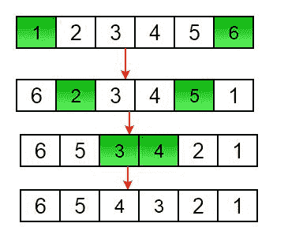

# 编写程序来反转数组或字符串

> 原文： [https://www.geeksforgeeks.org/write-a-program-to-reverse-an-array-or-string/](https://www.geeksforgeeks.org/write-a-program-to-reverse-an-array-or-string/)

给定一个数组（或字符串），任务是反转数组/字符串。

**示例**：

```
Input  : arr[] = {1, 2, 3}
Output : arr[] = {3, 2, 1}

Input :  arr[] = {4, 5, 1, 2}
Output : arr[] = {2, 1, 5, 4}

```


**迭代方式**：

1.  将开始和结束索引初始化为`start = 0`，`end = n-1`。

2.  在循环中，将`arr[start]`与`arr[end]`交换，并如下更改开始和结束：

    

    `start = start + 1`，`end = end – 1`。



另一个反转字符串的示例：


下面是上述方法的实现：

## C++ 

```cpp

// Iterative C++ program to reverse an array 
#include <bits/stdc++.h> 
using namespace std; 

/* Function to reverse arr[] from start to end*/
void rvereseArray(int arr[], int start, int end) 
{ 
    while (start < end) 
    { 
        int temp = arr[start];  
        arr[start] = arr[end]; 
        arr[end] = temp; 
        start++; 
        end--; 
    }  
}      

/* Utility function to print an array */
void printArray(int arr[], int size) 
{ 
   for (int i = 0; i < size; i++) 
   cout << arr[i] << " "; 

   cout << endl; 
}  

/* Driver function to test above functions */
int main()  
{ 
    int arr[] = {1, 2, 3, 4, 5, 6}; 

    int n = sizeof(arr) / sizeof(arr[0]);  

    // To print original array  
    printArray(arr, n); 

    // Function calling 
    rvereseArray(arr, 0, n-1); 

    cout << "Reversed array is" << endl; 

    // To print the Reversed array 
    printArray(arr, n); 

    return 0; 
} 

```