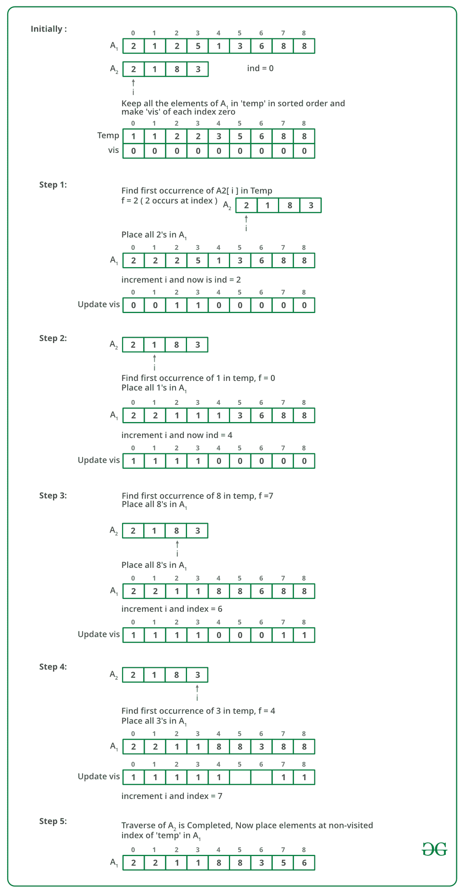

# 根据另一个数组定义的顺序对数组进行排序

> 原文： [https://www.geeksforgeeks.org/sort-array-according-order-defined-another-array/](https://www.geeksforgeeks.org/sort-array-according-order-defined-another-array/)

给定两个数组`A1[]`和`A2[]`，对`A1`进行排序，以使元素之间的相对顺序与`A2`中的相对顺序相同。 对于`A2`中不存在的元素，最后按排序顺序附加它们。

**例如**：

```
 Input: A1[] = {2, 1, 2, 5, 7, 1, 9, 3, 6, 8, 8}
       A2[] = {2, 1, 8, 3}
Output: A1[] = {2, 2, 1, 1, 8, 8, 3, 5, 6, 7, 9}

```

该代码应处理所有情况，例如与`A1[]`相比，`A2[]`中的元素数量可能更多或更少。 `A2[]`可能包含`A1[]`中可能不存在的某些元素，反之亦然。

**来源**： [Amazon 面试| 系列 110（校园内）](https://www.geeksforgeeks.org/amazon-interview-set-110-campus/)

[](https://practice.geeksforgeeks.org/problem-page.php?pid=434)

## 强烈建议您在继续解决方案之前，单击此处进行练习。

**方法 1（使用排序和二分搜索）**
假设`A1[]`的大小为`m`，而`A2[]`的大小为`n`。

*   创建一个大小为`m`的临时数组`temp`，并将`A1[]`的内容复制到其中。
*   创建另一个访问过的数组，并将其中的所有条目初始化为`false`。 `visit[]`用于标记`temp[]`中复制到`A1[]`的那些元素。
*   排序`temp[]`。
*   将输出索引`ind`初始化为 0。
*   对`A2[]`中的每个元素`A2[i]`进行跟踪。
    *   二分搜索`temp[]`中所有出现的`A2[i]`（如果存在），然后将所有出现的内容复制到`A1[ind]`并递增`ind`。 还标记复制的元素`visit[]`。
*   将所有未访问的元素从`temp[]`复制到`A1[]`。

.

下图是上述方法的模拟：



下面是上述方法的实现：

## C++ 

```cpp

// A C++ program to sort an array according to the order defined 
// by another array 
#include <bits/stdc++.h> 
using namespace std; 

// A Binary Search based function to find index of FIRST occurrence 
// of x in arr[].  If x is not present, then it returns -1 

// The same can be done using the lower_bound 
// function in C++ STL 
int first(int arr[], int low, int high, int x, int n) 
{ 

    // Checking condition 
    if (high >= low) { 

        // FInd the mid element 
        int mid = low + (high - low) / 2; 

        // Check if the element is the extreme left 
        // in the left half of the array 
        if ((mid == 0 || x > arr[mid - 1]) && arr[mid] == x) 
            return mid; 

        // If the element lies on the right half 
        if (x > arr[mid]) 
            return first(arr, (mid + 1), high, x, n); 

        // Check for element in the left half 
        return first(arr, low, (mid - 1), x, n); 
    } 

    // ELement not found 
    return -1; 
} 

// Sort A1[0..m-1] according to the order defined by A2[0..n-1]. 
void sortAccording(int A1[], int A2[], int m, int n) 
{ 
    // The temp array is used to store a copy of A1[] and visited[] 
    // is used mark the visited elements in temp[]. 
    int temp[m], visited[m]; 
    for (int i = 0; i < m; i++) { 
        temp[i] = A1[i]; 
        visited[i] = 0; 
    } 

    // Sort elements in temp 
    sort(temp, temp + m); 

    // for index of output which is sorted A1[] 
    int ind = 0; 

    // Consider all elements of A2[], find them in temp[] 
    // and copy to A1[] in order. 
    for (int i = 0; i < n; i++) { 
        // Find index of the first occurrence of A2[i] in temp 
        int f = first(temp, 0, m - 1, A2[i], m); 

        // If not present, no need to proceed 
        if (f == -1) 
            continue; 

        // Copy all occurrences of A2[i] to A1[] 
        for (int j = f; (j < m && temp[j] == A2[i]); j++) { 
            A1[ind++] = temp[j]; 
            visited[j] = 1; 
        } 
    } 

    // Now copy all items of temp[] 
    // which are not present in A2[] 
    for (int i = 0; i < m; i++) 
        if (visited[i] == 0) 
            A1[ind++] = temp[i]; 
} 

// Utility function to print an array 
void printArray(int arr[], int n) 
{ 

    // Iterate in the array 
    for (int i = 0; i < n; i++) 
        cout << arr[i] << " "; 
    cout << endl; 
} 

// Driver Code 
int main() 
{ 
    int A1[] = { 2, 1, 2, 5, 7, 1, 9, 3, 6, 8, 8 }; 
    int A2[] = { 2, 1, 8, 3 }; 
    int m = sizeof(A1) / sizeof(A1[0]); 
    int n = sizeof(A2) / sizeof(A2[0]); 

    // Prints the sorted array 
    cout << "Sorted array is \n"; 
    sortAccording(A1, A2, m, n); 
    printArray(A1, m); 
    return 0; 
} 

```