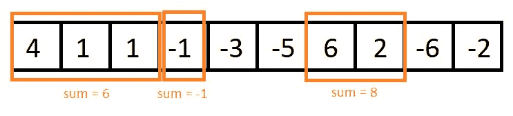

# 非重叠的连续子数组的 K 个最大和

> 原文： [https://www.geeksforgeeks.org/k-maximum-sums-non-overlapping-contiguous-sub-arrays/](https://www.geeksforgeeks.org/k-maximum-sums-non-overlapping-contiguous-sub-arrays/)

给定一个整数数组和一个整数值 k，找出 k 个最大和为 k 的非重叠子数组。



**示例**：

```
Input : arr1[] = {4, 1, 1, -1, -3, -5, 6, 2, -6, -2}, 
             k = 3.
Output : Maximum non-overlapping sub-array sum1: 8, 
         starting index: 6, ending index: 7.

         Maximum non-overlapping sub-array sum2: 6, 
         starting index: 0, ending index: 2.

         Maximum non-overlapping sub-array sum3: -1, 
         starting index: 3, ending index: 3.

Input : arr2 = {5, 1, 2, -6, 2, -1, 3, 1}, 
           k = 2.
Output : Maximum non-overlapping sub-array sum1: 8, 
         starting index: 0, ending index: 2.

         Maximum non-overlapping sub-array sum2: 5, 
         starting index: 4, ending index: 7.

```


**先决条件**： [Kadane 的算法](https://www.geeksforgeeks.org/largest-sum-contiguous-subarray/)

Kadane 的算法仅找出最大子数组和，但是使用相同的算法，我们可以找出 k 个最大的非重叠子数组和。 该方法是：

*   使用 Kadane 的算法找出数组中的最大子数组。 还找出其开始和结束索引。 打印此子数组的总和。
*   用-infinity 填充此子数组的每个单元格。
*   重复过程 1 和 2 k 次。

## C++ 

```cpp

// C++ program to find out k maximum  
// non-overlapping sub-array sums. 
#include <bits/stdc++.h> 
using namespace std; 

// Function to compute k maximum 
// sub-array sums. 
void kmax(int arr[], int k, int n) { 

    // In each iteration it will give 
    // the ith maximum subarray sum. 
    for(int c = 0; c < k; c++){ 

        // Kadane's algorithm. 
        int max_so_far = numeric_limits<int>::min(); 
        int max_here = 0; 

        // compute starting and ending 
        // index of each of the sub-array. 
        int start = 0, end = 0, s = 0; 
        for(int i = 0; i < n; i++) 
        { 
            max_here += arr[i]; 
            if (max_so_far < max_here) 
            { 
                max_so_far = max_here; 
                start = s; 
                end = i; 
            } 
            if (max_here < 0) 
            { 
                max_here = 0; 
                s = i + 1; 
            } 
        } 

        // Print out the result. 
        cout << "Maximum non-overlapping sub-array sum"
             << (c + 1) << ": "<< max_so_far  
             << ", starting index: " << start  
             << ", ending index: " << end << "." << endl; 

        // Replace all elements of the maximum subarray  
        // by -infinity. Hence these places cannot form  
        // maximum sum subarray again. 
        for (int l = start; l <= end; l++) 
            arr[l] = numeric_limits<int>::min(); 
    } 
    cout << endl; 
} 

// Driver Program 
int main() 
{ 
    // Test case 1 
    int arr1[] = {4, 1, 1, -1, -3,  
                 -5, 6, 2, -6, -2}; 
    int k1 = 3; 
    int n1 = sizeof(arr1) / sizeof(arr1[0]); 

    // Function calling 
    kmax(arr1, k1, n1); 

    // Test case 2 
    int arr2[] = {5, 1, 2, -6, 2, -1, 3, 1}; 
    int k2 = 2; 
    int n2 = sizeof(arr2)/sizeof(arr2[0]); 

    // Function calling 
    kmax(arr2, k2, n2); 

    return 0; 
} 

```

## Java

```java

// Java program to find out k maximum  
// non-overlapping sub-array sums. 

class GFG { 

    // Method to compute k maximum  
    // sub-array sums. 
    static void kmax(int arr[], int k, int n) { 

        // In each iteration it will give 
        // the ith maximum subarray sum. 
        for(int c = 0; c < k; c++) 
        {  
            // Kadane's algorithm. 
            int max_so_far = Integer.MIN_VALUE; 
            int max_here = 0; 

            // compute starting and ending 
            // index of each of the sub-array. 
            int start = 0, end = 0, s = 0; 
            for(int i = 0; i < n; i++) 
            { 
                max_here += arr[i]; 
                if (max_so_far < max_here) 
                { 
                    max_so_far = max_here; 
                    start = s; 
                    end = i; 
                } 
                if (max_here < 0) 
                    { 
                    max_here = 0; 
                    s = i + 1; 
                } 
            } 

            // Print out the result. 
            System.out.println("Maximum non-overlapping sub-arraysum" + 
                                (c + 1) + ": " +  max_so_far +  
                                ", starting index: " + start + 
                                ", ending index: " + end + "."); 

            // Replace all elements of the maximum subarray  
            // by -infinity. Hence these places cannot form  
            // maximum sum subarray again. 
            for (int l = start; l <= end; l++) 
                arr[l] = Integer.MIN_VALUE; 
        } 
        System.out.println(); 
    } 

    // Driver Program 
    public static void main(String[] args) 
    { 
        // Test case 1 
        int arr1[] = {4, 1, 1, -1, -3, -5,  
                            6, 2, -6, -2}; 
        int k1 = 3; 
        int n1 = arr1.length; 

        // Function calling 
        kmax(arr1, k1, n1); 

        // Test case 2 
        int arr2[] = {5, 1, 2, -6, 2, -1, 3, 1}; 
        int k2 = 2; 
        int n2 = arr2.length; 

        // Function calling 
        kmax(arr2, k2, n2); 
    } 
} 

// This code is contributed by Nirmal Patel 

```

## Python3

```py

# Python program to find out k maximum  
# non-overlapping subarray sums. 

# Function to compute k  
# maximum sub-array sums. 
def kmax(arr, k, n): 

    # In each iteration it will give 
    # the ith maximum subarray sum. 
    for c in range(k): 

        # Kadane's algorithm 
        max_so_far = -float("inf") 
        max_here = 0

        # compute starting and ending 
        # index of each of the subarray 
        start = 0
        end = 0
        s = 0
        for i in range(n): 

            max_here += arr[i] 
            if (max_so_far < max_here): 

                max_so_far = max_here 
                start = s 
                end = i 
            if (max_here < 0): 

                max_here = 0
                s = i + 1

        # Print out the result 
        print("Maximum non-overlapping sub-array sum", 
               c + 1, ": ", max_so_far, ", starting index: ", 
               start, ", ending index: ", end, ".", sep = "") 

        # Replace all elements of the maximum subarray 
        # by -infinity. Hence these places cannot form  
        # maximum sum subarray again. 
        for l in range(start, end+1): 
            arr[l] = -float("inf") 
    print() 

# Driver Program 
# Test case 1 
arr1 = [4, 1, 1, -1, -3, -5, 6, 2, -6, -2] 
k1 = 3
n1 = len(arr1) 

# Function calling 
kmax(arr1, k1, n1) 

# Test case 2 
arr2 = [5, 1, 2, -6, 2, -1, 3, 1] 
k2 = 2
n2 = len(arr2) 

# Function calling 
kmax(arr2, k2, n2) 

```

## C# 

```cs

// C# program to find out k maximum  
// non-overlapping sub-array sums. 
using System; 

class GFG { 

    // Method to compute k  
    // maximum sub-array sums. 
    static void kmax(int []arr, int k, int n) { 

        // In each iteration it will give 
        // the ith maximum subarray sum. 
        for(int c = 0; c < k; c++) 
        {  
            // Kadane's algorithm. 
            int max_so_far = int.MinValue; 
            int max_here = 0; 

            // compute starting and ending 
            // index of each of the sub-array. 
            int start = 0, end = 0, s = 0; 
            for(int i = 0; i < n; i++) 
            { 
                max_here += arr[i]; 
                if (max_so_far < max_here) 
                { 
                    max_so_far = max_here; 
                    start = s; 
                    end = i; 
                } 
                if (max_here < 0) 
                { 
                    max_here = 0; 
                    s = i + 1; 
                } 
            } 

            // Print out the result. 
            Console.WriteLine("Maximum non-overlapping sub-arraysum" + 
                              (c + 1) + ": "+ max_so_far +  
                              ", starting index: " + start +  
                              ", ending index: " + end + "."); 

            // Replace all elements of the maximum subarray  
            // by -infinity. Hence these places cannot form  
            // maximum sum subarray again. 
            for (int l = start; l <= end; l++) 
                arr[l] = int.MinValue; 
        } 
    Console.WriteLine(); 
    } 

    // Driver Program 
    public static void Main(String[] args) 
    { 
        // Test case 1 
        int []arr1 = {4, 1, 1, -1, -3, -5, 
                            6, 2, -6, -2}; 
        int k1 = 3; 
        int n1 = arr1.Length; 

        // Function calling 
        kmax(arr1, k1, n1); 

        // Test case 2 
        int []arr2 = {5, 1, 2, -6, 2, -1, 3, 1}; 
        int k2 = 2; 
        int n2 = arr2.Length; 

        // Function calling 
        kmax(arr2, k2, n2); 
    } 
} 

// This code is contributed by parashar... 

```

## PHP

```php

<?php 
// PHP program to find out k maximum  
// non-overlapping sub-array sums. 

    // Method to compute k  
    // maximum sub-array sums. 
    function kmax($arr, $k, $n) { 

        // In each iteration it will give 
        // the ith maximum subarray sum. 
        for( $c = 0; $c < $k; $c++) 
        {  
            // Kadane's algorithm. 
            $max_so_far = PHP_INT_MIN; 
            $max_here = 0; 

            // compute starting and ending 
            // index of each of the sub-array. 
            $start = 0; $end = 0; $s = 0; 
            for($i = 0; $i < $n; $i++) 
            { 
                $max_here += $arr[$i]; 
                if ($max_so_far < $max_here) 
                { 
                    $max_so_far = $max_here; 
                    $start = $s; 
                    $end = $i; 
                } 
                if ($max_here < 0) 
                { 
                    $max_here = 0; 
                    $s = $i + 1; 
                } 
            } 

            // Print out the result. 
            echo "Maximum non-overlapping sub-arraysum" ; 
            echo ($c + 1) , ": ", $max_so_far ;  
            echo", starting index: " , $start ; 
            echo", ending index: " , $end , "."; 
            echo"\n"; 

            // Replace all elements of the maximum subarray  
            // by -infinity. Hence these places cannot form  
            // maximum sum subarray again. 
            for ( $l = $start; $l <= $end; $l++) 
                $arr[$l] = PHP_INT_MIN; 
        } 
        echo "\n"; 
    } 

    // Driver Program 
        // Test case 1 
        $arr1 = array(4, 1, 1, -1, -3, -5, 
                            6, 2, -6, -2); 
        $k1 = 3; 
        $n1 = count($arr1); 

        // Function calling 
        kmax($arr1, $k1, $n1); 

        // Test case 2 
        $arr2 = array(5, 1, 2, -6, 2, -1, 3, 1); 
        $k2 = 2; 
        $n2 =count($arr2); 

        // Function calling 
        kmax($arr2, $k2, $n2); 

// This code is contributed by anuj_67\. 
?> 

```

输出：

```
Maximum non-overlapping sub-array sum1: 8, starting index: 6, ending index: 7.
Maximum non-overlapping sub-array sum2: 6, starting index: 0, ending index: 2.
Maximum non-overlapping sub-array sum3: -1, starting index: 3, ending index: 3.

Maximum non-overlapping sub-array sum1: 8, starting index: 0, ending index: 2.
Maximum non-overlapping sub-array sum2: 5, starting index: 4, ending index: 7.

```

**时间复杂度**：外循环运行 k 次，kadane 的算法在每次迭代中以线性时间`O(n)`运行。 因此，总时间复杂度为 O（k * n）。


* * *

* * *


