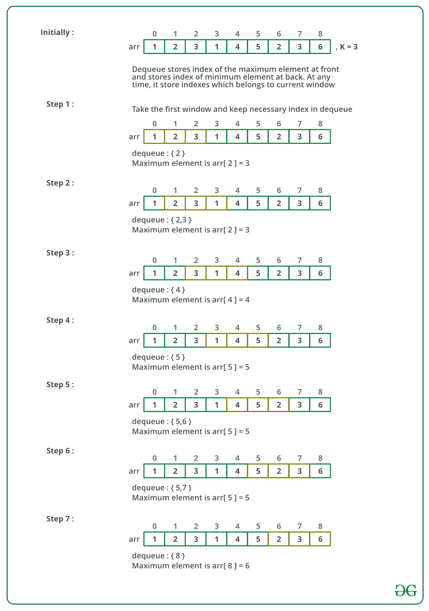

# 最大滑动窗口（大小为 k 的所有子数组的最大值）

> 原文： [https://www.geeksforgeeks.org/sliding-window-maximum-maximum-of-all-subarrays-of-size-k/](https://www.geeksforgeeks.org/sliding-window-maximum-maximum-of-all-subarrays-of-size-k/)

给定一个数组和一个整数 **K** ，请找到每个相邻的大小为 k 的子数组的最大值。

**示例：**

```
Input: arr[] = {1, 2, 3, 1, 4, 5, 2, 3, 6}, K = 3 
Output: 3 3 4 5 5 5 6
Explanation: 
Maximum of 1, 2, 3 is 3
Maximum of 2, 3, 1 is 3
Maximum of 3, 1, 4 is 4
Maximum of 1, 4, 5 is 5
Maximum of 4, 5, 2 is 5 
Maximum of 5, 2, 3 is 5
Maximum of 2, 3, 6 is 6

Input: arr[] = {8, 5, 10, 7, 9, 4, 15, 12, 90, 13}, K = 4 
Output: 10 10 10 15 15 90 90
Explanation:
Maximum of first 4 elements is 10, similarly for next 4 
elements (i.e from index 1 to 4) is 10, So the sequence 
generated is 10 10 10 15 15 90 90

```

## [推荐：请先在“ ***<u>实践</u>*** ”上解决它，然后再继续解决。](https://practice.geeksforgeeks.org/problems/maximum-of-all-subarrays-of-size-k/0)

<u>**方法 1：**</u> 这是解决上述问题的简单方法。

*   **方法：**
    这个想法非常基本，它运行一个嵌套循环，外部循环将标记长度为 k 的子数组的起始点，内部循环将从起始索引运行到 index + k ，从起始索引开始，将 k 个元素打印出来，并在这 k 个元素中显示最大元素。
*   **算法：**
    1.  创建一个嵌套循环，即从起始索引到第 n – k 个元素的外循环。 内部循环将运行 k 次迭代。
    2.  创建一个变量来存储内部循环遍历的 k 个元素的最大值。
    3.  查找内循环遍历的 k 个元素的最大值。
    4.  在外循环的每次迭代中打印最大元素
*   **实现：**

    ## C++ 

    ```

    // C++ Program to find the maximum for  
    // each and every contiguous subarray of size k. 
    #include <bits/stdc++.h> 
    using namespace std; 

    // Method to find the maximum for each  
    // and every contiguous subarray of size k. 
    void printKMax(int arr[], int n, int k)  
    {  
        int j, max;  

        for (int i = 0; i <= n - k; i++)  
        {  
            max = arr[i];  

            for (j = 1; j < k; j++)  
            {  
                if (arr[i + j] > max)  
                    max = arr[i + j];  
            }  
            cout << max << " ";  
        }  
    }  

    // Driver code 
    int main()  
    {  
        int arr[] = { 1, 2, 3, 4, 5, 6, 7, 8, 9, 10 };  
        int n = sizeof(arr) / sizeof(arr[0]);  
        int k = 3;  
        printKMax(arr, n, k);  
        return 0;  
    } 

    // This code is contributed by rathbhupendra 

    ```

    ## C

    ```

    #include <stdio.h> 

    void printKMax(int arr[], int n, int k) 
    { 
        int j, max; 

        for (int i = 0; i <= n - k; i++) { 
            max = arr[i]; 

            for (j = 1; j < k; j++) { 
                if (arr[i + j] > max) 
                    max = arr[i + j]; 
            } 
            printf("%d ", max); 
        } 
    } 

    int main() 
    { 
        int arr[] = { 1, 2, 3, 4, 5, 6, 7, 8, 9, 10 }; 
        int n = sizeof(arr) / sizeof(arr[0]); 
        int k = 3; 
        printKMax(arr, n, k); 
        return 0; 
    }

    ```

    ## 爪哇

    ```

    // Java Program to find the maximum for each and every contiguous subarray of size k. 

    public class GFG { 
        // Method to find the maximum for each and every contiguous subarray of size k. 
        static void printKMax(int arr[], int n, int k) 
        { 
            int j, max; 

            for (int i = 0; i <= n - k; i++) { 

                max = arr[i]; 

                for (j = 1; j < k; j++) { 
                    if (arr[i + j] > max) 
                        max = arr[i + j]; 
                } 
                System.out.print(max + " "); 
            } 
        } 

        // Driver method 
        public static void main(String args[]) 
        { 
            int arr[] = { 1, 2, 3, 4, 5, 6, 7, 8, 9, 10 }; 
            int k = 3; 
            printKMax(arr, arr.length, k); 
        } 
    } 

    // This code is contributed by Sumit Ghosh 

    ```

    ## Python3

    ```

    # Python program to find the maximum for  
    # each and every contiguous subarray of 
    # size k 

    # Method to find the maximum for each 
    # and every contiguous subarray of s  
    # of size k 
    def printMax(arr, n, k): 
        max = 0

        for i in range(n - k + 1): 
            max = arr[i] 
            for j in range(1, k): 
                if arr[i + j] > max: 
                    max = arr[i + j] 
            print(str(max) + " ", end = "") 

    # Driver method 
    if __name__=="__main__": 
        arr = [1, 2, 3, 4, 5, 6, 7, 8, 9, 10] 
        n = len(arr) 
        k = 3
        printMax(arr, n, k) 

    # This code is contributed by Shiv Shankar  

    ```

    ## C＃

    ```

    // C# program to find the maximum for 
    // each and every contiguous subarray of 
    // size kusing System; 
    using System; 

    class GFG { 
        // Method to find the maximum for 
        // each and every contiguous subarray 
        // of size k. 
        static void printKMax(int[] arr, int n, int k) 
        { 
            int j, max; 

            for (int i = 0; i <= n - k; i++) { 

                max = arr[i]; 

                for (j = 1; j < k; j++) { 
                    if (arr[i + j] > max) 
                        max = arr[i + j]; 
                } 
                Console.Write(max + " "); 
            } 
        } 

        // Driver method 
        public static void Main() 
        { 
            int[] arr = { 1, 2, 3, 4, 5, 6, 7, 8, 9, 10 }; 
            int k = 3; 
            printKMax(arr, arr.Length, k); 
        } 
    } 

    // This Code is Contributed by Sam007 

    ```

    ## 的 PHP

    ```

    <?php 
    // PHP program to find the maximum  
    // for each and every contiguous  
    // subarray of size k 

    function printKMax($arr, $n, $k) 
    { 
        $j; $max; 

        for ($i = 0; $i <= $n - $k; $i++) 
        { 
            $max = $arr[$i]; 

            for ($j = 1; $j < $k; $j++) 
            { 
                if ($arr[$i + $j] > $max) 
                $max = $arr[$i + $j]; 
            } 
            printf("%d ", $max); 
        } 
    } 

    // Driver Code 
    $arr = array(1, 2, 3, 4, 5,  
                 6, 7, 8, 9, 10); 
    $n = count($arr); 
    $k = 3; 
    printKMax($arr, $n, $k); 

    // This Code is Contributed by anuj_67\. 
    ?> 

    ```

    **输出：**

    ```
    3 4 5 6 7 8 9 10

    ```

*   **复杂度分析：**
    *   **时间复杂度：** O（N * K）。
        对于外循环的每次迭代，外循环运行 n-k + 1 次，内循环运行 k 次。 因此，时间复杂度为 O（（n-k + 1）* k），也可以写成 **O（N * K）**。
    *   **空间复杂度：** O（1）。
        不需要多余的空间。

<u>**方法 2：**</u> 此方法使用自平衡 BST 解决给定的问题。

*   **方法：**
    为了在子数组的 k 个元素中找到最大值，先前的方法使用遍历元素的循环。 为了减少该时间，我们的想法是使用 [AVL 树](https://www.geeksforgeeks.org/avl-tree-set-1-insertion/)，该树返回 log n 时间中的最大元素。 因此，遍历数组并将 k 个元素保留在 BST 中，并在每次迭代中打印最大值。 **AVL 树**是一种合适的数据结构，因为在平均和最坏情况下查找，插入和删除都需要 O（log n）时间，其中 n 是操作之前树中的节点数 。
*   **算法：**
    1.  创建一个自平衡 BST（AVL 树）以存储和查找最大元素。
    2.  从头到尾遍历整个数组。
    3.  将元素插入 AVL 树中。
    4.  如果循环计数器或大于或等于 k，则从 BST 中删除第 i-k 个元素
    5.  打印 BST 的最大元素。
*   **实现：**

    ```

    // C++ program to delete a node from AVL Tree  
    #include<bits/stdc++.h>  
    using namespace std;  

    // An AVL tree node  
    class Node  
    {  
        public:  
        int key;  
        Node *left;  
        Node *right;  
        int height;  
    };  

    // A utility function to get maximum  
    // of two integers  
    int max(int a, int b);  

    // A utility function to get height  
    // of the tree  
    int height(Node *N)  
    {  
        if (N == NULL)  
            return 0;  
        return N->height;  
    }  

    // A utility function to get maximum  
    // of two integers  
    int max(int a, int b)  
    {  
        return (a > b)? a : b;  
    }  

    /* Helper function that allocates a  
    new node with the given key and  
    NULL left and right pointers. */
    Node* newNode(int key)  
    {  
        Node* node = new Node();  
        node->key = key;  
        node->left = NULL;  
        node->right = NULL;  
        node->height = 1; // new node is initially  
                        // added at leaf  
        return(node);  
    }  

    // A utility function to right  
    // rotate subtree rooted with y  
    // See the diagram given above.  
    Node *rightRotate(Node *y)  
    {  
        Node *x = y->left;  
        Node *T2 = x->right;  

        // Perform rotation  
        x->right = y;  
        y->left = T2;  

        // Update heights  
        y->height = max(height(y->left),  
                        height(y->right)) + 1;  
        x->height = max(height(x->left),  
                        height(x->right)) + 1;  

        // Return new root  
        return x;  
    }  

    // A utility function to left  
    // rotate subtree rooted with x  
    // See the diagram given above.  
    Node *leftRotate(Node *x)  
    {  
        Node *y = x->right;  
        Node *T2 = y->left;  

        // Perform rotation  
        y->left = x;  
        x->right = T2;  

        // Update heights  
        x->height = max(height(x->left),  
                        height(x->right)) + 1;  
        y->height = max(height(y->left),  
                        height(y->right)) + 1;  

        // Return new root  
        return y;  
    }  

    // Get Balance factor of node N  
    int getBalance(Node *N)  
    {  
        if (N == NULL)  
            return 0;  
        return height(N->left) -  
            height(N->right);  
    }  

    Node* insert(Node* node, int key)  
    {  
        /* 1\. Perform the normal BST rotation */
        if (node == NULL)  
            return(newNode(key));  

        if (key < node->key)  
            node->left = insert(node->left, key);  
        else if (key > node->key)  
            node->right = insert(node->right, key);  
        else // Equal keys not allowed  
            return node;  

        /* 2\. Update height of this ancestor node */
        node->height = 1 + max(height(node->left),  
                            height(node->right));  

        /* 3\. Get the balance factor of this  
            ancestor node to check whether  
            this node became unbalanced */
        int balance = getBalance(node);  

        // If this node becomes unbalanced,  
        // then there are 4 cases  

        // Left Left Case  
        if (balance > 1 && key < node->left->key)  
            return rightRotate(node);  

        // Right Right Case  
        if (balance < -1 && key > node->right->key)  
            return leftRotate(node);  

        // Left Right Case  
        if (balance > 1 && key > node->left->key)  
        {  
            node->left = leftRotate(node->left);  
            return rightRotate(node);  
        }  

        // Right Left Case  
        if (balance < -1 && key < node->right->key)  
        {  
            node->right = rightRotate(node->right);  
            return leftRotate(node);  
        }  

        /* return the (unchanged) node pointer */
        return node;  
    }  

    /* Given a non-empty binary search tree,  
    return the node with minimum key value  
    found in that tree. Note that the entire  
    tree does not need to be searched. */
    Node * minValueNode(Node* node)  
    {  
        Node* current = node;  

        /* loop down to find the leftmost leaf */
        while (current->left != NULL)  
            current = current->left;  

        return current;  
    }  

    // Recursive function to delete a node  
    // with given key from subtree with  
    // given root. It returns root of the  
    // modified subtree.  
    Node* deleteNode(Node* root, int key)  
    {  

        // STEP 1: PERFORM STANDARD BST DELETE  
        if (root == NULL)  
            return root;  

        // If the key to be deleted is smaller  
        // than the root's key, then it lies  
        // in left subtree  
        if ( key < root->key )  
            root->left = deleteNode(root->left, key);  

        // If the key to be deleted is greater  
        // than the root's key, then it lies  
        // in right subtree  
        else if( key > root->key )  
            root->right = deleteNode(root->right, key);  

        // if key is same as root's key, then  
        // This is the node to be deleted  
        else
        {  
            // node with only one child or no child  
            if( (root->left == NULL) ||  
                (root->right == NULL) )  
            {  
                Node *temp = root->left ?  
                            root->left :  
                            root->right;  

                // No child case  
                if (temp == NULL)  
                {  
                    temp = root;  
                    root = NULL;  
                }  
                else // One child case  
                *root = *temp; // Copy the contents of  
                            // the non-empty child  
                free(temp);  
            }  
            else
            {  
                // node with two children: Get the inorder  
                // successor (smallest in the right subtree)  
                Node* temp = minValueNode(root->right);  

                // Copy the inorder successor's  
                // data to this node  
                root->key = temp->key;  

                // Delete the inorder successor  
                root->right = deleteNode(root->right,  
                                        temp->key);  
            }  
        }  

        // If the tree had only one node  
        // then return  
        if (root == NULL)  
        return root;  

        // STEP 2: UPDATE HEIGHT OF THE CURRENT NODE  
        root->height = 1 + max(height(root->left),  
                            height(root->right));  

        // STEP 3: GET THE BALANCE FACTOR OF  
        // THIS NODE (to check whether this  
        // node became unbalanced)  
        int balance = getBalance(root);  

        // If this node becomes unbalanced,  
        // then there are 4 cases  

        // Left Left Case  
        if (balance > 1 &&  
            getBalance(root->left) >= 0)  
            return rightRotate(root);  

        // Left Right Case  
        if (balance > 1 &&  
            getBalance(root->left) < 0)  
        {  
            root->left = leftRotate(root->left);  
            return rightRotate(root);  
        }  

        // Right Right Case  
        if (balance < -1 &&  
            getBalance(root->right) <= 0)  
            return leftRotate(root);  

        // Right Left Case  
        if (balance < -1 &&  
            getBalance(root->right) > 0)  
        {  
            root->right = rightRotate(root->right);  
            return leftRotate(root);  
        }  

        return root;  
    }  

    // A utility function to print preorder  
    // traversal of the tree.  
    // The function also prints height  
    // of every node  
    void preOrder(Node *root)  
    {  
        if(root != NULL)  
        {  
            cout << root->key << " ";  
            preOrder(root->left);  
            preOrder(root->right);  
        }  
    } 

    // Returns maximum value in a given   
    // Binary Tree   
    int findMax(Node* root)   
    {   
        // Base case   
        if (root == NULL)   
        return INT_MIN;   

        // Return maximum of 3 values:   
        // 1) Root's data 2) Max in Left Subtree   
        // 3) Max in right subtree   
        int res = root->key;   
        int lres = findMax(root->left);   
        int rres = findMax(root->right);   
        if (lres > res)   
        res = lres;   
        if (rres > res)   
        res = rres;   
        return res;   
    } 

    // Method to find the maximum for each  
    // and every contiguous subarray of size k. 
    void printKMax(int arr[], int n, int k)  
    {  
        int c = 0,l=0; 
        Node *root = NULL;  

        //traverse the array ; 
        for(int i=0; i<n; i++) 
        { 
            c++; 
            //insert the element in BST 
            root = insert(root, arr[i]);  

            //size of subarray greater than k  
            if(c > k) 
            { 
                root = deleteNode(root, arr[l++]);  
                c--; 
            } 

            //size of subarray equal to k 
            if(c == k) 
            { 
                cout<<findMax(root)<<" "; 
            } 
        } 
    } 
    // Driver code 
    int main()  
    {  
        int  arr[] = {8, 5, 10, 7, 9, 4, 15, 12, 90, 13}, k = 4;  
        int n = sizeof(arr) / sizeof(arr[0]);  
        printKMax(arr, n, k);  
        return 0;  
    } 

    ```

    **输出：**

    ```
    10 10 10 15 15 90 90 

    ```

*   **复杂度分析：**
    *   **时间复杂度**： **O（N * Log k）**。
        插入，删除和搜索在 AVL 树中花费 k k 的时间。 因此，总体时间复杂度为 O（N * log k）
    *   **空间复杂度：** O（k）。
        在 BST 中存储 k 个元素所需的空间为 O（k）。

**<u>方法 3：</u>** 此方法使用 Deque 解决上述问题。

*   **方法：**
    创建容量为 k 的[双端队列](https://www.geeksforgeeks.org/deque-set-1-introduction-applications/)， *Qi* ，该存储仅存储 k 个元素的当前窗口的有用元素。 如果一个元素在当前窗口中并且比当前窗口左侧其他元素大，则该元素很有用。 逐一处理所有数组元素，并保持 *Qi* 包含当前窗口的有用元素，并且这些有用元素将按排序的顺序进行维护。 *Qi* 前面的元素是最大的，而 *Qi* 后面的元素是当前窗口的最小元素。 感谢 [Aashish](https://www.geeksforgeeks.org/maximum-of-all-subarrays-of-size-k/#comment-10874) 提出了此方法。
*   **Dry run of the above approach:**

    

*   **算法：**
    1.  创建一个双端队列以存储 k 个元素。
    2.  运行循环并将双端 k 个元素插入双端队列。 如果在队列后面的元素小于当前元素，则在插入元素时删除所有那些元素，然后插入该元素。
    3.  现在，运行从 k 到数组末尾的循环。
    4.  打印数组的前部元素
    5.  如果元素不在当前窗口中，请从队列的最前面删除该元素。
    6.  将下一个元素插入双端队列。 如果在队列后面的元素小于当前元素，则在插入元素时删除所有那些元素，然后插入该元素。
    7.  打印最后一个窗口的最大元素。
*   **实现：**

    ## C++ 

    ```

    #include <bits/stdc++.h> 

    using namespace std; 

    // A Dequeue (Double ended queue) based method for printing maximum element of 
    // all subarrays of size k 
    void printKMax(int arr[], int n, int k) 
    { 
        // Create a Double Ended Queue, Qi that will store indexes of array elements 
        // The queue will store indexes of useful elements in every window and it will 
        // maintain decreasing order of values from front to rear in Qi, i.e., 
        // arr[Qi.front[]] to arr[Qi.rear()] are sorted in decreasing order 
        std::deque<int> Qi(k); 

        /* Process first k (or first window) elements of array */
        int i; 
        for (i = 0; i < k; ++i) { 
            // For every element, the previous smaller elements are useless so 
            // remove them from Qi 
            while ((!Qi.empty()) && arr[i] >= arr[Qi.back()]) 
                Qi.pop_back(); // Remove from rear 

            // Add new element at rear of queue 
            Qi.push_back(i); 
        } 

        // Process rest of the elements, i.e., from arr[k] to arr[n-1] 
        for (; i < n; ++i) { 
            // The element at the front of the queue is the largest element of 
            // previous window, so print it 
            cout << arr[Qi.front()] << " "; 

            // Remove the elements which are out of this window 
            while ((!Qi.empty()) && Qi.front() <= i - k) 
                Qi.pop_front(); // Remove from front of queue 

            // Remove all elements smaller than the currently 
            // being added element (remove useless elements) 
            while ((!Qi.empty()) && arr[i] >= arr[Qi.back()]) 
                Qi.pop_back(); 

            // Add current element at the rear of Qi 
            Qi.push_back(i); 
        } 

        // Print the maximum element of last window 
        cout << arr[Qi.front()]; 
    } 

    // Driver program to test above functions 
    int main() 
    { 
        int arr[] = { 12, 1, 78, 90, 57, 89, 56 }; 
        int n = sizeof(arr) / sizeof(arr[0]); 
        int k = 3; 
        printKMax(arr, n, k); 
        return 0; 
    } 

    ```

    ## Java

    ```

    // Java Program to find the maximum for  
    // each and every contiguous subarray of size k. 

    import java.util.Deque; 
    import java.util.LinkedList; 

    public class SlidingWindow { 

        // A Dequeue (Double ended queue) based method for printing maximum element of 
        // all subarrays of size k 
        static void printMax(int arr[], int n, int k) 
        { 
            // Create a Double Ended Queue, Qi that will store indexes of array elements 
            // The queue will store indexes of useful elements in every window and it will 
            // maintain decreasing order of values from front to rear in Qi, i.e., 
            // arr[Qi.front[]] to arr[Qi.rear()] are sorted in decreasing order 
            Deque<Integer> Qi = new LinkedList<Integer>(); 

            /* Process first k (or first window) elements of array */
            int i; 
            for (i = 0; i < k; ++i) { 
                // For every element, the previous smaller elements are useless so 
                // remove them from Qi 
                while (!Qi.isEmpty() && arr[i] >= arr[Qi.peekLast()]) 
                    Qi.removeLast(); // Remove from rear 

                // Add new element at rear of queue 
                Qi.addLast(i); 
            } 

            // Process rest of the elements, i.e., from arr[k] to arr[n-1] 
            for (; i < n; ++i) { 
                // The element at the front of the queue is the largest element of 
                // previous window, so print it 
                System.out.print(arr[Qi.peek()] + " "); 

                // Remove the elements which are out of this window 
                while ((!Qi.isEmpty()) && Qi.peek() <= i - k) 
                    Qi.removeFirst(); 

                // Remove all elements smaller than the currently 
                // being added element (remove useless elements) 
                while ((!Qi.isEmpty()) && arr[i] >= arr[Qi.peekLast()]) 
                    Qi.removeLast(); 

                // Add current element at the rear of Qi 
                Qi.addLast(i); 
            } 

            // Print the maximum element of last window 
            System.out.print(arr[Qi.peek()]); 
        } 

        // Driver program to test above functions 
        public static void main(String[] args) 
        { 
            int arr[] = { 12, 1, 78, 90, 57, 89, 56 }; 
            int k = 3; 
            printMax(arr, arr.length, k); 
        } 
    } 
    // This code is contributed by Sumit Ghosh 

    ```

    ## Python3

    ```

    # Python program to find the maximum for  
    # each and every contiguous subarray of 
    # size k 

    from collections import deque 

    # A Deque (Double ended queue) based  
    # method for printing maximum element  
    # of all subarrays of size k  
    def printMax(arr, n, k): 

        """ Create a Double Ended Queue, Qi that  
        will store indexes of array elements.  
        The queue will store indexes of useful  
        elements in every window and it will 
        maintain decreasing order of values from 
        front to rear in Qi, i.e., arr[Qi.front[]] 
        to arr[Qi.rear()] are sorted in decreasing 
        order"""
        Qi = deque() 

        # Process first k (or first window)  
        # elements of array 
        for i in range(k): 

            # For every element, the previous  
            # smaller elements are useless 
            # so remove them from Qi 
            while Qi and arr[i] >= arr[Qi[-1]] : 
                Qi.pop() 

            # Add new element at rear of queue 
            Qi.append(i); 

        # Process rest of the elements, i.e.  
        # from arr[k] to arr[n-1] 
        for i in range(k, n): 

            # The element at the front of the 
            # queue is the largest element of 
            # previous window, so print it 
            print(str(arr[Qi[0]]) + " ", end = "") 

            # Remove the elements which are  
            # out of this window 
            while Qi and Qi[0] <= i-k: 

                # remove from front of deque 
                Qi.popleft()  

            # Remove all elements smaller than 
            # the currently being added element  
            # (Remove useless elements) 
            while Qi and arr[i] >= arr[Qi[-1]] : 
                Qi.pop() 

            # Add current element at the rear of Qi 
            Qi.append(i) 

        # Print the maximum element of last window 
        print(str(arr[Qi[0]])) 

    # Driver programm to test above fumctions 
    if __name__=="__main__": 
        arr = [12, 1, 78, 90, 57, 89, 56] 
        k = 3
        printMax(arr, len(arr), k) 

    # This code is contributed by Shiv Shankar  

    ```

    ## C＃

    ```

    // C# Program to find the maximum for each  
    // and every contiguous subarray of size k. 
    using System;  
    using System.Collections.Generic; 

    public class SlidingWindow  
    { 

        // A Dequeue (Double ended queue) based  
        // method for printing maximum element of 
        // all subarrays of size k 
        static void printMax(int []arr, int n, int k) 
        { 
            // Create a Double Ended Queue, Qi that  
            // will store indexes of array elements 
            // The queue will store indexes of useful  
            // elements in every window and it will 
            // maintain decreasing order of values  
            // from front to rear in Qi, i.e., 
            // arr[Qi.front[]] to arr[Qi.rear()]  
            // are sorted in decreasing order 
            List<int> Qi = new List<int>(); 

            /* Process first k (or first window) elements of array */
            int i; 
            for (i = 0; i < k; ++i) { 
                // For every element, the previous  
                // smaller elements are useless so 
                // remove them from Qi 
                while (Qi.Count != 0 && arr[i] >= arr[Qi.IndexOf(0)]) 
                    Qi.RemoveAt(Qi.Count-1); // Remove from rear 

                // Add new element at rear of queue 
                Qi.Insert(Qi.Count, i); 
            } 

            // Process rest of the elements,  
            // i.e., from arr[k] to arr[n-1] 
            for (; i < n; ++i)  
            { 
                // The element at the front of  
                // the queue is the largest element of 
                // previous window, so print it 
                Console.Write(arr[Qi[0]] + " "); 

                // Remove the elements which are out of this window 
                while ((Qi.Count != 0) && Qi[0] <= i - k) 
                    Qi.RemoveAt(0); 

                // Remove all elements smaller than the currently 
                // being added element (remove useless elements) 
                while ((Qi.Count != 0) && arr[i] >= arr[Qi[Qi.Count - 1]]) 
                    Qi.RemoveAt(Qi.Count - 1); 

                // Add current element at the rear of Qi 
                Qi.Insert(Qi.Count, i); 
            } 

            // Print the maximum element of last window 
            Console.Write(arr[Qi[0]]); 
        } 

        // Driver code 
        public static void Main(String[] args) 
        { 
            int []arr = { 12, 1, 78, 90, 57, 89, 56 }; 
            int k = 3; 
            printMax(arr, arr.Length, k); 
        } 
    } 

    // This code has been contributed by 29AjayKumar 

    ```

    **输出：**

    ```
    78 90 90 90 89

    ```

*   **复杂度分析：**
    *   **时间复杂度：** O（n）。
        乍一看似乎不止 O（n）。 可以看出，数组的每个元素最多只能添加和删除一次。 因此共有 2n 次操作。
    *   **辅助空间：** O（k）。
        存储在出队中的元素占据 O（k）空间。
*   下面是此问题的扩展：
    [所有大小为 k 的子数组的最小和最大元素的总和。](https://www.geeksforgeeks.org/sum-minimum-maximum-elements-subarrays-size-k/)

<u>**方法 4：**</u> 该方法使用 Max-Heap 解决上述问题。

*   **方法：**
    在上述方法中，其中之一是使用 AVL 树。 该方法与该方法非常相似。 区别在于，此方法将使用 Max-Heap 而不是使用 AVL 树。 当前窗口的元素将存储在“最大堆”中，并且最大元素或根将在每次迭代中打印。
    **最大堆**是一种合适的数据结构，因为它可以对其中的最小和最大元素进行恒定时间的检索和对数时间去除，即找到恒定的最大元素并进行插入需要花费恒定的时间 删除操作需要花费 n 倍的时间。
*   **算法：**
    1.  选择前 k 个元素并创建大小为 k 的最大堆。
    2.  执行 heapify 并打印根元素。
    3.  存储数组中的下一个和最后一个元素
    4.  从 k – 1 到 n 运行循环
        *   用从窗口中移出的新元素替换从窗口中移出的元素的值。
        *   执行 heapify。
        *   打印堆的根。
*   **实现：**

    ## Python3

    ```

    # Python program to find the maximum for  
    # each and every contiguous subarray of 
    # size k  
    import heapq 

    # Method to find the maximum for each 
    # and every contiguous subarray of s  
    # of size k 
    def max_of_all_in_k(arr, n): 
        i = 0
        j = k-1

        # Create the heap and heapify 
        heap = arr[i:j + 1] 
        heapq._heapify_max(heap) 

        # Print the maximum element from  
        # the first window of size k 
        print(heap[0], end =" ") 
        last = arr[i] 
        i+= 1
        j+= 1
        nexts = arr[j] 

        # For every remaining element 
        while j < n: 

            # Add the next element of the window 
            heap[heap.index(last)] = nexts 

            # Heapify to get the maximum  
            # of the current window 
            heapq._heapify_max(heap) 

            # Print the current maximum 
            print(heap[0], end =" ") 
            last = arr[i] 
            i+= 1
            j+= 1
            if j < n: 
                nexts = arr[j] 

    # Driver Function 
    n, k = 10, 3
    arr = [1, 2, 3, 4, 5, 6, 7, 8, 9, 10] 
    max_of_all_in_k(arr, n) 

    ```

    **输出：**

    ```
    3 4 5 6 7 8 9 10

    ```

*   **复杂度分析：**
    *   **时间复杂度：** O（n * k）。
        步骤 4（a）的时间复杂度为 O（k），步骤 4（b）的复杂度为 O（Log（k）），并且它处于运行（n – k + 1）次的循环中。 因此，完整算法的时间复杂度为 O（（k + Log（k））* n），即 O（n * k）。
    *   **空间复杂度：** O（k）。
        使用将元素存储在堆 O（k）空间中。

如果您发现上述代码/算法有误，请写评论，或者找到其他解决相同问题的方法。

现在不要停下来，将您的学习提高到一个新的水平。 借助最受信任的课程，学习数据结构和算法的所有重要概念： [DSA Self Paced](https://practice.geeksforgeeks.org/courses/dsa-self-paced?utm_source=geeksforgeeks&utm_medium=article&utm_campaign=gfg_article_dsa_content_bottom) 。 以对学生友好的价格准备好行业。