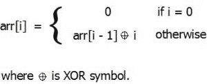

# 对数组的范围查询，其每个元素都是索引值与前一个元素的 XOR

> 原文： [https://www.geeksforgeeks.org/range-query-array-whose-element-xor-index-value-previous-element/](https://www.geeksforgeeks.org/range-query-array-whose-element-xor-index-value-previous-element/)

考虑一个 **arr []** ，它可以定义为：

给您 **Q** 查询，形式为 **[l，r]** 。 任务是为每个查询输出 arr [l]⊕arr [l + 1]……..⊕arr [r-1]⊕arr [r]的值。

**示例**：

```
Input : q = 3
        q1 = { 2, 4 }
        q2 = { 2, 8 }
        q3 = { 5, 9 }
Output : 7
         9
         15

The beginning of the array with constraint look like: 
arr[] = { 0, 1, 3, 0, 4, 1, 7, 0, 8, 1, 11, .... }
For q1, 3 ⊕ 0 ⊕ 4 = 7
For q2, 3 ⊕ 0 ⊕ 4 ⊕ 1 ⊕ 7 ⊕ 0 ⊕ 8 = 9
For q3, 1 ⊕ 7 ⊕ 0 ⊕ 8 ⊕ 1 = 15

```

> [推荐：在继续解决之前，请先在 ***{IDE}*** 上尝试您的方法。](https://ide.geeksforgeeks.org/)

让我们观察 **arr []**

```
arr[0] = 0
arr[1] = 1
arr[2] = 1 ⊕ 2
arr[3] = 1 ⊕ 2 ⊕ 3
arr[4] = 1 ⊕ 2 ⊕ 3 ⊕ 4
arr[5] = 1 ⊕ 2 ⊕ 3 ⊕ 4 ⊕ 5
....
```

让我们创建另一个数组，例如 brr []，其中 brr [i] = arr [0]⊕arr [1]⊕arr [2]…..⊕arr [i]。
brr [i] = arr [0]⊕arr [1]⊕arr [2]……arr [i-1]⊕arr [i] = brr [j]⊕arr [j + 1]⊕arr [j + 2]⊕.....⊕arr [i]，对于任何 0 < = j < = i。
因此，arr [l] = arr [l + 1] ..... arr [r] = brr [l-1] = brr [r]。

现在，让我们观察一下 brr []：

```
brr[1] = 1
brr[2] = 2
brr[3] = 1 ⊕ 3
brr[4] = 2 ⊕ 4
brr[5] = 1 ⊕ 3 ⊕ 5
brr[6] = 2 ⊕ 4 ⊕ 6
brr[7] = 1 ⊕ 3 ⊕ 5 ⊕ 7
brr[8] = 2 ⊕ 4 ⊕ 6 ⊕ 8
```

很容易观察到，在奇数索引中 brr [i] = 1⊕3⊕5⊕…。 对于偶数索引 brr [i] = 2 4 6 6…。 ⊕我

对于偶数索引，有从 1 到 i / 2 乘以 2 的数字，这意味着位将向左移动 1，因此 brr [i] = 2 4 4 6…。 ⊕i =（1⊕2⊕3…..⊕i / 2）*2。
对于奇数索引，从 0 到（i – 1）/ 2 的数字乘以 2 加 1。 位左移 1，最后一位为 1。因此，brr [i] = 1 3 3 5…。 ⊕i =（0⊕1⊕2⊕…。⊕（i – 1）/ 2）* 2 + x。
x 是 1⊕1。…..⊕1“ 1”重复（i – 1）/ 2 + 1 次。 因此，如果（i-1）/ 2 +1 为奇数，则 x = 1，否则 x = 0。

现在，计算 1⊕2⊕3⊕…。 ⊕x。
让我们证明（4K）⊕（4K + 1）⊕（4K + 2）⊕（4K + 3）= 0，< = k。

```
                 bitmask(K)00=4K
      xorsum     bitmask(K)01=4K+1
                 bitmask(K)10=4K+2
                 bitmask(K)11=4k+3
               ---------------------
                  000000000000=0
```

因此，当 0⊕Y = Y 时，则 1⊕2⊕3⊕…x =（floor（x / 4）x 4）…⊕x 这里最多有 3 个数字，因此我们可以在 O（1）中进行计算。

下面是此方法的实现：

## C++ 

```cpp

// CPP Program to solve range query on array 
// whose each element is XOR of index value 
// and previous element. 
#include <bits/stdc++.h> 
using namespace std; 

// function return derived formula value. 
int fun(int x) 
{ 
    int y = (x / 4) * 4; 

    // finding xor value of range [y...x] 
    int ans = 0; 
    for (int i = y; i <= x; i++) 
        ans ^= i; 

    return ans; 
} 

// function to solve query for l and r. 
int query(int x) 
{ 
    // if l or r is 0\. 
    if (x == 0) 
        return 0; 

    int k = (x + 1) / 2; 

    // finding x is divisible by 2 or not. 
    return (x %= 2) ? 2 * fun(k) : ((fun(k - 1) * 2) ^ (k & 1)); 
} 

void allQueries(int q, int l[], int r[]) 
{ 
    for (int i = 0; i < q; i++) 
        cout << (query(r[i]) ^ query(l[i] - 1)) << endl; 
} 

// Driven Program 
int main() 
{ 
    int q = 3; 
    int l[] = { 2, 2, 5 }; 
    int r[] = { 4, 8, 9 }; 

    allQueries(q, l, r); 
    return 0; 
} 

```

## Java

```java

// Java Program to solve range query on array 
// whose each element is XOR of index value 
// and previous element. 

import java.io.*; 

class GFG { 

    // function return derived formula value. 
    static int fun(int x) 
    { 
        int y = (x / 4) * 4; 

        // finding xor value of range [y...x] 
        int ans = 0; 

        for (int i = y; i <= x; i++) 
            ans ^= i; 

        return ans; 
    } 

    // function to solve query for l and r. 
    static int query(int x) 
    { 

        // if l or r is 0\. 
        if (x == 0) 
            return 0; 

        int k = (x + 1) / 2; 

        // finding x is divisible by 2 or not. 
        return ((x %= 2) != 0) ? 2 * fun(k) :  
                   ((fun(k - 1) * 2) ^ (k & 1)); 
    } 

    static void allQueries(int q, int l[], int r[]) 
    { 
        for (int i = 0; i < q; i++) 
            System.out.println((query(r[i]) ^  
                               query(l[i] - 1))) ; 
    } 

    // Driven Program 
    public static void main (String[] args) { 

        int q = 3; 
        int []l = { 2, 2, 5 }; 
        int []r = { 4, 8, 9 }; 

        allQueries(q, l, r); 

    } 
} 

// This code is contributed by vt_m. 

```

## Python3

```py

# Python3 Program to solve range query  
# on array whose each element is XOR of  
# index value and previous element.  

# function return derived formula value.  
def fun(x): 
    y = (x // 4) * 4

    # finding xor value of range [y...x]  
    ans = 0
    for i in range(y, x + 1): 
        ans ^= i  
    return ans 

# function to solve query for l and r.  
def query(x): 

    # if l or r is 0.  
    if (x == 0):  
        return 0

    k = (x + 1) // 2

    # finding x is divisible by 2 or not.  
    if x % 2 == 0: 
        return((fun(k - 1) * 2) ^ (k & 1)) 
    else: 
        return(2 * fun(k)) 

def allQueries(q, l, r):  
    for i in range(q): 
        print(query(r[i]) ^ query(l[i] - 1)) 

# Driver Code 
q = 3
l = [ 2, 2, 5 ]  
r = [ 4, 8, 9 ]  

allQueries(q, l, r)  

# This code is contributed  
# by sahishelangia 

```

## C# 

```cs

// C# Program to solve range query on array 
// whose each element is XOR of index value 
// and previous element. 
using System; 

class GFG { 

    // function return derived formula value. 
    static int fun(int x) 
    { 
        int y = (x / 4) * 4; 

        // finding xor value of range [y...x] 
        int ans = 0; 
        for (int i = y; i <= x; i++) 
            ans ^= i; 

        return ans; 
    } 

    // function to solve query for l and r. 
    static int query(int x) 
    { 
        // if l or r is 0\. 
        if (x == 0) 
            return 0; 

        int k = (x + 1) / 2; 

        // finding x is divisible by 2 or not. 
        return ((x %= 2)!=0) ? 2 * fun(k) :  
                   ((fun(k - 1) * 2) ^ (k & 1)); 
    } 

    static void allQueries(int q, int []l, int []r) 
    { 
        for (int i = 0; i < q; i++) 
            Console.WriteLine((query(r[i])  
                              ^ query(l[i] - 1))) ; 
    } 

    // Driven Program 
    public static void Main () 
    { 
        int q = 3; 
        int []l = { 2, 2, 5 }; 
        int []r = { 4, 8, 9 }; 

        allQueries(q, l, r); 

    } 
} 

// This code is contributed by vt_m. 

```

## PHP

```php

<?php 
// PHP Program to solve range  
// query on array whose each  
// element is XOR of index  
// value and previous element. 

// function return derived 
// formula value. 
function fun($x) 
{ 
    $y = ((int)($x / 4) * 4); 

    // finding xor value  
    // of range [y...x] 
    $ans = 0; 
    for ($i = $y; $i <= $x; $i++) 
        $ans ^= $i; 

    return $ans; 
} 

// function to solve  
// query for l and r. 
function query($x) 
{ 
    // if l or r is 0\. 
    if ($x == 0) 
        return 0; 

    $k = (int)(($x + 1) / 2); 

    // finding x is divisible 
    // by 2 or not. 
    return ($x %= 2) ? 2 * fun($k) :  
     ((fun($k - 1) * 2) ^ ($k & 1)); 
} 

function allQueries($q, $l, $r) 
{ 
    for ($i = 0; $i < $q; $i++) 
        echo (query($r[$i]) ^  
              query($l[$i] - 1)) , "\n"; 
} 

// Driver Code 
$q = 3; 
$l = array( 2, 2, 5 ); 
$r = array ( 4, 8, 9 ); 

allQueries($q, $l, $r); 

// This code is contributed by ajit 
?> 

```

**输出**：

```
0
2
0

```


* * *

* * *


