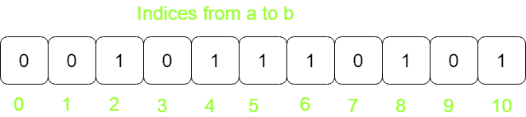
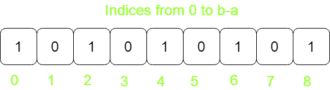

# 使用位操作进行空间优化

> 原文： [https://www.geeksforgeeks.org/space-optimization-using-bit-manipulations/](https://www.geeksforgeeks.org/space-optimization-using-bit-manipulations/)

在很多情况下，我们使用整数值作为数组中的索引来查看是否存在，我们可以使用位操作来优化此类问题中的空间。

让我们以下面的问题为例。

给定两个数字 a 和 b，请使用小于 O（| b – a |）的空间标记 a 和 b 之间 2 和 5 的倍数，并输出每个倍数。
**注意**：我们必须将**的倍数标记为**，即将（键，值）对保存在内存中，以便每个键的值都为 1 或 0，表示 2 或 2 的倍数 5 或没有。
**示例**：****

```
Input : 2 10
Output : 2 4 5 6 8 10

Input: 60 95
Output: 60 62 64 65 66 68 70 72 74 75 76 78 
        80 82 84 85 86 88 90 92 94 95

```

> [推荐：在继续解决之前，请先在 ***{IDE}*** 上尝试您的方法。](https://ide.geeksforgeeks.org/)

**方法 1（简单）**：
将数组中的索引从 a 散列到 b，并将每个索引标记为 1 或 0。
空间复杂度：O（max（a，b） ）



**方法 2（胜于简单）**：
通过将 a 转换为第 0 个索引并将 b 转换为第（b-a）个索引来节省内存。
空间复杂度：O（| b-a |）。



只需哈希| b – a | 数组的位置为 0 和 1。

## C++ 

```

// CPP program to mark numbers as multiple of 2 or 5 
#include <bits/stdc++.h> 
using namespace std; 

// Driver code 
int main() 
{ 
    int a = 2, b = 10; 
    int size = abs(b - a) + 1; 
    int* array = new int[size]; 

    // Iterate through a to b, If it is a multiple 
    // of 2 or 5 Mark index in array as 1 
    for (int i = a; i <= b; i++) 
        if (i % 2 == 0 || i % 5 == 0) 
            array[i - a] = 1; 

    cout << "MULTIPLES of 2 and 5:\n"; 
    for (int i = a; i <= b; i++) 
        if (array[i - a] == 1) 
            cout << i << " "; 

    return 0; 
} 

```

## Java

```

// Java program to mark numbers as  
// multiple of 2 or 5 
import java.lang.*; 

class GFG { 

    // Driver code 
    public static void main(String[] args) 
    { 
        int a = 2, b = 10; 
        int size = Math.abs(b - a) + 1; 
        int array[] = new int[size]; 

        // Iterate through a to b, If  
        // it is a multiple of 2 or 5  
        // Mark index in array as 1 
        for (int i = a; i <= b; i++) 
            if (i % 2 == 0 || i % 5 == 0) 
                array[i - a] = 1; 

        System.out.println("MULTIPLES of 2"
                              + " and 5:"); 
        for (int i = a; i <= b; i++) 
            if (array[i - a] == 1) 
                System.out.printf(i + " "); 
    } 
} 

// This code is contributed by 
// Smitha Dinesh Semwal 

```

## Python 3

```

# Python 3 program to mark numbers 
# as multiple of 2 or 5 
import math 

# Driver code 
a = 2
b = 10
size = abs(b - a) + 1
array = [0] * size 

# Iterate through a to b,  
# If it is a multiple of 2  
# or 5 Mark index in array as 1 
for i in range(a, b + 1): 
    if (i % 2 == 0 or i % 5 == 0): 
            array[i - a] = 1

print("MULTIPLES of 2 and 5:") 
for i in range(a, b + 1): 
    if (array[i - a] == 1): 
            print(i, end=" ") 

# This code is contributed by 
# Smitha Dinesh Semwal 

```

## C# 

```

// C# program to mark numbers as  
// multiple of 2 or 5 
using System; 

class GFG { 

    // Driver code 
    static public void Main () 
    { 
        int a = 2, b = 10; 
        int size = Math.Abs(b - a) + 1; 
        int[] array = new int[size]; 

        // Iterate through a to b, If  
        // it is a multiple of 2 or 5  
        // Mark index in array as 1 
        for (int i = a; i <= b; i++) 
            if (i % 2 == 0 || i % 5 == 0) 
                array[i - a] = 1; 

        Console.WriteLine("MULTIPLES of 2" + 
                          " and 5:"); 
        for (int i = a; i <= b; i++) 
            if (array[i - a] == 1) 
                Console.Write(i + " "); 
    } 
} 

// This code is contributed by Ajit. 

```

## PHP

```

<?php 
// PHP program to mark  
// numbers as multiple  
// of 2 or 5 

// Driver Code 
$a = 2; 
$b = 10; 
$size = abs($b - $a) + 1; 
$array = array_fill(0, $size, 0); 

// Iterate through a to b,  
// If it is a multiple of 
// 2 or 5 Mark index in 
// array as 1 
for ($i = $a; $i <= $b; $i++) 
    if ($i % 2 == 0 || $i % 5 == 0) 
        $array[$i - $a] = 1; 

echo "MULTIPLES of 2 and 5:\n"; 
for ($i = $a; $i <= $b; $i++) 
    if ($array[$i - $a] == 1) 
        echo $i . " "; 

// This code is contributed by mits. 
?> 

```

**Output :**

```
MULTIPLES of 2 and 5:
2 4 5 6 8 10

```

**方法 3（使用位操作）**：

这是一个优化的空间，它使用位操作技术，该技术可以应用于在数组中映射二进制值的问题。
64 位编译器中 int 变量的大小为 4 个字节。 1 个字节由内存中的 8 位位置表示。 因此，内存中的一个整数由 32 位位置（4 字节）表示，这 32 位位置可以使用，而不仅仅是一个索引来哈希二进制值。


## C++

```

// CPP code to for marking multiples 
#include <bits/stdc++.h> 
using namespace std; 

// index >> 5 corresponds to dividing index by 32 
// index & 31 corresponds to modulo operation of  
// index by 32 

// Function to check value of bit position whether  
// it is zero or one 
bool checkbit(int array[], int index) 
{ 
    return array[index >> 5] & (1 << (index & 31)); 
} 

// Sets value of bit for corresponding index 
void setbit(int array[], int index) 
{ 
    array[index >> 5] |= (1 << (index & 31)); 
} 

/* Driver program to test above functions*/
int main() 
{ 
    int a = 2, b = 10; 
    int size = abs(b - a); 

    // Size that will be used is actual_size/32 
    // ceil is used to initialize the array with 
    // positive number 
    size = ceil(size / 32); 

    // Array is dynamically initialized as 
    // we are calculating size at run time 
    int* array = new int[size]; 

    // Iterate through every index from a to b and 
    // call setbit() if it is a multiple of 2 or 5 
    for (int i = a; i <= b; i++) 
        if (i % 2 == 0 || i % 5 == 0) 
            setbit(array, i - a); 

    cout << "MULTIPLES of 2 and 5:\n"; 
    for (int i = a; i <= b; i++) 
        if (checkbit(array, i - a)) 
            cout << i << " "; 

    return 0; 
} 

```

## Java

```

// Java code to for marking multiples 
import java.io.*; 
import java.util.*; 

class GFG  
{ 
    // index >> 5 corresponds to dividing index by 32  
    // index & 31 corresponds to modulo operation of  
    // index by 32  

    // Function to check value of bit position whether  
    // it is zero or one  
    static boolean checkbit(int array[], int index)  
    {  
            int val = array[index >> 5] & (1 << (index & 31)); 
            if (val == 0) 
                return false; 
            return true;  
    }  

    // Sets value of bit for corresponding index  
    static void setbit(int array[], int index)  
    {  
            array[index >> 5] |= (1 << (index & 31));  
    } 

    // Driver code 
    public static void main(String args[]) 
    { 
            int a = 2, b = 10;  
            int size = Math.abs(b-a); 

            // Size that will be used is actual_size/32  
            // ceil is used to initialize the array with  
            // positive number 
            size = (int)Math.ceil((double)size / 32); 

            // Array is dynamically initialized as  
            // we are calculating size at run time  
            int[] array = new int[size]; 

            // Iterate through every index from a to b and  
            // call setbit() if it is a multiple of 2 or 5  
            for (int i = a; i <= b; i++)  
                if (i % 2 == 0 || i % 5 == 0)  
                    setbit(array, i - a); 

            System.out.println("MULTIPLES of 2 and 5:"); 
            for (int i = a; i <= b; i++)  
                if (checkbit(array, i - a))  
                    System.out.print(i + " ");  
    } 
} 

// This code is contributed by rachana soma 

```

## C#

```

// C# code to for marking multiples 
using System; 

class GFG  
{ 
    // index >> 5 corresponds to dividing index by 32  
    // index & 31 corresponds to modulo operation of  
    // index by 32  

    // Function to check value of bit position   
    // whether it is zero or one  
    static bool checkbit(int []array, int index)  
    {  
        int val = array[index >> 5] &  
                 (1 << (index & 31)); 
        if (val == 0) 
            return false; 
        return true;  
    }  

    // Sets value of bit for corresponding index  
    static void setbit(int []array, int index)  
    {  
            array[index >> 5] |= (1 << (index & 31));  
    } 

    // Driver code 
    public static void Main(String []args) 
    { 
        int a = 2, b = 10;  
        int size = Math.Abs(b-a); 

        // Size that will be used is actual_size/32  
        // ceil is used to initialize the array with  
        // positive number 
        size = (int)Math.Ceiling((double)size / 32); 

        // Array is dynamically initialized as  
        // we are calculating size at run time  
        int[] array = new int[size]; 

        // Iterate through every index from a to b and  
        // call setbit() if it is a multiple of 2 or 5  
        for (int i = a; i <= b; i++)  
            if (i % 2 == 0 || i % 5 == 0)  
                setbit(array, i - a); 

        Console.WriteLine("MULTIPLES of 2 and 5:"); 
        for (int i = a; i <= b; i++)  
            if (checkbit(array, i - a))  
                Console.Write(i + " ");  
    } 
} 

// This code is contributed by 29AjayKumar 

```

**输出**：

```
MULTIPLES of 2 and 5:
2 4 5 6 8 10

```


* * *

* * *

如果您喜欢 GeeksforGeeks 并希望做出贡献，则还可以使用 [tribution.geeksforgeeks.org](https://contribute.geeksforgeeks.org/) 撰写文章，或将您的文章邮寄至 tribution@geeksforgeeks.org。 查看您的文章出现在 GeeksforGeeks 主页上，并帮助其他 Geeks。

如果您发现任何不正确的地方，请单击下面的“改进文章”按钮，以改进本文。