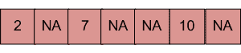
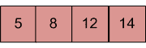
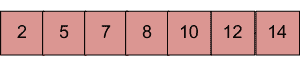

# 将大小为 n 的数组合并为大小为 m + n 的另一个数组

> 原文： [https://www.geeksforgeeks.org/merge-one-array-of-size-n-into-another-one-of-size-mn/](https://www.geeksforgeeks.org/merge-one-array-of-size-n-into-another-one-of-size-mn/)

有两个排序的数组。 第一个大小为 m + n，仅包含 m 个元素。 另一个大小为 n，包含 n 个元素。 将这两个数组合并到大小为 m + n 的第一个数组中，以便对输出进行排序。

输入：具有 m + n 个元素的数组（mPlusN []）。
 NA = >数组 mPlusN []中的值未填充/不可用。 应该有 n 个这样的数组块。

输入：具有 n 个元素的数组（N []）。


输出：N []合并为 mPlusN []（已修改的 mPlusN []）



**算法**：

```
Let first array be mPlusN[] and other array be N[]
1) Move m elements of mPlusN[] to end.
2) Start from nth element of mPlusN[] and 0th 
   element of N[] and merge them into mPlusN[].

```

下面是上述算法的实现：

## C++ 

```cpp

// C++ program to Merge an array of  
// size n into another array of size m + n 
#include <bits/stdc++.h> 
using namespace std; 

/* Assuming -1 is filled for the places 
   where element is not available */
#define NA -1 

/* Function to move m elements at  
   the end of array mPlusN[] */
void moveToEnd(int mPlusN[], int size) 
{ 
   int j = size - 1; 
   for (int i = size - 1; i >= 0; i--) 
     if (mPlusN[i] != NA) 
     { 
        mPlusN[j] = mPlusN[i]; 
        j--; 
     } 
} 

/* Merges array N[] of size n into 
   array mPlusN[] of size m+n*/
int merge(int mPlusN[], int N[], int m, int n) 
{ 
   int i = n; /* Current index of i/p part of mPlusN[]*/
   int j = 0; /* Current index of N[]*/
   int k = 0; /* Current index of output mPlusN[]*/
   while (k < (m + n)) 
   { 
    /* Take an element from mPlusN[] if 
    a) value of the picked element is smaller  
       and we have not reached end of it 
    b) We have reached end of N[] */
    if ((i < (m + n) && mPlusN[i] <= N[j]) || (j == n)) 
    { 
        mPlusN[k] = mPlusN[i]; 
        k++; 
        i++; 
    } 
    else // Otherwise take element from N[] 
    { 
       mPlusN[k] = N[j]; 
       k++; 
       j++; 
    } 
   } 
} 

/* Utility that prints out an array on a line */
void printArray(int arr[], int size) 
{ 
   for (int i = 0; i < size; i++) 
   cout << arr[i] << " "; 

   cout << endl; 
} 

/* Driver function to test above functions */
int main() 
{ 
   /* Initialize arrays */
   int mPlusN[] = {2, 8, NA, NA, NA, 13, NA, 15, 20}; 
   int N[] = {5, 7, 9, 25}; 

   int n = sizeof(N) / sizeof(N[0]); 
   int m = sizeof(mPlusN) / sizeof(mPlusN[0]) - n; 

   /*Move the m elements at the end of mPlusN*/
   moveToEnd(mPlusN, m + n); 

   /*Merge N[] into mPlusN[] */
   merge(mPlusN, N, m, n); 

   /* Print the resultant mPlusN */
   printArray(mPlusN, m+n); 

   return 0; 
} 

```