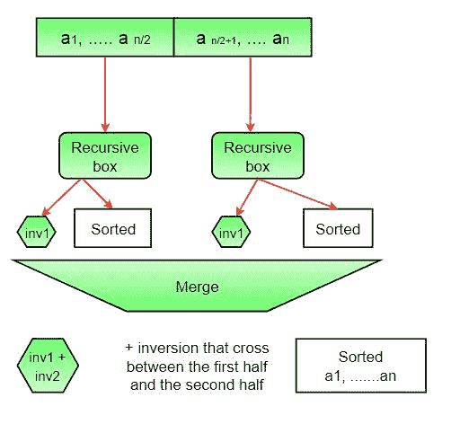

# 计算数组中的反转 系列 1（使用归并排序）

> 原文： [https://www.geeksforgeeks.org/counting-inversions/](https://www.geeksforgeeks.org/counting-inversions/)

**数组的反转计数**指示数组要排序的距离（或距离）。 如果数组已经排序，则反转计数为 0。如果数组以相反顺序排序，则反转计数为最大。
形式上讲，如果`a[i] > a[j]`和`i < j`，则两个元素`a[i]`和`a[j]`形成一个倒置。

**示例**：

```
Input: arr[] = {8, 4, 2, 1}
Output: 6

Explanation: Given array has six inversions:
(8,4), (4,2),(8,2), (8,1), (4,1), (2,1).

 Input: arr[] = {3, 1, 2}
Output: 2

Explanation: Given array has two inversions:
(3, 1), (3, 2) 

```


**方法 1（简单）**：

*   **方法**：遍历数组，并为每个索引找到数组右侧的较小元素的数量。 这可以使用嵌套循环来完成。 对数组中所有索引的计数求和，然后打印总和。
*   **算法**：
    1.  从头到尾遍历数组。
    2.  对于每个元素，使用另一个循环找到小于当前数量的元素数，直到该索引为止。
    3.  总结每个索引的反转计数。
    4.  打印反转计数。
*   **实现**：

    ## C++ 

    ```

    // C++ program to Count Inversions 
    // in an array 
    #include <bits/stdc++.h> 
    using namespace std; 

    int getInvCount(int arr[], int n) 
    { 
        int inv_count = 0; 
        for (int i = 0; i < n - 1; i++) 
            for (int j = i + 1; j < n; j++) 
                if (arr[i] > arr[j]) 
                    inv_count++; 

        return inv_count; 
    } 

    // Driver Code 
    int main() 
    { 
        int arr[] = { 1, 20, 6, 4, 5 }; 
        int n = sizeof(arr) / sizeof(arr[0]); 
        cout << " Number of inversions are "
             << getInvCount(arr, n); 
        return 0; 
    } 

    // This code is contributed 
    // by Akanksha Rai 

    ```

    ## C

    ```

    // C program to Count 
    // Inversions in an array 
    #include <stdio.h> 
    int getInvCount(int arr[], int n) 
    { 
        int inv_count = 0; 
        for (int i = 0; i < n - 1; i++) 
            for (int j = i + 1; j < n; j++) 
                if (arr[i] > arr[j]) 
                    inv_count++; 

        return inv_count; 
    } 

    /* Driver program to test above functions */
    int main() 
    { 
        int arr[] = { 1, 20, 6, 4, 5 }; 
        int n = sizeof(arr) / sizeof(arr[0]); 
        printf(" Number of inversions are %d \n", getInvCount(arr, n)); 
        return 0; 
    } 

    ```

    ## Java

    ```

    // Java program to count 
    // inversions in an array 
    class Test { 
        static int arr[] = new int[] { 1, 20, 6, 4, 5 }; 

        static int getInvCount(int n) 
        { 
            int inv_count = 0; 
            for (int i = 0; i < n - 1; i++) 
                for (int j = i + 1; j < n; j++) 
                    if (arr[i] > arr[j]) 
                        inv_count++; 

            return inv_count; 
        } 

        // Driver method to test the above function 
        public static void main(String[] args) 
        { 
            System.out.println("Number of inversions are "
                               + getInvCount(arr.length)); 
        } 
    } 

    ```

    ## Python3

    ```

    # Python3 program to count  
    # inversions in an array 

    def getInvCount(arr, n): 

        inv_count = 0
        for i in range(n): 
            for j in range(i + 1, n): 
                if (arr[i] > arr[j]): 
                    inv_count += 1

        return inv_count 

    # Driver Code 
    arr = [1, 20, 6, 4, 5] 
    n = len(arr) 
    print("Number of inversions are", 
                  getInvCount(arr, n)) 

    # This code is contributed by Smitha Dinesh Semwal 

    ```

    ## C# 

    ```

    // C# program to count inversions 
    // in an array 
    using System; 
    using System.Collections.Generic; 

    class GFG { 

        static int[] arr = new int[] { 1, 20, 6, 4, 5 }; 

        static int getInvCount(int n) 
        { 
            int inv_count = 0; 

            for (int i = 0; i < n - 1; i++) 
                for (int j = i + 1; j < n; j++) 
                    if (arr[i] > arr[j]) 
                        inv_count++; 

            return inv_count; 
        } 

        // Driver code 
        public static void Main() 
        { 
            Console.WriteLine("Number of "
                              + "inversions are "
                              + getInvCount(arr.Length)); 
        } 
    } 

    // This code is contributed by Sam007 

    ```

    ## PHP

    ```

    <?php  
    // PHP program to Count Inversions 
    // in an array 

    function getInvCount(&$arr, $n) 
    { 
        $inv_count = 0; 
        for ($i = 0; $i < $n - 1; $i++) 
            for ($j = $i + 1; $j < $n; $j++) 
                if ($arr[$i] > $arr[$j]) 
                    $inv_count++; 

        return $inv_count; 
    } 

    // Driver Code 
    $arr = array(1, 20, 6, 4, 5 ); 
    $n = sizeof($arr); 
    echo "Number of inversions are ",  
               getInvCount($arr, $n); 

    // This code is contributed by ita_c 
    ?> 

    ```

    **输出**：

    ```
    Number of inversions are 5
    ```

*   **复杂度分析**：
    *   **时间复杂度**：`O(n ^ 2)`，需要两个嵌套循环才能从头到尾遍历数组，因此时间复杂度为 `O(n ^ 2)`。
    *   **空间复杂度**：`O(1)`，不需要额外的空间。

**方法 2（增强归并排序）**：

*   **方法**：
    Suppose the number of inversions in the left half and right half of the array (let be inv1 and inv2), what kinds of inversions are not accounted for in Inv1 + Inv2? The answer is – the inversions that need to be counted during the merge step. Therefore, to get a number of inversions, that needs to be added a number of inversions in the left subarray, right subarray and merge().

    
    **如何获取`merge()`中的反转数？**
    在合并过程中，让`i`用于索引左子数组，让`j`用于右子数组。 在`merge()`的任何步骤中，如果 `a[i]`大于`a[j]`，则存在`mid – i`个反转。 因为左子数组和右子数组已排序，所以左子数组中的所有其余元素（`a[i + 1], a[i + 2] … a[mid]`）将大于`a[j]`。

    

    **完整图片**：
    

*   **算法**：
    1.  这个想法类似于归并排序，将数组分成两个相等或几乎相等的两半，直到达到基本情况为止。
    2.  创建一个函数合并，计算合并数组的两半时的反转次数，创建两个索引`i`和`j`，`i`是上半部分的索引，`j`是下半部分的索引。 如果`a[i]`大于`a[j]`，则存在`mid – i`个反转。 因为左子数组和右子数组已排序，所以左子数组中的所有其余元素（`a[i + 1], a [i + 2] … a[mid]`）将大于`a[j]`。
    3.  创建一个递归函数，将数组分成两半，然后求和前一半的求反数​​，再求后一半的求反数​​，然后将两者合并，求反。
    4.  递归的基本情况是在给定的一半中只有一个元素。
    5.  打印答案。
*   **实现**：

    ## C++ 

    ```

    // C++ program to Count 
    // Inversions in an array 
    // using Merge Sort 
    #include <bits/stdc++.h> 
    using namespace std; 

    int _mergeSort(int arr[], int temp[], int left, int right); 
    int merge(int arr[], int temp[], int left, int mid, int right); 

    /* This function sorts the input array and returns the  
    number of inversions in the array */
    int mergeSort(int arr[], int array_size) 
    { 
        int temp[array_size]; 
        return _mergeSort(arr, temp, 0, array_size - 1); 
    } 

    /* An auxiliary recursive function that sorts the input array and  
    returns the number of inversions in the array. */
    int _mergeSort(int arr[], int temp[], int left, int right) 
    { 
        int mid, inv_count = 0; 
        if (right > left) { 
            /* Divide the array into two parts and  
            call _mergeSortAndCountInv()  
            for each of the parts */
            mid = (right + left) / 2; 

            /* Inversion count will be sum of  
            inversions in left-part, right-part  
            and number of inversions in merging */
            inv_count += _mergeSort(arr, temp, left, mid); 
            inv_count += _mergeSort(arr, temp, mid + 1, right); 

            /*Merge the two parts*/
            inv_count += merge(arr, temp, left, mid + 1, right); 
        } 
        return inv_count; 
    } 

    /* This funt merges two sorted arrays  
    and returns inversion count in the arrays.*/
    int merge(int arr[], int temp[], int left, 
              int mid, int right) 
    { 
        int i, j, k; 
        int inv_count = 0; 

        i = left; /* i is index for left subarray*/
        j = mid; /* j is index for right subarray*/
        k = left; /* k is index for resultant merged subarray*/
        while ((i <= mid - 1) && (j <= right)) { 
            if (arr[i] <= arr[j]) { 
                temp[k++] = arr[i++]; 
            } 
            else { 
                temp[k++] = arr[j++]; 

                /* this is tricky -- see above  
                explanation/diagram for merge()*/
                inv_count = inv_count + (mid - i); 
            } 
        } 

        /* Copy the remaining elements of left subarray  
    (if there are any) to temp*/
        while (i <= mid - 1) 
            temp[k++] = arr[i++]; 

        /* Copy the remaining elements of right subarray  
    (if there are any) to temp*/
        while (j <= right) 
            temp[k++] = arr[j++]; 

        /*Copy back the merged elements to original array*/
        for (i = left; i <= right; i++) 
            arr[i] = temp[i]; 

        return inv_count; 
    } 

    // Driver code 
    int main() 
    { 
        int arr[] = { 1, 20, 6, 4, 5 }; 
        int n = sizeof(arr) / sizeof(arr[0]); 
        int ans = mergeSort(arr, n); 
        cout << " Number of inversions are " << ans; 
        return 0; 
    } 

    // This is code is contributed by rathbhupendra 

    ```

    ## C

    ```

    // C program to Count 
    // Inversions in an array 
    // using Merge Sort 
    #include <stdio.h> 

    int _mergeSort(int arr[], int temp[], int left, int right); 
    int merge(int arr[], int temp[], int left, int mid, int right); 

    /* This function sorts the input array and returns the 
       number of inversions in the array */
    int mergeSort(int arr[], int array_size) 
    { 
        int* temp = (int*)malloc(sizeof(int) * array_size); 
        return _mergeSort(arr, temp, 0, array_size - 1); 
    } 

    /* An auxiliary recursive function that sorts the input array and 
      returns the number of inversions in the array. */
    int _mergeSort(int arr[], int temp[], int left, int right) 
    { 
        int mid, inv_count = 0; 
        if (right > left) { 
            /* Divide the array into two parts and call _mergeSortAndCountInv() 
           for each of the parts */
            mid = (right + left) / 2; 

            /* Inversion count will be the sum of inversions in left-part, right-part 
          and number of inversions in merging */
            inv_count += _mergeSort(arr, temp, left, mid); 
            inv_count += _mergeSort(arr, temp, mid + 1, right); 

            /*Merge the two parts*/
            inv_count += merge(arr, temp, left, mid + 1, right); 
        } 
        return inv_count; 
    } 

    /* This funt merges two sorted arrays and returns inversion count in 
       the arrays.*/
    int merge(int arr[], int temp[], int left, int mid, int right) 
    { 
        int i, j, k; 
        int inv_count = 0; 

        i = left; /* i is index for left subarray*/
        j = mid; /* j is index for right subarray*/
        k = left; /* k is index for resultant merged subarray*/
        while ((i <= mid - 1) && (j <= right)) { 
            if (arr[i] <= arr[j]) { 
                temp[k++] = arr[i++]; 
            } 
            else { 
                temp[k++] = arr[j++]; 

                /*this is tricky -- see above explanation/diagram for merge()*/
                inv_count = inv_count + (mid - i); 
            } 
        } 

        /* Copy the remaining elements of left subarray 
       (if there are any) to temp*/
        while (i <= mid - 1) 
            temp[k++] = arr[i++]; 

        /* Copy the remaining elements of right subarray 
       (if there are any) to temp*/
        while (j <= right) 
            temp[k++] = arr[j++]; 

        /*Copy back the merged elements to original array*/
        for (i = left; i <= right; i++) 
            arr[i] = temp[i]; 

        return inv_count; 
    } 

    /* Driver program to test above functions */
    int main(int argv, char** args) 
    { 
        int arr[] = { 1, 20, 6, 4, 5 }; 
        printf(" Number of inversions are %d \n", mergeSort(arr, 5)); 
        getchar(); 
        return 0; 
    } 

    ```

    ## Java

    ```

    // Java implementation of the approach 
    import java.util.Arrays; 

    public class GFG { 

        // Function to count the number of inversions 
        // during the merge process 
        private static int mergeAndCount(int[] arr, int l, int m, int r) 
        { 

            // Left subarray 
            int[] left = Arrays.copyOfRange(arr, l, m + 1); 

            // Right subarray 
            int[] right = Arrays.copyOfRange(arr, m + 1, r + 1); 

            int i = 0, j = 0, k = l, swaps = 0; 

            while (i < left.length && j < right.length) { 
                if (left[i] <= right[j]) 
                    arr[k++] = left[i++]; 
                else { 
                    arr[k++] = right[j++]; 
                    swaps += (m + 1) - (l + i); 
                } 
            } 

            // Fill from the rest of the left subarray 
            while (i < left.length) 
                arr[k++] = left[i++]; 

            // Fill from the rest of the right subarray 
            while (j < right.length) 
                arr[k++] = right[j++]; 

            return swaps; 
        } 

        // Merge sort function 
        private static int mergeSortAndCount(int[] arr, int l, int r) 
        { 

            // Keeps track of the inversion count at a 
            // particular node of the recursion tree 
            int count = 0; 

            if (l < r) { 
                int m = (l + r) / 2; 

                // Total inversion count = left subarray count 
                // + right subarray count + merge count 

                // Left subarray count 
                count += mergeSortAndCount(arr, l, m); 

                // Right subarray count 
                count += mergeSortAndCount(arr, m + 1, r); 

                // Merge count 
                count += mergeAndCount(arr, l, m, r); 
            } 

            return count; 
        } 

        // Driver code 
        public static void main(String[] args) 
        { 
            int[] arr = { 1, 20, 6, 4, 5 }; 

            System.out.println(mergeSortAndCount(arr, 0, arr.length - 1)); 
        } 
    } 

    // This code is contributed by Pradip Basak 

    ```

    ## Python3

    ```

    # Python 3 program to count inversions in an array 

    # Function to Use Inversion Count 
    def mergeSort(arr, n): 
        # A temp_arr is created to store 
        # sorted array in merge function 
        temp_arr = [0]*n 
        return _mergeSort(arr, temp_arr, 0, n-1) 

    # This Function will use MergeSort to count inversions 

    def _mergeSort(arr, temp_arr, left, right): 

        # A variable inv_count is used to store 
        # inversion counts in each recursive call 

        inv_count = 0

        # We will make a recursive call if and only if 
        # we have more than one elements 

        if left < right: 

            # mid is calculated to divide the array into two subarrays 
            # Floor division is must in case of python 

            mid = (left + right)//2

            # It will calculate inversion counts in the left subarray 

            inv_count += _mergeSort(arr, temp_arr, left, mid) 

            # It will calculate inversion counts in right subarray 

            inv_count += _mergeSort(arr, temp_arr, mid + 1, right) 

            # It will merge two subarrays in a sorted subarray 

            inv_count += merge(arr, temp_arr, left, mid, right) 
        return inv_count 

    # This function will merge two subarrays in a single sorted subarray 
    def merge(arr, temp_arr, left, mid, right): 
        i = left     # Starting index of left subarray 
        j = mid + 1 # Starting index of right subarray 
        k = left     # Starting index of to be sorted subarray 
        inv_count = 0

        # Conditions are checked to make sure that i and j don't exceed their 
        # subarray limits. 

        while i <= mid and j <= right: 

            # There will be no inversion if arr[i] <= arr[j] 

            if arr[i] <= arr[j]: 
                temp_arr[k] = arr[i] 
                k += 1
                i += 1
            else: 
                # Inversion will occur. 
                temp_arr[k] = arr[j] 
                inv_count += (mid-i + 1) 
                k += 1
                j += 1

        # Copy the remaining elements of left subarray into temporary array 
        while i <= mid: 
            temp_arr[k] = arr[i] 
            k += 1
            i += 1

        # Copy the remaining elements of right subarray into temporary array 
        while j <= right: 
            temp_arr[k] = arr[j] 
            k += 1
            j += 1

        # Copy the sorted subarray into Original array 
        for loop_var in range(left, right + 1): 
            arr[loop_var] = temp_arr[loop_var] 

        return inv_count 

    # Driver Code 
    # Given array is 
    arr = [1, 20, 6, 4, 5] 
    n = len(arr) 
    result = mergeSort(arr, n) 
    print("Number of inversions are", result) 

    # This code is contributed by ankush_953 

    ```

    ## C# 

    ```

    // C# implementation of counting the 
    // inversion using merge sort 

    using System; 
    public class Test { 

        /* This method sorts the input array and returns the 
           number of inversions in the array */
        static int mergeSort(int[] arr, int array_size) 
        { 
            int[] temp = new int[array_size]; 
            return _mergeSort(arr, temp, 0, array_size - 1); 
        } 

        /* An auxiliary recursive method that sorts the input array and 
          returns the number of inversions in the array. */
        static int _mergeSort(int[] arr, int[] temp, int left, int right) 
        { 
            int mid, inv_count = 0; 
            if (right > left) { 
                /* Divide the array into two parts and call _mergeSortAndCountInv() 
               for each of the parts */
                mid = (right + left) / 2; 

                /* Inversion count will be the sum of inversions in left-part, right-part 
              and number of inversions in merging */
                inv_count += _mergeSort(arr, temp, left, mid); 
                inv_count += _mergeSort(arr, temp, mid + 1, right); 

                /*Merge the two parts*/
                inv_count += merge(arr, temp, left, mid + 1, right); 
            } 
            return inv_count; 
        } 

        /* This method merges two sorted arrays and returns inversion count in 
           the arrays.*/
        static int merge(int[] arr, int[] temp, int left, int mid, int right) 
        { 
            int i, j, k; 
            int inv_count = 0; 

            i = left; /* i is index for left subarray*/
            j = mid; /* j is index for right subarray*/
            k = left; /* k is index for resultant merged subarray*/
            while ((i <= mid - 1) && (j <= right)) { 
                if (arr[i] <= arr[j]) { 
                    temp[k++] = arr[i++]; 
                } 
                else { 
                    temp[k++] = arr[j++]; 

                    /*this is tricky -- see above explanation/diagram for merge()*/
                    inv_count = inv_count + (mid - i); 
                } 
            } 

            /* Copy the remaining elements of left subarray 
           (if there are any) to temp*/
            while (i <= mid - 1) 
                temp[k++] = arr[i++]; 

            /* Copy the remaining elements of right subarray 
           (if there are any) to temp*/
            while (j <= right) 
                temp[k++] = arr[j++]; 

            /*Copy back the merged elements to original array*/
            for (i = left; i <= right; i++) 
                arr[i] = temp[i]; 

            return inv_count; 
        } 

        // Driver method to test the above function 
        public static void Main() 
        { 
            int[] arr = new int[] { 1, 20, 6, 4, 5 }; 
            Console.Write("Number of inversions are " + mergeSort(arr, 5)); 
        } 
    } 
    // This code is contributed by Rajput-Ji 

    ```

    **输出**：

    ```
    Number of inversions are 5
    ```

*   **复杂度分析**：
    *   **时间复杂度**：`O(N log N)`，使用的算法是分治法，因此在每个级别中需要一个完整的数组遍历，并且存在`log n`个级别，因此时间复杂度为`O(N log N)`）。
    *   **空间复杂度**：`O(n)`，临时数组。

注意上面的代码修改（或排序）输入数组。 如果我们只想计算倒数，那么我们需要创建一个原始数组的副本，并在副本上调用`mergeSort()`。

您可能想看看。
[计数数组中的反转 | 系列 2（使用自平衡 BST）](https://www.geeksforgeeks.org/count-inversions-in-an-array-set-2-using-self-balancing-bst/)
[使用 C++  STL 中的集合计数反转](http://quiz.geeksforgeeks.org/counting-inversions-using-set-in-c-stl/)
[计数数组中的反转 | 系列 3（使用 BIT）](https://www.geeksforgeeks.org/count-inversions-array-set-3-using-bit/)

 **参考**：
[http://www.cs.umd.edu/class/fall2009/cmsc451/lectures/Lec08-inversions.pdf](http://www.cs.umd.edu/class/fall2009/cmsc451/lectures/Lec08-inversions.pdf)
[http://www.cp.eng.chula.ac.th/~piak/teaching/algo/algo2008/count-inv.htm](http://www.cp.eng.chula.ac.th/~piak/teaching/algo/algo2008/count-inv.htm)

如果您在上述程序/算法或其他解决相同问题的方法中发现任何错误，请发表评论。

