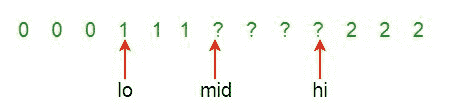
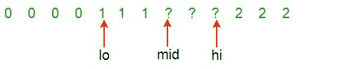
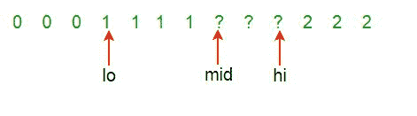
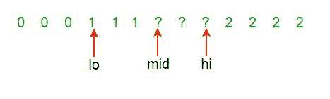

# 对 0、1 和 2 的数组进行排序

> 原文： [https://www.geeksforgeeks.org/sort-an-array-of-0s-1s-and-2s/](https://www.geeksforgeeks.org/sort-an-array-of-0s-1s-and-2s/)

给定一个数组 **A []** ，其中包含 0、1 和 2。 任务是编写一个对给定数组进行排序的函数。 函数应将全 0 放在最前面，然后将全 1 放在最后，并将全 2 放在最后。

**示例：**

```
Input: {0, 1, 2, 0, 1, 2}
Output: {0, 0, 1, 1, 2, 2}

Input: {0, 1, 1, 0, 1, 2, 1, 2, 0, 0, 0, 1}
Output: {0, 0, 0, 0, 0, 1, 1, 1, 1, 1, 2, 2}

```

## [推荐：请先在“ ***<u>实践</u>*** ”上解决它，然后再继续解决。](https://practice.geeksforgeeks.org/problems/sort-an-array-of-0s-1s-and-2s/0)

在这篇文章（[对 0、1、2 和 2s 的数组进行排序（简单计数）](https://www.geeksforgeeks.org/sort-array-0s-1s-2s-simple-counting/)）中讨论了一种简单的解决方案。

**<u>方法 1</u>**

*   **Approach:**The problem is similar to our old post [Segregate 0s and 1s in an array](https://www.geeksforgeeks.org/segregate-0s-and-1s-in-an-array-by-traversing-array-once/), and both of these problems are variation of famous [Dutch national flag problem](http://www.csse.monash.edu.au/~lloyd/tildeAlgDS/Sort/Flag/).

    *问题是由三种颜色构成的，这里是'0'，'1'和'2'。 数组分为四个部分：*

    1.  a [1..Lo-1]零（红色）
    2.  a [Lo..Mid-1]个（白色）
    3.  [Mid..Hi]未知
    4.  a [Hi + 1..N]两位（蓝色）

    **荷兰国旗算法或 3 路分区：**
    首先，整个数组是未知的。 有三个指标– **低，中和高**。 最初，低=中= 1，高=N。

    *   如果第 ith 个元素为 0，则将该元素交换到较低范围，从而缩小未知范围。
    *   同样，如果元素为 1，则保持原样，但缩小未知范围。
    *   如果元素为 2，则将其与大范围的元素交换。
*   **算法：**
    1.  保持三个索引为低= 1，中= 1 和高= N，并且有四个范围，从 1 到低（包含 0 的范围），低到中（包含 1 的范围），中到高（包含未知元素的范围） 和高到 N（包含 2 的范围）。
    2.  从头到尾遍历数组，中间值不高。 （循环计数器是 i）
    3.  如果元素为 0，则将其与索引为低的元素交换，并更新 low = low + 1 和 mid = mid + 1
    4.  如果元素为 1，则更新 mid = mid + 1
    5.  如果元素为 2，则将其与索引为高的元素交换，并更新 high = high – 1 并更新 i = i –1。因为未处理交换的元素
    6.  打印输出数组。
*   **Dry Run:**
    Part way through the process, some red, white and blue elements are known and are in the “right” place. The section of unknown elements, a[Mid..Hi], is shrunk by examining a[Mid]:

    > 
    > 
    > 检查一个[中]。 存在三种可能性：
    > 和[Mid]是（0）红色，（1）白色或（2）蓝色。
    > 情况（0）a [Mid]为红色，交换 a [Lo]和 a [Mid]； Lo ++; 中++
    > 
    > 
    > 
    > 情况（1）a [中]是白色，中++
    > 
    > 
    > 
    > 情况（2）a [Mid]为蓝色，交换 a [Mid]和 a [Hi]； 嗨–
    > 
    > 
    > 
    > 继续直到>中。

*   **实现：**

    ## C++ 

    ```

    // C++ program to sort an array 
    // with 0, 1 and 2 in a single pass 
    #include <bits/stdc++.h> 
    using namespace std; 

    // Function to sort the input array, 
    // the array is assumed 
    // to have values in {0, 1, 2} 
    void sort012(int a[], int arr_size) 
    { 
        int lo = 0; 
        int hi = arr_size - 1; 
        int mid = 0; 

        // Iterate till all the elements 
        // are sorted 
        while (mid <= hi) { 
            switch (a[mid]) { 

            // If the element is 0 
            case 0: 
                swap(a[lo++], a[mid++]); 
                break; 

            // If the element is 1 . 
            case 1: 
                mid++; 
                break; 

            // If the element is 2 
            case 2: 
                swap(a[mid], a[hi--]); 
                break; 
            } 
        } 
    } 

    // Function to print array arr[] 
    void printArray(int arr[], int arr_size) 
    { 
        // Iterate and print every element 
        for (int i = 0; i < arr_size; i++) 
            cout << arr[i] << " "; 
    } 

    // Driver Code 
    int main() 
    { 
        int arr[] = { 0, 1, 1, 0, 1, 2, 1, 2, 0, 0, 0, 1 }; 
        int n = sizeof(arr) / sizeof(arr[0]); 

        sort012(arr, n); 

        cout << "array after segregation "; 

        printArray(arr, n); 

        return 0; 
    } 

    // This code is contributed by Shivi_Aggarwal 

    ```

    ## C

    ```

    // C program to sort an array with 0, 1 and 2 
    // in a single pass 
    #include <stdio.h> 

    /* Function to swap *a and *b */
    void swap(int* a, int* b); 

    // Sort the input array, the array is assumed to 
    // have values in {0, 1, 2} 
    void sort012(int a[], int arr_size) 
    { 
        int lo = 0; 
        int hi = arr_size - 1; 
        int mid = 0; 

        while (mid <= hi) { 
            switch (a[mid]) { 
            case 0: 
                swap(&a[lo++], &a[mid++]); 
                break; 
            case 1: 
                mid++; 
                break; 
            case 2: 
                swap(&a[mid], &a[hi--]); 
                break; 
            } 
        } 
    } 

    /* UTILITY FUNCTIONS */
    void swap(int* a, int* b) 
    { 
        int temp = *a; 
        *a = *b; 
        *b = temp; 
    } 

    /* Utility function to print array arr[] */
    void printArray(int arr[], int arr_size) 
    { 
        int i; 
        for (i = 0; i < arr_size; i++) 
            printf("%d ", arr[i]); 
        printf("n"); 
    } 

    /* driver program to test */
    int main() 
    { 
        int arr[] = { 0, 1, 1, 0, 1, 2, 1, 2, 0, 0, 0, 1 }; 
        int arr_size = sizeof(arr) / sizeof(arr[0]); 
        int i; 

        sort012(arr, arr_size); 

        printf("array after segregation "); 
        printArray(arr, arr_size); 

        getchar(); 
        return 0; 
    } 

    ```

    ## 爪哇

    ```

    // Java program to sort an array of 0, 1 and 2 
    import java.io.*; 

    class countzot { 

        // Sort the input array, the array is assumed to 
        // have values in {0, 1, 2} 
        static void sort012(int a[], int arr_size) 
        { 
            int lo = 0; 
            int hi = arr_size - 1; 
            int mid = 0, temp = 0; 
            while (mid <= hi) { 
                switch (a[mid]) { 
                case 0: { 
                    temp = a[lo]; 
                    a[lo] = a[mid]; 
                    a[mid] = temp; 
                    lo++; 
                    mid++; 
                    break; 
                } 
                case 1: 
                    mid++; 
                    break; 
                case 2: { 
                    temp = a[mid]; 
                    a[mid] = a[hi]; 
                    a[hi] = temp; 
                    hi--; 
                    break; 
                } 
                } 
            } 
        } 

        /* Utility function to print array arr[] */
        static void printArray(int arr[], int arr_size) 
        { 
            int i; 
            for (i = 0; i < arr_size; i++) 
                System.out.print(arr[i] + " "); 
            System.out.println(""); 
        } 

        /*Driver function to check for above functions*/
        public static void main(String[] args) 
        { 
            int arr[] = { 0, 1, 1, 0, 1, 2, 1, 2, 0, 0, 0, 1 }; 
            int arr_size = arr.length; 
            sort012(arr, arr_size); 
            System.out.println("Array after seggregation "); 
            printArray(arr, arr_size); 
        } 
    } 
    /*This code is contributed by Devesh Agrawal*/

    ```

    ## 蛇蛇

    ```

    # Python program to sort an array with  
    # 0, 1 and 2 in a single pass 

    # Function to sort array 
    def sort012( a, arr_size): 
        lo = 0
        hi = arr_size - 1
        mid = 0
        while mid <= hi: 
            if a[mid] == 0: 
                a[lo], a[mid] = a[mid], a[lo] 
                lo = lo + 1
                mid = mid + 1
            elif a[mid] == 1: 
                mid = mid + 1
            else: 
                a[mid], a[hi] = a[hi], a[mid]  
                hi = hi - 1
        return a 

    # Function to print array 
    def printArray( a): 
        for k in a: 
            print k, 

    # Driver Program 
    arr = [0, 1, 1, 0, 1, 2, 1, 2, 0, 0, 0, 1] 
    arr_size = len(arr) 
    arr = sort012( arr, arr_size) 
    print "Array after segregation :\n", 
    printArray(arr) 

    # Contributed by Harshit Agrawal 

    ```

    ## C＃

    ```

    // C# program to sort an 
    // array of 0, 1 and 2 
    using System; 

    class GFG { 
        // Sort the input array, the array is assumed to 
        // have values in {0, 1, 2} 
        static void sort012(int[] a, int arr_size) 
        { 
            int lo = 0; 
            int hi = arr_size - 1; 
            int mid = 0, temp = 0; 

            while (mid <= hi) { 
                switch (a[mid]) { 
                case 0: { 
                    temp = a[lo]; 
                    a[lo] = a[mid]; 
                    a[mid] = temp; 
                    lo++; 
                    mid++; 
                    break; 
                } 
                case 1: 
                    mid++; 
                    break; 
                case 2: { 
                    temp = a[mid]; 
                    a[mid] = a[hi]; 
                    a[hi] = temp; 
                    hi--; 
                    break; 
                } 
                } 
            } 
        } 

        /* Utility function to print array arr[] */
        static void printArray(int[] arr, int arr_size) 
        { 
            int i; 

            for (i = 0; i < arr_size; i++) 
                Console.Write(arr[i] + " "); 
            Console.WriteLine(""); 
        } 

        /*Driver function to check for above functions*/
        public static void Main() 
        { 
            int[] arr = { 0, 1, 1, 0, 1, 2, 1, 2, 0, 0, 0, 1 }; 
            int arr_size = arr.Length; 
            sort012(arr, arr_size); 

            Console.Write("Array after seggregation "); 

            printArray(arr, arr_size); 
        } 
    } 

    // This code is contributed by Sam007 

    ```

    ## 的 PHP

    ```

    <?php  
    // PHP program to sort an array 
    // with 0, 1 and 2 in a single pass 

    // Sort the input array, the array is  
    // assumed to have values in {0, 1, 2} 
    function sort012(&$a, $arr_size) 
    { 
        $lo = 0; 
        $hi = $arr_size - 1; 
        $mid = 0; 

        while ($mid <= $hi) 
        { 
            switch ($a[$mid]) 
            { 
            case 0: 
                swap($a[$lo++], $a[$mid++]); 
                break; 
            case 1: 
                $mid++; 
                break; 
            case 2: 
                swap($a[$mid], $a[$hi--]); 
                break; 
            } 
        } 
    } 

    /* UTILITY FUNCTIONS */
    function swap(&$a, &$b) 
    { 
        $temp = $a; 
        $a = $b; 
        $b = $temp; 
    } 

    /* Utility function to print array arr[] */
    function printArray(&$arr, $arr_size) 
    { 
        for ($i = 0; $i < $arr_size; $i++) 
            echo $arr[$i]." "; 
        echo "\n"; 
    } 

    // Driver Code 
    $arr = array(0, 1, 1, 0, 1, 2,  
                 1, 2, 0, 0, 0, 1); 
    $arr_size = sizeof($arr); 

    sort012($arr, $arr_size); 

    echo "array after segregation "; 
    printArray($arr, $arr_size); 

    // This code is contributed 
    // by ChitraNayal 
    ?> 

    ```

    **输出：**

    ```
    array after segregation
     0 0 0 0 0 1 1 1 1 1 2 2 
    ```

*   **复杂度分析：**
    *   **时间复杂度：** O（n）。
        仅需要遍历数组一次。
    *   **空间复杂度：** O（1）。
        不需要多余的空间。

上面的代码对某些实际上不需要的输入执行不必要的交换。 可以对其进行修改以减少一些交换。

*感谢 Ankur Roy 建议进行此优化。*

**<u>方法 2</u>**

*   **方法：**计算给定数组中的 0、1 和 2 的数量。 然后在开始时存储所有 0，然后存储所有 1，然后存储所有 2。
*   **算法：**
    1.  保持三个计数器 c0 计数 0s，c1 计数 1s，c2 计数 2s
    2.  遍历数组并增加 c0 的数量为 0，增加 c1 的数量为 1，增加 c2 的数量为 2
    3.  现在再次遍历数组，将第一个 c0 元素替换为 0，将下一个 c1 元素替换为 1，将下一个 c2 元素替换为 2。
*   **实现：**

    ## C++ 

    ```

    // C++ implementation of the approach 
    #include <bits/stdc++.h> 
    using namespace std; 

    // Utility function to print the contents of an array 
    void printArr(int arr[], int n) 
    { 
        for (int i = 0; i < n; i++) 
            cout << arr[i] << " "; 
    } 

    // Function to sort the array of 0s, 1s and 2s 
    void sortArr(int arr[], int n) 
    { 
        int i, cnt0 = 0, cnt1 = 0, cnt2 = 0; 

        // Count the number of 0s, 1s and 2s in the array 
        for (i = 0; i < n; i++) { 
            switch (arr[i]) { 
            case 0: 
                cnt0++; 
                break; 
            case 1: 
                cnt1++; 
                break; 
            case 2: 
                cnt2++; 
                break; 
            } 
        } 

        // Update the array 
        i = 0; 

        // Store all the 0s in the beginning 
        while (cnt0 > 0) { 
            arr[i++] = 0; 
            cnt0--; 
        } 

        // Then all the 1s 
        while (cnt1 > 0) { 
            arr[i++] = 1; 
            cnt1--; 
        } 

        // Finally all the 2s 
        while (cnt2 > 0) { 
            arr[i++] = 2; 
            cnt2--; 
        } 

        // Print the sorted array 
        printArr(arr, n); 
    } 

    // Driver code 
    int main() 
    { 
        int arr[] = { 0, 1, 1, 0, 1, 2, 1, 2, 0, 0, 0, 1 }; 
        int n = sizeof(arr) / sizeof(int); 

        sortArr(arr, n); 

        return 0; 
    } 

    ```

    ## Java

    ```

    // Java implementation of the approach 
    import java.io.*; 

    class GFG { 
        // Utility function to print the contents of an array 
        static void printArr(int arr[], int n) 
        { 
            for (int i = 0; i < n; i++) 
                System.out.print(arr[i] + " "); 
        } 

        // Function to sort the array of 0s, 1s and 2s 
        static void sortArr(int arr[], int n) 
        { 
            int i, cnt0 = 0, cnt1 = 0, cnt2 = 0; 

            // Count the number of 0s, 1s and 2s in the array 
            for (i = 0; i < n; i++) { 
                switch (arr[i]) { 
                case 0: 
                    cnt0++; 
                    break; 
                case 1: 
                    cnt1++; 
                    break; 
                case 2: 
                    cnt2++; 
                    break; 
                } 
            } 

            // Update the array 
            i = 0; 

            // Store all the 0s in the beginning 
            while (cnt0 > 0) { 
                arr[i++] = 0; 
                cnt0--; 
            } 

            // Then all the 1s 
            while (cnt1 > 0) { 
                arr[i++] = 1; 
                cnt1--; 
            } 

            // Finally all the 2s 
            while (cnt2 > 0) { 
                arr[i++] = 2; 
                cnt2--; 
            } 

            // Print the sorted array 
            printArr(arr, n); 
        } 

        // Driver code 
        public static void main(String[] args) 
        { 
            int arr[] = { 0, 1, 1, 0, 1, 2, 1, 2, 0, 0, 0, 1 }; 
            int n = arr.length; 
            sortArr(arr, n); 
        } 
    } 

    // This code is contributed by shubhamsingh10 

    ```

    ## Python

    ```

    # Python implementation of the approach 

    # Utility function to print contents of an array 
    def printArr(arr, n): 
        for i in range(n): 
            print(arr[i],end=" ") 

    # Function to sort the array of 0s, 1s and 2s 
    def sortArr(arr, n): 
        cnt0 = 0
        cnt1 = 0
        cnt2 = 0

        # Count the number of 0s, 1s and 2s in the array 
        for i in range(n): 
            if arr[i] == 0: 
                cnt0+=1

            elif arr[i] == 1: 
                cnt1+=1

            elif arr[i] == 2: 
                cnt2+=1

        # Update the array 
        i = 0

        # Store all the 0s in the beginning 
        while (cnt0 > 0): 
            arr[i] = 0
            i+=1
            cnt0-=1

        # Then all the 1s 
        while (cnt1 > 0): 
            arr[i] = 1
            i+=1
            cnt1-=1

        # Finally all the 2s 
        while (cnt2 > 0): 
            arr[i] = 2
            i+=1
            cnt2-=1

        # Prthe sorted array 
        printArr(arr, n) 

    # Driver code 

    arr = [0, 1, 1, 0, 1, 2, 1, 2, 0, 0, 0, 1] 
    n = len(arr) 

    sortArr(arr, n) 

    #This code is contributed by shubhamsingh10 

    ```

    ## C＃

    ```

    // C# implementation of the approach 
    using System; 

    class GFG { 
        // Utility function to print the contents of an array 
        static void printArr(int[] arr, int n) 
        { 
            for (int i = 0; i < n; i++) 
                Console.Write(arr[i] + " "); 
        } 

        // Function to sort the array of 0s, 1s and 2s 
        static void sortArr(int[] arr, int n) 
        { 
            int i, cnt0 = 0, cnt1 = 0, cnt2 = 0; 

            // Count the number of 0s, 1s and 2s in the array 
            for (i = 0; i < n; i++) { 
                switch (arr[i]) { 
                case 0: 
                    cnt0++; 
                    break; 
                case 1: 
                    cnt1++; 
                    break; 
                case 2: 
                    cnt2++; 
                    break; 
                } 
            } 

            // Update the array 
            i = 0; 

            // Store all the 0s in the beginning 
            while (cnt0 > 0) { 
                arr[i++] = 0; 
                cnt0--; 
            } 

            // Then all the 1s 
            while (cnt1 > 0) { 
                arr[i++] = 1; 
                cnt1--; 
            } 

            // Finally all the 2s 
            while (cnt2 > 0) { 
                arr[i++] = 2; 
                cnt2--; 
            } 

            // Print the sorted array 
            printArr(arr, n); 
        } 

        // Driver code 
        public static void Main() 
        { 
            int[] arr = { 0, 1, 1, 0, 1, 2, 1, 2, 0, 0, 0, 1 }; 
            int n = arr.Length; 

            sortArr(arr, n); 
        } 
    } 

    // This code is contributed by shubhamsingh10 

    ```

    **输出：**

    ```
    0 0 0 0 0 1 1 1 1 1 2 2

    ```

*   **复杂度分析：**
    *   **时间复杂度：** O（n）。
        仅需要两次遍历数组。
    *   **空间复杂度：** O（1）。
        由于不需要额外的空间。

现在不要停下来，将您的学习提高到一个新的水平。 借助最受信任的课程，学习数据结构和算法的所有重要概念： [DSA Self Paced](https://practice.geeksforgeeks.org/courses/dsa-self-paced?utm_source=geeksforgeeks&utm_medium=article&utm_campaign=gfg_article_dsa_content_bottom) 。 以对学生友好的价格准备好行业。