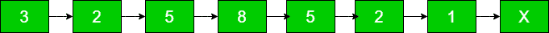

# 按数组中出现的元素顺序对链接列表进行排序

> 原文： [https://www.geeksforgeeks.org/sort-linked-list-order-elements-appearing-array/](https://www.geeksforgeeks.org/sort-linked-list-order-elements-appearing-array/)

给定一个大小为 N 的数组和一个链表，链表中的元素将来自该数组，但也可以重复，按顺序对链表进行排序，元素将出现在数组中。 可以假定该数组覆盖了链表的所有元素。

arr [] =


列表=


排序清单=


在[中被问及亚马逊](https://www.geeksforgeeks.org/amazon-interview-experience-set-424-sde-2/)


首先，创建一个散列表，以存储链表中元素的频率。 然后，只需遍历列表，并为 arr [i]的每个元素检查 has 表中的频率，并通过 arr [i]元素修改列表数据，直到其频率，最后打印列表。

## C++ 

```cpp

// Efficient CPP program to sort given list in order 
// elements are appearing in an array 
#include <bits/stdc++.h> 
using namespace std; 

// Linked list node 
struct Node { 
    int data; 
    struct Node* next; 
}; 

// function prototype for printing the list 
void printList(struct Node*); 

// Function to insert a node at the 
// beginning of the linked list 
void push(struct Node** head_ref, int new_data) 
{ 
    struct Node* new_node = new Node; 
    new_node -> data = new_data; 
    new_node -> next = *head_ref; 
    *head_ref = new_node; 
} 

// function to print the linked list 
void printList(struct Node* head) 
{ 
    while (head != NULL) { 
        cout << head -> data << " -> "; 
        head = head -> next; 
    } 
} 

// Function that sort list in order of apperaing 
// elements in an array 
void sortlist(int arr[], int N, struct Node* head) 
{ 
    // Store frequencies of elements in a 
    // hash table. 
    unordered_map<int, int> hash; 
    struct Node* temp = head; 
    while (temp) {         
        hash[temp -> data]++; 
        temp = temp -> next; 
    } 

    temp = head; 

    // One by one put elements in lis according 
    // to their appearance in array 
    for (int i = 0; i < N; i++) {         

        // Update 'frequency' nodes with value  
        // equal to arr[i] 
        int frequency = hash[arr[i]]; 
        while (frequency--) { 

            // Modify list data as element  
            // appear in an array 
            temp -> data = arr[i]; 
            temp = temp -> next; 
        } 
    } 
} 

// Driver Code 
int main() 
{ 
    struct Node* head = NULL; 
    int arr[] = { 5, 1, 3, 2, 8 }; 
    int N = sizeof(arr) / sizeof(arr[0]); 

    // creating the linked list 
    push(&head, 3); 
    push(&head, 2); 
    push(&head, 5); 
    push(&head, 8); 
    push(&head, 5); 
    push(&head, 2); 
    push(&head, 1); 

    // Function call to sort the list in order 
    // elements are apperaing in an array 
    sortlist(arr, N, head); 

    // print the modified linked list 
    cout << "Sorted List:" << endl; 
    printList(head); 
    return 0; 
} 

```