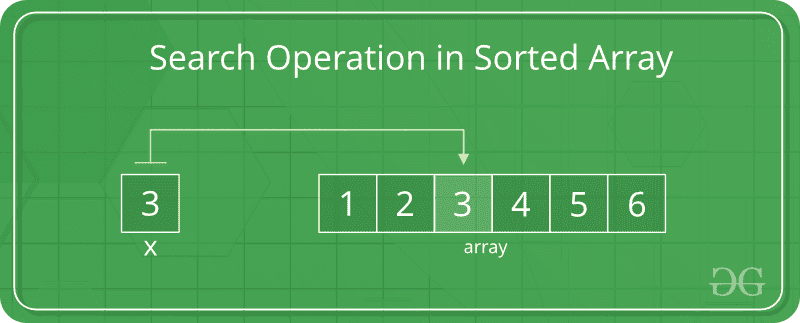
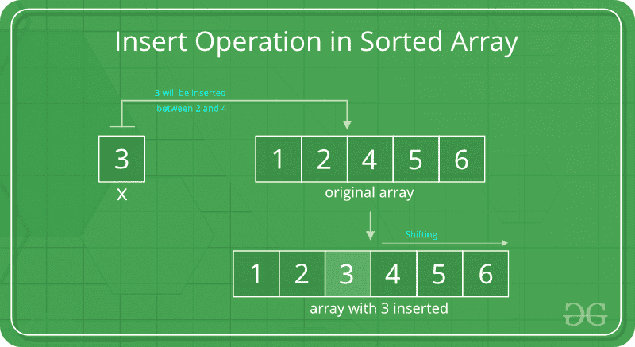

# 在排序的数组中搜索，插入和删除

> 原文： [https://www.geeksforgeeks.org/search-insert-and-delete-in-a-sorted-array/](https://www.geeksforgeeks.org/search-insert-and-delete-in-a-sorted-array/)

在此后搜索中，讨论了排序数组中的插入和删除操作。

## [推荐：请先在“ ***<u>实践</u>*** ”上解决它，然后再继续解决。](https://practice.geeksforgeeks.org/problems/operating-a-sorted-array/1)

**搜索操作**

在排序数组中，可以使用[二进制搜索](http://quiz.geeksforgeeks.org/binary-search/)来执行搜索操作。



## C ++

```

// C++ program to implement binary search in sorted array 
#include <bits/stdc++.h> 
using namespace std; 

int binarySearch(int arr[], int low, int high, int key) 
{ 
    if (high < low) 
        return -1; 
    int mid = (low + high) / 2; /*low + (high - low)/2;*/
    if (key == arr[mid]) 
        return mid; 
    if (key > arr[mid]) 
        return binarySearch(arr, (mid + 1), high, key); 
    return binarySearch(arr, low, (mid - 1), key); 
} 

/* Driver code */
int main() 
{ 
    // Let us search 3 in below array 
    int arr[] = { 5, 6, 7, 8, 9, 10 }; 
    int n, key; 

    n = sizeof(arr) / sizeof(arr[0]); 
    key = 10; 

    cout << "Index: " << binarySearch(arr, 0, n, key) << endl; 
    return 0; 
} 

// This code is contributed by NamrataSrivastava1 

```

## C

```

// C program to implement binary search in sorted array 
#include <stdio.h> 

int binarySearch(int arr[], int low, int high, int key) 
{ 
    if (high < low) 
        return -1; 
    int mid = (low + high) / 2; /*low + (high - low)/2;*/
    if (key == arr[mid]) 
        return mid; 
    if (key > arr[mid]) 
        return binarySearch(arr, (mid + 1), high, key); 
    return binarySearch(arr, low, (mid - 1), key); 
} 

/* Driver program to check above functions */
int main() 
{ 
    // Let us search 3 in below array 
    int arr[] = { 5, 6, 7, 8, 9, 10 }; 
    int n, key; 

    n = sizeof(arr) / sizeof(arr[0]); 
    key = 10; 

    printf("Index: %d\n", binarySearch(arr, 0, n, key)); 
    return 0; 
} 

```

## 爪哇

```

// Java program to implement binary 
// search in a sorted array 

class Main { 
    // function to implement 
    // binary search 
    static int binarySearch(int arr[], int low, int high, int key) 
    { 
        if (high < low) 
            return -1; 

        /*low + (high - low)/2;*/
        int mid = (low + high) / 2; 
        if (key == arr[mid]) 
            return mid; 
        if (key > arr[mid]) 
            return binarySearch(arr, (mid + 1), high, key); 
        return binarySearch(arr, low, (mid - 1), key); 
    } 

    /* Driver program to test above function */
    public static void main(String[] args) 
    { 
        int arr[] = { 5, 6, 7, 8, 9, 10 }; 
        int n, key; 
        n = arr.length; 
        key = 10; 

        System.out.println("Index: " + binarySearch(arr, 0, n, key)); 
    } 
} 

```

## Python3

```

# python 3  program to implement 
# binary search in sorted array 

def binarySearch(arr, low, high, key): 

    if (high < low): 
        return -1
    # low + (high - low)/2 
    mid = (low + high)/2

    if (key == arr[int(mid)]): 
        return mid 

    if (key > arr[int(mid)]): 
        return binarySearch(arr, 
           (mid + 1), high, key) 

    return (binarySearch(arr, low, 
           (mid -1), key)) 

# Driver program to check above functions  
# Let us search 3 in below array 
arr = [5, 6, 7, 8, 9, 10] 
n = len(arr) 
key = 10
print("Index:", int(binarySearch(arr, 0, n, key) )) 

# This code is contributed by 
# Smitha Dinesh Semwal 

```

## C＃

```

using System; 

// C# program to implement binary 
// search in a sorted array 

public class GFG { 
    // function to implement 
    // binary search 
    public static int binarySearch(int[] arr, int low, int high, int key) 
    { 
        if (high < low) { 
            return -1; 
        } 

        /*low + (high - low)/2;*/
        int mid = (low + high) / 2; 
        if (key == arr[mid]) { 
            return mid; 
        } 
        if (key > arr[mid]) { 
            return binarySearch(arr, (mid + 1), high, key); 
        } 
        return binarySearch(arr, low, (mid - 1), key); 
    } 

    /* Driver program to test above function */
    public static void Main(string[] args) 
    { 
        int[] arr = new int[] { 5, 6, 7, 8, 9, 10 }; 
        int n, key; 
        n = arr.Length; 
        key = 10; 

        Console.WriteLine("Index: " + binarySearch(arr, 0, n, key)); 
    } 
} 

// This code is contributed by Shrikant13 

```

## 的 PHP

```

<?php 
// PHP program to implement 
// binary search in sorted array 

function binarySearch($arr, $low,  
                      $high, $key)  
{ 
    if ($high < $low)  
    return -1; 

    // low + (high - low)/2 
    $mid = ($low + $high) / 2; 

    if ($key == $arr[(int)$mid]) 
        return $mid; 

    if ($key > $arr[(int)$mid])  
        return binarySearch($arr, ($mid + 1),  
                            $high, $key); 

    return (binarySearch($arr, $low,  
                        ($mid -1), $key)); 
} 

// Driver Code 

// Let us search 3 in below array 
$arr = array(5, 6, 7, 8, 9, 10); 
$n = count($arr); 
$key = 10; 
echo "Index: ", (int)binarySearch($arr, 0,  
                                  $n, $key); 

// This code is contributed by 
// Srathore 
?> 

```

**Output:**

```
Index: 5

```

**插入操作**

在未排序的数组中，插入操作比已排序的数组要快，这是因为我们不必关心元素放置的位置。



## C++

```

// C++ program to implement insert operation in 
// an sorted array. 
#include <iostream> 
using namespace std; 

// Inserts a key in arr[] of given capacity. n is current 
// size of arr[]. This function returns n+1 if insertion 
// is successful, else n. 
int insertSorted(int arr[], int n, int key, int capacity) 
{ 
    // Cannot insert more elements if n is already 
    // more than or equal to capcity 
    if (n >= capacity) 
        return n; 

    int i; 
    for (i = n - 1; (i >= 0 && arr[i] > key); i--) 
        arr[i + 1] = arr[i]; 

    arr[i + 1] = key; 

    return (n + 1); 
} 

/* Driver code */
int main() 
{ 
    int arr[20] = { 12, 16, 20, 40, 50, 70 }; 
    int capacity = sizeof(arr) / sizeof(arr[0]); 
    int n = 6; 
    int i, key = 26; 

    cout<< "\nBefore Insertion: "; 
    for (i = 0; i < n; i++) 
        cout << arr[i] << " "; 

    // Inserting key 
    n = insertSorted(arr, n, key, capacity); 

    cout << "\nAfter Insertion: "; 
    for (i = 0; i < n; i++) 
        cout << arr[i]<< " "; 

    return 0; 
} 

// This code is contributed by SHUBHAMSINGH10 

```