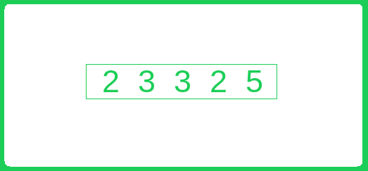

# 计算 O（1）额外空间和 O（n）时间中数组中所有元素的频率

> 原文： [https://www.geeksforgeeks.org/count-frequencies-elements-array-o1-extra-space-time/](https://www.geeksforgeeks.org/count-frequencies-elements-array-o1-extra-space-time/)

给定 n 个整数的未排序数组，其中可以包含 1 到 n 的整数。 某些元素可以重复多次，而数组中可以不包含其他元素。 计算存在的所有元素的频率并打印缺失的元素。

**示例：**

```
Input: arr[] = {2, 3, 3, 2, 5}
Output: Below are frequencies of all elements
        1 -> 0
        2 -> 2
        3 -> 2
        4 -> 0
        5 -> 1
Explanation: Frequency of elements 1 is 
0, 2 is 2, 3 is 2, 4 is 0 and 5 is 1.

Input: arr[] = {4, 4, 4, 4}
Output: Below are frequencies of all elements
        1 -> 0
        2 -> 0
        3 -> 0
        4 -> 4
Explanation: Frequency of elements 1 is 
0, 2 is 0, 3 is 0 and 4 is 4.

```

## [推荐：请先在“ ***<u>实践</u>*** ”上解决它，然后再继续解决。](https://practice.geeksforgeeks.org/problems/frequency-of-array-elements/0)

<u>**简单解决方案**</u>

*   **方法：**创建一个大小为 n 的额外空间，因为数组的元素在 1 到 n 的范围内。 使用多余的空间作为 [HashMap](http://www.geeksforgeeks.org/java-util-hashmap-in-java/) 。 遍历数组并更新当前元素的计数。 最后，打印 HashMap 的频率以及索引。
*   **算法：**
    1.  创建一个大小为 n（ *hm* ）的额外空间，并将其用作 HashMap。
    2.  从头到尾遍历数组。
    3.  对于每个元素更新 *hm [array [i] -1]* ，即 *hm [array [i] -1] ++*
    4.  从 0 到 n 循环运行，并显示 *hm [array [i] -1]* 以及索引 *i*
*   **Implementation:**

    ```

    // C++ program to print frequencies of all array 
    // elements in O(n) extra space and O(n) time 
    #include<bits/stdc++.h> 
    using namespace std; 

    // Function to find counts of all elements present in 
    // arr[0..n-1]. The array elements must be range from 
    // 1 to n 
    void findCounts(int *arr, int n) 
    { 
        //Hashmap 
        int hash[n]={0}; 

        // Traverse all array elements 
        int i = 0; 
        while (i<n) 
        { 
            //update the frequency of array[i] 
            hash[arr[i]-1]++; 

            //increase the index 
            i++; 
        } 

        printf("\nBelow are counts of all elements\n"); 
        for (int i=0; i<n; i++) 
            printf("%d -> %d\n", i+1, hash[i]); 
    } 

    // Driver program to test above function 
    int main() 
    { 
        int arr[] = {2, 3, 3, 2, 5}; 
        findCounts(arr, sizeof(arr)/ sizeof(arr[0])); 

        int arr1[] = {1}; 
        findCounts(arr1, sizeof(arr1)/ sizeof(arr1[0])); 

        int arr3[] = {4, 4, 4, 4}; 
        findCounts(arr3, sizeof(arr3)/ sizeof(arr3[0])); 

        int arr2[] = {1, 3, 5, 7, 9, 1, 3, 5, 7, 9, 1}; 
        findCounts(arr2, sizeof(arr2)/ sizeof(arr2[0])); 

        int arr4[] = {3, 3, 3, 3, 3, 3, 3, 3, 3, 3, 3}; 
        findCounts(arr4, sizeof(arr4)/ sizeof(arr4[0])); 

        int arr5[] = {1, 2, 3, 4, 5, 6, 7, 8, 9, 10, 11}; 
        findCounts(arr5, sizeof(arr5)/ sizeof(arr5[0])); 

        int arr6[] = {11, 10, 9, 8, 7, 6, 5, 4, 3, 2, 1}; 
        findCounts(arr6, sizeof(arr6)/ sizeof(arr6[0])); 

        return 0; 
    } 

    ```

    **输出：**

    ```
    Below are counts of all elements
    1 -> 0
    2 -> 2
    3 -> 2
    4 -> 0
    5 -> 1

    Below are counts of all elements
    1 -> 1

    Below are counts of all elements
    1 -> 0
    2 -> 0
    3 -> 0
    4 -> 4

    Below are counts of all elements
    1 -> 3
    2 -> 0
    3 -> 2
    4 -> 0
    5 -> 2
    6 -> 0
    7 -> 2
    8 -> 0
    9 -> 2
    10 -> 0
    11 -> 0

    Below are counts of all elements
    1 -> 0
    2 -> 0
    3 -> 11
    4 -> 0
    5 -> 0
    6 -> 0
    7 -> 0
    8 -> 0
    9 -> 0
    10 -> 0
    11 -> 0

    Below are counts of all elements
    1 -> 1
    2 -> 1
    3 -> 1
    4 -> 1
    5 -> 1
    6 -> 1
    7 -> 1
    8 -> 1
    9 -> 1
    10 -> 1
    11 -> 1

    Below are counts of all elements
    1 -> 1
    2 -> 1
    3 -> 1
    4 -> 1
    5 -> 1
    6 -> 1
    7 -> 1
    8 -> 1
    9 -> 1
    10 -> 1
    11 -> 1
    ```

*   **复杂度分析：**

    *   **时间复杂度：** O（n）。
        由于数组的单个遍历需要 O（n）时间。
    *   **空间复杂度：** O（n）。
        需要将所有元素存储在 HashMap O（n）空间中。

以下是在 O（n）时间和 O（1）额外空间中解决此问题的两种有效方法。 两种方法都修改给定数组以获得 O（1）额外空间。

<u>**方法 2**</u> ：通过使元素为负。

*   **方法：**的想法是遍历给定的数组，将元素用作索引并将其计数存储在索引中。 考虑基本方法，需要大小为 n 的 Hashmap，并且数组的大小也为 n。 因此，该数组可用作哈希图，该数组的所有元素均为 1 到 n，即均为正元素。 因此频率可以存储为负数。 这可能会导致问题。 假设*第 i 个*元素为 a，则应将计数存储在*数组[a-1]* 中，但是当存储频率时，该元素将丢失。 要解决此问题，首先，将第一个元素替换为 array [a-1]，然后将-1 放在 array [a-1]。 因此，我们的想法是用频率替换元素并将其存储在当前索引中，如果 array [a-1]处的元素已经为负，则它已经被频率降低的 *array [a- 1]* 。



*   **算法：**
    1.  从头到尾遍历数组。
    2.  对于每个元素，检查元素是否小于或等于零。 如果为负或零，则跳过该元素，因为它是频率。
    3.  如果元素（ *e = array [i] – 1* ）为正，则检查 *array [e]* 是否为正。 如果为正，则表示它是数组中 e 的第一个出现，并用 *array [e]* 替换 *array [i]* ，即 *array [i] = array [ e]* 并分配 *array [e] = -1* 。 如果 *array [e]* 为负，则不是第一次出现，将 *array [e]* 更新为 *array [e] –* 并更新 *array [i]* as *array [i] = 0* 。
    4.  同样，遍历数组并将 i + 1 打印为值，将 array [i]打印为频率。
*   **Implementation:**

    ## C++ 

    ```

    // C++ program to print frequencies of all array 
    // elements in O(1) extra space and O(n) time 
    #include<bits/stdc++.h> 
    using namespace std; 

    // Function to find counts of all elements present in 
    // arr[0..n-1]. The array elements must be range from 
    // 1 to n 
    void findCounts(int *arr, int n) 
    { 
        // Traverse all array elements 
        int i = 0; 
        while (i<n) 
        { 
            // If this element is already processed, 
            // then nothing to do 
            if (arr[i] <= 0) 
            { 
                i++; 
                continue; 
            } 

            // Find index corresponding to this element 
            // For example, index for 5 is 4 
            int elementIndex = arr[i]-1; 

            // If the elementIndex has an element that is not 
            // processed yet, then first store that element 
            // to arr[i] so that we don't lose anything. 
            if (arr[elementIndex] > 0) 
            { 
                arr[i] = arr[elementIndex]; 

                // After storing arr[elementIndex], change it 
                // to store initial count of 'arr[i]' 
                arr[elementIndex] = -1; 
            } 
            else
            { 
                // If this is NOT first occurrence of arr[i], 
                // then decrement its count. 
                arr[elementIndex]--; 

                // And initialize arr[i] as 0 means the element 
                // 'i+1' is not seen so far 
                arr[i] = 0; 
                i++; 
            } 
        } 

        printf("\nBelow are counts of all elements\n"); 
        for (int i=0; i<n; i++) 
            printf("%d -> %d\n", i+1, abs(arr[i])); 
    } 

    // Driver program to test above function 
    int main() 
    { 
        int arr[] = {2, 3, 3, 2, 5}; 
        findCounts(arr, sizeof(arr)/ sizeof(arr[0])); 

        int arr1[] = {1}; 
        findCounts(arr1, sizeof(arr1)/ sizeof(arr1[0])); 

        int arr3[] = {4, 4, 4, 4}; 
        findCounts(arr3, sizeof(arr3)/ sizeof(arr3[0])); 

        int arr2[] = {1, 3, 5, 7, 9, 1, 3, 5, 7, 9, 1}; 
        findCounts(arr2, sizeof(arr2)/ sizeof(arr2[0])); 

        int arr4[] = {3, 3, 3, 3, 3, 3, 3, 3, 3, 3, 3}; 
        findCounts(arr4, sizeof(arr4)/ sizeof(arr4[0])); 

        int arr5[] = {1, 2, 3, 4, 5, 6, 7, 8, 9, 10, 11}; 
        findCounts(arr5, sizeof(arr5)/ sizeof(arr5[0])); 

        int arr6[] = {11, 10, 9, 8, 7, 6, 5, 4, 3, 2, 1}; 
        findCounts(arr6, sizeof(arr6)/ sizeof(arr6[0])); 

        return 0; 
    } 

    ```

    ## 爪哇

    ```

    // Java program to print frequencies of all array 
    // elements in O(1) extra space and O(n) time 

    class CountFrequencies  
    { 
        // Function to find counts of all elements present in 
        // arr[0..n-1]. The array elements must be range from 
        // 1 to n 
        void findCounts(int arr[], int n)  
        { 
            // Traverse all array elements 
            int i = 0; 
            while (i < n)  
            { 
                // If this element is already processed, 
                // then nothing to do 
                if (arr[i] <= 0)  
                { 
                    i++; 
                    continue; 
                } 

                // Find index corresponding to this element 
                // For example, index for 5 is 4 
                int elementIndex = arr[i] - 1; 

                // If the elementIndex has an element that is not 
                // processed yet, then first store that element 
                // to arr[i] so that we don't lose anything. 
                if (arr[elementIndex] > 0)  
                { 
                    arr[i] = arr[elementIndex]; 

                    // After storing arr[elementIndex], change it 
                    // to store initial count of 'arr[i]' 
                    arr[elementIndex] = -1; 
                }  
                else 
                { 
                    // If this is NOT first occurrence of arr[i], 
                    // then decrement its count. 
                    arr[elementIndex]--; 

                    // And initialize arr[i] as 0 means the element 
                    // 'i+1' is not seen so far 
                    arr[i] = 0; 
                    i++; 
                } 
            } 

            System.out.println("Below are counts of all elements"); 
            for (int j = 0; j < n; j++) 
                System.out.println(j+1 + "->" + Math.abs(arr[j])); 
        } 

        // Driver program to test above functions 
        public static void main(String[] args)  
        { 
            CountFrequencies count = new CountFrequencies(); 
            int arr[] = {2, 3, 3, 2, 5}; 
            count.findCounts(arr, arr.length); 

            int arr1[] = {1}; 
            count.findCounts(arr1, arr1.length); 

            int arr3[] = {4, 4, 4, 4}; 
            count.findCounts(arr3, arr3.length); 

            int arr2[] = {1, 3, 5, 7, 9, 1, 3, 5, 7, 9, 1}; 
            count.findCounts(arr2, arr2.length); 

            int arr4[] = {3, 3, 3, 3, 3, 3, 3, 3, 3, 3, 3}; 
            count.findCounts(arr4, arr4.length); 

            int arr5[] = {1, 2, 3, 4, 5, 6, 7, 8, 9, 10, 11}; 
            count.findCounts(arr5, arr5.length); 

            int arr6[] = {11, 10, 9, 8, 7, 6, 5, 4, 3, 2, 1}; 
            count.findCounts(arr6, arr6.length); 
        } 
    } 

    // This code has been contributed by Mayank Jaiswal(mayank_24) 

    ```

    ## Python3

    ```

    # Python3 program to print frequencies of all array 
    # elements in O(1) extra space and O(n) time 

    # Function to find counts of all elements present in 
    # arr[0..n-1]. The array elements must be range from 
    # 1 to n 
    def findCounts(arr, n): 

        # Traverse all array elements 
        i = 0
        while i<n: 

            # If this element is already processed, 
            # then nothing to do 
            if arr[i] <= 0: 
                i += 1
                continue

            # Find index corresponding to this element 
            # For example, index for 5 is 4 
            elementIndex = arr[i] - 1

            # If the elementIndex has an element that is not 
            # processed yet, then first store that element 
            # to arr[i] so that we don't lose anything. 
            if arr[elementIndex] > 0: 
                arr[i] = arr[elementIndex] 

                # After storing arr[elementIndex], change it 
                # to store initial count of 'arr[i]' 
                arr[elementIndex] = -1

            else: 

                # If this is NOT first occurrence of arr[i], 
                # then decrement its count. 
                arr[elementIndex] -= 1

                # And initialize arr[i] as 0 means the element 
                # 'i+1' is not seen so far 
                arr[i] = 0
                i += 1

        print ("Below are counts of all elements") 
        for i in range(0,n): 
            print ("%d -> %d"%(i+1, abs(arr[i]))) 
        print ("") 

    # Driver program to test above function 
    arr = [2, 3, 3, 2, 5] 
    findCounts(arr, len(arr)) 

    arr1 = [1] 
    findCounts(arr1, len(arr1)) 

    arr3 = [4, 4, 4, 4] 
    findCounts(arr3, len(arr3)) 

    arr2 = [1, 3, 5, 7, 9, 1, 3, 5, 7, 9, 1] 
    findCounts(arr2, len(arr2)) 

    arr4 = [3, 3, 3, 3, 3, 3, 3, 3, 3, 3, 3] 
    findCounts(arr4, len(arr4)) 

    arr5 = [1, 2, 3, 4, 5, 6, 7, 8, 9, 10, 11] 
    findCounts(arr5, len(arr5)) 

    arr6 = [11, 10, 9, 8, 7, 6, 5, 4, 3, 2, 1] 
    findCounts(arr6, len(arr6)) 

    # This code is contributed 
    # by shreyanshi_19 

    ```

    ## C＃

    ```

    // C# program to print frequencies of  
    // all array elements in O(1) extra 
    // space and O(n) time 
    using System;  

    class GFG  
    { 
    // Function to find counts of all  
    // elements present in arr[0..n-1]. 
    // The array elements must be range  
    // from 1 to n 
    void findCounts(int[] arr, int n)  
    { 
        // Traverse all array elements 
        int i = 0; 
        while (i < n)  
        { 
            // If this element is already  
            // processed, then nothing to do 
            if (arr[i] <= 0)  
            { 
                i++; 
                continue; 
            } 

            // Find index corresponding to  
            // this element. For example, 
            // index for 5 is 4 
            int elementIndex = arr[i] - 1; 

            // If the elementIndex has an element  
            // that is not processed yet, then  
            // first store that element to arr[i]  
            // so that we don't loose anything. 
            if (arr[elementIndex] > 0)  
            { 
                arr[i] = arr[elementIndex]; 

                // After storing arr[elementIndex], 
                // change it to store initial count  
                // of 'arr[i]' 
                arr[elementIndex] = -1; 
            }  
            else
            { 
                // If this is NOT first occurrence  
                // of arr[i], then decrement its count. 
                arr[elementIndex]--; 

                // And initialize arr[i] as 0 means  
                // the element 'i+1' is not seen so far 
                arr[i] = 0; 
                i++; 
            } 
        } 

        Console.Write("\nBelow are counts of " +  
                       "all elements" + "\n"); 
        for (int j = 0; j < n; j++) 
            Console.Write(j + 1 + "->" +  
               Math.Abs(arr[j]) + "\n"); 
    } 

    // Driver Code 
    public static void Main()  
    { 
        GFG count = new GFG(); 
        int[] arr = {2, 3, 3, 2, 5}; 
        count.findCounts(arr, arr.Length); 

        int[] arr1 = {1}; 
        count.findCounts(arr1, arr1.Length); 

        int[] arr3 = {4, 4, 4, 4}; 
        count.findCounts(arr3, arr3.Length); 

        int[] arr2 = {1, 3, 5, 7, 9, 1, 
                      3, 5, 7, 9, 1}; 
        count.findCounts(arr2, arr2.Length); 

        int[] arr4 = {3, 3, 3, 3, 3,  
                      3, 3, 3, 3, 3, 3}; 
        count.findCounts(arr4, arr4.Length); 

        int[] arr5 = {1, 2, 3, 4, 5, 6,  
                      7, 8, 9, 10, 11}; 
        count.findCounts(arr5, arr5.Length); 

        int[] arr6 = {11, 10, 9, 8, 7, 6,  
                       5, 4, 3, 2, 1}; 
        count.findCounts(arr6, arr6.Length); 
    } 
    } 

    // This code is contributed by ChitraNayal 

    ```

    **Output:**

    ```
    Below are counts of all elements
    1 -> 0
    2 -> 2
    3 -> 2
    4 -> 0
    5 -> 1

    Below are counts of all elements
    1 -> 1

    Below are counts of all elements
    1 -> 0
    2 -> 0
    3 -> 0
    4 -> 4

    Below are counts of all elements
    1 -> 3
    2 -> 0
    3 -> 2
    4 -> 0
    5 -> 2
    6 -> 0
    7 -> 2
    8 -> 0
    9 -> 2
    10 -> 0
    11 -> 0

    Below are counts of all elements
    1 -> 0
    2 -> 0
    3 -> 11
    4 -> 0
    5 -> 0
    6 -> 0
    7 -> 0
    8 -> 0
    9 -> 0
    10 -> 0
    11 -> 0

    Below are counts of all elements
    1 -> 1
    2 -> 1
    3 -> 1
    4 -> 1
    5 -> 1
    6 -> 1
    7 -> 1
    8 -> 1
    9 -> 1
    10 -> 1
    11 -> 1

    Below are counts of all elements
    1 -> 1
    2 -> 1
    3 -> 1
    4 -> 1
    5 -> 1
    6 -> 1
    7 -> 1
    8 -> 1
    9 -> 1
    10 -> 1
    11 -> 1
    ```

*   **复杂度分析：**
    *   **时间复杂度：** O（n）。
        由于数组的单个遍历需要 O（n）时间。
    *   **空间复杂度：** O（1）。
        由于不需要额外的空间。

**<u>方法 3</u> ：**通过添加“ n”来跟踪计数。

*   **方法：**所有数组元素都从 1 到 n。 将每个元素减少 1。数组元素现在在 0 到 n-1 的范围内，因此可以说，对于每个索引 i， *floor（array [i] / n）= 0* 。
    因此，如前所述，其想法是遍历给定的数组，将元素用作索引并将其计数存储在索引中。 考虑基本方法，需要大小为 n 的 Hashmap，并且数组的大小也为 n。 因此，该数组可用作哈希图，但不同之处在于，不是替换元素，而是向 *array [i]第*索引添加 n。
    因此，在更新之后， *array [i]％n* 将给出第 i 个元素， *array [i] / n* 将给出 i + 1 的频率。


*   **算法：**
    1.  从头到尾遍历数组，并将所有元素减少 1。
    2.  再次从头到尾遍历数组。
    3.  对于每个元素 *array [i]％n* 更新 *array [array [i]％n]* ，即 *array [array [i]％n] ++*
    4.  从头到尾遍历数组，并将 *i +1* 作为值打印，将 *array [i] / n* 作为频率打印。
*   **实现：**

    ## C++ 

    ```

    // C++ program to print frequencies of all array 
    // elements in O(1) extra space and O(n) time 
    #include<bits/stdc++.h> 
    using namespace std; 

    // Function to find counts of all elements present in 
    // arr[0..n-1]. The array elements must be range from 
    // 1 to n 
    void printfrequency(int arr[],int n) 
    { 
        // Subtract 1 from every element so that the elements 
        // become in range from 0 to n-1 
        for (int j =0; j<n; j++) 
            arr[j] = arr[j]-1; 

        // Use every element arr[i] as index and add 'n' to 
        // element present at arr[i]%n to keep track of count of 
        // occurrences of arr[i] 
        for (int i=0; i<n; i++) 
            arr[arr[i]%n] = arr[arr[i]%n] + n; 

        // To print counts, simply print the number of times n 
        // was added at index corresponding to every element 
        for (int i =0; i<n; i++) 
            cout << i + 1 << " ->  " << arr[i]/n << endl; 
    } 

    // Driver program to test above function 
    int main() 
    { 
        int arr[] = {2, 3, 3, 2, 5}; 
        int n = sizeof(arr)/sizeof(arr[0]); 
        printfrequency(arr,n); 
        return 0; 
    }

    ```

    ## Java

    ```

    class CountFrequency  
    { 
        // Function to find counts of all elements present in 
        // arr[0..n-1]. The array elements must be range from 
        // 1 to n 
        void printfrequency(int arr[], int n)  
        { 
            // Subtract 1 from every element so that the elements 
            // become in range from 0 to n-1 
            for (int j = 0; j < n; j++) 
                arr[j] = arr[j] - 1; 

            // Use every element arr[i] as index and add 'n' to 
            // element present at arr[i]%n to keep track of count of 
            // occurrences of arr[i] 
            for (int i = 0; i < n; i++) 
                arr[arr[i] % n] = arr[arr[i] % n] + n; 

            // To print counts, simply print the number of times n 
            // was added at index corresponding to every element 
            for (int i = 0; i < n; i++) 
                System.out.println(i + 1 + "->" + arr[i] / n); 
        } 

        // Driver program to test above functions 
        public static void main(String[] args)  
        { 
            CountFrequency count = new CountFrequency(); 
            int arr[] = {2, 3, 3, 2, 5}; 
            int n = arr.length; 
            count.printfrequency(arr, n); 
        } 
    } 

    // This code has been contributed by Mayank Jaiswal 

    ```

    ## Python3

    ```

    # Python 3 program to print frequencies  
    # of all array elements in O(1) extra  
    # space and O(n) time  

    # Function to find counts of all elements  
    # present in arr[0..n-1]. The array  
    # elements must be range from 1 to n  
    def printfrequency(arr, n): 

        # Subtract 1 from every element so that  
        # the elements become in range from 0 to n-1  
        for j in range(n): 
            arr[j] = arr[j] - 1

        # Use every element arr[i] as index  
        # and add 'n' to element present at  
        # arr[i]%n to keep track of count of  
        # occurrences of arr[i]  
        for i in range(n): 
            arr[arr[i] % n] = arr[arr[i] % n] + n 

        # To print counts, simply print the  
        # number of times n was added at index  
        # corresponding to every element  
        for i in range(n): 
            print(i + 1, "->", arr[i] // n) 

    # Driver code 
    arr = [2, 3, 3, 2, 5] 
    n = len(arr) 
    printfrequency(arr, n) 

    # This code is contributed  
    # by Shrikant13 

    ```

    ## C＃

    ```

    using System; 

    internal class CountFrequency 
    { 
        // Function to find counts of all elements present in  
        // arr[0..n-1]. The array elements must be range from  
        // 1 to n  
        internal virtual void printfrequency(int[] arr, int n) 
        { 
            // Subtract 1 from every element so that the elements  
            // become in range from 0 to n-1  
            for (int j = 0; j < n; j++) 
            { 
                arr[j] = arr[j] - 1; 
            } 

            // Use every element arr[i] as index and add 'n' to  
            // element present at arr[i]%n to keep track of count of  
            // occurrences of arr[i]  
            for (int i = 0; i < n; i++) 
            { 
                arr[arr[i] % n] = arr[arr[i] % n] + n; 
            } 

            // To print counts, simply print the number of times n  
            // was added at index corresponding to every element  
            for (int i = 0; i < n; i++) 
            { 
                Console.WriteLine(i + 1 + "->" + arr[i] / n); 
            } 
        } 

        // Driver program to test above functions  
        public static void Main(string[] args) 
        { 
            CountFrequency count = new CountFrequency(); 
            int[] arr = new int[] {2, 3, 3, 2, 5}; 
            int n = arr.Length; 
            count.printfrequency(arr, n); 
        } 
    } 

    // This code is contributed by Shrikant13 

    ```

    ## 的 PHP

    ```

    <?php 
    // PHP program to print  
    // frequencies of all  
    // array elements in O(1) 
    // extra space and O(n) time 

    // Function to find counts  
    // of all elements present  
    // in arr[0..n-1]. The array 
    // elements must be range  
    // from 1 to n 
    function printfrequency($arr,$n) 
    { 
        // Subtract 1 from every 
        // element so that the  
        // elements become in  
        // range from 0 to n-1 
        for ($j = 0; $j < $n; $j++) 
            $arr[$j] = $arr[$j] - 1; 

        // Use every element arr[i]  
        // as index and add 'n' to 
        // element present at arr[i]%n  
        // to keep track of count of 
        // occurrences of arr[i] 
        for ($i = 0; $i < $n; $i++) 
            $arr[$arr[$i] % $n] = 
                 $arr[$arr[$i] % $n] + $n; 

        // To print counts, simply  
        // print the number of times  
        // n was added at index 
        // corresponding to every element 
        for ($i = 0; $i < $n; $i++) 
            echo $i + 1, " -> " ,  
                 (int)($arr[$i] / $n) , "\n"; 
    } 

    // Driver Code 
    $arr = array(2, 3, 3, 2, 5); 
    $n = sizeof($arr); 
    printfrequency($arr,$n); 

    // This code is contributed by ajit 
    ?> 

    ```

    **输出：**

    ```
    1 ->  0
    2 ->  2
    3 ->  2
    4 ->  0
    5 ->  1
    ```

*   **复杂度分析：**
    *   **时间复杂度：** O（n）。
        仅需要两次遍历数组，一次遍历数组需要 O（n）时间。
    *   **空间复杂度：** O（1）。
        由于不需要多余的空间。

感谢 Vivek Kumar 在下面的评论中建议此解决方案。

本文由 Shubham Gupta 提供。 如果发现任何不正确的地方，或者想分享有关上述主题的更多信息，请发表评论

现在不要停下来，将您的学习提高到一个新的水平。 借助最受信任的课程，学习数据结构和算法的所有重要概念： [DSA Self Paced](https://practice.geeksforgeeks.org/courses/dsa-self-paced?utm_source=geeksforgeeks&utm_medium=article&utm_campaign=gfg_article_dsa_content_bottom) 。 以对学生友好的价格准备好行业。