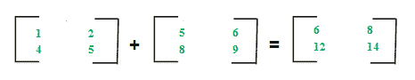
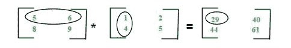

# 矩阵的不同运算

> 原文： [https://www.geeksforgeeks.org/different-operation-matrices/](https://www.geeksforgeeks.org/different-operation-matrices/)

有关矩阵的介绍，您可以参考以下文章：[矩阵介绍](https://www.geeksforgeeks.org/matrix-introduction/)
在本文中，我们将讨论关于矩阵及其属性的各种运算：

**矩阵加法–**
两个矩阵 A <sub>m * n</sub> 和 B <sub>m * n</sub> 相加得出矩阵 C <sub>m * n</sub> 。 C 的元素是 A 和 B 中相应元素的总和，可以显示为：



矩阵相加的算法可以写成：

```
for i in 1 to m
   for j in 1 to n
      cij = aij + bij
```

**要点：**

*   矩阵加法是可交换的，这意味着 A + B = B + A
*   矩阵的加法是关联的，这意味着 A +（B + C）=（A + B）+ C
*   矩阵 A，B 和 A + B 的顺序始终相同
*   如果 A 和 B 的顺序不同，则无法计算 A + B
*   加法运算的复杂度为 O（m * n），其中 m * n 是矩阵的阶数

**矩阵减法–**
两个矩阵 A <sub>m * n</sub> 和 B <sub>m * n</sub> 的减法得到矩阵 C <sub>m * n</sub> 。 C 的元素是 A 和 B 中相应元素的差，可以表示为：


矩阵相减的算法可写为：

```
for i in 1 to m
   for j in 1 to n
      cij = aij-bij
```

**Key points:**

*   矩阵相减是不可交换的，这意味着 A-B≠B-A
*   矩阵相减是非缔合的，这意味着 A-（B-C）≠（A-B）-C
*   矩阵 A，B 和 A-B 的顺序始终相同
*   如果 A 和 B 的顺序不同，则无法计算 A-B
*   减法运算的复杂度为 O（m * n），其中 m * n 是矩阵的阶数

**矩阵乘法–**
两个矩阵 A <sub>m * n</sub> 和 B <sub>n * p</sub> 的乘法给出矩阵 C <sub>m * p</sub> 。 这意味着 A 中的列数必须等于 B 中的行数才能计算 C = A * B。 要计算元素 c11，请将 A 的第一行的元素与 B 的第一列相乘，然后将它们相加（5 * 1 + 6 * 4），如下所示：



矩阵 A 与阶 m * n 相乘，矩阵 B 与阶 n * p 相乘的算法可以写成：

```
for i in 1 to m
   for j in 1 to p
      cij = 0
      for k in 1 to n
         cij += aik*bkj
```

**Key points:**

*   矩阵的乘法是不可交换的，这意味着 A * B≠B * A
*   矩阵相乘是关联的，这意味着 A *（B * C）=（A * B）* C
*   为了计算 A * B，A 中的列数必须等于 B 中的行数
*   A * B 的存在并不意味着 B * A 的存在
*   乘法运算的复杂度（A * B）为 O（m * n * p），其中 m * n 和 n * p 分别为 A 和 B 的阶数
*   计算为 A * B 的矩阵 C 的阶为 m * p，其中 m * n 和 n * p 分别为 A 和 B 的阶

继续阅读–矩阵[的行列式](https://www.geeksforgeeks.org/determinant-of-a-matrix/)，矩阵[的伴随和逆矩阵](https://www.geeksforgeeks.org/adjoint-inverse-matrix/)

现在不要停下来，将您的学习提高到一个新的水平。 借助最受信任的课程，学习数据结构和算法的所有重要概念： [DSA Self Paced](https://practice.geeksforgeeks.org/courses/dsa-self-paced?utm_source=geeksforgeeks&utm_medium=article&utm_campaign=gfg_article_dsa_content_bottom) 。 以对学生友好的价格准备好行业。

本文由 **Sonal Tuteja** 提供。 如果您喜欢 GeeksforGeeks 并希望做出贡献，则也可以使用 [tribution.geeksforgeeks.org](https://contribute.geeksforgeeks.org/) 撰写文章，或将您的文章邮寄至 tribution@geeksforgeeks.org。 查看您的文章出现在 GeeksforGeeks 主页上，并帮助其他 Geeks。

如果您发现任何不正确的地方，请单击下面的“改进文章”按钮，以改进本文。