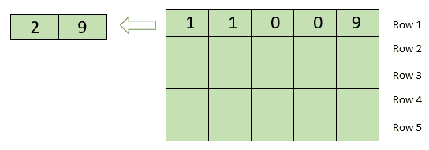

# 沿给定方向移动矩阵元素并添加具有相同值的元素

> 原文： [https://www.geeksforgeeks.org/move-matrix-elements-given-direction-add-elements-value/](https://www.geeksforgeeks.org/move-matrix-elements-given-direction-add-elements-value/)

给定大小为`n x n`的矩阵`m[][]`，该矩阵由整数组成，并给出表示方向的字符`x`。 `x`的值可以是`u, d, l, r`，分别表示上，下，左，右。 任务是将元素移至给定方向，以便将具有相同值的连续元素添加到单个值中，并移动其余元素。 同样，如果给定方向上的下一个元素为 0，则移动该元素。
**例如**：
考虑`x = 'l'`和矩阵`m[][]`：

```
32 3 3
0 0 1
10 10 8
```

在第一行中添加 3，第三行中添加 10 并在第二行中移动 1 之后，矩阵将变为

```
32 6 0
1 0 0
20 8 0
```

**示例**：

```
Input : x = 'l'
m[][] = { { 32, 3, 3, 3, 3 },
          { 0, 0, 1, 0, 0 },
          { 10, 10, 8, 1, 2},
          { 0, 0, 0, 0, 1},
          { 4, 5, 6, 7, 8 } }
Output :
32 6 6 0 0
1 0 0 0 0
20 8 1 2 0
1 0 0 0 0 0
4 5 6 7 8

Input : x = 'u'
m[][] = { { 10, 3, 32 },
        { 10, 0, 96 },
        { 5, 32, 96 } }
Output :
20 3 32
5 32 192
0 0 0

```

**方法**：想法是从行或列的侧面`x`朝`x'`（与`x`相对）遍历每一行或每一列（取决于给定的方向）。 例如，如果给定的`x`值为`'l'`（左），则开始从左侧到右侧扫描每一行。 遍历时，通过跳过具有值 0 的元素和连续元素之和（如果它们具有相等的值），将行或列元素存储在临时一维数组中（例如`temp[]`）。 之后，开始将临时数组`temp[0..k]`从（行或列的）`x`侧复制到当前行或列的`x'`（与`x`相对），然后用 0 填充元素的重置。

令`x = 'l'`，即向左移动。 因此，从该行的最左索引到最右索引开始处理每一行，并通过忽略 0 并将两个连续元素（如果它们具有相同的值）加到一个中的处理，存储在临时数组中。 下面是第 1 行的图示，

现在，对于每个复制行，将临时数组从最左侧的索引复制到最右侧的索引。 以下是第 1 行的图示，


**以下是此方法的实现**：

## C++ 

```cpp

// CPP code to move matrix elements 
// in given direction with add 
// element with same value 
#include <bits/stdc++.h> 
using namespace std; 

#define MAX 50 

// Function to shift the matrix 
// in the given direction 
void moveMatrix(char d[], int n, 
                int a[MAX][MAX]) 
{ 

    // For right shift move. 
    if (d[0] == 'r') { 

        // for each row from 
        // top to bottom 
        for (int i = 0; i < n; i++) { 
            vector<int> v, w; 
            int j; 

            // for each element of 
            // row from right to left 
            for (j = n - 1; j >= 0; j--) { 
                // if not 0 
                if (a[i][j]) 
                    v.push_back(a[i][j]); 
            } 

            // for each temporary array 
            for (j = 0; j < v.size(); j++) { 
                // if two element have same 
                // value at consecutive position. 
                if (j < v.size() - 1 && v[j] == v[j + 1]) { 
                    // insert only one element 
                    // as sum of two same element. 
                    w.push_back(2 * v[j]); 
                    j++; 
                } 
                else
                    w.push_back(v[j]); 
            } 

            // filling the each row element to 0\. 
            for (j = 0; j < n; j++) 
                a[i][j] = 0; 

            j = n - 1; 

            // Copying the temporary 
            // array to the current row. 
            for (auto it = w.begin(); 
                 it != w.end(); it++) 
                a[i][j--] = *it; 
        } 
    } 

    // for left shift move 
    else if (d[0] == 'l') { 

        // for each row 
        for (int i = 0; i < n; i++) { 
            vector<int> v, w; 
            int j; 

            // for each element of the 
            // row from left to right 
            for (j = 0; j < n; j++) { 
                // if not 0 
                if (a[i][j]) 
                    v.push_back(a[i][j]); 
            } 

            // for each temporary array 
            for (j = 0; j < v.size(); j++) { 
                // if two element have same 
                // value at consecutive position. 
                if (j < v.size() - 1 && v[j] == v[j + 1]) { 
                    // insert only one element 
                    // as sum of two same element. 
                    w.push_back(2 * v[j]); 
                    j++; 
                } 
                else
                    w.push_back(v[j]); 
            } 

            // filling the each row element to 0\. 
            for (j = 0; j < n; j++) 
                a[i][j] = 0; 

            j = 0; 

            for (auto it = w.begin(); 
                 it != w.end(); it++) 
                a[i][j++] = *it; 
        } 
    } 

    // for down shift move. 
    else if (d[0] == 'd') { 
        // for each column 
        for (int i = 0; i < n; i++) { 
            vector<int> v, w; 
            int j; 

            // for each element of 
            // column from bottom to top 
            for (j = n - 1; j >= 0; j--) { 
                // if not 0 
                if (a[j][i]) 
                    v.push_back(a[j][i]); 
            } 

            // for each temporary array 
            for (j = 0; j < v.size(); j++) { 

                // if two element have same 
                // value at consecutive position. 
                if (j < v.size() - 1 && v[j] == v[j + 1]) { 
                    // insert only one element 
                    // as sum of two same element. 
                    w.push_back(2 * v[j]); 
                    j++; 
                } 
                else
                    w.push_back(v[j]); 
            } 

            // filling the each column element to 0\. 
            for (j = 0; j < n; j++) 
                a[j][i] = 0; 

            j = n - 1; 

            // Copying the temporary array 
            // to the current column 
            for (auto it = w.begin(); 
                 it != w.end(); it++) 
                a[j--][i] = *it; 
        } 
    } 

    // for up shift move 
    else if (d[0] == 'u') { 
        // for each column 
        for (int i = 0; i < n; i++) { 
            vector<int> v, w; 
            int j; 

            // for each element of column 
            // from top to bottom 
            for (j = 0; j < n; j++) { 
                // if not 0 
                if (a[j][i]) 
                    v.push_back(a[j][i]); 
            } 

            // for each temporary array 
            for (j = 0; j < v.size(); j++) { 
                // if two element have same 
                // value at consecutive position. 
                if (j < v.size() - 1 && v[j] == v[j + 1]) { 
                    // insert only one element 
                    // as sum of two same element. 
                    w.push_back(2 * v[j]); 
                    j++; 
                } 
                else
                    w.push_back(v[j]); 
            } 

            // filling the each column element to 0\. 
            for (j = 0; j < n; j++) 
                a[j][i] = 0; 

            j = 0; 

            // Copying the temporary array 
            // to the current column 
            for (auto it = w.begin(); 
                 it != w.end(); it++) 
                a[j++][i] = *it; 
        } 
    } 
} 

// Driven Program 
int main() 
{ 
    char d[2] = "l"; 
    int n = 5; 
    int a[MAX][MAX] = { { 32, 3, 3, 3, 3 }, 
                        { 0, 0, 1, 0, 0 }, 
                        { 10, 10, 8, 1, 2 }, 
                        { 0, 0, 0, 0, 1 }, 
                        { 4, 5, 6, 7, 8 } }; 

    moveMatrix(d, n, a); 

    // Printing the final array 
    for (int i = 0; i < n; i++) { 
        for (int j = 0; j < n; j++) 
            cout << a[i][j] << " "; 

        cout << endl; 
    } 

    return 0; 
} 

```

## Java

```java

// Java code to move matrix 
// elements in given direction 
// with add element with same value 
import java.io.*; 
import java.util.*; 

class GFG { 
    // Function to shift the matrix 
    // in the given direction 
    static void moveMatrix(char d, 
                           int n, 
                           int a[][]) 
    { 

        // For right shift move. 
        if (d == 'r') { 

            // for each row from 
            // top to bottom 
            for (int i = 0; i < n; i++) { 
                ArrayList<Integer> v = new ArrayList<Integer>(); 
                ArrayList<Integer> w = new ArrayList<Integer>(); 
                int j; 

                // for each element of 
                // row from right to left 
                for (j = n - 1; j >= 0; j--) { 
                    // if not 0 
                    if (a[i][j] != 0) 
                        v.add(a[i][j]); 
                } 

                // for each temporary array 
                for (j = 0; j < v.size(); j++) { 
                    // if two element have 
                    // same value at 
                    // consecutive position. 
                    if (j < v.size() - 1 && v.get(j) == v.get(j + 1)) { 
                        // insert only one element 
                        // as sum of two same element. 
                        w.add(2 * v.get(j)); 
                        j++; 
                    } 
                    else
                        w.add(v.get(j)); 
                } 

                // filling the each 
                // row element to 0\. 
                for (j = 0; j < n; j++) 
                    a[i][j] = 0; 

                j = n - 1; 

                // Copying the temporary 
                // array to the current row. 
                for (int it = 0; it < w.size(); it++) 
                    a[i][j--] = w.get(it); 
            } 
        } 

        // for left shift move 
        else if (d == 'l') { 

            // for each row 
            for (int i = 0; i < n; i++) { 
                ArrayList<Integer> v = new ArrayList<Integer>(); 
                ArrayList<Integer> w = new ArrayList<Integer>(); 
                int j; 

                // for each element of the 
                // row from left to right 
                for (j = 0; j < n; j++) { 
                    // if not 0 
                    if (a[i][j] != 0) 
                        v.add(a[i][j]); 
                } 

                // for each temporary array 
                for (j = 0; j < v.size(); j++) { 
                    // if two element have 
                    // same value at 
                    // consecutive position. 
                    if (j < v.size() - 1 && v.get(j) == v.get(j + 1)) { 
                        // insert only one 
                        // element as sum 
                        // of two same element. 
                        w.add(2 * v.get(j)); 
                        j++; 
                    } 
                    else
                        w.add(v.get(j)); 
                } 

                // filling the each 
                // row element to 0\. 
                for (j = 0; j < n; j++) 
                    a[i][j] = 0; 

                j = 0; 

                for (int it = 0; it < w.size(); it++) 
                    a[i][j++] = w.get(it); 
            } 
        } 

        // for down shift move. 
        else if (d == 'd') { 
            // for each column 
            for (int i = 0; i < n; i++) { 
                ArrayList<Integer> v = new ArrayList<Integer>(); 
                ArrayList<Integer> w = new ArrayList<Integer>(); 
                int j; 

                // for each element of 
                // column from bottom to top 
                for (j = n - 1; j >= 0; j--) { 
                    // if not 0 
                    if (a[j][i] != 0) 
                        v.add(a[j][i]); 
                } 

                // for each temporary array 
                for (j = 0; j < v.size(); j++) { 

                    // if two element have 
                    // same value at consecutive 
                    // position. 
                    if (j < v.size() - 1 && v.get(j) == v.get(j + 1)) { 
                        // insert only one element 
                        // as sum of two same element. 
                        w.add(2 * v.get(j)); 
                        j++; 
                    } 
                    else
                        w.add(v.get(j)); 
                } 

                // filling the each 
                // column element to 0\. 
                for (j = 0; j < n; j++) 
                    a[j][i] = 0; 

                j = n - 1; 

                // Copying the temporary array 
                // to the current column 
                for (int it = 0; it < w.size(); it++) 
                    a[j--][i] = w.get(it); 
            } 
        } 

        // for up shift move 
        else if (d == 'u') { 
            // for each column 
            for (int i = 0; i < n; i++) { 
                ArrayList<Integer> v = new ArrayList<Integer>(); 
                ArrayList<Integer> w = new ArrayList<Integer>(); 
                int j; 

                // for each element of column 
                // from top to bottom 
                for (j = 0; j < n; j++) { 
                    // if not 0 
                    if (a[j][i] != 0) 
                        v.add(a[j][i]); 
                } 

                // for each temporary array 
                for (j = 0; j < v.size(); j++) { 
                    // if two element have 
                    // same value at 
                    // consecutive position. 
                    if (j < v.size() - 1 && v.get(j) == v.get(j + 1)) { 
                        // insert only one element 
                        // as sum of two same element. 
                        w.add(2 * v.get(j)); 
                        j++; 
                    } 
                    else
                        w.add(v.get(j)); 
                } 

                // filling the each 
                // column element to 0\. 
                for (j = 0; j < n; j++) 
                    a[j][i] = 0; 

                j = 0; 

                // Copying the temporary 
                // array to the current 
                // column 
                for (int it = 0; it < w.size(); it++) 
                    a[j++][i] = w.get(it); 
            } 
        } 
    } 

    // Driver Code 
    public static void main(String args[]) 
    { 
        char d = 'l'; 
        int n = 5; 
        int a[][] = { { 32, 3, 3, 3, 3 }, 
                      { 0, 0, 1, 0, 0 }, 
                      { 10, 10, 8, 1, 2 }, 
                      { 0, 0, 0, 0, 1 }, 
                      { 4, 5, 6, 7, 8 } }; 

        moveMatrix(d, n, a); 

        // Printing the 
        // final array 
        for (int i = 0; i < n; i++) { 
            for (int j = 0; j < n; j++) 
                System.out.print(a[i][j] + " "); 

            System.out.println(); 
        } 
    } 
} 

// This code is contributed by 
// Manish Shaw(manishshaw1) 

```

## C# 

```cs

// C# code to move matrix elements 
// in given direction with add 
// element with same value 
using System; 
using System.Collections.Generic; 

class GFG { 
    // Function to shift the matrix 
    // in the given direction 
    static void moveMatrix(char d, int n, 
                           int[, ] a) 
    { 

        // For right shift move. 
        if (d == 'r') { 

            // for each row from 
            // top to bottom 
            for (int i = 0; i < n; i++) { 
                List<int> v = new List<int>(); 
                List<int> w = new List<int>(); 
                int j; 

                // for each element of 
                // row from right to left 
                for (j = n - 1; j >= 0; j--) { 
                    // if not 0 
                    if (a[i, j] != 0) 
                        v.Add(a[i, j]); 
                } 

                // for each temporary array 
                for (j = 0; j < v.Count; j++) { 
                    // if two element have 
                    // same value at 
                    // consecutive position. 
                    if (j < v.Count - 1 && v[j] == v[j + 1]) { 
                        // insert only one element 
                        // as sum of two same element. 
                        w.Add(2 * v[j]); 
                        j++; 
                    } 
                    else
                        w.Add(v[j]); 
                } 

                // filling the each 
                // row element to 0\. 
                for (j = 0; j < n; j++) 
                    a[i, j] = 0; 

                j = n - 1; 

                // Copying the temporary 
                // array to the current row. 
                for (int it = 0; it < w.Count; it++) 
                    a[i, j--] = w[it]; 
            } 
        } 

        // for left shift move 
        else if (d == 'l') { 

            // for each row 
            for (int i = 0; i < n; i++) { 
                List<int> v = new List<int>(); 
                List<int> w = new List<int>(); 
                int j; 

                // for each element of the 
                // row from left to right 
                for (j = 0; j < n; j++) { 
                    // if not 0 
                    if (a[i, j] != 0) 
                        v.Add(a[i, j]); 
                } 

                // for each temporary array 
                for (j = 0; j < v.Count; j++) { 
                    // if two element have 
                    // same value at 
                    // consecutive position. 
                    if (j < v.Count - 1 && v[j] == v[j + 1]) { 
                        // insert only one element 
                        // as sum of two same element. 
                        w.Add(2 * v[j]); 
                        j++; 
                    } 
                    else
                        w.Add(v[j]); 
                } 

                // filling the each 
                // row element to 0\. 
                for (j = 0; j < n; j++) 
                    a[i, j] = 0; 

                j = 0; 

                for (int it = 0; it < w.Count; it++) 
                    a[i, j++] = w[it]; 
            } 
        } 

        // for down shift move. 
        else if (d == 'd') { 
            // for each column 
            for (int i = 0; i < n; i++) { 
                List<int> v = new List<int>(); 
                List<int> w = new List<int>(); 
                int j; 

                // for each element of 
                // column from bottom to top 
                for (j = n - 1; j >= 0; j--) { 
                    // if not 0 
                    if (a[j, i] != 0) 
                        v.Add(a[j, i]); 
                } 

                // for each temporary array 
                for (j = 0; j < v.Count; j++) { 

                    // if two element have same 
                    // value at consecutive position. 
                    if (j < v.Count - 1 && v[j] == v[j + 1]) { 
                        // insert only one element 
                        // as sum of two same element. 
                        w.Add(2 * v[j]); 
                        j++; 
                    } 
                    else
                        w.Add(v[j]); 
                } 

                // filling the each 
                // column element to 0\. 
                for (j = 0; j < n; j++) 
                    a[j, i] = 0; 

                j = n - 1; 

                // Copying the temporary array 
                // to the current column 
                for (int it = 0; it < w.Count; it++) 
                    a[j--, i] = w[it]; 
            } 
        } 

        // for up shift move 
        else if (d == 'u') { 
            // for each column 
            for (int i = 0; i < n; i++) { 
                List<int> v = new List<int>(); 
                List<int> w = new List<int>(); 
                int j; 

                // for each element of column 
                // from top to bottom 
                for (j = 0; j < n; j++) { 
                    // if not 0 
                    if (a[j, i] != 0) 
                        v.Add(a[j, i]); 
                } 

                // for each temporary array 
                for (j = 0; j < v.Count; j++) { 
                    // if two element have same 
                    // value at consecutive position. 
                    if (j < v.Count - 1 && v[j] == v[j + 1]) { 
                        // insert only one element 
                        // as sum of two same element. 
                        w.Add(2 * v[j]); 
                        j++; 
                    } 
                    else
                        w.Add(v[j]); 
                } 

                // filling the each 
                // column element to 0\. 
                for (j = 0; j < n; j++) 
                    a[j, i] = 0; 

                j = 0; 

                // Copying the temporary array 
                // to the current column 

                for (int it = 0; it < w.Count; it++) 
                    a[j++, i] = w[it]; 
            } 
        } 
    } 

    // Driven Code 
    static void Main() 
    { 
        char d = 'l'; 
        int n = 5; 
        int[, ] a = new int[, ] { { 32, 3, 3, 3, 3 }, 
                                  { 0, 0, 1, 0, 0 }, 
                                  { 10, 10, 8, 1, 2 }, 
                                  { 0, 0, 0, 0, 1 }, 
                                  { 4, 5, 6, 7, 8 } }; 

        moveMatrix(d, n, a); 

        // Printing the final array 
        for (int i = 0; i < n; i++) { 
            for (int j = 0; j < n; j++) 
                Console.Write(a[i, j] + " "); 

            Console.WriteLine(); 
        } 
    } 
} 
// This code is contributed by 
// Manish Shaw(manishshaw1) 

```

## PHP

```php

<?php 
// PHP code to move matrix  
// elements in given  
// direction with add element 
// with same value 
$MAX = 50; 

// Function to shift the matrix 
// in the given direction 
function moveMatrix($d, $n, &$a) 
{  
    global $MAX; 

    // For right shift move. 
    if ($d[0] == 'r')  
    { 

        // for each row from  
        // top to bottom 
        for ($i = 0; $i < $n; $i++)  
        { 
            $v = array(); 
            $w = array(); 
            $j = 0; 

            // for each element of  
            // row from right to left 
            for ($j = $n - 1; $j >= 0; $j--)  
            { 
                // if not 0 
                if ($a[$i][$j]) 
                    array_push($v, $a[$i][$j]); 
            } 

            // for each temporary array 
            for ($j = 0; $j < count($v); $j++)  
            { 
                // if two element have same 
                // value at consecutive position. 
                if ($j < count($v) - 1 &&  
                    $v[$j] == $v[$j + 1])  
                { 
                    // insert only one element  
                    // as sum of two same element. 
                    array_push($w, 2 * $v[$j]); 
                    $j++; 
                } 
                else
                    array_push($w, $v[$j]); 
            } 

            // filling the each  
            // row element to 0\. 
            for ($j = 0; $j < $n; $j++) 
                $a[$i][$j] = 0; 

            $j = $n - 1; 

            // Copying the temporary  
            // array to the current row. 
            for ($it = 0; $it != count($w); $it++) 
                    $a[$i][$j--] = $w[$it]; 
        } 
    } 

    // for left shift move 
    else if ($d[0] == 'l')  
    {  
        // for each row 
        for ($i = 0; $i < $n; $i++)  
        { 
            $v = array(); $w = array(); 
            $j = 0; 

            // for each element of the  
            // row from left to right 
            for ($j = 0; $j < $n; $j++)  
            { 
                // if not 0 
                if ($a[$i][$j]) 
                    array_push($v,  
                               $a[$i][$j]); 
            } 

            // for each temporary array 
            for ($j = 0; $j < count($v); $j++)  
            { 
                // if two element have 
                // same value at consecutive  
                // position. 
                if ($j < count($v) - 1 && 
                    $v[$j] == $v[$j + 1])  
                { 
                    // insert only one element  
                    // as sum of two same element. 
                    array_push($w, 2 * $v[$j]); 
                    $j++; 
                } 
                else
                    array_push($w, $v[$j]); 
            } 

            // filling the each  
            // row element to 0\. 
            for ($j = 0; $j < $n; $j++) 
                $a[$i][$j] = 0; 

            $j = 0; 

            for ($it = 0; $it != count($w); $it++) 
                    $a[$i][$j++] = $w[$it]; 
        } 
    } 

    // for down shift move. 
    else if ($d[0] == 'd')  
    { 
        // for each column 
        for ($i = 0; $i < $n; $i++)  
        { 
            $v = array(); $w = array(); 
            $j = 0; 

            // for each element  
            // of column from 
            // bottom to top 
            for ($j = $n - 1; $j >= 0; $j--)  
            { 
                // if not 0 
                if ($a[$j][$i]) 
                    array_push($v, $a[$j][$i]); 
            } 

            // for each temporary array 
            for ($j = 0; $j < count($v); $j++)  
            { 

                // if two element have  
                // same value at  
                // consecutive position. 
                if ($j < count($v) - 1 &&  
                    $v[$j] == $v[$j + 1])  
                { 
                    // insert only one element 
                    // as sum of two same element. 
                    array_push($w, 2 * $v[$j]); 
                    $j++; 
                } 
                else
                    array_push($w, $v[$j]); 
            } 

            // filling the each  
            // column element to 0\. 
            for ($j = 0; $j < $n; $j++) 
                $a[$j][$i] = 0; 

            $j = $n - 1; 

            // Copying the temporary array 
            // to the current column 
            for ($it = 0; $it != count($w); $it++) 
                    $a[$j--][$i] = $w[$it]; 
        } 
    } 

    // for up shift move 
    else if ($d[0] == 'u')  
    { 
        // for each column 
        for ($i = 0; $i < $n; $i++)  
        { 
            $v = array(); $w = array(); 
            $j = 0; 

            // for each element of column 
            // from top to bottom 
            for ($j = 0; $j < $n; $j++)  
            { 
                // if not 0 
                if ($a[$j][$i]) 
                    array_push($v,  
                               $a[$j][$i]); 
            } 

            // for each temporary array 
            for ($j = 0; $j < count($v); $j++)  
            { 
                // if two element have same 
                // value at consecutive position. 
                if ($j < count($v) - 1 && 
                    $v[$j] == $v[$j + 1])  
                { 
                    // insert only one element  
                    // as sum of two same element. 
                    array_push($w, 2 * $v[$j]); 
                    $j++; 
                } 
                else
                    array_push($w, $v[$j]); 
            } 

            // filling the each  
            // column element to 0\. 
            for ($j = 0; $j < $n; $j++) 
                $a[$j][$i] = 0; 

            $j = 0; 

            // Copying the temporary array 
            // to the current column 
            for ($it = 0; $it != count($w); $it++) 
                    $a[$j++][$i] = $w[$it]; 
        } 
    } 
} 

// Driven Code 
$d = array("l"); 
$n = 5; 
$a = array( array(32, 3, 3, 3, 3), 
            array(0, 0, 1, 0, 0), 
            array(10, 10, 8, 1, 2), 
            array(0, 0, 0, 0, 1), 
            array(4, 5, 6, 7, 8)); 

moveMatrix($d, $n, $a); 

// Printing the final array 
for ($i = 0; $i < $n; $i++) 
{ 
    for ($j = 0; $j < $n; $j++) 
        echo ($a[$i][$j]." "); 

    echo ("\n"); 
} 

// This code is contributed 
// by Manish Shaw(manishshaw1) 
?> 

```

**输出**：

```
32 6 6 0 0 
1 0 0 0 0 
20 8 1 2 0 
1 0 0 0 0 
4 5 6 7 8

```


* * *

* * *


