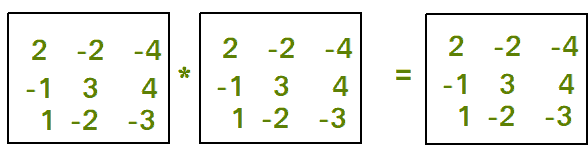

# 检查幂等矩阵的程序

> 原文： [https://www.geeksforgeeks.org/program-check-idempotent-matrix/](https://www.geeksforgeeks.org/program-check-idempotent-matrix/)

给定一个 N * N 矩阵，任务是检查矩阵是否为等幂矩阵。

**[等幂矩阵：](https://en.wikipedia.org/wiki/Idempotent_matrix)** 如果矩阵与自身相乘返回相同的矩阵，则称该矩阵为等幂矩阵。 当且仅当 **M * M = M** 时，矩阵 M 才是等幂矩阵。 在幂等矩阵中，M 是平方矩阵。



例子：

```
Input : mat[][] = {{3, -6},
                   {1, -2}};
Output : Idempotent Matrix

Input : mat[N][N] = {{2, -2, -4},
                     {-1, 3, 4},
                     {1, -2, -3}}
Output : Idempotent Matrix.

```

## [推荐：在继续进行解决之前，请先在 ***<u>{IDE}</u>*** 上尝试您的方法。](https://ide.geeksforgeeks.org/)

## C ++

```

// Program to check given matrix  
// is idempotent matrix or not. 
#include<bits/stdc++.h> 
#define N 3 
using namespace std; 

// Function for matrix multiplication. 
void multiply(int mat[][N], int res[][N]) 
{ 
    for (int i = 0; i < N; i++) 
    { 
        for (int j = 0; j < N; j++) 
        { 
            res[i][j] = 0; 
            for (int k = 0; k < N; k++) 
                res[i][j] += mat[i][k] * mat[k][j]; 
        } 
    } 
} 

// Function to check idempotent 
// property of matrix. 
bool checkIdempotent(int mat[][N]) 
{    
    // Calculate multiplication of matrix 
    // with itself and store it into res. 
    int res[N][N]; 
    multiply(mat, res); 

    for (int i = 0; i < N; i++)     
        for (int j = 0; j < N; j++)         
            if (mat[i][j] != res[i][j]) 
                return false; 
    return true; 
} 

// Driver function. 
int main() 
{ 
    int mat[N][N] = {{2, -2, -4}, 
                    {-1, 3, 4}, 
                    {1, -2, -3}}; 

    // checkIdempotent function call. 
    if (checkIdempotent(mat)) 
        cout << "Idempotent Matrix"; 
    else
        cout << "Not Idempotent Matrix."; 
    return 0; 
} 

```

## 爪哇

```

// Java program to check given matrix  
// is idempotent matrix or not. 
import java.io.*; 

class GFG  
{ 
    static int N = 3; 

    // Function for matrix multiplication. 
    static void multiply(int mat[][], int res[][]) 
    { 
        for (int i = 0; i < N; i++) 
        { 
            for (int j = 0; j < N; j++) 
            { 
                res[i][j] = 0; 
                for (int k = 0; k < N; k++) 
                    res[i][j] += mat[i][k] * mat[k][j]; 
            } 
        } 
    } 

    // Function to check idempotent 
    // property of matrix. 
    static boolean checkIdempotent(int mat[][]) 
    {  
        // Calculate multiplication of matrix 
        // with itself and store it into res. 
        int res[][] = new int[N][N]; 
        multiply(mat, res); 

        for (int i = 0; i < N; i++) 
        {  
            for (int j = 0; j < N; j++) 
            { 
                if (mat[i][j] != res[i][j]) 
                    return false; 
            } 
        } 
        return true; 
    } 

    // Driver code. 
    public static void main (String[] args)  
    { 
        int mat[][] = {{2, -2, -4}, 
                       {-1, 3, 4}, 
                       {1, -2, -3}}; 

        // checkIdempotent function call. 
        if (checkIdempotent(mat)) 
            System.out.println( "Idempotent Matrix"); 
        else
            System.out.println("Not Idempotent Matrix."); 

    } 
} 

// This code is contributed by vt_m. 

```

## Python 3

```

# Python Program to check given matrix  
# is idempotent matrix or not. 
import math 

# Function for matrix multiplication. 
def multiply(mat, res): 

    N= len(mat) 
    for i in range(0,N): 

        for j in range(0,N): 

            res[i][j] = 0
            for k in range(0,N): 
                res[i][j] += mat[i][k] * mat[k][j] 

# Function to check idempotent 
# property of matrix. 
def checkIdempotent(mat): 

    N= len(mat) 
    # Calculate multiplication of matrix 
    # with itself and store it into res. 
    res =[[0]*N for i in range(0,N)] 
    multiply(mat, res) 

    for i in range(0,N): 
        for j in range(0,N):      
            if (mat[i][j] != res[i][j]): 
                return False
    return True

# driver Function 
mat = [ [2, -2, -4], 
        [-1, 3, 4], 
        [1, -2, -3] ] 

# checkIdempotent function call. 
if (checkIdempotent(mat)): 
    print("Idempotent Matrix") 
else: 
    print("Not Idempotent Matrix.") 

# This code is contributed by Gitanjali. 

```

## C＃

```

// C# program to check given matrix  
// is idempotent matrix or not. 
using System; 

class GFG  
{ 
    static int N = 3; 

    // Function for matrix multiplication. 
    static void multiply(int [,]mat, int [,]res) 
    { 
        for (int i = 0; i < N; i++) 
        { 
            for (int j = 0; j < N; j++) 
            { 
                res[i,j] = 0; 
                for (int k = 0; k < N; k++) 
                    res[i,j] += mat[i,k] * mat[k,j]; 
            } 
        } 
    } 

    // Function to check idempotent 
    // property of matrix. 
    static bool checkIdempotent(int [,]mat) 
    {  
        // Calculate multiplication of matrix 
        // with itself and store it into res. 
        int [,]res = new int[N,N]; 
        multiply(mat, res); 

        for (int i = 0; i < N; i++) 
        {  
            for (int j = 0; j < N; j++) 
            { 
                if (mat[i,j] != res[i,j]) 
                    return false; 
            } 
        } 
        return true; 
    } 

    // Driver code 
    public static void Main ()  
    { 
        int [,]mat = {{2, -2, 4}, 
                    {-1, 3, 4}, 
                    {1, -2, -3}}; 

        // checkIdempotent function call. 
        if (checkIdempotent(mat)) 
            Console.WriteLine( "Idempotent Matrix"); 
        else
            Console.WriteLine("Not Idempotent Matrix."); 

    } 
} 

// This code is contributed by vt_m. 

```

Output

```
Idempotent Matrix
```

现在不要停下来，将您的学习提高到一个新的水平。 借助最受信任的课程，学习数据结构和算法的所有重要概念： [DSA Self Paced](https://practice.geeksforgeeks.org/courses/dsa-self-paced?utm_source=geeksforgeeks&utm_medium=article&utm_campaign=gfg_article_dsa_content_bottom) 。 以对学生友好的价格准备好行业。

* * *

* * *

如果您喜欢 GeeksforGeeks 并希望做出贡献，则还可以使用 [tribution.geeksforgeeks.org](https://contribute.geeksforgeeks.org/) 撰写文章，或将您的文章邮寄至 tribution@geeksforgeeks.org。 查看您的文章出现在 GeeksforGeeks 主页上，并帮助其他 Geeks。

如果您发现任何不正确的地方，请单击下面的“改进文章”按钮，以改进本文。