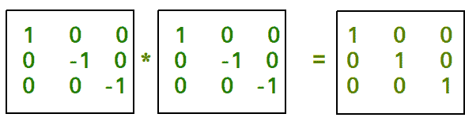

# 程序检查对合矩阵

> 原文： [https://www.geeksforgeeks.org/program-check-involutory-matrix/](https://www.geeksforgeeks.org/program-check-involutory-matrix/)

给定一个矩阵，任务是检查矩阵是否为非强制矩阵。
[**非对映矩阵**](https://en.wikipedia.org/wiki/Involutory_matrix)：如果矩阵本身相乘返回恒等矩阵，则称该矩阵为非对映矩阵。 对合矩阵是其自身的逆矩阵。 如果 **A * A ＝ I** ，则矩阵 **A** 被称为​​对合矩阵。 我是身份矩阵。


**示例**：

```
Input : mat[N][N] = {{1, 0, 0},
                     {0, -1, 0},
                     {0, 0, -1}}
Output : Involutory Matrix

Input : mat[N][N] = {{1, 0, 0},
                     {0, 1, 0},
                     {0, 0, 1}} 
Output : Involutory Matrix

```

> [推荐：在继续进行解决之前，请先在 ***{IDE}*** 上尝试您的方法。](https://ide.geeksforgeeks.org/)

## C++ 

```

// Program to implement involutory matrix. 
#include <bits/stdc++.h> 
#define N 3 
using namespace std; 

// Function for matrix multiplication. 
void multiply(int mat[][N], int res[][N]) 
{ 
    for (int i = 0; i < N; i++) { 
        for (int j = 0; j < N; j++) { 
            res[i][j] = 0; 
            for (int k = 0; k < N; k++) 
                res[i][j] += mat[i][k] * mat[k][j]; 
        } 
    } 
} 

// Function to check involutory matrix. 
bool InvolutoryMatrix(int mat[N][N]) 
{ 
    int res[N][N]; 

    // multiply function call. 
    multiply(mat, res); 

    for (int i = 0; i < N; i++) { 
        for (int j = 0; j < N; j++) { 
            if (i == j && res[i][j] != 1) 
                return false; 
            if (i != j && res[i][j] != 0) 
                return false; 
        } 
    } 
    return true; 
} 

// Driver function. 
int main() 
{ 
    int mat[N][N] = { { 1, 0, 0 }, 
                      { 0, -1, 0 }, 
                      { 0, 0, -1 } }; 

    // Function call. If function return 
    // true then if part will execute otherwise 
    // else part will execute. 
    if (InvolutoryMatrix(mat)) 
        cout << "Involutory Matrix"; 
    else
        cout << "Not Involutory Matrix"; 

    return 0; 
} 

```

## Java

```

// Java  Program to implement  
// involutory matrix. 
import java.io.*; 

class GFG { 

    static int N = 3; 

    // Function for matrix multiplication. 
    static void multiply(int mat[][], int res[][]) 
    { 
        for (int i = 0; i < N; i++) { 
            for (int j = 0; j < N; j++) { 
                res[i][j] = 0; 
                for (int k = 0; k < N; k++) 
                    res[i][j] += mat[i][k] * mat[k][j]; 
            } 
        } 
    } 

    // Function to check involutory matrix. 
    static boolean InvolutoryMatrix(int mat[][]) 
    { 
        int res[][] = new int[N][N]; 

        // multiply function call. 
        multiply(mat, res); 

        for (int i = 0; i < N; i++) { 
            for (int j = 0; j < N; j++) { 
                if (i == j && res[i][j] != 1) 
                    return false; 
                if (i != j && res[i][j] != 0) 
                    return false; 
            } 
        } 
        return true; 
    } 

    // Driver function. 
    public static void main (String[] args)  
    { 

        int mat[][] = { { 1, 0, 0 }, 
                        { 0, -1, 0 }, 
                        { 0, 0, -1 } }; 

        // Function call. If function return 
        // true then if part will execute  
        // otherwise else part will execute. 
        if (InvolutoryMatrix(mat)) 
            System.out.println ( "Involutory Matrix"); 
        else
            System.out.println ( "Not Involutory Matrix"); 

    } 
} 

// This code is contributed by vt_m 

```

## Python3

```

# Program to implement involutory matrix. 
N = 3; 

# Function for matrix multiplication. 
def multiply(mat, res): 

    for i in range(N):  
        for j in range(N): 
            res[i][j] = 0; 
            for k in range(N): 
                res[i][j] += mat[i][k] * mat[k][j]; 
    return res; 

# Function to check involutory matrix. 
def InvolutoryMatrix(mat): 

    res=[[0 for i in range(N)]  
            for j in range(N)]; 

    # multiply function call. 
    res = multiply(mat, res); 

    for i in range(N):  
        for j in range(N): 
            if (i == j and res[i][j] != 1): 
                return False; 
            if (i != j and res[i][j] != 0): 
                return False; 
    return True; 

# Driver Code 
mat = [[1, 0, 0], [0, -1, 0], [0, 0, -1]]; 

# Function call. If function  
# return true then if part  
# will execute otherwise 
# else part will execute. 
if (InvolutoryMatrix(mat)): 
    print("Involutory Matrix"); 
else: 
    print("Not Involutory Matrix"); 

# This code is contributed by mits 

```

## C# 

```

// C# Program to implement  
// involutory matrix. 
using System; 

class GFG { 

    static int N = 3; 

    // Function for matrix multiplication. 
    static void multiply(int [,]mat, int [,]res) 
    { 
        for (int i = 0; i < N; i++) { 
            for (int j = 0; j < N; j++) { 
                res[i,j] = 0; 
                for (int k = 0; k < N; k++) 
                    res[i,j] += mat[i,k] * mat[k,j]; 
            } 
        } 
    } 

    // Function to check involutory matrix. 
    static bool InvolutoryMatrix(int [,]mat) 
    { 
        int [,]res = new int[N,N]; 

        // multiply function call. 
        multiply(mat, res); 

        for (int i = 0; i < N; i++) { 
            for (int j = 0; j < N; j++) { 
                if (i == j && res[i,j] != 1) 
                    return false; 
                if (i != j && res[i,j] != 0) 
                    return false; 
            } 
        } 
        return true; 
    } 

    // Driver function. 
    public static void Main ()  
    { 

        int [,]mat = { { 1, 0, 0 }, 
                        { 0, -1, 0 }, 
                        { 0, 0, -1 } }; 

        // Function call. If function return 
        // true then if part will execute  
        // otherwise else part will execute. 
        if (InvolutoryMatrix(mat)) 
            Console.WriteLine( "Involutory Matrix"); 
        else
            Console.WriteLine( "Not Involutory Matrix"); 

    } 
} 

// This code is contributed by vt_m 

```

## PHP

```

<?php 
// Program to implement  
// involutory matrix. 

$N = 3; 

// Function for matrix 
// multiplication. 
function multiply($mat, $res) 
{ 
    global $N; 
    for ($i = 0; $i < $N; $i++)  
    { 
        for ($j = 0; $j < $N; $j++) 
        { 
            $res[$i][$j] = 0; 
            for ($k = 0; $k < $N; $k++) 
                $res[$i][$j] += $mat[$i][$k] *  
                                $mat[$k][$j]; 
        } 
    } 
    return $res; 
} 

// Function to check 
// involutory matrix. 
function InvolutoryMatrix($mat) 
{ 
    global $N; 
    $res; 
    for ($i = 0; $i < $N; $i++) 
        for ($j = 0; $j < $N; $j++) 
            $res[$i][$j] = 0; 

    // multiply function call. 
    $res = multiply($mat, $res); 

    for ($i = 0; $i < $N; $i++)  
    { 
        for ($j = 0; $j < $N; $j++) 
        { 
            if ($i == $j && 
                $res[$i][$j] != 1) 
                return false; 
            if ($i != $j &&  
                $res[$i][$j] != 0) 
                return false; 
        } 
    } 
    return true; 
} 

// Driver Code 
$mat = array(array(1, 0, 0), 
             array(0, -1, 0), 
             array(0, 0, -1)); 

// Function call. If function  
// return true then if part  
// will execute otherwise 
// else part will execute. 
if (InvolutoryMatrix($mat)) 
    echo "Involutory Matrix"; 
else
    echo "Not Involutory Matrix"; 

// This code is contributed by mits 
?> 

```

**Output :**

```
Involutory Matrix
```


* * *

* * *

如果您喜欢 GeeksforGeeks 并希望做出贡献，则还可以使用 [tribution.geeksforgeeks.org](https://contribute.geeksforgeeks.org/) 撰写文章，或将您的文章邮寄至 tribution@geeksforgeeks.org。 查看您的文章出现在 GeeksforGeeks 主页上，并帮助其他 Geeks。

如果您发现任何不正确的地方，请单击下面的“改进文章”按钮，以改进本文。