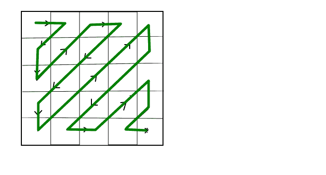

# zag-zag 方式打印矩阵

> 原文： [https://www.geeksforgeeks.org/print-matrix-zag-zag-fashion/](https://www.geeksforgeeks.org/print-matrix-zag-zag-fashion/)

给定 n 行和 m 个列的 2D 数组矩阵。 如图所示，以 ZIG-ZAG 方式打印此矩阵。


**示例**：

```
Input: 
1 2 3
4 5 6
7 8 9
Output: 
1 2 4 7 5 3 6 8 9

```

## [推荐：在继续进行解决之前，请先在 ***<u>{IDE}</u>*** 上尝试您的方法。](https://ide.geeksforgeeks.org/)

**C++ 代码的方法**
这种方法很简单。 只需一次遍历每个对角线元素，然后根据上一个匹配项更改方向即可。

**Python3 代码的方法**
这种方法很简单。 在以通常的方式行进矩阵时，如果元素 i 和 j 的总和分别为偶数或奇数，则根据元素索引总和的奇偶校验，将该特定元素添加到列表的开头或末尾 。 按原样打印解决方案列表。

## C++ 

```

/* C++ Program to print matrix in Zig-zag pattern*/
#include <iostream> 
using namespace std; 
#define C 3 

// Utility function to print matrix 
// in zig-zag form 
void zigZagMatrix(int arr[][C], int n, int m) 
{ 
    int row = 0, col = 0; 

    // Boolean variable that will true if we 
    // need to increment 'row' value otherwise 
    // false- if increment 'col' value 
    bool row_inc = 0; 

    // Print matrix of lower half zig-zag pattern 
    int mn = min(m, n); 
    for (int len = 1; len <= mn; ++len) { 
        for (int i = 0; i < len; ++i) { 
            cout << arr[row][col] << " "; 

            if (i + 1 == len) 
                break; 
            // If row_increment value is true 
            // increment row and decrement col 
            // else decrement row and increment 
            // col 
            if (row_inc) 
                ++row, --col; 
            else
                --row, ++col; 
        } 

        if (len == mn) 
            break; 

        // Update row or col value according 
        // to the last increment 
        if (row_inc) 
            ++row, row_inc = false; 
        else
            ++col, row_inc = true; 
    } 

    // Update the indexes of row and col variable 
    if (row == 0) { 
        if (col == m - 1) 
            ++row; 
        else
            ++col; 
        row_inc = 1; 
    } 
    else { 
        if (row == n - 1) 
            ++col; 
        else
            ++row; 
        row_inc = 0; 
    } 

    // Print the next half zig-zag pattern 
    int MAX = max(m, n) - 1; 
    for (int len, diag = MAX; diag > 0; --diag) { 

        if (diag > mn) 
            len = mn; 
        else
            len = diag; 

        for (int i = 0; i < len; ++i) { 
            cout << arr[row][col] << " "; 

            if (i + 1 == len) 
                break; 

            // Update row or col value according 
            // to the last increment 
            if (row_inc) 
                ++row, --col; 
            else
                ++col, --row; 
        } 

        // Update the indexes of row and col variable 
        if (row == 0 || col == m - 1) { 
            if (col == m - 1) 
                ++row; 
            else
                ++col; 

            row_inc = true; 
        } 

        else if (col == 0 || row == n - 1) { 
            if (row == n - 1) 
                ++col; 
            else
                ++row; 

            row_inc = false; 
        } 
    } 
} 

// Driver code 
int main() 
{ 
    int matrix[][3] = { { 1, 2, 3 }, 
                        { 4, 5, 6 }, 
                        { 7, 8, 9 } }; 
    zigZagMatrix(matrix, 3, 3); 

    return 0; 
} 

```

## 爪哇

```

/* Java Program to print matrix in Zig-zag pattern*/
class GFG { 
  static final int C = 3; 

  // Utility function to print matrix 
  // in zig-zag form 
  static void zigZagMatrix(int arr[][], int n, int m) { 
    int row = 0, col = 0; 

    // Boolean variable that will true if we 
    // need to increment 'row' value otherwise 
    // false- if increment 'col' value 
    boolean row_inc = false; 

    // Print matrix of lower half zig-zag pattern 
    int mn = Math.min(m, n); 
    for (int len = 1; len <= mn; ++len) { 
      for (int i = 0; i < len; ++i) { 
        System.out.print(arr[row][col] + " "); 

        if (i + 1 == len) 
          break; 
        // If row_increment value is true 
        // increment row and decrement col 
        // else decrement row and increment 
        // col 
        if (row_inc) { 
          ++row; 
          --col; 
        } else { 
          --row; 
          ++col; 
        } 
      } 

      if (len == mn) 
        break; 

      // Update row or col valaue according 
      // to the last increment 
      if (row_inc) { 
        ++row; 
        row_inc = false; 
      } else { 
        ++col; 
        row_inc = true; 
      } 
    } 

    // Update the indexes of row and col variable 
    if (row == 0) { 
      if (col == m - 1) 
        ++row; 
      else
        ++col; 
      row_inc = true; 
    } else { 
      if (row == n - 1) 
        ++col; 
      else
        ++row; 
      row_inc = false; 
    } 

    // Print the next half zig-zag pattern 
    int MAX = Math.max(m, n) - 1; 
    for (int len, diag = MAX; diag > 0; --diag) { 

      if (diag > mn) 
        len = mn; 
      else
        len = diag; 

      for (int i = 0; i < len; ++i) { 
        System.out.print(arr[row][col] + " "); 

        if (i + 1 == len) 
          break; 

        // Update row or col value according 
        // to the last increment 
        if (row_inc) { 
          ++row; 
          --col; 
        } else { 
          ++col; 
          --row; 
        } 
      } 

      // Update the indexes of row and col variable 
      if (row == 0 || col == m - 1) { 
        if (col == m - 1) 
          ++row; 
        else
          ++col; 

        row_inc = true; 
      } 

      else if (col == 0 || row == n - 1) { 
        if (row == n - 1) 
          ++col; 
        else
          ++row; 

        row_inc = false; 
      } 
    } 
  } 
  // Driver code 
  public static void main(String[] args) { 
    int matrix[][] = {{1, 2, 3}, {4, 5, 6}, {7, 8, 9}}; 
    zigZagMatrix(matrix, 3, 3); 
  } 
} 
// This code is contributed by Anant Agarwal. 

```

## Python3

```

# Program to print matrix in Zig-zag pattern 

matrix =[ 
            [ 1, 2, 3,], 
            [ 4, 5, 6 ], 
            [ 7, 8, 9 ], 
        ] 
rows=3
columns=3

solution=[[] for i in range(rows+columns-1)] 

for i in range(rows): 
    for j in range(columns): 
        sum=i+j 
        if(sum%2 ==0): 

            #add at beginning 
            solution[sum].insert(0,matrix[i][j]) 
        else: 

            #add at end of the list 
            solution[sum].append(matrix[i][j]) 

# print the solution as it as 
for i in solution: 
    for j in i: 
        print(j,end=" ") 

```

## C# 

```

// C# Program to print matrix 
// in Zig-zag pattern 
using System; 

class GFG { 
    static int C = 3; 

    // Utility function to print 
    // matrix in zig-zag form 
    static void zigZagMatrix(int[, ] arr, int n, int m) 
    { 
        int row = 0, col = 0; 

        // Boolean variable that will 
        // true if we need to increment 
        // 'row' valueotherwise false- 
        // if increment 'col' value 
        bool row_inc = false; 

        // Print matrix of lower half 
        // zig-zag pattern 
        int mn = Math.Min(m, n); 
        for (int len = 1; len <= mn; ++len) { 
                for (int i = 0; i < len; ++i) { 

                Console.Write(arr[row, col] + " "); 

                if (i + 1 == len) 
                    break; 

                // If row_increment value is true 
                // increment row and decrement col 
                // else decrement row and increment 
                // col 
                if (row_inc) { 
                    ++row; 
                    --col; 
                } 
                else { 
                    --row; 
                    ++col; 
                } 
            } 

            if (len == mn) 
                break; 

            // Update row or col valaue 
            // according to the last 
            // increment 
            if (row_inc) { 
                    ++row; 
                    row_inc = false; 
            } 
            else { 
                ++col; 
                row_inc = true; 
            } 
        } 

        // Update the indexes of row 
        // and col variable 
        if (row == 0) { 
            if (col == m - 1) 
                ++row; 
            else
                ++col; 
            row_inc = true; 
        } 
        else { 
            if (row == n - 1) 
                ++col; 
            else
                ++row; 
            row_inc = false; 
        } 

        // Print the next half 
        // zig-zag pattern 
        int MAX = Math.Max(m, n) - 1; 
        for (int len, diag = MAX; diag > 0; --diag) { 

            if (diag > mn) 
                    len = mn; 
            else
                len = diag; 

            for (int i = 0; i < len; ++i) { 
                    Console.Write(arr[row, col] + " "); 

                if (i + 1 == len) 
                    break; 

                // Update row or col value 
                // according to the last 
                // increment 
                if (row_inc) { 
                        ++row; 
                        --col; 
                } 
                else { 
                    ++col; 
                    --row; 
                } 
            } 

            // Update the indexes of 
            // row and col variable 
            if (row == 0 || col == m - 1) { 
                if (col == m - 1) 
                    ++row; 
                else
                    ++col; 

                row_inc = true; 
            } 

            else if (col == 0 || row == n - 1) { 
                if (row == n - 1) 
                    ++col; 
                else
                    ++row; 

                row_inc = false; 
            } 
        } 
    } 

    // Driver code 
    public static void Main() 
    { 
        int[, ] matrix = { { 1, 2, 3 }, 
                        { 4, 5, 6 }, 
                        { 7, 8, 9 } }; 
        zigZagMatrix(matrix, 3, 3); 
    } 
} 

// This code is contributed by vt_m. 

```

## PHP

```

<?php 
// PHP Program to print  
// matrix in Zig-zag pattern 
$C = 3; 

// Utility function  
// to print matrix 
// in zig-zag form 
function zigZagMatrix($arr, 
                      $n, $m) 
{ 
    $row = 0; $col = 0; 

    // Boolean variable that 
    // will true if we need  
    // to increment 'row'  
    // value otherwise false- 
    // if increment 'col' value 
    $row_inc = false; 

    // Print matrix of lower 
    // half zig-zag pattern 
    $mn = min($m, $n); 
    for ($len = 1;  
         $len <= $mn; $len++)  
    { 
        for ($i = 0;  
             $i < $len; $i++)  
        { 
            echo ($arr[$row][$col]." "); 

            if ($i + 1 == $len) 
                break; 

            // If row_increment value  
            // is true increment row  
            // and decrement col else  
            // decrement row and  
            // increment col 
            if ($row_inc) 
            { 
                $row++; $col--; 
            } 
            else
            { 
                $row--; $col++; 
            } 
        } 

        if ($len == $mn) 
            break; 

        // Update row or col 
        // value according 
        // to the last increment 
        if ($row_inc)  
        { 
            ++$row; $row_inc = false; 
        } 
        else 
        { 
            ++$col; $row_inc = true; 
        } 
    } 

    // Update the indexes of 
    // row and col variable 
    if ($row == 0)  
    { 
        if ($col == $m - 1) 
            ++$row; 
        else
            ++$col; 
        $row_inc = 1; 
    } 
    else 
    { 
        if ($row == $n - 1) 
            ++$col; 
        else
            ++$row; 
        $row_inc = 0; 
    } 

    // Print the next half 
    // zig-zag pattern 
    $MAX = max($m, $n) - 1; 
    for ($len, $diag = $MAX; 
         $diag > 0; --$diag)  
    { 
        if ($diag > $mn) 
            $len = $mn; 
        else
            $len = $diag; 

        for ($i = 0;  
             $i < $len; ++$i) 
        { 
            echo($arr[$row][$col] . " "); 

            if ($i + 1 == $len) 
                break; 

            // Update row or col  
            // value according to 
            // the last increment 
            if ($row_inc) 
            { 
                ++$row; --$col; 
            } 
            else
            { 
                ++$col; --$row; 
            } 
        } 

        // Update the indexes of 
        // row and col variable 
        if ($row == 0 ||  
            $col == $m - 1)  
        { 
            if ($col == $m - 1) 
                ++$row; 
            else
                ++$col; 

            $row_inc = true; 
        } 

        else if ($col == 0 ||  
                 $row == $n - 1)  
        { 
            if ($row == $n - 1) 
                ++$col; 
            else
                ++$row; 

            $row_inc = false; 
        } 
    } 
} 

// Driver code 
$matrix = array(array(1, 2, 3), 
                array(4, 5, 6), 
                array(7, 8, 9)); 

zigZagMatrix($matrix, 3, 3); 

// This code is contributed by  
// Manish Shaw(manishshaw1) 
?> 

```

**Output:**

```
1 2 4 7 5 3 6 8 9 

```

**时间复杂度**： O（n * m）
**辅助空间**： O（1）

现在不要停下来，将您的学习提高到一个新的水平。 借助最受信任的课程，学习数据结构和算法的所有重要概念： [DSA Self Paced](https://practice.geeksforgeeks.org/courses/dsa-self-paced?utm_source=geeksforgeeks&utm_medium=article&utm_campaign=gfg_article_dsa_content_bottom) 。 以对学生友好的价格准备好行业。

* * *

* * *

如果您喜欢 GeeksforGeeks 并希望做出贡献，则还可以使用 [tribution.geeksforgeeks.org](https://contribute.geeksforgeeks.org/) 撰写文章，或将您的文章邮寄至 tribution@geeksforgeeks.org。 查看您的文章出现在 GeeksforGeeks 主页上，并帮助其他 Geeks。

如果您发现任何不正确的地方，请单击下面的“改进文章”按钮，以改进本文。