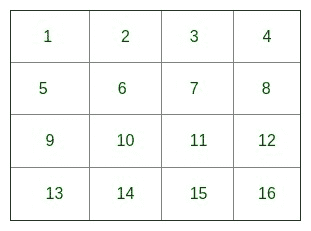
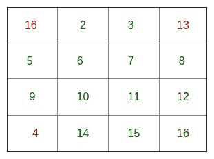

# 魔术广场| 偶数订单

> 原文： [https://www.geeksforgeeks.org/magic-square-even-order/](https://www.geeksforgeeks.org/magic-square-even-order/)

阶数为 n 的**幻方**是正方形中 n ^ 2 个数字（通常是不同的整数）的排列，以使所有行，所有列和两个对角线中的 n 个数字求和为相同的常数。 幻方包含从 1 到 n ^ 2 的整数。

每行，每一列和对角线中的常数之和称为魔术常数或魔术之和 M。正常魔术方阵的魔术常数仅取决于 n，并且具有以下值：
M = n（n ^ 2 + 1）/ 2。

**示例**：

```
Magic Square of order 3:
-----------------------
 2   7   6
 9   5   1
 4   3   8

Magic Square of order 4:
-----------------------
16 2 3 13 
5 11 10 8 
9  7 6 12 
4 14 15 1 

Magic Square of order 8:
-----------------------
64 63  3  4  5  6 58 57 
56 55 11 12 13 14 50 49 
17 18 46 45 44 43 23 24 
25 26 38 37 36 35 31 32 
33 34 30 29 28 27 39 40 
41 42 22 21 20 19 47 48 
16 15 51 52 53 54 10 9 
8  7  59 60 61 62 2  1 

```

**有点理论**：
魔术方块根据方块的顺序分为三大类。
1）[奇数阶幻方。](https://www.geeksforgeeks.org/magic-square/) 示例：3,5,7，…（2 * n +1）
2）双偶数阶幻方。 示例：4,8,12,16，..（4 * n）
3）单双阶幻方。 例子：6,10,14,18，..（4 * n +2）

## [推荐：在继续进行解决之前，请先在 ***<u>{IDE}</u>*** 上尝试您的方法。](https://ide.geeksforgeeks.org/)

**双偶幻方的算法**：

```
    define an 2-D array of order n*n
    // fill array with their index-counting 
    // starting from 1
    for ( i = 0; i<n; i++)
    {
        for ( j = 0; j<n; j++)
            // filling array with its count value 
            // starting from 1;
            arr[i][j] = (n*i) + j + 1;        
    }

    // change value of Array elements 
    // at fix location as per rule 
    // (n*n+1)-arr[i][j]
    // Top Left corner of Matrix 
   // (order (n/4)*(n/4))
    for ( i = 0; i<n/4; i++)
    {
        for ( j = 0; j<n/4; j++)
            arr[i][j] = (n*n + 1) - arr[i][j];
    }

    // Top Right corner of Matrix 
    // (order (n/4)*(n/4))
    for ( i = 0; i< n/4; i++)
    {
        for ( j = 3* (n/4); j<n; j++)
            arr[i][j] = (n*n + 1) - arr[i][j];
    }

    // Bottom Left corner of Matrix 
    // (order (n/4)*(n/4))
    for ( i = 3* n/4; i<n; i++)
    {
        for ( j = 0; j<n/4; j++)
            arr[i][j] = (n*n + 1) - arr[i][j];
    }

    // Bottom Right corner of Matrix 
   // (order (n/4)*(n/4))
    for ( i = 3* n/4; i<n; i++)
    {
        for ( j = 3* n/4; j<n; j++)
            arr[i][j] = (n*n + 1) - arr[i][j];
    }

    // Centre of Matrix (order (n/2)*(n/2))
    for ( i = n/4; i<3* n/4; i++)
    {
        for ( j = n/4; j<3* n/4; j++)
            arr[i][j] = (n*n + 1) - arr[i][j];
    } 

```

**举例说明：（第 4 阶）**

1）定义 4 * 4 阶数组，并将其计数值填充为：
[](https://media.geeksforgeeks.org/wp-content/uploads/array-5.jpg)

2）更改顺序（1 * 1）的左上角矩阵的值：
[](https://media.geeksforgeeks.org/wp-content/uploads/array1.jpg)

3）更改顺序（1 * 1）的右上角矩阵的值：
[](https://media.geeksforgeeks.org/wp-content/uploads/array2-1.jpg)

4）更改顺序（1 * 1）的左下角矩阵的值：
[](https://media.geeksforgeeks.org/wp-content/uploads/array3.jpg)

5）更改顺序（1 * 1）的右下角矩阵的值：
[](https://media.geeksforgeeks.org/wp-content/uploads/array4.jpg)

6）阶数（2 * 2）的中心矩阵的更改值：
[](https://media.geeksforgeeks.org/wp-content/uploads/array5.jpg)

**双偶幻方的实现**：

## C/C++ 

```

// C++ Program to print Magic square 
// of Doubly even order 
#include<iostream> 
using namespace std; 

// Function for calculating Magic square  
void doublyEven( int n ) 
{  
    int arr[n][n], i, j; 

    // filling matrix with its count value  
    // starting from 1; 
    for ( i = 0; i < n; i++) 
        for ( j = 0; j < n; j++) 
            arr[i][j] = (n*i) + j + 1; 

    // change value of Array elements 
    // at fix location as per rule  
    // (n*n+1)-arr[i][j] 
    // Top Left corner of Matrix  
    // (order (n/4)*(n/4)) 
    for ( i = 0; i < n/4; i++) 
        for ( j = 0; j < n/4; j++) 
            arr[i][j] = (n*n + 1) - arr[i][j]; 

    // Top Right corner of Matrix  
    // (order (n/4)*(n/4)) 
    for ( i = 0; i < n/4; i++) 
        for ( j = 3 * (n/4); j < n; j++) 
            arr[i][j] = (n*n + 1) - arr[i][j]; 

     // Bottom Left corner of Matrix 
    // (order (n/4)*(n/4)) 
    for ( i = 3 * n/4; i < n; i++) 
        for ( j = 0; j < n/4; j++) 
            arr[i][j] = (n*n+1) - arr[i][j]; 

    // Bottom Right corner of Matrix  
    // (order (n/4)*(n/4)) 
    for ( i = 3 * n/4; i < n; i++) 
        for ( j = 3 * n/4; j < n; j++) 
            arr[i][j] = (n*n + 1) - arr[i][j]; 

    // Centre of Matrix (order (n/2)*(n/2)) 
    for ( i = n/4; i < 3 * n/4; i++) 
        for ( j = n/4; j < 3 * n/4; j++) 
            arr[i][j] = (n*n + 1) - arr[i][j]; 

    // Printing the magic-square 
    for (i = 0; i < n; i++) 
    { 
        for ( j = 0; j < n; j++) 
            cout << arr[i][j] << " "; 
        cout << "\n"; 
    } 
} 

// driver program 
int main() 
{ 
    int n=8; 
    doublyEven(n); //Function call 
    return 0; 
}  

```