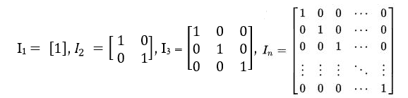

# 身份矩阵程序

> 原文： [https://www.geeksforgeeks.org/program-print-identity-matrix/](https://www.geeksforgeeks.org/program-print-identity-matrix/)

**身份矩阵简介：**

**单位矩阵**的字典定义是一个方矩阵，其中主对角线或主对角线的所有元素均为 1，其他所有元素均为零。 在下图中，每个矩阵都是一个 Identity Matrix。


在线性代数中，有时将其称为**单位矩阵**，它是一个方矩阵（大小= n x n），主对角线为 1，其他地方为零。 单位矩阵由“ **I** ”表示。 有时，U 或 E 也用于表示身份矩阵。
**单位矩阵的一个特性是，如果将其乘以单位矩阵，则矩阵将保持不变。**

**示例：**

```
Input  : 2
Output : 1 0
         0 1

Input :  4
Output : 1 0 0 0
         0 1 0 0
         0 0 1 0
         0 0 0 1
The explanation is simple. We need to make all
the elements of principal or main diagonal as 
1 and everything else as 0.

```

**打印身份矩阵的程序：**
逻辑很简单。 您需要在行等于矩阵列的那些位置打印 1，并将所有其他位置设为 0。

## C ++

```

// C++ program to print Identity Matrix 
#include<bits/stdc++.h> 
using namespace std; 

int Identity(int num) 
{ 
    int row, col; 

    for (row = 0; row < num; row++) 
    { 
        for (col = 0; col < num; col++) 
        { 
            // Checking if row is equal to column  
            if (row == col) 
                cout << 1 << " "; 
            else
                cout << 0 << " "; 
        }  
        cout << endl; 
    } 
    return 0; 
} 

// Driver Code 
int main() 
{ 
    int size = 5; 
    Identity(size); 
    return 0; 
} 

// This code is contributed by shubhamsingh10 

```