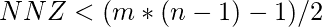

# 稀疏矩阵表示| 套装 3（CSR）

> 原文： [https://www.geeksforgeeks.org/sparse-matrix-representations-set-3-csr/](https://www.geeksforgeeks.org/sparse-matrix-representations-set-3-csr/)

如果矩阵中的大多数元素为零，则该矩阵称为稀疏矩阵。 将零元素存储在矩阵中非常浪费，因为它们不会影响我们的计算结果。 这就是为什么我们以比标准 2D 数组更有效的表示形式实现这些矩阵的原因。 使用更有效的表示，我们可以显着减少操作的空间和时间复杂性。

我们在以下文章中讨论了 4 种不同的表示形式：

1.  [稀疏矩阵表示| 设置 1](https://www.geeksforgeeks.org/sparse-matrix-representation/)
2.  [稀疏矩阵表示| 设置 2](https://www.geeksforgeeks.org/sparse-matrix-representations-using-list-lists-dictionary-keys/) 。

在本文中，我们将讨论稀疏矩阵的另一种表示形式，通常称为耶鲁格式。

[CSR（压缩稀疏行）或耶鲁格式](https://en.wikipedia.org/wiki/Sparse_matrix#Compressed_sparse_row_(CSR, _CRS_or_Yale_format))与稀疏矩阵的数组表示（在组 1 中讨论）相似。 我们用三个一维数组或称为 A，IA，JA 的向量表示矩阵 M（m * n）。 令 **NNZ** 表示 M 中非零元素的数量，并注意使用基于 0 的索引。

*   A 向量的大小为 NNZ，它存储矩阵的非零元素的值。 值以逐行遍历矩阵的顺序显示
*   大小为 m + 1 的 IA 向量存储直到（不包括）第 i 行的非零元素的累积数量。 它由递归关系定义：
    *   IA [0] = 0
    *   IA [i] = IA [i-1] +矩阵第（i-1）行中的非零元素个数
*   JA 向量将每个元素的列索引存储在 A 向量中。 因此，它的大小也为 NNZ。

要找到第 i 行中非零元素的数量，我们执行 IA [i + 1] – IA [i]。 请注意，此表示形式与基于数组的实现有何不同，在后者中，第二个矢量存储非零元素的行索引。

以下示例显示了如何表示这些矩阵。

例子：

```
Input : 0  0  0  0
        5  8  0  0
        0  0  3  0
        0  6  0  0

Solution: When the matrix is read row by 
          row, the A vector is [ 5 8 3 6]
          The JA vector stores column indices
          of elements in A hence, JA = [ 0 1 2 
           1]. IA[0] = 0\. IA[1] = IA[0] + no  
          of non-zero elements in row 0 
          i.e 0 + 0 = 0.
          Similarly,
          IA[2] = IA[1] + 2 = 2
          IA[3] = IA[2] + 1 = 3  
          IA[4] = IA[3]+1 = 4
          Therefore IA = [0 0 2 3 4]
          The trick is remember that IA[i]
          stores NNZ upto and not-including 
          i row.

Input : 10  20  0  0  0  0
         0  30  0  4  0  0
         0   0 50 60 70  0
         0   0  0  0  0 80

Output :  A = [10 20 30 4 50 60 70 80],
         IA = [0 2 4 7 8]
         JA = [0  1 1 3 2 3 4 5]

```

算法

```
SPARSIFY (MATRIX)
Step 1: Set M to number of rows in MATRIX
Step 2: Set N to number of columns in MATRIX
Step 3: I = 0, NNZ = 0\. Declare A, JA, and IA. 
        Set IA[0] to 0
Step 4: for I = 0 ... N-1
Step 5: for J = 0 ... N-1
Step 5: If MATRIX [I][J] is not zero
           Add MATRIX[I][J] to A
           Add J to JA
           NNZ = NNZ + 1
        [End of IF]
Step 6: [ End of J loop ]
        Add NNZ to IA
        [ End of I loop ]
Step 7: Print vectors A, IA, JA
Step 8: END

```

```

// CPP program to find sparse matrix rep- 
// resentation using CSR 
#include <algorithm> 
#include <iostream> 
#include <vector> 
using namespace std; 

typedef std::vector<int> vi; 

typedef vector<vector<int> > matrix; 

// Utility Function to print a Matrix 
void printMatrix(const matrix& M) 
{ 
    int m = M.size(); 
    int n = M[0].size(); 
    for (int i = 0; i < m; i++) { 
        for (int j = 0; j < n; j++)  
            cout << M[i][j] << " ";         
        cout << endl; 
    } 
} 

// Utility Function to print A, IA, JA vectors 
// with some decoration. 
void printVector(const vi& V, char* msg) 
{ 

    cout << msg << "[ "; 
    for_each(V.begin(), V.end(), [](int a) { 
        cout << a << " "; 
    }); 
    cout << "]" << endl; 
} 

// Generate the three vectors A, IA, JA  
void sparesify(const matrix& M) 
{ 
    int m = M.size(); 
    int n = M[0].size(), i, j; 
    vi A; 
    vi IA = { 0 }; // IA matrix has N+1 rows 
    vi JA; 
    int NNZ = 0; 

    for (i = 0; i < m; i++) { 
        for (j = 0; j < n; j++) { 
            if (M[i][j] != 0) { 
                A.push_back(M[i][j]); 
                JA.push_back(j); 

                // Count Number of Non Zero  
                // Elements in row i 
                NNZ++; 
            } 
        } 
        IA.push_back(NNZ); 
    } 

    printMatrix(M); 
    printVector(A, (char*)"A = "); 
    printVector(IA, (char*)"IA = "); 
    printVector(JA, (char*)"JA = "); 
} 

// Driver code 
int main() 
{ 
    matrix M = { 
        { 0, 0, 0, 0, 1 }, 
        { 5, 8, 0, 0, 0 }, 
        { 0, 0, 3, 0, 0 }, 
        { 0, 6, 0, 0, 1 }, 
    }; 

    sparesify(M); 

    return 0; 
} 

```

输出：

```
0 0 0 0 1 
5 8 0 0 0 
0 0 3 0 0 
0 6 0 0 1 
A = [ 1 5 8 3 6 1 ]
IA = [ 0 1 3 4 6 ]
JA = [ 4 0 1 2 1 4 ]

```

**注释**

*   矩阵的稀疏度=（元素总数–非零元素数）/（元素总数）或（1 – NNZ / mn）或（1 – size（A）/ mn）。
*   基于直接数组的表示形式需要内存 3 * NNZ，而 CSR 需要（2 * NNZ + m + 1）内存。
*   只要，CSR 矩阵就可以提高存储效率。
*   与 CSR 相似，退出 CSC 代表压缩稀疏列。 它是 CSR 的列类似物。
*   “新”耶鲁格式进一步将 A 和 JA 向量压缩为 1 个向量。

**参考**
[https://zh.wikipedia.org/wiki/Sparse_matrix](https://en.wikipedia.org/wiki/Sparse_matrix)

现在不要停下来，将您的学习提高到一个新的水平。 借助最受信任的课程，学习数据结构和算法的所有重要概念： [DSA Self Paced](https://practice.geeksforgeeks.org/courses/dsa-self-paced?utm_source=geeksforgeeks&utm_medium=article&utm_campaign=gfg_article_dsa_content_bottom) 。 以对学生友好的价格准备好行业。

* * *

* * *

如果您喜欢 GeeksforGeeks 并希望做出贡献，则还可以使用 [tribution.geeksforgeeks.org](https://contribute.geeksforgeeks.org/) 撰写文章，或将您的文章邮寄至 tribution@geeksforgeeks.org。 查看您的文章出现在 GeeksforGeeks 主页上，并帮助其他 Geeks。

如果您发现任何不正确的地方，请单击下面的“改进文章”按钮，以改进本文。