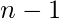

# 填充矩阵以使所有行和所有列的乘积等于 1 的方式

> 原文： [https://www.geeksforgeeks.org/ways-filling-matrix-product-rows-columns-equal-unity/](https://www.geeksforgeeks.org/ways-filling-matrix-product-rows-columns-equal-unity/)

我们给定三个值，和，其中是矩阵中的行数，是矩阵中的列数，是只能有两个值的数 -1 和 1.我们的目标是找到填充矩阵的方法，以使每一行和每一列中所有元素的乘积等于。 由于方法的数量可能很大，因此我们将输出
**示例**：

```
Input : n = 2, m = 4, k = -1
Output : 8
Following configurations satisfy the conditions:-

Input  : n = 2, m = 1, k = -1
Output : The number of filling the matrix
         are 0

```

## [推荐：在继续进行解决之前，请先在 ***<u>{IDE}</u>*** 上尝试您的方法。](https://ide.geeksforgeeks.org/)

从以上条件可以看出，矩阵中唯一可以输入的元素是 1 和-1。 现在我们可以轻松推断出一些极端情况

***   如果 k = -1，则行和列的总数之和不能为奇数，因为-1 在每一行和每一列中的出现次数为奇数
    ，因此，如果总和为奇数，则答案为。*   如果 n = 1 或 m = 1，则只有一种填充矩阵的方式，因此答案为 1。*   如果以上情况均不适用，则我们在第一行和第一列中填充 1 和-1。 然后，由于已经知道每一行每一列的乘积，因此可以唯一地标识其余数字，因此答案为。**

## [Recommended: Please try your approach on ***<u>{IDE}</u>*** first, before moving on to the solution.](https://ide.geeksforgeeks.org/)

## C++ 

```

// CPP program to find number of ways to fill 
// a matrix under given constraints 
#include <bits/stdc++.h> 
using namespace std; 

#define mod 100000007 

/* Returns a raised power t under modulo mod */
long long modPower(long long a, long long t) 
{ 
    long long now = a, ret = 1; 

    // Counting number of ways of filling the matrix 
    while (t) { 
        if (t & 1) 
            ret = now * (ret % mod); 
        now = now * (now % mod); 
        t >>= 1; 
    } 
    return ret; 
} 

// Function calculating the answer 
long countWays(int n, int m, int k) 
{ 
    // if sum of numbers of rows and columns is odd 
    // i.e (n + m) % 2 == 1 and k = -1 then there 
    // are 0 ways of filiing the matrix. 
    if (k == -1 && (n + m) % 2 == 1) 
        return 0; 

    // If there is one row or one column then there 
    // is only one way of filling the matrix 
    if (n == 1 || m == 1) 
        return 1; 

    // If the above cases are not followed then we 
    // find ways to fill the n - 1 rows and m - 1 
    // columns which is 2 ^ ((m-1)*(n-1)). 
    return (modPower(modPower((long long)2, n - 1), 
                                    m - 1) % mod); 
} 

// Driver function for the program 
int main() 
{ 
    int n = 2, m = 7, k = 1; 
    cout << countWays(n, m, k); 
    return 0; 
} 

```

输出：

```
64

```

## 爪哇

```

// Java program to find number of ways to fill 
// a matrix under given constraints 
import java.io.*; 

class Example { 

    final static long mod = 100000007; 

    /* Returns a raised power t under modulo mod */
    static long modPower(long a, long t, long mod) 
    { 
        long now = a, ret = 1; 

        // Counting number of ways of filling the 
        // matrix 
        while (t > 0) { 
            if (t % 2 == 1) 
                ret = now * (ret % mod); 
            now = now * (now % mod); 
            t >>= 1; 
        } 
        return ret; 
    } 

    // Function calculating the answer 
    static long countWays(int n, int m, int k) 
    { 
        // if sum of numbers of rows and columns is 
        // odd i.e (n + m) % 2 == 1 and k = -1, 
        // then there are 0 ways of filiing the matrix. 
        if (n == 1 || m == 1) 
            return 1; 

        // If there is one row or one column then 
        // there is only one way of filling the matrix 
        else if ((n + m) % 2 == 1 && k == -1) 
            return 0; 

       // If the above cases are not followed then we 
       // find ways to fill the n - 1 rows and m - 1 
       // columns which is 2 ^ ((m-1)*(n-1)). 
        return (modPower(modPower((long)2, n - 1, mod), 
                                    m - 1, mod) % mod); 
    } 

    // Driver function for the program 
    public static void main(String args[]) throws IOException 
    { 
        int n = 2, m = 7, k = 1; 
        System.out.println(countWays(n, m, k)); 
    } 
} 

```

## Python 3

```

# Python program to find number of ways to  
# fill a matrix under given constraints 

# Returns a raised power t under modulo mod  
def modPower(a, t): 

    now = a; 
    ret = 1; 
    mod = 100000007; 

    # Counting number of ways of filling 
    # the matrix 
    while (t):  
        if (t & 1): 
            ret = now * (ret % mod); 
        now = now * (now % mod); 
        t >>= 1; 

    return ret; 

# Function calculating the answer 
def countWays(n, m, k): 

    mod= 100000007; 

    # if sum of numbers of rows and columns  
    # is odd i.e (n + m) % 2 == 1 and k = -1  
    # then there are 0 ways of filiing the matrix. 
    if (k == -1 and ((n + m) % 2 == 1)): 
        return 0; 

    # If there is one row or one column then  
    # there is only one way of filling the matrix 
    if (n == 1 or m == 1): 
        return 1; 

    # If the above cases are not followed then we 
    # find ways to fill the n - 1 rows and m - 1 
    # columns which is 2 ^ ((m-1)*(n-1)). 
    return (modPower(modPower(2, n - 1),  
                              m - 1) % mod); 

# Driver Code 
n = 2; 
m = 7; 
k = 1; 
print(countWays(n, m, k)); 

# This code is contributed  
# by Shivi_Aggarwal 

```

## C# 

```

// C# program to find number of ways to fill 
// a matrix under given constraints 
using System; 

class Example 
{ 

    static long mod = 100000007; 

    // Returns a raised power t  
    // under modulo mod  
    static long modPower(long a, long t, 
                         long mod) 
    { 
        long now = a, ret = 1; 

        // Counting number of ways  
        // of filling the 
        // matrix 
        while (t > 0) 
        { 
            if (t % 2 == 1) 
                ret = now * (ret % mod); 
            now = now * (now % mod); 
            t >>= 1; 
        } 
        return ret; 
    } 

    // Function calculating the answer 
    static long countWays(int n, int m, 
                          int k) 
    { 
        // if sum of numbers of rows  
        // and columns is odd i.e 
        // (n + m) % 2 == 1 and  
        // k = -1, then there are 0  
        // ways of filiing the matrix. 
        if (n == 1 || m == 1) 
            return 1; 

        // If there is one row or one 
        // column then there is only  
        // one way of filling the matrix 
        else if ((n + m) % 2 == 1 && k == -1) 
            return 0; 

        // If the above cases are not  
        // followed then we find ways 
        // to fill the n - 1 rows and 
        // m - 1 columns which is 
        // 2 ^ ((m-1)*(n-1)). 
        return (modPower(modPower((long)2, n - 1,  
                         mod), m - 1, mod) % mod); 

    } 

    // Driver Code 
    public static void Main()  
    { 
        int n = 2, m = 7, k = 1; 
        Console.WriteLine(countWays(n, m, k)); 
    } 
} 

// This code is contributed by vt_m. 

```

## PHP

```

<?php 
// PHP program to find number 
// of ways to fill a matrix under 
// given constraints 

$mod = 100000007; 

// Returns a raised power t  
// under modulo mod 
function modPower($a, $t) 
{ 
    global $mod; 
    $now = $a; $ret = 1; 

    // Counting number of ways  
    // of filling the matrix 
    while ($t)  
    { 
        if ($t & 1) 
            $ret = $now * ($ret % $mod); 
        $now = $now * ($now % $mod); 
        $t >>= 1; 
    } 
    return $ret; 
} 

// Function calculating the answer 
function countWays($n, $m, $k) 
{ 
    global $mod; 

    // if sum of numbers of rows 
    // and columns is odd i.e  
    // (n + m) % 2 == 1 and k = -1  
    // then there are 0 ways of  
    // filiing the matrix. 
    if ($k == -1 and ($n + $m) % 2 == 1) 
        return 0; 

    // If there is one row or 
    // one column then there 
    // is only one way of  
    // filling the matrix 
    if ($n == 1 or $m == 1) 
        return 1; 

    // If the above cases are 
    // not followed then we 
    // find ways to fill the  
    // n - 1 rows and m - 1 
    // columns which is  
    // 2 ^ ((m-1)*(n-1)). 
    return (modPower(modPower(2, $n - 1), 
                         $m - 1) % $mod); 
} 

    // Driver Code 
    $n = 2;  
    $m = 7;  
    $k = 1; 
    echo countWays($n, $m, $k); 

// This code is contributed by anuj_67\. 
?> 

```

**Output:**

```
64

```

上述解决方案的时间复杂度为。

现在不要停下来，将您的学习提高到一个新的水平。 借助最受信任的课程，学习数据结构和算法的所有重要概念： [DSA Self Paced](https://practice.geeksforgeeks.org/courses/dsa-self-paced?utm_source=geeksforgeeks&utm_medium=article&utm_campaign=gfg_article_dsa_content_bottom) 。 以对学生友好的价格准备好行业。

* * *

* * *

如果您喜欢 GeeksforGeeks 并希望做出贡献，则还可以使用 [tribution.geeksforgeeks.org](https://contribute.geeksforgeeks.org/) 撰写文章，或将您的文章邮寄至 tribution@geeksforgeeks.org。 查看您的文章出现在 GeeksforGeeks 主页上，并帮助其他 Geeks。

如果您发现任何不正确的地方，请单击下面的“改进文章”按钮，以改进本文。