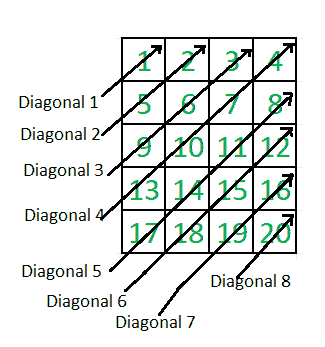

# 矩阵的锯齿形（或对角线）遍历

> 原文： [https://www.geeksforgeeks.org/zigzag-or-diagonal-traversal-of-matrix/](https://www.geeksforgeeks.org/zigzag-or-diagonal-traversal-of-matrix/)

给定 2D 矩阵，以对角线顺序打印给定矩阵的所有元素。 例如，考虑以下 5 X 4 输入矩阵。

```
    1     2     3     4
    5     6     7     8
    9    10    11    12
   13    14    15    16
   17    18    19    20
```

上述矩阵的对角线打印是

```
    1
    5     2
    9     6     3
   13    10     7     4
   17    14    11     8
   18    15    12
   19    16
   20
```

另一个示例：
 [](https://practice.geeksforgeeks.org/problem-page.php?pid=124)

## 强烈建议您在继续解决方案之前，单击此处进行练习。

以下是对角线打印的代码。

给定矩阵“ matrix [ROW] [COL]”的对角打印输出中始终带有“ ROW + COL – 1”行。

## C++ 

```

#include <stdio.h> 
#include <stdlib.h> 

#define ROW 5 
#define COL 4 

// A utility function to find min of two integers 
int minu(int a, int b) 
{ return (a < b)? a: b; } 

// A utility function to find min of three integers 
int min(int a, int b, int c) 
{ return minu(minu(a, b), c);} 

// A utility function to find max of two integers 
int max(int a, int b) 
{ return (a > b)? a: b; } 

// The main function that prints given matrix in diagonal order 
void diagonalOrder(int matrix[][COL]) 
{ 
    // There will be ROW+COL-1 lines in the output 
    for (int line=1; line<=(ROW + COL -1); line++) 
    { 
        /* Get column index of the first element in this line of output. 
           The index is 0 for first ROW lines and line - ROW for remaining 
           lines  */
        int start_col =  max(0, line-ROW); 

        /* Get count of elements in this line. The count of elements is 
           equal to minimum of line number, COL-start_col and ROW */
         int count = min(line, (COL-start_col), ROW); 

        /* Print elements of this line */
        for (int j=0; j<count; j++) 
            printf("%5d ", matrix[minu(ROW, line)-j-1][start_col+j]); 

        /* Ptint elements of next diagonal on next line */
        printf("\n"); 
    } 
} 

// Utility function to print a matrix 
void printMatrix(int matrix[ROW][COL]) 
{ 
    for (int i=0; i< ROW; i++) 
    { 
        for (int j=0; j<COL; j++) 
            printf("%5d ", matrix[i][j]); 
        printf("\n"); 
    } 
} 

// Driver program to test above functions 
int main() 
{ 
    int M[ROW][COL] = {{1, 2, 3, 4}, 
                       {5, 6, 7, 8}, 
                       {9, 10, 11, 12}, 
                       {13, 14, 15, 16}, 
                       {17, 18, 19, 20}, 
                      }; 
    printf ("Given matrix is \n"); 
    printMatrix(M); 

    printf ("\nDiagonal printing of matrix is \n"); 
    diagonalOrder(M); 
    return 0; 
} 

```