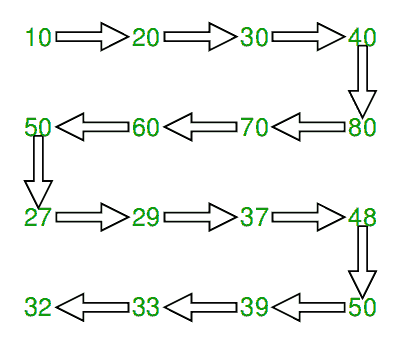

# 以蛇形图案打印矩阵

> 原文： [https://www.geeksforgeeks.org/print-matrix-snake-pattern/](https://www.geeksforgeeks.org/print-matrix-snake-pattern/)

给定一个 n x n 矩阵。在给定的矩阵中，您必须以蛇形图案打印矩阵的元素。

**示例**：

```
Input :mat[][] = { {10, 20, 30, 40},
                   {15, 25, 35, 45},
                   {27, 29, 37, 48},
                   {32, 33, 39, 50}};

Output : 10 20 30 40 45 35 25 15 27 29
         37 48 50 39 33 32 

Input :mat[][] = { {1, 2, 3},
                   {4, 5, 6},
                   {7, 8, 9}};
Output : 1 2 3 6 5 4 7 8 9

```



> [推荐：请先在“ ***实践*** ”上解决它，然后再继续解决。](https://practice.geeksforgeeks.org/problems/print-matrix-in-snake-pattern/0)

我们遍历所有行。 对于每一行，我们检查它是偶数还是奇数。 如果是偶数，我们从左到右打印，否则从右到左打印。

## C++ 

```

// C++ program to print matrix in snake order 
#include <iostream> 
#define M 4 
#define N 4 
using namespace std; 

void print(int mat[M][N]) 
{ 
    // Traverse through all rows 
    for (int i = 0; i < M; i++) { 

        // If current row is even, print from 
        // left to right 
        if (i % 2 == 0) { 
            for (int j = 0; j < N; j++) 
                cout << mat[i][j] << " "; 

        // If current row is odd, print from 
        // right to left 
        } else { 
            for (int j = N - 1; j >= 0; j--) 
                cout << mat[i][j] << " "; 
        } 
    } 
} 

// Driver code 
int main() 
{ 
    int mat[][] = { { 10, 20, 30, 40 }, 
                    { 15, 25, 35, 45 }, 
                    { 27, 29, 37, 48 }, 
                    { 32, 33, 39, 50 } }; 

    print(mat); 
    return 0; 
} 

```

## Java

```

// Java program to print matrix in snake order 
import java.util.*; 
class GFG 
{ 
    static void print(int [][] mat) 
    { 
        // Traverse through all rows 
        for (int i = 0; i < mat.length; i++) 
        { 

            // If current row is even, print from 
            // left to right 
            if (i % 2 == 0) 
            { 
                for (int j = 0; j < mat[0].length; j++) 
                    System.out.print(mat[i][j] +" "); 

            // If current row is odd, print from 
            // right to left 
            } 
            else
            { 
                for (int j = mat[0].length - 1; j >= 0; j--) 
                    System.out.print(mat[i][j] +" "); 
            } 
        } 
    } 

    // Driver code 
    public static void main(String[] args) 
    { 
        int mat[][] = new int[][] 
        { 
            { 10, 20, 30, 40 }, 
            { 15, 25, 35, 45 }, 
            { 27, 29, 37, 48 }, 
            { 32, 33, 39, 50 } 
        }; 

        print(mat); 
    } 
} 
/* This code is contributed by Mr. Somesh Awasthi */

```

## Python 3

```

# Python 3 program to print 
# matrix in snake order 
M = 4
N = 4

def printf(mat): 
    global M, N 

    # Traverse through all rows 
    for i in range(M): 

        # If current row is 
        # even, print from 
        # left to right 
        if i % 2 == 0: 
            for j in range(N): 
                print(str(mat[i][j]), 
                          end = " ") 

        # If current row is  
        # odd, print from 
        # right to left 
        else: 
            for j in range(N - 1, -1, -1): 
                print(str(mat[i][j]),  
                          end = " ") 

# Driver code 
mat = [[ 10, 20, 30, 40 ], 
       [ 15, 25, 35, 45 ], 
       [ 27, 29, 37, 48 ], 
       [ 32, 33, 39, 50 ]] 

printf(mat) 

# This code is contributed 
# by ChitraNayal 

```

## C# 

```

// C# program to print  
// matrix in snake order 
using System; 
class GFG 
{ 
    static void print(int [,]mat) 
    { 
        // Traverse through all rows 
        for (int i = 0;  
                 i < mat.GetLength(0); i++) 
        { 

            // If current row is  
            // even, print from  
            // left to right 
            if (i % 2 == 0) 
            { 
                for (int j = 0;  
                         j < mat.GetLength(1); j++) 
                    Console.Write(mat[i, j] + " "); 

            // If current row is  
            // odd, print from  
            // right to left 
            } 
            else
            { 
                for (int j = mat.GetLength(1) - 1;  
                         j >= 0; j--) 
                    Console.Write(mat[i, j] + " "); 
            } 
        } 
    } 

    // Driver code 
    public static void Main() 
    { 
        int [,]mat = {{ 10, 20, 30, 40 }, 
                      { 15, 25, 35, 45 }, 
                      { 27, 29, 37, 48 }, 
                      { 32, 33, 39, 50 }}; 

        print(mat); 
    } 
} 

// This code is contributed 
// by ChitraNayal 

```

## PHP

```

<?php 
// PHP program to print  
// matrix in snake order 
$M= 4; 
$N =4; 

function printLN($mat) 
{ 
    global $M; 
    global $N; 

    // Traverse through all rows 
    for ($i = 0; $i < $M; $i++)  
    { 

        // If current row is even,  
        // print from left to right 
        if ($i % 2 == 0)  
        { 
            for ($j = 0; $j < $N; $j++) 
                echo $mat[$i][$j], " "; 

        // If current row is odd,  
        // print from right to left 
        }  
        else 
        { 
            for ($j = $N - 1; $j >= 0; $j--) 
                echo $mat[$i][$j] , " "; 
        } 
    } 
} 

// Driver code 
$mat = array(array(10, 20, 30, 40), 
             array(15, 25, 35, 45), 
             array(27, 29, 37, 48), 
             array(32, 33, 39, 50)); 

printLN($mat); 

// This code is contributed by ajit  
?> 

```

**Output :**

```
10 20 30 40 45 35 25 15 27 29 37 48 50 39 33 32 

```

本文由 **Rakesh Kumar** 提供。 如果您喜欢 GeeksforGeeks 并希望做出贡献，则也可以使用 [tribution.geeksforgeeks.org](http://www.contribute.geeksforgeeks.org) 撰写文章，或将您的文章邮寄至 tribution@geeksforgeeks.org。 查看您的文章出现在 GeeksforGeeks 主页上，并帮助其他 Geeks。

如果发现任何不正确的地方，或者想分享有关上述主题的更多信息，请写评论。

