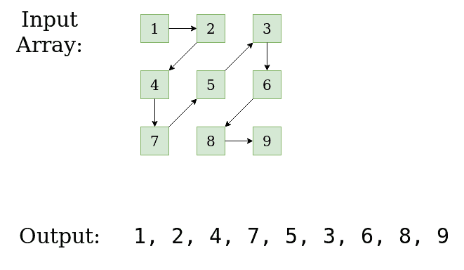

# 以对角线图案打印矩阵

> 原文： [https://www.geeksforgeeks.org/print-matrix-diagonal-pattern/](https://www.geeksforgeeks.org/print-matrix-diagonal-pattern/)

给定 n * n 大小的矩阵，任务是以对角线图案打印其元素。


```
Input : mat[3][3] = {{1, 2, 3},
                     {4, 5, 6},
                     {7, 8, 9}}
Output : 1 2 4 7 5 3 6 8 9.
Explanation: Start from 1 
Then from upward to downward diagonally i.e. 2 and 4
Then from downward to upward diagonally i.e 7, 5, 3 
Then from up to down diagonally i.e  6, 8 
Then down to up i.e. end at 9.

Input :  mat[4][4] =  {{1,  2,  3,  10},
                      {4,  5,  6,  11},
                      {7,  8,  9,  12},
                      {13, 14, 15, 16}}
Output:  1 2 4 7 5 3 10 6 8 13 14 9 11 12 15 16 .
Explanation: Start from 1 
Then from upward to downward diagonally i.e. 2 and 4
Then from downward to upward diagonally i.e 7, 5, 3 
Then from upward to downward diagonally i.e. 10 6 8 13
Then from downward to upward diagonally i.e 14 9 11
Then from upward to downward diagonally i.e. 12 15
then end at 16

```

> [推荐：请先在“ ***实践*** ”上解决它，然后再继续解决。](https://practice.geeksforgeeks.org/problems/print-matrix-in-diagonal-pattern/1)

**方法**：从图中可以看出，每个元素要么斜向上打印，要么斜向下打印。 从索引（0,0）开始，对角向上打印元素，然后更改方向，改变列，对角向下打印。 该循环一直持续到到达最后一个元素为止。

**算法**：

1.  创建变量 *i = 0，j = 0* 以存储行和列的当前索引
2.  运行从 0 到 n * n 的循环，其中 n 是矩阵的边。
3.  使用标志 **isUp** 来确定方向是向上还是向下。 最初将 *isUp = true* 设置为向上方向。
4.  如果 isUp = 1，则通过增加列索引和减少行索引来开始打印元素。
5.  同样，如果 isUp = 0，则减少列索引并增加行索引。
6.  移至下一个列或行（下一个开始的行和列）
7.  这样做直到遍历所有元素。

**实现**：

## C++ 

```cpp

// C++ program to print matrix in diagonal order 
#include <bits/stdc++.h> 
using namespace std; 
const int MAX = 100; 

void printMatrixDiagonal(int mat[MAX][MAX], int n) 
{ 
    // Initialize indexes of element to be printed next 
    int i = 0, j = 0; 

    // Direction is initially from down to up 
    bool isUp = true; 

    // Traverse the matrix till all elements get traversed 
    for (int k = 0; k < n * n;) { 
        // If isUp = true then traverse from downward 
        // to upward 
        if (isUp) { 
            for (; i >= 0 && j < n; j++, i--) { 
                cout << mat[i][j] << " "; 
                k++; 
            } 

            // Set i and j according to direction 
            if (i < 0 && j <= n - 1) 
                i = 0; 
            if (j == n) 
                i = i + 2, j--; 
        } 

        // If isUp = 0 then traverse up to down 
        else { 
            for (; j >= 0 && i < n; i++, j--) { 
                cout << mat[i][j] << " "; 
                k++; 
            } 

            // Set i and j according to direction 
            if (j < 0 && i <= n - 1) 
                j = 0; 
            if (i == n) 
                j = j + 2, i--; 
        } 

        // Revert the isUp to change the direction 
        isUp = !isUp; 
    } 
} 

int main() 
{ 
    int mat[MAX][MAX] = { { 1, 2, 3 }, 
                          { 4, 5, 6 }, 
                          { 7, 8, 9 } }; 

    int n = 3; 
    printMatrixDiagonal(mat, n); 
    return 0; 
} 

```