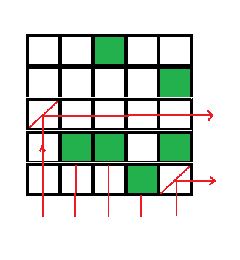

# 可以从下到右传输光线的最大反射镜

> 原文： [https://www.geeksforgeeks.org/maximum-mirrors-can-transfer-light-bottom-right/](https://www.geeksforgeeks.org/maximum-mirrors-can-transfer-light-bottom-right/)

给出一个方阵，其中每个像元代表一个空白或一个障碍。 我们可以将镜子放置在空白位置。 所有反光镜都将以 45 度角放置，即，如果路径中没有障碍物，它们可以将光从底部传输到右侧。
在这个问题中，我们需要计算在正方形矩阵中可以放置多少个这样的反射镜，这些反射镜可以将光从底部传递到右侧。
示例：

```
 
Output for above example is 2.

In above diagram, mirror at (3, 1) and (5, 5) are able
to send light from bottom to right so total possible 
mirror count is 2.

```


我们可以通过检查此类反射镜在矩阵中的位置来解决此问题，可以从下向右传输光的反射镜在其路径中将没有任何障碍，即，如果反射镜位于索引`(i, j)`处，则对于所有`k`，`i < k <= N`，在索引`(k, j)`处将不存在障碍。对于所有`k`，`j < k <= N`，在索引`(i, k)`中将不存在障碍。
记住上面的两个方程，我们可以在给定矩阵的一次迭代中在每一行找到最右边的障碍物，而在给定矩阵的另一次迭代中在每一列中找到最下面的障碍物。 将这些索引存储在单独的数组中之后，我们可以检查每个索引是否满足障碍条件，然后相应地增加计数。
以下是基于上述概念的解决方案，需要`O(N ^ 2)`时间和`O(n)`额外空间。

## C++ 

```cpp

// C++ program to find how many mirror can transfer 
// light from bottom to right 
#include <bits/stdc++.h> 
using namespace std; 

// method returns number of mirror which can transfer 
// light from bottom to right 
int maximumMirrorInMatrix(string mat[], int N) 
{ 
    // To store first obstacles horizontaly (from right) 
    // and vertically (from bottom) 
    int horizontal[N], vertical[N]; 

    // initialize both array as -1, signifying no obstacle 
    memset(horizontal, -1, sizeof(horizontal)); 
    memset(vertical, -1, sizeof(vertical)); 

    // looping matrix to mark column for obstacles 
    for (int i=0; i<N; i++) 
    { 
        for (int j=N-1; j>=0; j--) 
        { 
            if (mat[i][j] == 'B') 
                continue; 

            // mark rightmost column with obstacle 
            horizontal[i] = j; 
            break; 
        } 
    } 

    // looping matrix to mark rows for obstacles 
    for (int j=0; j<N; j++) 
    { 
        for (int i=N-1; i>=0; i--) 
        { 
            if (mat[i][j] == 'B') 
                continue; 

            // mark leftmost row with obstacle 
            vertical[j] = i; 
            break; 
        } 
    } 

    int res = 0; // Initialize result 

    // if there is not obstacle on right or below, 
    // then mirror can be placed to transfer light 
    for (int i = 0; i < N; i++) 
    { 
        for (int j = 0; j < N; j++) 
        { 
            /* if i > vertical[j] then light can from bottom 
               if j > horizontal[i] then light can go to right */
            if (i > vertical[j] && j > horizontal[i]) 
            { 
                /* uncomment this code to print actual mirror 
                   position also 
                cout << i << " " << j << endl; */
                res++; 
            } 
        } 
    } 

    return res; 
} 

//  Driver code to test above method 
int main() 
{ 
    int N = 5; 

    //  B - Blank     O - Obstacle 
    string mat[N] = {"BBOBB", 
                     "BBBBO", 
                     "BBBBB", 
                     "BOOBO", 
                     "BBBOB"
                    }; 

    cout << maximumMirrorInMatrix(mat, N) << endl; 

    return 0; 
} 

```