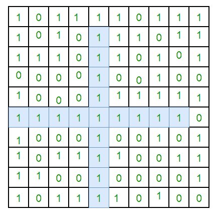

# 在二进制矩阵中查找所有位形成的最大“ +”的大小

> 原文： [https://www.geeksforgeeks.org/find-size-of-the-largest-formed-by-all-ones-in-a-binary-matrix/](https://www.geeksforgeeks.org/find-size-of-the-largest-formed-by-all-ones-in-a-binary-matrix/)

给定一个 N X N 的二进制矩阵，找出所有 1 组成的最大“ +”的大小。

**示例：**


对于上述矩阵，最大的“ +”将由尺寸 17 的突出显示部分形成。

## [推荐：在继续进行解决之前，请先在 ***<u>{IDE}</u>*** 上尝试您的方法。](https://ide.geeksforgeeks.org/)

这个想法是维持四个辅助矩阵 left [] []，right [] []，top [] []，bottom [] []，以在每个方向上存储连续的 1。 对于输入矩阵中的每个单元格（i，j），我们将以下信息存储在这四个矩阵中–

```
left(i, j) stores maximum number of
consecutive 1's to the left of cell (i, j) 
including cell (i, j).

right(i, j) stores maximum number of
consecutive 1's to the right of cell (i, j) 
including cell (i, j).

top(i, j) stores maximum number of
consecutive 1's at top of cell (i, j) 
including cell (i, j).

bottom(i, j) stores maximum number of
consecutive 1's at bottom of cell (i, j) 
including cell (i, j).

```

在为上述矩阵的每个像元计算值之后，最大的+将由具有最大值的输入矩阵像元形成，并考虑（left（i，j），right（i，j），top（i，j）中的最小值 ），bottom（i，j））

我们可以使用动态规划来计算每个方向上连续 1 的总数。

```
if mat(i, j) == 1
    left(i, j) = left(i, j - 1) + 1
else left(i, j) = 0

if mat(i, j) == 1
    top(i, j) = top(i - 1, j) + 1;
else
    top(i, j) = 0;

if mat(i, j) == 1
    bottom(i, j) = bottom(i + 1, j) + 1;
else
    bottom(i, j) = 0;    

if mat(i, j) == 1
    right(i, j) = right(i, j + 1) + 1;
else
    right(i, j) = 0;

```

以下是上述想法的实现–

## C ++

```

// C++ program to find the size of the largest '+' 
// formed by all 1's in given binary matrix 
#include <bits/stdc++.h> 
using namespace std; 

// size of binary square matrix 
#define N 10 

// Function to find the size of the largest '+' 
// formed by all 1's in given binary matrix 
int findLargestPlus(int mat[N][N]) 
{ 
    // left[j][j], right[i][j], top[i][j] and 
    // bottom[i][j] store maximum number of 
    // consecutive 1's present to the left, 
    // right, top and bottom of mat[i][j] including 
    // cell(i, j) respectively 
    int left[N][N], right[N][N], top[N][N], 
        bottom[N][N]; 

    // initialize above four matrix 
    for (int i = 0; i < N; i++) 
    { 
        // initialize first row of top 
        top[0][i] = mat[0][i]; 

        // initialize last row of bottom 
        bottom[N - 1][i] = mat[N - 1][i]; 

        // initialize first column of left 
        left[i][0] = mat[i][0]; 

        // initialize last column of right 
        right[i][N - 1] = mat[i][N - 1]; 
    } 

    // fill all cells of above four matrix 
    for (int i = 0; i < N; i++) 
    { 
        for (int j = 1; j < N; j++) 
        { 
            // calculate left matrix (filled left to right) 
            if (mat[i][j] == 1) 
                left[i][j] = left[i][j - 1] + 1; 
            else
                left[i][j] = 0; 

            // calculate top matrix 
            if (mat[j][i] == 1) 
                top[j][i] = top[j - 1][i] + 1; 
            else
                top[j][i] = 0; 

            // calculate new value of j to calculate 
            // value of bottom(i, j) and right(i, j) 
            j = N - 1 - j; 

            // calculate bottom matrix 
            if (mat[j][i] == 1) 
                bottom[j][i] = bottom[j + 1][i] + 1; 
            else
                bottom[j][i] = 0; 

            // calculate right matrix 
            if (mat[i][j] == 1) 
                right[i][j] = right[i][j + 1] + 1; 
            else
                right[i][j] = 0; 

            // revert back to old j 
            j = N - 1 - j; 
        } 
    } 

    // n stores length of longest + found so far 
    int n = 0; 

    // compute longest + 
    for (int i = 0; i < N; i++) 
    { 
        for (int j = 0; j < N; j++) 
        { 
            // find minimum of left(i, j), right(i, j), 
            // top(i, j), bottom(i, j) 
            int len = min(min(top[i][j], bottom[i][j]), 
                          min(left[i][j], right[i][j])); 

            // largest + would be formed by a cell that 
            // has maximum value 
            if(len > n) 
                n = len; 
        } 
    } 

    // 4 directions of length n - 1 and 1 for middle cell 
    if (n) 
       return 4 * (n - 1) + 1; 

    // matrix contains all 0's 
    return 0; 
} 

/* Driver function to test above functions */
int main() 
{ 
    // Binary Matrix of size N 
    int mat[N][N] = 
    { 
        { 1, 0, 1, 1, 1, 1, 0, 1, 1, 1 }, 
        { 1, 0, 1, 0, 1, 1, 1, 0, 1, 1 }, 
        { 1, 1, 1, 0, 1, 1, 0, 1, 0, 1 }, 
        { 0, 0, 0, 0, 1, 0, 0, 1, 0, 0 }, 
        { 1, 1, 1, 0, 1, 1, 1, 1, 1, 1 }, 
        { 1, 1, 1, 1, 1, 1, 1, 1, 1, 0 }, 
        { 1, 0, 0, 0, 1, 0, 0, 1, 0, 1 }, 
        { 1, 0, 1, 1, 1, 1, 0, 0, 1, 1 }, 
        { 1, 1, 0, 0, 1, 0, 1, 0, 0, 1 }, 
        { 1, 0, 1, 1, 1, 1, 0, 1, 0, 0 } 
    }; 

    cout << findLargestPlus(mat); 

    return 0; 
} 

```

## 爪哇

```

// Java program to find the size of the largest '+' 
// formed by all 1's in given binary matrix 

import java.io.*; 

class GFG { 

    // size of binary square matrix 
    static int N = 10; 

    // Function to find the size of the largest '+' 
    // formed by all 1's in given binary matrix 
    static int findLargestPlus(int mat[][]) 
    { 

        // left[j][j], right[i][j], top[i][j] and 
        // bottom[i][j] store maximum number of 
        // consecutive 1's present to the left, 
        // right, top and bottom of mat[i][j]  
        // including cell(i, j) respectively 
        int left[][] = new int[N][N]; 
        int right[][] = new int[N][N]; 
        int top[][] = new int[N][N]; 
        int bottom[][] = new int[N][N]; 

        // initialize above four matrix 
        for (int i = 0; i < N; i++) { 

            // initialize first row of top 
            top[0][i] = mat[0][i]; 

            // initialize last row of bottom 
            bottom[N - 1][i] = mat[N - 1][i]; 

            // initialize first column of left 
            left[i][0] = mat[i][0]; 

            // initialize last column of right 
            right[i][N - 1] = mat[i][N - 1]; 
        } 

        // fill all cells of above four matrix 
        for (int i = 0; i < N; i++) { 
            for (int j = 1; j < N; j++) { 

                // calculate left matrix  
                // (filled left to right) 
                if (mat[i][j] == 1) 
                    left[i][j] = left[i][j - 1] + 1; 
                else
                    left[i][j] = 0; 

                // calculate top matrix 
                if (mat[j][i] == 1) 
                    top[j][i] = top[j - 1][i] + 1; 
                else
                    top[j][i] = 0; 

                // calculate new value of j to  
                // calculate value of bottom(i, j)  
                // and right(i, j) 
                j = N - 1 - j; 

                // calculate bottom matrix 
                if (mat[j][i] == 1) 
                    bottom[j][i] = bottom[j + 1][i] + 1; 
                else
                    bottom[j][i] = 0; 

                // calculate right matrix 
                if (mat[i][j] == 1) 
                    right[i][j] = right[i][j + 1] + 1; 
                else
                    right[i][j] = 0; 

                // revert back to old j 
                j = N - 1 - j; 
            } 
        } 

        // n stores length of longest + found so far 
        int n = 0; 

        // compute longest + 
        for (int i = 0; i < N; i++) { 
            for (int j = 0; j < N; j++) { 
                // find minimum of left(i, j),  
                // right(i, j), top(i, j),  
                // bottom(i, j) 
                int len = Math.min(Math.min(top[i][j],  
                    bottom[i][j]),Math.min(left[i][j],  
                                        right[i][j])); 

                // largest + would be formed by a 
                // cell that has maximum value 
                if (len > n) 
                    n = len; 
            } 
        } 

        // 4 directions of length n - 1 and 1 for 
        // middle cell 
        if (n > 0) 
            return 4 * (n - 1) + 1; 

        // matrix contains all 0's 
        return 0; 
    } 

    /* Driver function to test above functions */
    public static void main(String[] args) 
    { 

        // Binary Matrix of size N 
        int mat[][] = { 
            { 1, 0, 1, 1, 1, 1, 0, 1, 1, 1 }, 
            { 1, 0, 1, 0, 1, 1, 1, 0, 1, 1 }, 
            { 1, 1, 1, 0, 1, 1, 0, 1, 0, 1 }, 
            { 0, 0, 0, 0, 1, 0, 0, 1, 0, 0 }, 
            { 1, 1, 1, 0, 1, 1, 1, 1, 1, 1 }, 
            { 1, 1, 1, 1, 1, 1, 1, 1, 1, 0 }, 
            { 1, 0, 0, 0, 1, 0, 0, 1, 0, 1 }, 
            { 1, 0, 1, 1, 1, 1, 0, 0, 1, 1 }, 
            { 1, 1, 0, 0, 1, 0, 1, 0, 0, 1 }, 
            { 1, 0, 1, 1, 1, 1, 0, 1, 0, 0 } 
        }; 
        System.out.println(findLargestPlus(mat)); 
    } 
} 

// This code is contributed by vt_m. 

```

## Python 3

```

# Python 3 program to find the size  
# of the largest '+' formed by all  
# 1's in given binary matrix 

# size of binary square matrix 
N = 10

# Function to find the size of the  
# largest '+' formed by all 1's in 
# given binary matrix 
def findLargestPlus(mat): 

    # left[j][j], right[i][j], top[i][j] and 
    # bottom[i][j] store maximum number of 
    # consecutive 1's present to the left, 
    # right, top and bottom of mat[i][j] including 
    # cell(i, j) respectively 
    left = [[0 for x in range(N)]  
               for y in range(N)] 
    right = [[0 for x in range(N)]  
                for y in range(N)] 
    top = [[0 for x in range(N)]  
              for y in range(N)] 
    bottom = [[0 for x in range(N)]  
                 for y in range(N)] 

    # initialize above four matrix 
    for i in range(N): 

        # initialize first row of top 
        top[0][i] = mat[0][i] 

        # initialize last row of bottom 
        bottom[N - 1][i] = mat[N - 1][i] 

        # initialize first column of left 
        left[i][0] = mat[i][0] 

        # initialize last column of right 
        right[i][N - 1] = mat[i][N - 1] 

    # fill all cells of above four matrix 
    for i in range(N): 
        for j in range(1, N): 

            # calculate left matrix (filled  
            # left to right) 
            if (mat[i][j] == 1): 
                left[i][j] = left[i][j - 1] + 1
            else: 
                left[i][j] = 0

            # calculate top matrix 
            if (mat[j][i] == 1): 
                top[j][i] = top[j - 1][i] + 1
            else: 
                top[j][i] = 0

            # calculate new value of j to calculate 
            # value of bottom(i, j) and right(i, j) 
            j = N - 1 - j 

            # calculate bottom matrix 
            if (mat[j][i] == 1): 
                bottom[j][i] = bottom[j + 1][i] + 1
            else: 
                bottom[j][i] = 0

            # calculate right matrix 
            if (mat[i][j] == 1): 
                right[i][j] = right[i][j + 1] + 1
            else: 
                right[i][j] = 0

            # revert back to old j 
            j = N - 1 - j 

    # n stores length of longest '+'  
    # found so far 
    n = 0

    # compute longest + 
    for i in range(N): 
        for j in range(N): 

            # find minimum of left(i, j),  
            # right(i, j), top(i, j), bottom(i, j) 
            l = min(min(top[i][j], bottom[i][j]), 
                    min(left[i][j], right[i][j])) 

            # largest + would be formed by  
            # a cell that has maximum value 
            if(l > n): 
                n = l 

    # 4 directions of length n - 1 and 1  
    # for middle cell 
    if (n): 
        return 4 * (n - 1) + 1

    # matrix contains all 0's 
    return 0

# Driver Code 
if __name__=="__main__": 

    # Binary Matrix of size N 
    mat = [ [ 1, 0, 1, 1, 1, 1, 0, 1, 1, 1 ], 
            [ 1, 0, 1, 0, 1, 1, 1, 0, 1, 1 ], 
            [ 1, 1, 1, 0, 1, 1, 0, 1, 0, 1 ], 
            [ 0, 0, 0, 0, 1, 0, 0, 1, 0, 0 ], 
            [ 1, 1, 1, 0, 1, 1, 1, 1, 1, 1 ], 
            [ 1, 1, 1, 1, 1, 1, 1, 1, 1, 0 ], 
            [ 1, 0, 0, 0, 1, 0, 0, 1, 0, 1 ], 
            [ 1, 0, 1, 1, 1, 1, 0, 0, 1, 1 ], 
            [ 1, 1, 0, 0, 1, 0, 1, 0, 0, 1 ], 
            [ 1, 0, 1, 1, 1, 1, 0, 1, 0, 0 ]] 

    print(findLargestPlus(mat)) 

# This code is contributed by ChitraNayal 

```

## C＃

```

// C# program to find the size of the largest '+' 
// formed by all 1's in given binary matrix 
using System; 

class GFG { 

    // size of binary square matrix 
    static int N = 10; 

    // Function to find the size of the largest '+' 
    // formed by all 1's in given binary matrix 
    static int findLargestPlus(int [,] mat) 
    { 

        // left[j][j], right[i][j], top[i][j] and 
        // bottom[i][j] store maximum number of 
        // consecutive 1's present to the left, 
        // right, top and bottom of mat[i][j]  
        // including cell(i, j) respectively 
        int [,] left = new int[N,N]; 
        int [,] right = new int[N,N]; 
        int [,] top = new int[N,N]; 
        int [,] bottom = new int[N,N]; 

        // initialize above four matrix 
        for (int i = 0; i < N; i++) { 

            // initialize first row of top 
            top[0,i] = mat[0,i]; 

            // initialize last row of bottom 
            bottom[N - 1,i] = mat[N - 1,i]; 

            // initialize first column of left 
            left[i,0] = mat[i,0]; 

            // initialize last column of right 
            right[i,N - 1] = mat[i,N - 1]; 
        } 

        // fill all cells of above four matrix 
        for (int i = 0; i < N; i++) { 
            for (int j = 1; j < N; j++) { 

                // calculate left matrix  
                // (filled left to right) 
                if (mat[i,j] == 1) 
                    left[i,j] = left[i,j - 1] + 1; 
                else
                    left[i,j] = 0; 

                // calculate top matrix 
                if (mat[j,i] == 1) 
                    top[j,i] = top[j - 1,i] + 1; 
                else
                    top[j,i] = 0; 

                // calculate new value of j to  
                // calculate value of bottom(i, j)  
                // and right(i, j) 
                j = N - 1 - j; 

                // calculate bottom matrix 
                if (mat[j,i] == 1) 
                    bottom[j,i] = bottom[j + 1,i] + 1; 
                else
                    bottom[j,i] = 0; 

                // calculate right matrix 
                if (mat[i,j] == 1) 
                    right[i,j] = right[i,j + 1] + 1; 
                else
                    right[i,j] = 0; 

                // revert back to old j 
                j = N - 1 - j; 
            } 
        } 

        // n stores length of longest + found so far 
        int n = 0; 

        // compute longest + 
        for (int i = 0; i < N; i++) { 
            for (int j = 0; j < N; j++) { 

                // find minimum of left(i, j),  
                // right(i, j), top(i, j),  
                // bottom(i, j) 
                int len = Math.Min(Math.Min(top[i,j],  
                    bottom[i,j]),Math.Min(left[i,j],  
                                        right[i,j])); 

                // largest + would be formed by a 
                // cell that has maximum value 
                if (len > n) 
                    n = len; 
            } 
        } 

        // 4 directions of length n - 1 and 1 for 
        // middle cell 
        if (n > 0) 
            return 4 * (n - 1) + 1; 

        // matrix contains all 0's 
        return 0; 
    } 

    /* Driver function to test above functions */
    public static void Main() 
    { 

        // Binary Matrix of size N 
        int [,]mat = { 
            { 1, 0, 1, 1, 1, 1, 0, 1, 1, 1 }, 
            { 1, 0, 1, 0, 1, 1, 1, 0, 1, 1 }, 
            { 1, 1, 1, 0, 1, 1, 0, 1, 0, 1 }, 
            { 0, 0, 0, 0, 1, 0, 0, 1, 0, 0 }, 
            { 1, 1, 1, 0, 1, 1, 1, 1, 1, 1 }, 
            { 1, 1, 1, 1, 1, 1, 1, 1, 1, 0 }, 
            { 1, 0, 0, 0, 1, 0, 0, 1, 0, 1 }, 
            { 1, 0, 1, 1, 1, 1, 0, 0, 1, 1 }, 
            { 1, 1, 0, 0, 1, 0, 1, 0, 0, 1 }, 
            { 1, 0, 1, 1, 1, 1, 0, 1, 0, 0 } 
        }; 

        Console.Write(findLargestPlus(mat)); 
    } 
} 

// This code is contributed by KRV. 

```

## 的 PHP

```

<?php 
// PHP program to find the size of the  
// largest '+' formed by all 1's in 
// given binary matrix 

// size of binary square matrix 
$N = 10; 

// Function to find the size of the largest '+' 
// formed by all 1's in given binary matrix 
function findLargestPlus($mat) 
{ 
    global $N ; 

    // left[j][j], right[i][j], top[i][j] and 
    // bottom[i][j] store maximum number of 
    // consecutive 1's present to the left, 
    // right, top and bottom of mat[i][j]  
    // including cell(i, j) respectively 
    $left[$N][$N] = array();  
    $right[$N][$N] = array(); 
    $top[$N][$N] = array(); 
    $bottom[$N][$N] = array(); 

    // initialize above four matrix 
    for ($i = 0; $i < $N; $i++) 
    { 
        // initialize first row of top 
        $top[0][$i] = $mat[0][$i]; 

        // initialize last row of bottom 
        $bottom[$N - 1][$i] = $mat[$N - 1][$i]; 

        // initialize first column of left 
        $left[$i][0] = $mat[$i][0]; 

        // initialize last column of right 
        $right[$i][$N - 1] = $mat[$i][$N - 1]; 
    } 

    // fill all cells of above four matrix 
    for ( $i = 0; $i < $N; $i++) 
    { 
        for ($j = 1; $j < $N; $j++) 
        { 
            // calculate left matrix (filled left to right) 
            if ($mat[$i][$j] == 1) 
                $left[$i][$j] = $left[$i][$j - 1] + 1; 
            else
                $left[$i][$j] = 0; 

            // calculate top matrix 
            if ($mat[$j][$i] == 1) 
                $top[$j][$i] = $top[$j - 1][$i] + 1; 
            else
                $top[$j][$i] = 0; 

            // calculate new value of j to calculate 
            // value of bottom(i, j) and right(i, j) 
            $j = $N - 1 - $j; 

            // calculate bottom matrix 
            if ($mat[$j][$i] == 1) 
                $bottom[$j][$i] = $bottom[$j + 1][$i] + 1; 
            else
                $bottom[$j][$i] = 0; 

            // calculate right matrix 
            if ($mat[$i][$j] == 1) 
                $right[$i][$j] = $right[$i][$j + 1] + 1; 
            else
                $right[$i][$j] = 0; 

            // revert back to old j 
            $j = $N - 1 - $j; 
        } 
    } 

    // n stores length of longest + found so far 
    $n = 0; 

    // compute longest + 
    for ($i = 0; $i < $N; $i++) 
    { 
        for ($j = 0; $j < $N; $j++) 
        { 
            // find minimum of left(i, j), right(i, j), 
            // top(i, j), bottom(i, j) 
            $len = min(min($top[$i][$j], $bottom[$i][$j]), 
                       min($left[$i][$j], $right[$i][$j])); 

            // largest + would be formed by a  
            // cell that has maximum value 
            if($len > $n) 
                $n = $len; 
        } 
    } 

    // 4 directions of length n - 1 and 1 
    // for middle cell 
    if ($n) 
    return 4 * ($n - 1) + 1; 

    // matrix contains all 0's 
    return 0; 
} 

// Driver Code 

// Binary Matrix of size N 
$mat = array(array(1, 0, 1, 1, 1, 1, 0, 1, 1, 1), 
             array(1, 0, 1, 0, 1, 1, 1, 0, 1, 1), 
             array(1, 1, 1, 0, 1, 1, 0, 1, 0, 1), 
             array(0, 0, 0, 0, 1, 0, 0, 1, 0, 0), 
             array(1, 1, 1, 0, 1, 1, 1, 1, 1, 1), 
             array(1, 1, 1, 1, 1, 1, 1, 1, 1, 0), 
             array(1, 0, 0, 0, 1, 0, 0, 1, 0, 1), 
             array(1, 0, 1, 1, 1, 1, 0, 0, 1, 1), 
             array(1, 1, 0, 0, 1, 0, 1, 0, 0, 1), 
             array(1, 0, 1, 1, 1, 1, 0, 1, 0, 0)); 

echo findLargestPlus($mat); 

// This code is contributed by Sach_Code 
?> 

```

**Output:**

```
17

```

**上述解决方案的时间复杂度**为 O（n <sup>2</sup> ）。

**程序使用的辅助空间**为 O（n <sup>2</sup> ）。

本文由 **Aditya Goel** 提供。 如果您喜欢 GeeksforGeeks 并希望做出贡献，则也可以使用 [tribution.geeksforgeeks.org](http://www.contribute.geeksforgeeks.org) 撰写文章，或将您的文章邮寄至 tribution@geeksforgeeks.org。 查看您的文章出现在 GeeksforGeeks 主页上，并帮助其他 Geeks。

如果发现任何不正确的地方，或者想分享有关上述主题的更多信息，请写评论。

现在不要停下来，将您的学习提高到一个新的水平。 借助最受信任的课程，学习数据结构和算法的所有重要概念： [DSA Self Paced](https://practice.geeksforgeeks.org/courses/dsa-self-paced?utm_source=geeksforgeeks&utm_medium=article&utm_campaign=gfg_article_dsa_content_bottom) 。 以对学生友好的价格准备好行业。