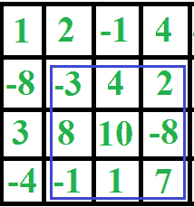

# 打印给定大小的最大和平方子矩阵

> 原文： [https://www.geeksforgeeks.org/print-maximum-sum-square-sub-matrix-of-given-size/](https://www.geeksforgeeks.org/print-maximum-sum-square-sub-matrix-of-given-size/)

给定一个 N x N 矩阵，找到一个 k x k 个子矩阵，其中 k < = N，k > = 1，这样子矩阵中所有元素的总和最大。 输入矩阵可以包含零，正数和负数。

例如，考虑下面的矩阵，如果 k = 3，则输出应打印用蓝色包围的子矩阵。
[](https://media.geeksforgeeks.org/wp-content/cdn-uploads/rectangle2.png)

**我们强烈建议您最小化浏览器，然后自己尝试。**

一个简单的解决方案是考虑输入矩阵中所有可能的大小为 k x k 的子正方形，并找到具有最大和的子正方形。 上述解决方案的时间复杂度为 O（N <sup>2</sup> k <sup>2</sup> ）。

我们可以在 O（N <sup>2</sup> ）时间内解决此问题。 此问题主要是[这个打印所有金额的](https://www.geeksforgeeks.org/given-n-x-n-square-matrix-find-sum-sub-squares-size-k-x-k/)问题的扩展。 这个想法是预处理给定的方阵。 在预处理步骤中，计算临时方阵 stripSum [] []中所有大小为 k x 1 的垂直条的总和。 一旦我们获得了所有垂直条带的总和，我们就可以计算该行中第一个子正方形的总和作为该行中前 k 个条带的总和，对于剩余的子正方形，我们可以通过去除 O（1）时间来计算总和 前一个子正方形的最左边的条，并添加新正方形的最右边的条。
以下是上述想法的实现。

## C++ 

```

// An efficient C++ program to find maximum sum 
// sub-square matrix 
#include <bits/stdc++.h> 
using namespace std; 

// Size of given matrix 
#define N 5 

// A O(n^2) function to the maximum sum sub- 
// squares of size k x k in a given square 
// matrix of size n x n 
void printMaxSumSub(int mat[][N], int k) 
{ 
    // k must be smaller than or equal to n 
    if (k > N) return; 

    // 1: PREPROCESSING 
    // To store sums of all strips of size k x 1 
    int stripSum[N][N]; 

    // Go column by column 
    for (int j=0; j<N; j++) 
    { 
        // Calculate sum of first k x 1 rectangle 
        // in this column 
        int sum = 0; 
        for (int i=0; i<k; i++) 
            sum += mat[i][j]; 
        stripSum[0][j] = sum; 

        // Calculate sum of remaining rectangles 
        for (int i=1; i<N-k+1; i++) 
        { 
            sum += (mat[i+k-1][j] - mat[i-1][j]); 
            stripSum[i][j] = sum; 
        } 
    } 

    // max_sum stores maximum sum and its 
    // position in matrix 
    int max_sum = INT_MIN, *pos = NULL; 

    // 2: CALCULATE SUM of Sub-Squares using stripSum[][] 
    for (int i=0; i<N-k+1; i++) 
    { 
        // Calculate and print sum of first subsquare 
        // in this row 
        int sum = 0; 
        for (int j = 0; j<k; j++) 
            sum += stripSum[i][j]; 

        // Update max_sum and position of result 
        if (sum > max_sum) 
        { 
            max_sum = sum; 
            pos = &(mat[i][0]); 
        } 

        // Calculate sum of remaining squares in 
        // current row by removing the leftmost 
        // strip of previous sub-square and adding 
        // a new strip 
        for (int j=1; j<N-k+1; j++) 
        { 
            sum += (stripSum[i][j+k-1] - stripSum[i][j-1]); 

            // Update max_sum and position of result 
            if (sum > max_sum) 
            { 
                max_sum = sum; 
                pos = &(mat[i][j]); 
            } 
        } 
    } 

    // Print the result matrix 
    for (int i=0; i<k; i++) 
    { 
        for (int j=0; j<k; j++) 
            cout << *(pos + i*N + j) << " "; 
        cout << endl; 
    } 
} 

// Driver program to test above function 
int main() 
{ 
    int mat[N][N] = {{1, 1, 1, 1, 1}, 
        {2, 2, 2, 2, 2}, 
        {3, 8, 6, 7, 3}, 
        {4, 4, 4, 4, 4}, 
        {5, 5, 5, 5, 5}, 
    }; 
    int k = 3; 

    cout << "Maximum sum 3 x 3 matrix is\n"; 
    printMaxSumSub(mat, k); 

    return 0; 
} 

```

## Java

```

// An efficient Java program to find maximum sum  
// sub-square matrix  

// Class to store the position of start of  
// maximum sum in matrix 
class Position { 
    int x; 
    int y; 

    // Constructor 
    Position(int x, int y) { 
        this.x = x; 
        this.y = y; 
    } 

    // Updates the position if new maximum sum 
    // is found 
    void updatePosition(int x, int y) { 
        this.x = x; 
        this.y = y; 
    } 

    // returns the current value of X 
    int getXPosition() { 
        return this.x; 
    } 

    // returns the current value of y 
    int getYPosition() { 
        return this.y; 
    } 
} 

class Gfg { 
    // Size of given matrix 
    static int N; 

    // A O(n^2) function to the maximum sum sub- 
    // squares of size k x k in a given square 
    // matrix of size n x n 
    static void printMaxSumSub(int[][] mat, int k) { 

        // k must be smaller than or equal to n 
        if (k > N) 
            return; 

        // 1: PREPROCESSING 
        // To store sums of all strips of size k x 1 
        int[][] stripSum = new int[N][N]; 

        // Go column by column 
        for (int j = 0; j < N; j++) { 

            // Calculate sum of first k x 1 rectangle 
            // in this column 
            int sum = 0; 
            for (int i = 0; i < k; i++) 
                sum += mat[i][j]; 
            stripSum[0][j] = sum; 

            // Calculate sum of remaining rectangles 
            for (int i = 1; i < N - k + 1; i++) { 
                sum += (mat[i + k - 1][j] - mat[i - 1][j]); 
                stripSum[i][j] = sum; 
            } 
        } 

        // max_sum stores maximum sum and its 
        // position in matrix 
        int max_sum = Integer.MIN_VALUE; 
        Position pos = new Position(-1, -1); 

        // 2: CALCULATE SUM of Sub-Squares using stripSum[][] 
        for (int i = 0; i < N - k + 1; i++) { 

            // Calculate and print sum of first subsquare 
            // in this row 
            int sum = 0; 
            for (int j = 0; j < k; j++) 
                sum += stripSum[i][j]; 

            // Update max_sum and position of result 
            if (sum > max_sum) { 
                max_sum = sum; 
                pos.updatePosition(i, 0); 
            } 

            // Calculate sum of remaining squares in 
            // current row by removing the leftmost 
            // strip of previous sub-square and adding 
            // a new strip 
            for (int j = 1; j < N - k + 1; j++) { 
                sum += (stripSum[i][j + k - 1] - stripSum[i][j - 1]); 

                // Update max_sum and position of result 
                if (sum > max_sum) { 
                    max_sum = sum; 
                    pos.updatePosition(i, j); 
                } 
            } 
        } 

        // Print the result matrix 
        for (int i = 0; i < k; i++) { 
            for (int j = 0; j < k; j++) { 
                System.out.print(mat[i + pos.getXPosition()][j + pos.getYPosition()] + " "); 
            } 
            System.out.println(); 
        } 
    } 

    // Driver program to test above function 
    public static void main(String[] args) { 
        N = 5; 
        int[][] mat = { { 1, 1, 1, 1, 1 },  
                { 2, 2, 2, 2, 2 },  
                { 3, 8, 6, 7, 3 },  
                { 4, 4, 4, 4, 4 }, 
            { 5, 5, 5, 5, 5 } }; 
    int k = 3; 

        System.out.println("Maximum sum 3 x 3 matrix is"); 
        printMaxSumSub(mat, k); 
    } 
} 

// This code is contributed by Vivek Kumar Singh 

```

## C# 

```

// An efficient C# program to find maximum sum  
// sub-square matrix  
using System; 

// Class to store the position of start of  
// maximum sum in matrix  
class Position  
{  
    int x;  
    int y;  

    // Constructor  
    public Position(int x, int y) 
    {  
        this.x = x;  
        this.y = y;  
    }  

    // Updates the position if new maximum sum  
    // is found  
    public void updatePosition(int x, int y) 
    {  
        this.x = x;  
        this.y = y;  
    }  

    // returns the current value of X  
    public int getXPosition() 
    {  
        return this.x;  
    }  

    // returns the current value of y  
    public int getYPosition()  
    {  
        return this.y;  
    }  
}  

class GFG  
{  

    // Size of given matrix  
    static int N;  

    // A O(n^2) function to the maximum sum sub-  
    // squares of size k x k in a given square  
    // matrix of size n x n  
    static void printMaxSumSub(int[,] mat, int k)  
    {  

        // k must be smaller than or equal to n  
        if (k > N)  
            return;  

        // 1: PREPROCESSING  
        // To store sums of all strips of size k x 1  
        int[,] stripSum = new int[N, N];  

        // Go column by column  
        for (int j = 0; j < N; j++)  
        {  

            // Calculate sum of first k x 1 rectangle  
            // in this column  
            int sum = 0;  
            for (int i = 0; i < k; i++)  
                sum += mat[i, j];  
            stripSum[0, j] = sum;  

            // Calculate sum of remaining rectangles  
            for (int i = 1; i < N - k + 1; i++)  
            {  
                sum += (mat[i + k - 1, j] -  
                        mat[i - 1, j]);  
                stripSum[i, j] = sum;  
            }  
        }  

        // max_sum stores maximum sum and its  
        // position in matrix  
        int max_sum = int.MinValue;  
        Position pos = new Position(-1, -1);  

        // 2: CALCULATE SUM of Sub-Squares using stripSum[,]  
        for (int i = 0; i < N - k + 1; i++) 
        {  

            // Calculate and print sum of first subsquare  
            // in this row  
            int sum = 0;  
            for (int j = 0; j < k; j++)  
                sum += stripSum[i, j];  

            // Update max_sum and position of result  
            if (sum > max_sum)  
            {  
                max_sum = sum;  
                pos.updatePosition(i, 0);  
            }  

            // Calculate sum of remaining squares in  
            // current row by removing the leftmost  
            // strip of previous sub-square and adding  
            // a new strip  
            for (int j = 1; j < N - k + 1; j++)  
            {  
                sum += (stripSum[i, j + k - 1] -  
                        stripSum[i, j - 1]);  

                // Update max_sum and position of result  
                if (sum > max_sum) 
                {  
                    max_sum = sum;  
                    pos.updatePosition(i, j);  
                }  
            }  
        }  

        // Print the result matrix  
        for (int i = 0; i < k; i++)  
        {  
            for (int j = 0; j < k; j++)  
            {  
                Console.Write(mat[i + pos.getXPosition(), 
                                  j + pos.getYPosition()] + " ");  
            }  
            Console.WriteLine();  
        }  
    }  

    // Driver Code 
    public static void Main(String[] args)  
    {  
        N = 5;  
        int[,] mat = {{ 1, 1, 1, 1, 1 },  
                      { 2, 2, 2, 2, 2 },  
                        { 3, 8, 6, 7, 3 },  
                      { 4, 4, 4, 4, 4 },  
                      { 5, 5, 5, 5, 5 }};  
        int k = 3;  

        Console.WriteLine("Maximum sum 3 x 3 matrix is");  
        printMaxSumSub(mat, k);  
    }  
}  

// This code is contributed by Princi Singh 

```

**输出**：

```
Maximum sum 3 x 3 matrix is
8 6 7
4 4 4
5 5 5
```

**相关文章**：
[给定 n x n 方阵，找到大小为 k x k 的所有子方阵的和](https://www.geeksforgeeks.org/given-n-x-n-square-matrix-find-sum-sub-squares-size-k-x-k/)
[2D 矩阵中的最大和矩形](https://www.geeksforgeeks.org/dynamic-programming-set-27-max-sum-rectangle-in-a-2d-matrix/)

本文由 **Aditya Goel** 提供。 如果您喜欢 GeeksforGeeks 并希望做出贡献，那么您也可以写一篇文章并将您的文章邮寄到 contribution@geeksforgeeks.org。 查看您的文章出现在 GeeksforGeeks 主页上，并帮助其他 Geeks。

如果发现任何不正确的地方，或者想分享有关上述主题的更多信息，请发表评论

