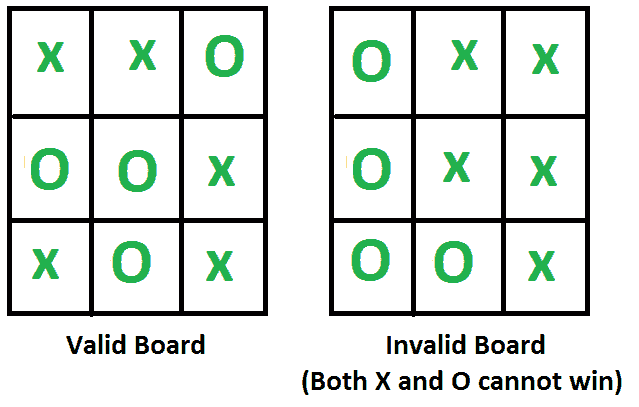

# 给定井字棋盘配置的有效性

> 原文： [https://www.geeksforgeeks.org/validity-of-a-given-tic-tac-toe-board-configuration/](https://www.geeksforgeeks.org/validity-of-a-given-tic-tac-toe-board-configuration/)

播放一些动作后，将显示井字游戏棋盘。 找出给定的板是否有效，即是否可以在某些移动之后到达该板位置。

请注意，每个由 9 个空格组成的任意填充网格都是无效的，例如 充满 3 个 X 和 6 个 O 的网格是无效的情况，因为每个玩家都需要轮流交替进行。

[](https://media.geeksforgeeks.org/wp-content/cdn-uploads/tictactoe.png)

输入为大小为 9 的一维数组。
**示例**：

```
Input: board[] =  {'X', 'X', 'O', 
                   'O', 'O', 'X',
                   'X', 'O', 'X'};
Output: Valid

Input: board[] =  {'O', 'X', 'X', 
                   'O', 'X', 'X',
                   'O', 'O', 'X'};
Output: Invalid
(Both X and O cannot win)

Input: board[] =  {'O', 'X', ' ', 
                   ' ', ' ', ' ',
                   ' ', ' ', ' '};
Output: Valid
(Valid board with only two moves played)

```

## [推荐：请先在“ ***实践*** ”上解决它，然后再继续解决。](https://practice.geeksforgeeks.org/problems/tic-tac-toe/0)

基本上，要找到输入网格的有效性，我们可以考虑输入网格无效时的条件。 不行 X 的数字为 countX，否。 的“ O”为 countO。 由于我们知道游戏以 X 开头，因此，如果以下两个条件满足
，a）countX！= countO 和
b）countX！= countO + 1，则给定的井字游戏网格绝对无效。

由于“ X”始终是第一个动作，因此也需要第二个条件。

现在是否意味着所有剩余的董事会职位都是有效的？ 答案是不。 考虑一下输入网格使得 X 和 O 都成直线的情况。 这也是无效位置，因为当一名玩家获胜时游戏结束。 因此，我们还需要检查以下情况
c）如果输入网格显示两个玩家都处于获胜状态，则该位置无效。
d）如果输入网格显示 O 的玩家放置了一条直线（即处于获胜状态）并且 countX！= countO，则该位置无效。 原因是 O 仅在 X 出手后才出手。 自从 X 开始游戏以来，当 X 和 O 都玩过等于 No 的 O 时，O 将获胜。 的动作。
e）如果输入网格显示 X 处于获胜条件，则 xCount 必须比 oCount 大 1。

有了上述条件，即 a），b），c）和 d），我们现在可以轻松地制定算法/程序来检查给定 Tic-Tac-Toe 板位置的有效性。

```
1)  countX == countO or countX == countO + 1
2)  If O is in win condition then check 
     a)     If X also wins, not valid
     b)     If xbox != obox , not valid
3)  If X is in win condition then check if xCount is
     one more than oCount or not  
```

确定给定板的有效性的另一种方法是使用“反向方法”，即排除给定板无效时的所有可能性。

## C++ 

```

// C++ program to check whether a given tic tac toe 
// board is valid or not 
#include <iostream> 
using namespace std; 

// This matrix is used to find indexes to check all 
// possible wining triplets in board[0..8] 
int win[8][3] = {{0, 1, 2}, // Check first row. 
                {3, 4, 5}, // Check second Row 
                {6, 7, 8}, // Check third Row 
                {0, 3, 6}, // Check first column 
                {1, 4, 7}, // Check second Column 
                {2, 5, 8}, // Check third Column 
                {0, 4, 8}, // Check first Diagonal 
                {2, 4, 6}}; // Check second Diagonal 

// Returns true if character 'c' wins. c can be either 
// 'X' or 'O' 
bool isCWin(char *board, char c) 
{ 
    // Check all possible winning combinations 
    for (int i=0; i<8; i++) 
        if (board[win[i][0]] == c && 
            board[win[i][1]] == c && 
            board[win[i][2]] == c ) 
            return true; 
    return false; 
} 

// Returns true if given board is valid, else returns false 
bool isValid(char board[9]) 
{ 
    // Count number of 'X' and 'O' in the given board 
    int xCount=0, oCount=0; 
    for (int i=0; i<9; i++) 
    { 
    if (board[i]=='X') xCount++; 
    if (board[i]=='O') oCount++; 
    } 

    // Board can be valid only if either xCount and oCount 
    // is same or xount is one more than oCount 
    if (xCount==oCount || xCount==oCount+1) 
    { 
        // Check if 'O' is winner 
        if (isCWin(board, 'O')) 
        { 
            // Check if 'X' is also winner, then 
            // return false 
            if (isCWin(board, 'X')) 
                return false; 

            // Else return true xCount and yCount are same 
            return (xCount == oCount); 
        } 

        // If 'X' wins, then count of X must be greater 
        if (isCWin(board, 'X') && xCount != oCount + 1) 
        return false;  

        // If 'O' is not winner, then return true 
        return true; 
    } 
    return false; 
} 

// Driver program 
int main() 
{ 
char board[] = {'X', 'X', 'O', 
                'O', 'O', 'X', 
                'X', 'O', 'X'}; 
(isValid(board))? cout << "Given board is valid": 
                    cout << "Given board is not valid"; 
return 0; 
} 

```

## Java

```

// Java program to check whether a given tic tac toe  
// board is valid or not   
class GFG { 

// This matrix is used to find indexes to check all  
// possible wining triplets in board[0..8]  
    static int win[][] = {{0, 1, 2}, // Check first row.  
    {3, 4, 5}, // Check second Row  
    {6, 7, 8}, // Check third Row  
    {0, 3, 6}, // Check first column  
    {1, 4, 7}, // Check second Column  
    {2, 5, 8}, // Check third Column  
    {0, 4, 8}, // Check first Diagonal  
    {2, 4, 6}}; // Check second Diagonal  

// Returns true if character 'c' wins. c can be either  
// 'X' or 'O'  
    static boolean isCWin(char[] board, char c) { 
        // Check all possible winning combinations  
        for (int i = 0; i < 8; i++) { 
            if (board[win[i][0]] == c 
                    && board[win[i][1]] == c 
                    && board[win[i][2]] == c) { 
                return true; 
            } 
        } 
        return false; 
    } 

// Returns true if given board is valid, else returns false  
    static boolean isValid(char board[]) { 
        // Count number of 'X' and 'O' in the given board  
        int xCount = 0, oCount = 0; 
        for (int i = 0; i < 9; i++) { 
            if (board[i] == 'X') { 
                xCount++; 
            } 
            if (board[i] == 'O') { 
                oCount++; 
            } 
        } 

        // Board can be valid only if either xCount and oCount  
        // is same or xount is one more than oCount  
        if (xCount == oCount || xCount == oCount + 1) { 
            // Check if 'O' is winner  
            if (isCWin(board, 'O')) { 
                // Check if 'X' is also winner, then  
                // return false  
                if (isCWin(board, 'X')) { 
                    return false; 
                } 

                // Else return true xCount and yCount are same  
                return (xCount == oCount); 
            } 

            // If 'X' wins, then count of X must be greater  
            if (isCWin(board, 'X') && xCount != oCount + 1) { 
                return false; 
            } 

            // If 'O' is not winner, then return true  
            return true; 
        } 
        return false; 
    } 

// Driver program  
    public static void main(String[] args) { 
        char board[] = {'X', 'X', 'O', 'O', 'O', 'X', 'X', 'O', 'X'}; 

        if ((isValid(board))) { 
            System.out.println("Given board is valid"); 
        } else { 
            System.out.println("Given board is not valid"); 
        } 
    } 
} 
//this code contributed by PrinciRaj1992 

```

## Python3

```

# Python3 program to check whether a given tic tac toe 
# board is valid or not 

# Returns true if char wins. Char can be either 
# 'X' or 'O' 
def win_check(arr, char): 
    # Check all possible winning combinations 
    matches = [[0, 1, 2], [3, 4, 5], 
               [6, 7, 8], [0, 3, 6], 
               [1, 4, 7], [2, 5, 8], 
               [0, 4, 8], [2, 4, 6]] 

    for i in range(8): 
        if(arr[matches[i][0]] == char and
            arr[matches[i][1]] == char and
            arr[matches[i][2]] == char): 
            return True
    return False

def is_valid(arr): 
    # Count number of 'X' and 'O' in the given board 
    xcount = arr.count('X') 
    ocount = arr.count('O') 

    # Board can be valid only if either xcount and ocount 
    # is same or xount is one more than oCount 
    if(xcount == ocount+1 or xcount == ocount): 
        # Check if O wins 
        if win_check(arr, 'O'): 
            # Check if X wins, At a given point only one can win,  
            # if X also wins then return Invalid 
            if win_check(arr, 'X'): 
                return "Invalid"

            # O can only win if xcount == ocount in case where whole 
            # board has values in each position. 
            if xcount == ocount: 
                return "Valid"

        # If X wins then it should be xc == oc + 1,  
        # If not return Invalid      
        if win_check(arr, 'X') and xcount != ocount+1: 
            return "Invalid"

        # if O is not the winner return Valid  
        if not win_check(arr, 'O'): 
            return "Valid"

    # If nothing above matches return invalid 
    return "Invalid"

# Driver Code 
arr = ['X', 'X', 'O', 
       'O', 'O', 'X',  
       'X', 'O', 'X'] 
print("Given board is " + is_valid(arr)) 

```

## C# 

```

// C# program to check whether a given  
// tic tac toe board is valid or not  
using System; 

class GFG 
{ 

// This matrix is used to find indexes 
// to check all possible wining triplets 
// in board[0..8]  
public static int[][] win = new int[][] 
{ 
    new int[] {0, 1, 2}, 
    new int[] {3, 4, 5}, 
    new int[] {6, 7, 8}, 
    new int[] {0, 3, 6}, 
    new int[] {1, 4, 7}, 
    new int[] {2, 5, 8}, 
    new int[] {0, 4, 8}, 
    new int[] {2, 4, 6} 
}; 

// Returns true if character 'c'  
// wins. c can be either 'X' or 'O'  
public static bool isCWin(char[] board,  
                          char c) 
{ 
    // Check all possible winning 
    // combinations  
    for (int i = 0; i < 8; i++) 
    { 
        if (board[win[i][0]] == c &&  
            board[win[i][1]] == c &&  
            board[win[i][2]] == c) 
        { 
            return true; 
        } 
    } 
    return false; 
} 

// Returns true if given board  
// is valid, else returns false  
public static bool isValid(char[] board) 
{ 
    // Count number of 'X' and  
    // 'O' in the given board  
    int xCount = 0, oCount = 0; 
    for (int i = 0; i < 9; i++) 
    { 
        if (board[i] == 'X') 
        { 
            xCount++; 
        } 
        if (board[i] == 'O') 
        { 
            oCount++; 
        } 
    } 

    // Board can be valid only if either  
    // xCount and oCount is same or xount 
    // is one more than oCount  
    if (xCount == oCount || 
        xCount == oCount + 1) 
    { 
        // Check if 'O' is winner  
        if (isCWin(board, 'O')) 
        { 
            // Check if 'X' is also winner,  
            // then return false  
            if (isCWin(board, 'X')) 
            { 
                return false; 
            } 

            // Else return true xCount  
            // and yCount are same  
            return (xCount == oCount); 
        } 

        // If 'X' wins, then count of  
        // X must be greater  
        if (isCWin(board, 'X') &&  
            xCount != oCount + 1) 
        { 
            return false; 
        } 

        // If 'O' is not winner,  
        // then return true  
        return true; 
    } 
    return false; 
} 

// Driver Code  
public static void Main(string[] args) 
{ 
    char[] board = new char[] {'X', 'X', 'O', 'O', 'O', 
                                    'X', 'X', 'O', 'X'}; 

    if ((isValid(board))) 
    { 
        Console.WriteLine("Given board is valid"); 
    } 
    else
    { 
        Console.WriteLine("Given board is not valid"); 
    } 
} 
} 

// This code is contributed by Shrikant13 

```

## PHP

```

<?php 
// PHP program to check whether a given  
// tic tac toe board is valid or not 

// This matrix is used to find indexes  
// to check all possible wining triplets 
// in board[0..8] 

// Returns true if character 'c' wins.  
// c can be either 'X' or 'O' 
function isCWin($board, $c) 
{ 
    $win = array(array(0, 1, 2), // Check first row. 
                 array(3, 4, 5), // Check second Row 
                 array(6, 7, 8), // Check third Row 
                 array(0, 3, 6), // Check first column 
                 array(1, 4, 7), // Check second Column 
                 array(2, 5, 8), // Check third Column 
                 array(0, 4, 8), // Check first Diagonal 
                 array(2, 4, 6)); // Check second Diagonal 

    // Check all possible winning combinations 
    for ($i = 0; $i < 8; $i++) 
        if ($board[$win[$i][0]] == $c && 
            $board[$win[$i][1]] == $c && 
            $board[$win[$i][2]] == $c ) 
            return true; 
    return false; 
} 

// Returns true if given board is 
// valid, else returns false 
function isValid(&$board) 
{ 
    // Count number of 'X' and 'O' 
    // in the given board 
    $xCount = 0; 
    $oCount = 0; 
    for ($i = 0; $i < 9; $i++) 
    { 
        if ($board[$i] == 'X') $xCount++; 
        if ($board[$i] == 'O') $oCount++; 
    } 

    // Board can be valid only if either  
    // xCount and oCount is same or xount  
    // is one more than oCount 
    if ($xCount == $oCount || $xCount == $oCount + 1) 
    { 
        // Check if 'O' is winner 
        if (isCWin($board, 'O')) 
        { 
            // Check if 'X' is also winner,  
            // then return false 
            if (isCWin($board, 'X')) 
                return false; 

            // Else return true xCount and 
            // yCount are same 
            return ($xCount == $oCount); 
        } 

        // If 'X' wins, then count of X  
        // must be greater 
        if (isCWin($board, 'X') && 
                   $xCount != $oCount + 1) 
        return false;  

        // If 'O' is not winner, then  
        // return true 
        return true; 
    } 
    return false; 
} 

// Driver Code 
$board = array('X', 'X', 'O','O',  
               'O', 'X','X', 'O', 'X'); 
if(isValid($board)) 
    echo("Given board is valid"); 
else
    echo ("Given board is not valid"); 

// This code is contributed  
// by Shivi_Aggarwal 
?> 

```

**输出**：

```
Given board is valid
```

感谢 Utkarsh 提出此解决方案。

如果发现任何不正确的地方，或者想分享有关上述主题的更多信息，请发表评论

