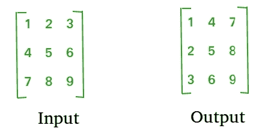

# 查找矩阵转置的程序

> 原文： [https://www.geeksforgeeks.org/program-to-find-transpose-of-a-matrix/](https://www.geeksforgeeks.org/program-to-find-transpose-of-a-matrix/)

通过将行更改为列并将列更改为行来获得矩阵的转置。 换句话说，通过将 A [i] [j]更改为 A [j] [i]可获得 A [] []的转置。



> [推荐：请先在“ ***实践*** ”上解决它，然后再继续解决。](https://practice.geeksforgeeks.org/problems/transpose-of-matrix/0)

**对于方矩阵**：

下面的程序找到 A [] []的转置，并将结果存储在 B [] []中，我们可以将 N 更改为不同的维数。

## C++ 

```

#include <stdio.h> 
#define N 4 

// This function stores transpose of A[][] in B[][] 
void transpose(int A[][N], int B[][N]) 
{ 
    int i, j; 
    for (i = 0; i < N; i++) 
        for (j = 0; j < N; j++) 
            B[i][j] = A[j][i]; 
} 

int main() 
{ 
    int A[N][N] = { {1, 1, 1, 1}, 
                    {2, 2, 2, 2}, 
                    {3, 3, 3, 3}, 
                    {4, 4, 4, 4}}; 

    int B[N][N], i, j; 

    transpose(A, B); 

    printf("Result matrix is \n"); 
    for (i = 0; i < N; i++) 
    { 
        for (j = 0; j < N; j++) 
           printf("%d ", B[i][j]); 
        printf("\n"); 
    } 

    return 0; 
} 

```