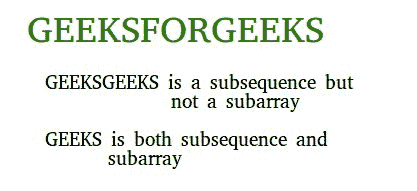

# 子数组/子字符串与子序列以及生成它们的程序

> 原文： [https://www.geeksforgeeks.org/subarraysubstring-vs-subsequence-and-programs-to-generate-them/](https://www.geeksforgeeks.org/subarraysubstring-vs-subsequence-and-programs-to-generate-them/)

**子数组/子字符串**

子数组是数组的**连续**部分。 一个在另一个数组内的数组。 例如，考虑数组[1、2、3、4]，有 10 个非空子数组。 子栏位是（1），（2），（3），（4），（1,2），（2,3），（3,4），（1,2,3），（2,3， 4）和（1,2,3,4）。 通常，对于大小为 n 的数组/字符串，有 **n *（n + 1）/ 2** 个非空子数组/子字符串。



***如何生成所有子数组？***
我们可以运行两个嵌套循环，外部循环选择开始元素，内部循环将被选择元素右边的所有元素视为子数组的结束元素。

## C++ 

```

/*  C++ code to generate all possible subarrays/subArrays 
    Complexity- O(n^3) */
#include<bits/stdc++.h> 
using namespace std; 

// Prints all subarrays in arr[0..n-1] 
void subArray(int arr[], int n) 
{ 
    // Pick starting point 
    for (int i=0; i <n; i++) 
    { 
        // Pick ending point 
        for (int j=i; j<n; j++) 
        { 
            // Print subarray between current starting 
            // and ending points 
            for (int k=i; k<=j; k++) 
                cout << arr[k] << " "; 

            cout << endl; 
        } 
    } 
} 

// Driver program 
int main() 
{ 
    int arr[] = {1, 2, 3, 4}; 
    int n = sizeof(arr)/sizeof(arr[0]); 
    cout << "All Non-empty Subarrays\n"; 
    subArray(arr, n); 
    return 0; 
} 

```