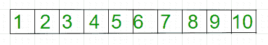
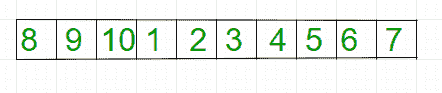

# 数组右旋转的逆向算法

> 原文： [https://www.geeksforgeeks.org/reversal-algorithm-right-rotation-array/](https://www.geeksforgeeks.org/reversal-algorithm-right-rotation-array/)

给定一个数组，将其右旋转`k`个元素。



在`K = 3`旋转后：



**示例**：

```
Input: arr[] = {1, 2, 3, 4, 5, 
                6, 7, 8, 9, 10}
          k = 3
Output: 8 9 10 1 2 3 4 5 6 7

Input: arr[] = {121, 232, 33, 43 ,5}
           k = 2
Output: 43 5 121 232 33

```


 **注意**：在下面的解决方案中，假定`k`小于或等于`n`。 我们可以通过修改`k = k % n`来轻松修改解决方案以处理更大的`k`值。

**算法**：

```
rotate(arr[], d, n)
  reverseArray(arr[], 0, n-1) ;
  reverse(arr[], 0, d-1);
  reverse(arr[], d, n-1);
```

下面是上述方法的实现：

## C++ 

```cpp

// C++ program for right rotation of  
// an array (Reversal Algorithm) 
#include <bits/stdc++.h> 

/*Function to reverse arr[]  
from index start to end*/
void reverseArray(int arr[], int start, 
                            int end) 
{ 
    while (start < end) 
    { 
        std::swap(arr[start], arr[end]); 
        start++; 
        end--; 
    } 
} 

/* Function to right rotate arr[] 
of size n by d */
void rightRotate(int arr[], int d, int n) 
{ 
    reverseArray(arr, 0, n-1); 
    reverseArray(arr, 0, d-1); 
    reverseArray(arr, d, n-1); 
} 

/* function to print an array */
void printArray(int arr[], int size) 
{ 
    for (int i = 0; i < size; i++) 
        std::cout << arr[i] << " "; 
} 

// driver code 
int main() 
{ 
    int arr[] = {1, 2, 3, 4, 5,  
                6, 7, 8, 9, 10}; 

    int n = sizeof(arr)/sizeof(arr[0]); 
    int k = 3; 

    rightRotate(arr, k, n); 
    printArray(arr, n); 

    return 0; 
}  

```

## Java

```java
// Java program for right rotation of  
// an array (Reversal Algorithm) 
import java.io.*; 
  
class GFG  
{ 
    // Function to reverse arr[]  
    // from index start to end 
    static void reverseArray(int arr[], int start, 
                             int end) 
    { 
        while (start < end) 
        { 
           int temp = arr[start]; 
           arr[start] = arr[end]; 
           arr[end] = temp; 
           start++; 
           end--; 
         } 
    } 
  
    // Function to right rotate  
    // arr[] of size n by d  
    static void rightRotate(int arr[], int d, int n) 
    { 
       reverseArray(arr, 0, n - 1); 
       reverseArray(arr, 0, d - 1); 
       reverseArray(arr, d, n - 1); 
    } 
  
    // Function to print an array  
    static void printArray(int arr[], int size) 
    { 
       for (int i = 0; i < size; i++) 
          System.out.print(arr[i] + " "); 
    } 
  
    public static void main (String[] args)  
    { 
        int arr[] = {1, 2, 3, 4, 5,  
                     6, 7, 8, 9, 10}; 
      
    int n = arr.length; 
    int k = 3; 
      
    rightRotate(arr, k, n); 
    printArray(arr, n); 
          
    } 
} 
// This code is contributed by Gitanjali. 
```

## Python3

```py
# Python3 program for right rotation of  
# an array (Reversal Algorithm) 
  
  
# Function to reverse arr 
# from index start to end 
def reverseArray( arr, start, end): 
      
    while (start < end): 
          
        arr[start], arr[end] = arr[end], arr[start] 
        start = start + 1
        end = end - 1
      
  
# Function to right rotate arr 
# of size n by d  
def rightRotate( arr, d, n): 
      
    reverseArray(arr, 0, n - 1); 
    reverseArray(arr, 0, d - 1); 
    reverseArray(arr, d, n - 1); 
  
  
# function to pr an array  
def prArray( arr, size): 
    for i in range(0, size): 
        print (arr[i], end = ' ') 
  
  
# Driver code 
arr = [1, 2, 3, 4, 5, 6, 7, 8, 9, 10] 
n = len(arr) 
k = 3
      
# Function call 
rightRotate(arr, k, n) 
prArray(arr, n) 
  
  
# This article is contributed  
# by saloni1297 
```

## C#

```cs
// C# program for right rotation of  
// an array (Reversal Algorithm) 
using System; 
  
class GFG { 
      
    // Function to reverse arr[]  
    // from index start to end 
    static void reverseArray(int []arr, int start, 
                                        int end) 
    { 
        while (start < end) 
        { 
            int temp = arr[start]; 
            arr[start] = arr[end]; 
            arr[end] = temp; 
            start++; 
            end--; 
        } 
    } 
  
    // Function to right rotate  
    // arr[] of size n by d  
    static void rightRotate(int []arr, int d, int n) 
    { 
        reverseArray(arr, 0, n - 1); 
        reverseArray(arr, 0, d - 1); 
        reverseArray(arr, d, n - 1); 
    } 
  
    // Function to print an array  
    static void printArray(int []arr, int size) 
    { 
        for (int i = 0; i < size; i++) 
            Console.Write(arr[i] + " "); 
    } 
  
    // Driver code 
    public static void Main ()  
    { 
        int []arr = {1, 2, 3, 4, 5,  
                    6, 7, 8, 9, 10}; 
      
        int n = arr.Length; 
        int k = 3; 
      
        rightRotate(arr, k, n); 
        printArray(arr, n); 
          
    } 
} 
  
// This code is contributed by vt_m. 
```

## PHP

```php
<?php  
// PHP program for right rotation of  
// an array (Reversal Algorithm) 
  
/*Function to reverse arr[]  
from index start to end*/
function reverseArray(&$arr, $start, $end) 
{ 
    while ($start < $end) 
    { 
        $temp = $arr[$start]; 
        $arr[$start] = $arr[$end]; 
        $arr[$end] = $temp; 
        $start++; 
        $end--; 
    } 
} 
  
/* Function to right rotate arr[] 
of size n by d */
function rightRotate(&$arr, $d, $n) 
{ 
    reverseArray($arr, 0, $n - 1); 
    reverseArray($arr, 0, $d - 1); 
    reverseArray($arr, $d, $n - 1); 
} 
  
/* function to print an array */
function printArray(&$arr, $size) 
{ 
    for ($i = 0; $i < $size; $i++) 
        echo $arr[$i] . " "; 
} 
  
// Driver code 
$arr = array(1, 2, 3, 4, 5,  
             6, 7, 8, 9, 10); 
  
$n = sizeof($arr); 
$k = 3; 
  
rightRotate($arr, $k, $n); 
printArray($arr, $n); 
  
// This code is contributed by ita_c 
?> 
```

输出：

```
8 9 10 1 2 3 4 5 6 7 
```
